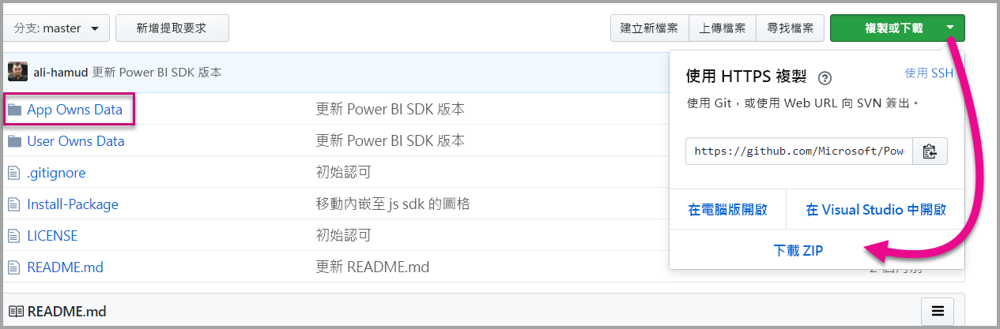

# <a name="tutorial-embed-a-power-bi-dashboard-tile-or-report-into-your-application-for-sovereign-clouds"></a>教學課程：將主權雲端的 Power BI 儀表板、磚或報表內嵌至應用程式

了解如何在主權雲端的商務程序應用程式內內嵌分析內容。 您可以使用 Power BI .NET SDK 搭配 Power BI JavaScript API 將報表、儀表板或圖格內嵌至 Web 應用程式。

Power BI 也支援主權 (私人) 雲端。

以下為不同的主權雲端：

* 美國政府社群雲端 (GCC)

* 美 國 軍事承包商 (DoDCON)

* 美 國 軍事 (DoD)

* 適用於德國雲端的 Power BI

* 適用於中國雲端的 Power BI


若要開始使用此逐步解說，您需要一個 **Power BI** 帳戶。 如果您尚未設定任何帳戶，則可根據主權雲端類型，註冊一個[美國政府 Power BI 帳戶](../service-govus-signup.md)、一個[適用於德國雲端的 Power BI 帳戶](https://powerbi.microsoft.com/power-bi-germany/?ru=https%3A%2F%2Fapp.powerbi.de%2F%3FnoSignUpCheck%3D1)或一個[適用於中國雲端的 Power BI 帳戶](http://www.21vbluecloud.com/powerbi/)。

> [!NOTE]
> 想要改為內嵌組織的內容嗎？ 請參閱[將儀表板整合到應用程式中](integrate-dashboard.md)。

若要將儀表板整合到 Web 應用程式，請使用 **Power BI** API 和 Azure Active Directory (AD) 授權**存取權杖**，以取得儀表板。 然後，使用內嵌權杖載入儀表板。 **Power BI** API 可讓您以程式設計方式存取特定的 **Power BI** 資源。 如需詳細資訊，請參閱 [Power BI REST API](https://docs.microsoft.com/rest/api/power-bi/)、[Power BI .NET SDK 與 [Power BI JavaScript API](https://github.com/Microsoft/PowerBI-JavaScript)。

## <a name="download-the-sample"></a>下載範例

本文顯示 GitHub 上 [App Owns Data 範例](https://github.com/Microsoft/PowerBI-Developer-Samples)中所使用的程式碼。 若要依照本逐步解說進行，您可以下載範例。



* 政府社群雲端 (GCC)：
1. 以 GCCCloud.config 內容覆寫 Cloud.config 檔案。

2. 更新 Web.config 檔案中的應用程式識別碼 (原生應用程式的應用程式識別碼)、工作區識別碼、使用者 (您的主要使用者) 與密碼。

3. 在 web.config 中新增 GCC 參數，如下所示。

```xml
<add key="authorityUrl" value="https://login.microsoftonline.net/common/" />
<add key="resourceUrl" value="https://analysis.usgovcloudapi.net/powerbi/api" />
<add key="apiUrl" value="https://api.powerbigov.us/" />
<add key="embedUrlBase" value="https://app.powerbigov.us" />
```

* 軍事承包商 (DoDCON)：
1. 以 TBCloud.config 內容覆寫 Cloud.config 檔案。

2. 更新 Web.config 檔案中的應用程式識別碼 (原生應用程式的應用程式識別碼)、工作區識別碼、使用者 (您的主要使用者) 與密碼。

3. 在 web.config 中新增 DoDCON 參數，如下所示。

```xml
<add key="authorityUrl" value="https://login.microsoftonlineS.net/common/" />
<add key="resourceUrl" value="https://high.analysis.usgovcloudapi.net/powerbi/api" />
<add key="apiUrl" value="https://api.high.powerbigov.us/" />
<add key="embedUrlBase" value="https://app.high.powerbigov.us" />
```

* 軍事 (DoD)：
1. 以 PFCloud.config 內容覆寫 Cloud.config 檔案。

2. 更新 Web.config 檔案中的應用程式識別碼 (原生應用程式的應用程式識別碼)、工作區識別碼、使用者 (您的主要使用者) 與密碼。

3. 在 web.config 中新增 DoDCON 參數，如下所示。

```xml
<add key="authorityUrl" value="https://login.microsoftonline.net/common/" />
<add key="resourceUrl" value="https://mil.analysis.usgovcloudapi.net/powerbi/api" />
<add key="apiUrl" value="https://api.mil.powerbigov.us/" />
<add key="embedUrlBase" value="https://app.mil.powerbigov.us" />
```

* 適用於德國雲端的 Power BI 參數
1. 使用適用於德國雲端的 Power BI 內容覆寫 Cloud.config 檔案。

2. 更新 Web.config 檔案中的應用程式識別碼 (原生應用程式的應用程式識別碼)、工作區識別碼、使用者 (您的主要使用者) 與密碼。

3. 在 web.config 檔案中新增適用於德國雲端的 Power BI 參數，如下所示。

```xml
<add key="authorityUrl" value="https://login.microsoftonline.de/common/" />
<add key="resourceUrl" value="https://analysis.cloudapi.de/powerbi/api" />
<add key="apiUrl" value="https://api.powerbi.de/" />
<add key="embedUrlBase" value="https://app.powerbi.de" />
```

* 適用於中國雲端的 Power BI 參數
1. 使用[適用於中國雲端的 Power BI](https://github.com/Microsoft/PowerBI-Developer-Samples/blob/master/App%20Owns%20Data/PowerBIEmbedded_AppOwnsData/CloudConfigs/Power%20BI%20operated%20by%2021Vianet%20in%20China/Cloud.config) 內容覆寫 Cloud.config 檔案。

2. 更新 Web.config 檔案中的應用程式識別碼 (原生應用程式的應用程式識別碼)、工作區識別碼、使用者 (您的主要使用者) 與密碼。

3. 在 web.config 檔案中新增適用於中國雲端的 Power BI 參數，如下所示。

```xml
<add key="authorityUrl" value="https://login.chinacloudapi.cn/common/" />
<add key="resourceUrl" value="https://analysis.chinacloudapi.cn/powerbi/api" />
<add key="apiUrl" value="https://api.powerbi.cn/" />
<add key="embedUrlBase" value="https://app.powerbi.cn" />
```

## <a name="step-1---register-an-app-in-azure-ad"></a>步驟 1 - 在 Azure AD 中註冊應用程式

在 Azure AD 中註冊應用程式以進行 REST API 呼叫。 如需詳細資訊，請參閱[註冊 Azure AD 應用程式以內嵌 Power BI 內容](register-app.md)。 由於有不同的主權雲端聯盟，因此有不同的 URL 可用來註冊您的應用程式。

* 政府社群雲端 (GCC)： https://app.powerbigov.us/apps 

* 軍事承包商 (DoDCON)： https://app.high.powerbigov.us/apps 

* 軍事 (DoD)： https://app.mil.powerbigov.us/apps

* 適用於德國雲端的 Power BI： https://app.powerbi.de/apps

* 適用於中國雲端的 Power BI - https://app.powerbi.cn/apps

若您已經下載[對客戶進行內嵌範例](https://github.com/Microsoft/PowerBI-Developer-Samples/tree/master/App%20Owns%20Data)，就能使用取得的 **applicationId** 來設定範例，以向 Azure AD 驗證。 若要設定範例，請變更 *web.config* 檔案中的 **applicationId**。

## <a name="step-2---get-an-access-token-from-azure-ad"></a>步驟 2 - 從 Azure AD 取得存取權杖

在您的應用程式中，您必須從 Azure AD 取得**存取權杖**，才能呼叫 Power BI REST API。 如需詳細資訊，請參閱 [Authenticate users and get an Azure AD access token for your Power BI app](get-azuread-access-token.md) (驗證使用者，並為 Power BI 應用程式取得 Azure AD 存取權杖)。 由於有不同的主權雲端聯盟，因此有不同的 URL 可用來取得您應用程式的存取權杖。

* 政府社群雲端 (GCC)： https://login.microsoftonline.com

* 軍事承包商 (DoDCON)： http://login.microsoftonline.us

* 軍事 (DoD)： https://login.microsoftonline.us

* 適用於德國雲端的 Power BI： https://login.microsoftonline.de

* 適用於中國雲端的 Power BI - https://login.chinacloudapi.cn

您可以在 **Controllers\HomeController.cs** 檔案的每個內容項目工作中看到這些存取權杖範例。

## <a name="step-3---get-a-content-item"></a>步驟 3 - 取得內容項目

若要內嵌 Power BI 內容，您需要執行幾項工作以確保能夠正確地將其內嵌。 雖然這些步驟全都能直接利用 REST API 完成，但這裡的範例應用程式及範例會使用 .NET SDK。

### <a name="create-the-power-bi-client-with-your-access-token"></a>使用存取權杖建立 Power BI 用戶端

使用存取權杖，您需要建立 Power BI 用戶端物件，以便與 Power BI API 互動。 你可以將 AccessToken 與 *Microsoft.Rest.TokenCredentials* 物件包裝在一起來建立 Power BI 用戶端物件。

```csharp
using Microsoft.IdentityModel.Clients.ActiveDirectory;
using Microsoft.Rest;
using Microsoft.PowerBI.Api.V2;

var tokenCredentials = new TokenCredentials(authenticationResult.AccessToken, "Bearer");

// Create a Power BI Client object. This is used to call the Power BI APIs.
using (var client = new PowerBIClient(new Uri(ApiUrl), tokenCredentials))
{
    // Your code to embed items.
}
```

### <a name="get-the-content-item-you-want-to-embed"></a>取得您想要內嵌的內容項目

使用 Power BI 用戶端物件，擷取您想要內嵌之項目的參考。 您可以內嵌儀表板、圖格或報表。 以下範例會示範如何從提供的工作區中擷取第一個儀表板、圖格或報表。

您可以在[「應用程式擁有資料」範例](https://github.com/Microsoft/PowerBI-Developer-Samples/tree/master/App%20Owns%20Data)的 **Controllers\HomeController.cs** 中找到範例。

#### <a name="reports"></a>報表

```csharp
using Microsoft.PowerBI.Api.V2;
using Microsoft.PowerBI.Api.V2.Models;

// You need to provide the workspaceId where the dashboard resides.
ODataResponseListReport reports = client.Reports.GetReportsInGroupAsync(workspaceId);

// Get the first report in the group.
Report report = reports.Value.FirstOrDefault();
```

#### <a name="dashboards"></a>儀表板

```csharp
using Microsoft.PowerBI.Api.V2;
using Microsoft.PowerBI.Api.V2.Models;

// You need to provide the workspaceId where the dashboard resides.
ODataResponseListDashboard dashboards = client.Dashboards.GetDashboardsInGroup(workspaceId);

// Get the first report in the group.
Dashboard dashboard = dashboards.Value.FirstOrDefault();
```

#### <a name="tiles"></a>圖格

```csharp
using Microsoft.PowerBI.Api.V2;
using Microsoft.PowerBI.Api.V2.Models;

// To retrieve the tile, you first need to retrieve the dashboard.

// You need to provide the workspaceId where the dashboard resides.
ODataResponseListDashboard dashboards = client.Dashboards.GetDashboardsInGroup(workspaceId);

// Get the first report in the group.
Dashboard dashboard = dashboards.Value.FirstOrDefault();

// Get a list of tiles from a specific dashboard
ODataResponseListTile tiles = client.Dashboards.GetTilesInGroup(workspaceId, dashboard.Id);

// Get the first tile in the group.
Tile tile = tiles.Value.FirstOrDefault();
```

### <a name="create-the-embed-token"></a>建立內嵌權杖

使用 JavaScript API，您就可以產生內嵌權杖。 內嵌權杖專屬於您內嵌的項目。 每次您內嵌 Power BI 內容時，都必須為其建立一個新的內嵌權杖。 如需詳細資訊，包括要使用的 **accessLevel**，請參閱 [Embed Token](https://docs.microsoft.com/rest/api/power-bi/embedtoken) (內嵌權杖)。

> [!IMPORTANT]
> 因為內嵌權杖只適用於開發人員測試，所以 Power BI 主要帳戶可以產生的內嵌權杖數目有限。 [必須購買容量](https://docs.microsoft.com/power-bi/developer/embedded-faq#technical)才可進行生產環境內嵌案例。 購買容量後，內嵌權杖產生的數量就不受限制。

您可以在[對組織進行內嵌範例](https://github.com/Microsoft/PowerBI-Developer-Samples/tree/master/App%20Owns%20Data)的 **Controllers\HomeController.cs** 中找到範例。

這會假設針對 **EmbedConfig** 及 **TileEmbedConfig** 建立類別。 您可以在 **Models\EmbedConfig.cs** 及 **Models\TileEmbedConfig.cs** 中找到範例。

#### <a name="reports"></a>報表

```csharp
using Microsoft.PowerBI.Api.V2;
using Microsoft.PowerBI.Api.V2.Models;

// Generate Embed Token.
var generateTokenRequestParameters = new GenerateTokenRequest(accessLevel: "view");
EmbedToken tokenResponse = client.Reports.GenerateTokenInGroup(workspaceId, report.Id, generateTokenRequestParameters);

// Generate Embed Configuration.
var embedConfig = new EmbedConfig()
{
    EmbedToken = tokenResponse,
    EmbedUrl = report.EmbedUrl,
    Id = report.Id
};
```

#### <a name="dashboards"></a>儀表板

```csharp
using Microsoft.PowerBI.Api.V2;
using Microsoft.PowerBI.Api.V2.Models;

// Generate Embed Token.
var generateTokenRequestParameters = new GenerateTokenRequest(accessLevel: "view");
EmbedToken tokenResponse = client.Dashboards.GenerateTokenInGroup(workspaceId, dashboard.Id, generateTokenRequestParameters);

// Generate Embed Configuration.
var embedConfig = new EmbedConfig()
{
    EmbedToken = tokenResponse,
    EmbedUrl = dashboard.EmbedUrl,
    Id = dashboard.Id
};
```

#### <a name="tiles"></a>圖格

```csharp
using Microsoft.PowerBI.Api.V2;
using Microsoft.PowerBI.Api.V2.Models;

// Generate Embed Token for a tile.
var generateTokenRequestParameters = new GenerateTokenRequest(accessLevel: "view");
EmbedToken tokenResponse = client.Tiles.GenerateTokenInGroup(workspaceId, dashboard.Id, tile.Id, generateTokenRequestParameters);

// Generate Embed Configuration.
var embedConfig = new TileEmbedConfig()
{
    EmbedToken = tokenResponse,
    EmbedUrl = tile.EmbedUrl,
    Id = tile.Id,
    dashboardId = dashboard.Id
};
```

## <a name="step-4---load-an-item-using-javascript"></a>步驟 4 - 使用 JavaScript 載入項目

您可以使用 JavaScript 將儀表板載入到網頁上的 div 項目中。 此範例會使用 EmbedConfig/TileEmbedConfig 模型，以及儀表板、圖格或報表的檢視。 如需使用 JavaScript API 的完整範例，您可以使用 [Microsoft Power BI Embedded Sample](https://microsoft.github.io/PowerBI-JavaScript/demo) (Microsoft Power BI 內嵌範例)。

您可以在[對組織進行內嵌範例](https://github.com/Microsoft/PowerBI-Developer-Samples/tree/master/App%20Owns%20Data)中找到關於這項作業的應用程式範例。

### <a name="viewshomeembeddashboardcshtml"></a>Views\Home\EmbedDashboard.cshtml

```csharp
<script src="~/scripts/powerbi.js"></script>
<div id="dashboardContainer"></div>
<script>
    // Read embed application token from Model
    var accessToken = "@Model.EmbedToken.Token";

    // Read embed URL from Model
    var embedUrl = "@Html.Raw(Model.EmbedUrl)";

    // Read dashboard Id from Model
    var embedDashboardId = "@Model.Id";

    // Get models. models contains enums that can be used.
    var models = window['powerbi-client'].models;

    // Embed configuration used to describe the what and how to embed.
    // This object is used when calling powerbi.embed.
    // This also includes settings and options such as filters.
    // You can find more information at https://github.com/Microsoft/PowerBI-JavaScript/wiki/Embed-Configuration-Details.
    var config = {
        type: 'dashboard',
        tokenType: models.TokenType.Embed,
        accessToken: accessToken,
        embedUrl: embedUrl,
        id: embedDashboardId
    };

    // Get a reference to the embedded dashboard HTML element
    var dashboardContainer = $('#dashboardContainer')[0];

    // Embed the dashboard and display it within the div container.
    var dashboard = powerbi.embed(dashboardContainer, config);
</script>
```

### <a name="viewshomeembedtilecshtml"></a>Views\Home\EmbedTile.cshtml

```csharp
<script src="~/scripts/powerbi.js"></script>
<div id="tileContainer"></div>
<script>
    // Read embed application token from Model
    var accessToken = "@Model.EmbedToken.Token";

    // Read embed URL from Model
    var embedUrl = "@Html.Raw(Model.EmbedUrl)";

    // Read tile Id from Model
    var embedTileId = "@Model.Id";

    // Read dashboard Id from Model
    var embedDashboardeId = "@Model.dashboardId";

    // Get models. models contains enums that can be used.
    var models = window['powerbi-client'].models;

    // Embed configuration used to describe the what and how to embed.
    // This object is used when calling powerbi.embed.
    // This also includes settings and options such as filters.
    // You can find more information at https://github.com/Microsoft/PowerBI-JavaScript/wiki/Embed-Configuration-Details.
    var config = {
        type: 'tile',
        tokenType: models.TokenType.Embed,
        accessToken: accessToken,
        embedUrl: embedUrl,
        id: embedTileId,
        dashboardId: embedDashboardeId
    };

    // Get a reference to the embedded tile HTML element
    var tileContainer = $('#tileContainer')[0];

    // Embed the tile and display it within the div container.
    var tile = powerbi.embed(tileContainer, config);
</script>
```

### <a name="viewshomeembedreportcshtml"></a>Views\Home\EmbedReport.cshtml

```csharp
<script src="~/scripts/powerbi.js"></script>
<div id="reportContainer"></div>
<script>
    // Read embed application token from Model
    var accessToken = "@Model.EmbedToken.Token";

    // Read embed URL from Model
    var embedUrl = "@Html.Raw(Model.EmbedUrl)";

    // Read report Id from Model
    var embedReportId = "@Model.Id";

    // Get models. models contains enums that can be used.
    var models = window['powerbi-client'].models;

    // Embed configuration used to describe the what and how to embed.
    // This object is used when calling powerbi.embed.
    // This also includes settings and options such as filters.
    // You can find more information at https://github.com/Microsoft/PowerBI-JavaScript/wiki/Embed-Configuration-Details.
    var config = {
        type: 'report',
        tokenType: models.TokenType.Embed,
        accessToken: accessToken,
        embedUrl: embedUrl,
        id: embedReportId,
        permissions: models.Permissions.All,
        settings: {
            filterPaneEnabled: true,
            navContentPaneEnabled: true
        }
    };

    // Get a reference to the embedded report HTML element
    var reportContainer = $('#reportContainer')[0];

    // Embed the report and display it within the div container.
    var report = powerbi.embed(reportContainer, config);
</script>
```

## <a name="next-steps"></a>後續步驟

* GitHub 上有範例應用程式可供您檢閱。 上述範例皆以該範例為基礎。 如需詳細資訊，請參閱[對組織進行內嵌範例](https://github.com/Microsoft/PowerBI-Developer-Samples/tree/master/App%20Owns%20Data)。

* 如需 JavaScript API 的詳細資訊，請參閱 [Power BI JavaScript API](https://github.com/Microsoft/PowerBI-JavaScript) \(英文\)。

* 如需適用於德國雲端的 Power BI 詳細資訊，請參閱[適用於德國雲端的 Power BI 常見問題集](https://docs.microsoft.com/power-bi/service-govde-faq)

* [如何將 Power BI 工作區集合內容遷移至 Power BI](migrate-from-powerbi-embedded.md)

限制與考量

* GCC 帳戶目前僅支援 P 和 EM 容量

有其他問題嗎？ [嘗試在 Power BI 社群提問](http://community.powerbi.com/)