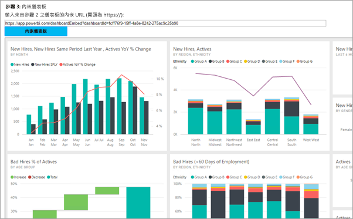

# <a name="embed-a-power-bi-dashboard-tile-or-report-into-your-application"></a>將 Power BI 儀表板、磚或報表內嵌至應用程式
了解如何在對客戶進行內嵌時，使用 Power BI .NET SDK 配合 Power BI JavaScript API 將儀表板、磚或報表整合或內嵌至 Web 應用程式。 這通常是 ISV 案例。



若要遵循此逐步解說開始使用，您需要 **Power BI Pro** 帳戶。 如果您沒有任何帳戶，可以[註冊免費 Power BI 帳戶](../service-self-service-signup-for-power-bi.md)，然後註冊 [Power BI Pro 試用版](../service-self-service-signup-for-power-bi.md#in-service-power-bi-pro-60-day-trial)，或建立您自己的 [Azure Active Directory 租用戶](create-an-azure-active-directory-tenant.md)用於測試用途。

> [!NOTE]
> 想要改為內嵌組織的內容嗎？ 請參閱[將儀表板整合到應用程式中](integrate-dashboard.md)。
> 
> 

若要將儀表板整合到 Web 應用程式，請使用 **Power BI** API 和 Azure Active Directory (AD) 授權**存取權杖**，以取得儀表板。 然後，使用內嵌權杖載入儀表板。 **Power BI** API 為特定 **Power BI** 資源提供程式設計存取。 如需詳細資訊，請參閱 [Overview of Power BI REST API](https://msdn.microsoft.com/library/dn877544.aspx) (Power BI REST API 概觀)、[Power BI .NET SDK](https://github.com/Microsoft/PowerBI-CSharp) 及 [Power BI JavaScript API](https://github.com/Microsoft/PowerBI-JavaScript)。

## <a name="download-the-sample"></a>下載範例
本文示範 GitHub 上的[對組織進行內嵌範例](https://github.com/Microsoft/PowerBI-Developer-Samples/tree/master/App%20Owns%20Data)中所使用的程式碼。 若要依照本逐步解說進行，您可以下載範例。

## <a name="step-1---register-an-app-in-azure-ad"></a>步驟 1 - 在 Azure AD 中註冊應用程式
您必須在 Azure AD 中註冊應用程式，才能進行 REST API 呼叫。 如需詳細資訊，請參閱[註冊 Azure AD 應用程式以內嵌 Power BI 內容](register-app.md)。

若您已經下載[對組織進行內嵌範例](https://github.com/Microsoft/PowerBI-Developer-Samples/tree/master/App%20Owns%20Data)，就能使用註冊後取得的**用戶端識別碼**來設定範例，以便向 Azure AD 驗證。 若要設定範例，請在 *web.config* 檔案中變更 **clientId**。

## <a name="step-2---get-an-access-token-from-azure-ad"></a>步驟 2 - 從 Azure AD 取得存取權杖
在您的應用程式中，您必須先從 Azure AD 取得**存取權杖**，才能對 Power BI REST API 進行呼叫。 如需詳細資訊，請參閱 [Authenticate users and get an Azure AD access token for your Power BI app](get-azuread-access-token.md) (驗證使用者，並為 Power BI 應用程式取得 Azure AD 存取權杖)。

您可以在 **Controllers\HomeController.cs** 的每個內容項目工作中看到相關範例。

## <a name="step-3---get-a-content-item"></a>步驟 3 - 取得內容項目
若要內嵌 Power BI 內容，您需要執行幾項工作以確保能夠正確地將其內嵌。 因為這些步驟全都能直接利用 REST API 完成，所以會使用 .NET SDK 建立這裡的範例應用程式及範例。

### <a name="create-the-power-bi-client-with-your-access-token"></a>使用存取權杖建立 Power BI 用戶端
使用您的存取權杖建立 Power BI 用戶端物件，可讓您與 Power BI API 互動。 你可以藉由將 AccessToken 與 *Microsoft.Rest.TokenCredentials* 物件包裝在一起以進行這項作業。

```
using Microsoft.IdentityModel.Clients.ActiveDirectory;
using Microsoft.Rest;
using Microsoft.PowerBI.Api.V2;

var tokenCredentials = new TokenCredentials(authenticationResult.AccessToken, "Bearer");

// Create a Power BI Client object. It will be used to call Power BI APIs.
using (var client = new PowerBIClient(new Uri(ApiUrl), tokenCredentials))
{
    // Your code to embed items.
}
```

### <a name="get-the-content-item-you-want-to-embed"></a>取得您想要內嵌的內容項目
使用 Power BI 用戶端物件，擷取您想要內嵌之項目的參考。 您可以內嵌儀表板、磚或報表。 以下範例會示範如何從提供的工作區中擷取第一個儀表板、磚或報表。

您可以在 [App Owns Data 範例](https://github.com/Microsoft/PowerBI-Developer-Samples/tree/master/App%20Owns%20Data)的 **Controllers\HomeController.cs** 中，找到關於這項作業的範例。

**儀表板**

```
using Microsoft.PowerBI.Api.V2;
using Microsoft.PowerBI.Api.V2.Models;

// You will need to provide the GroupID where the dashboard resides.
ODataResponseListDashboard dashboards = client.Dashboards.GetDashboardsInGroup(GroupId);

// Get the first report in the group.
Dashboard dashboard = dashboards.Value.FirstOrDefault();
```

**磚**

```
using Microsoft.PowerBI.Api.V2;
using Microsoft.PowerBI.Api.V2.Models;

// To retrieve the tile, you first need to retrieve the dashboard.

// You will need to provide the GroupID where the dashboard resides.
ODataResponseListDashboard dashboards = client.Dashboards.GetDashboardsInGroup(GroupId);

// Get the first report in the group.
Dashboard dashboard = dashboards.Value.FirstOrDefault();

// Get a list of tiles from a specific dashboard
ODataResponseListTile tiles = client.Dashboards.GetTilesInGroup(GroupId, dashboard.Id);

// Get the first tile in the group.
Tile tile = tiles.Value.FirstOrDefault();
```

**報表**

```
using Microsoft.PowerBI.Api.V2;
using Microsoft.PowerBI.Api.V2.Models;

// You will need to provide the GroupID where the dashboard resides.
ODataResponseListReport reports = client.Reports.GetReportsInGroupAsync(GroupId);

// Get the first report in the group.
Report report = reports.Value.FirstOrDefault();
```

### <a name="create-the-embed-token"></a>建立內嵌權杖
必須產生內嵌權杖，以供 JavaScript API 使用。 內嵌權杖專屬於您內嵌的項目。 這表示每次內嵌 Power BI 內容時，您都必須為其建立一個新的內嵌權杖。 如需更多詳細資訊，包括要使用的 **accessLevel**，請參閱 [GenerateToken API](https://msdn.microsoft.com/library/mt784614.aspx)。

> [!IMPORTANT]
> 因為內嵌權杖只適用於開發測試，所以 Power BI 主要帳戶可以產生的內嵌權杖數目有限。 [必須購買容量](https://docs.microsoft.com/power-bi/developer/embedded-faq#technical)才可進行生產環境內嵌案例。 購買容量後，內嵌權杖產生的數量就不受限制。 移至[取得可用功能](https://msdn.microsoft.com/en-us/library/mt846473.aspx) \(英文\) 來檢查已經使用多少免費的內嵌權杖。

您可以在[對組織進行內嵌範例](https://github.com/Microsoft/PowerBI-Developer-Samples/tree/master/App%20Owns%20Data)的 **Controllers\HomeController.cs** 中，找到關於這項作業的範例。

這會假設針對 **EmbedConfig** 及 **TileEmbedConfig** 建立類別。 您可以在 **Models\EmbedConfig.cs** 及 **Models\TileEmbedConfig.cs** 中找到關於上述作業的範例。

**儀表板**

```
using Microsoft.PowerBI.Api.V2;
using Microsoft.PowerBI.Api.V2.Models;

// Generate Embed Token.
var generateTokenRequestParameters = new GenerateTokenRequest(accessLevel: "view");
EmbedToken tokenResponse = client.Dashboards.GenerateTokenInGroup(GroupId, dashboard.Id, generateTokenRequestParameters);

// Generate Embed Configuration.
var embedConfig = new EmbedConfig()
{
    EmbedToken = tokenResponse,
    EmbedUrl = dashboard.EmbedUrl,
    Id = dashboard.Id
};
```

**磚**

```
using Microsoft.PowerBI.Api.V2;
using Microsoft.PowerBI.Api.V2.Models;

// Generate Embed Token for a tile.
var generateTokenRequestParameters = new GenerateTokenRequest(accessLevel: "view");
EmbedToken tokenResponse = client.Tiles.GenerateTokenInGroup(GroupId, dashboard.Id, tile.Id, generateTokenRequestParameters);

// Generate Embed Configuration.
var embedConfig = new TileEmbedConfig()
{
    EmbedToken = tokenResponse,
    EmbedUrl = tile.EmbedUrl,
    Id = tile.Id,
    dashboardId = dashboard.Id
};
```

**報表**

```
using Microsoft.PowerBI.Api.V2;
using Microsoft.PowerBI.Api.V2.Models;

// Generate Embed Token.
var generateTokenRequestParameters = new GenerateTokenRequest(accessLevel: "view");
EmbedToken tokenResponse = client.Reports.GenerateTokenInGroup(GroupId, report.Id, generateTokenRequestParameters);

// Generate Embed Configuration.
var embedConfig = new EmbedConfig()
{
    EmbedToken = tokenResponse,
    EmbedUrl = report.EmbedUrl,
    Id = report.Id
};
```


## <a name="step-4---load-an-item-using-javascript"></a>步驟 4 - 使用 JavaScript 載入項目
您可以使用 JavaScript 將儀表板載入到網頁上的 div 項目中。 此範例會使用 EmbedConfig/TileEmbedConfig 模型，以及儀表板、磚或報表的檢視。 如需使用 JavaScript API 的完整範例，您可以使用 [Microsoft Power BI Embedded Sample](https://microsoft.github.io/PowerBI-JavaScript/demo) (Microsoft Power BI 內嵌範例)。

您可以在[對組織進行內嵌範例](https://github.com/Microsoft/PowerBI-Developer-Samples/tree/master/App%20Owns%20Data)中找到關於這項作業的應用程式範例。

**Views\Home\EmbedDashboard.cshtml**

```
<script src="~/scripts/powerbi.js"></script>
<div id="dashboardContainer"></div>
<script>
    // Read embed application token from Model
    var accessToken = "@Model.EmbedToken.Token";

    // Read embed URL from Model
    var embedUrl = "@Html.Raw(Model.EmbedUrl)";

    // Read dashboard Id from Model
    var embedDashboardId = "@Model.Id";

    // Get models. models contains enums that can be used.
    var models = window['powerbi-client'].models;

    // Embed configuration used to describe the what and how to embed.
    // This object is used when calling powerbi.embed.
    // This also includes settings and options such as filters.
    // You can find more information at https://github.com/Microsoft/PowerBI-JavaScript/wiki/Embed-Configuration-Details.
    var config = {
        type: 'dashboard',
        tokenType: models.TokenType.Embed,
        accessToken: accessToken,
        embedUrl: embedUrl,
        id: embedDashboardId
    };

    // Get a reference to the embedded dashboard HTML element
    var dashboardContainer = $('#dashboardContainer')[0];

    // Embed the dashboard and display it within the div container.
    var dashboard = powerbi.embed(dashboardContainer, config);
</script>
```

**Views\Home\EmbedTile.cshtml**

```
<script src="~/scripts/powerbi.js"></script>
<div id="tileContainer"></div>
<script>
    // Read embed application token from Model
    var accessToken = "@Model.EmbedToken.Token";

    // Read embed URL from Model
    var embedUrl = "@Html.Raw(Model.EmbedUrl)";

    // Read tile Id from Model
    var embedTileId = "@Model.Id";

    // Read dashboard Id from Model
    var embedDashboardeId = "@Model.dashboardId";

    // Get models. models contains enums that can be used.
    var models = window['powerbi-client'].models;

    // Embed configuration used to describe the what and how to embed.
    // This object is used when calling powerbi.embed.
    // This also includes settings and options such as filters.
    // You can find more information at https://github.com/Microsoft/PowerBI-JavaScript/wiki/Embed-Configuration-Details.
    var config = {
        type: 'tile',
        tokenType: models.TokenType.Embed,
        accessToken: accessToken,
        embedUrl: embedUrl,
        id: embedTileId,
        dashboardId: embedDashboardeId
    };

    // Get a reference to the embedded tile HTML element
    var tileContainer = $('#tileContainer')[0];

    // Embed the tile and display it within the div container.
    var tile = powerbi.embed(tileContainer, config);
</script>
```

**Views\Home\EmbedReport.cshtml**

```
<script src="~/scripts/powerbi.js"></script>
<div id="reportContainer"></div>
<script>
    // Read embed application token from Model
    var accessToken = "@Model.EmbedToken.Token";

    // Read embed URL from Model
    var embedUrl = "@Html.Raw(Model.EmbedUrl)";

    // Read report Id from Model
    var embedReportId = "@Model.Id";

    // Get models. models contains enums that can be used.
    var models = window['powerbi-client'].models;

    // Embed configuration used to describe the what and how to embed.
    // This object is used when calling powerbi.embed.
    // This also includes settings and options such as filters.
    // You can find more information at https://github.com/Microsoft/PowerBI-JavaScript/wiki/Embed-Configuration-Details.
    var config = {
        type: 'report',
        tokenType: models.TokenType.Embed,
        accessToken: accessToken,
        embedUrl: embedUrl,
        id: embedReportId,
        permissions: models.Permissions.All,
        settings: {
            filterPaneEnabled: true,
            navContentPaneEnabled: true
        }
    };

    // Get a reference to the embedded report HTML element
    var reportContainer = $('#reportContainer')[0];

    // Embed the report and display it within the div container.
    var report = powerbi.embed(reportContainer, config);
</script>
```

## <a name="next-steps"></a>後續步驟
GitHub 上有範例應用程式可供您檢閱。 上述範例皆以該範例為基礎。 如需詳細資訊，請參閱[對組織進行內嵌範例](https://github.com/Microsoft/PowerBI-Developer-Samples/tree/master/App%20Owns%20Data)。

您可以參閱 [Power BI JavaScript API](https://github.com/Microsoft/PowerBI-JavaScript) 取得更多 JavaScript API 的資訊。

有其他問題嗎？ [嘗試在 Power BI 社群提問](http://community.powerbi.com/)

