# <a name="tutorial-embed-a-power-bi-report-dashboard-or-tile-into-an-application-for-your-customers"></a>教學課程：為您的客戶將 Power BI 報表、儀表板或磚內嵌至應用程式

使用 **Azure 中的 Power BI Embedded**，可利用應用程式擁有的資料，將報表、儀表板或磚內嵌至應用程式。 **應用程式擁有的資料**即是應用程式使用 Power BI 作為其內嵌的分析平台。 身為 **ISV 開發人員**，您可以建立會顯示應用程式 (完全整合且互動) 中報表、儀表板或磚的 Power BI 內容，而使用者完全不需要有 Power BI 授權。 本教學課程示範如何在使用 **Azure 中的 Power BI Embedded** 時，利用 Power BI .NET SDK 搭配 Power BI JavaScript API，為客戶將報表整合至應用程式。

在本教學課程中，您會了解如何：
> [!div class="checklist"]
> * 在 Azure 中註冊應用程式。
> * 將 Power BI 報表內嵌到應用程式中。

## <a name="prerequisites"></a>先決條件

若要開始進行，您需要一個 **Power BI Pro** 帳戶，此帳戶是您的**主帳戶**和 **Microsoft Azure** 訂用帳戶。

* 如果您尚未註冊 **Power BI Pro**，請先[註冊免費試用](https://powerbi.microsoft.com/en-us/pricing/)，再開始進行。
* 如果您沒有 Azure 訂用帳戶，請先建立[免費帳戶](https://azure.microsoft.com/free/?WT.mc_id=A261C142F)，再開始進行。
* 您必須設定自己的 [Azure Active Directory 租用戶](create-an-azure-active-directory-tenant.md)。
* 您必須安裝 [Visual Studio](https://www.visualstudio.com/) (2013 版或更新版本)。

## <a name="set-up-your-embedded-analytics-development-environment"></a>設定您的內嵌分析開發環境

在您開始將報表、儀表板或磚內嵌至您的應用程式之前，必須先確定您的環境允許使用 Power BI 內嵌。

您可以瀏覽[內嵌設定工具](https://aka.ms/embedsetup/AppOwnsData)，即可快速開始使用及下載範例應用程式，協助您逐步建立環境及內嵌報表。

不過，若您選擇手動設定環境，可以繼續進行下方步驟。

### <a name="register-an-application-in-azure-active-directory-azure-ad"></a>在 Azure Active Directory (Azure AD) 中註冊應用程式

請向 Azure Active Directory 註冊您的應用程式，以允許該應用程式存取 Power BI REST API。 註冊您的應用程式可讓您為應用程式建立身分識別，並指定對 Power BI REST 資源的權限。

1. 接受 [Microsoft Power BI API 條款](https://powerbi.microsoft.com/api-terms)。

2. 登入[Azure 入口網站](https://portal.azure.com)。

    

3. 在左側功能窗格中，選取 [所有服務]，選取 [應用程式註冊]，然後選取 [新增應用程式註冊]。

    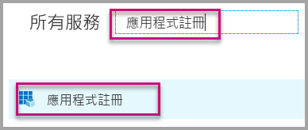</br>
    

4. 遵循提示並建立新的應用程式。 針對擁有資料的應用程式，您需要使用適用於應用程式類型的**原生**。 您還必須提供 [重新導向 URI]，供 **Azure AD** 用來傳回權杖回應。 輸入您應用程式特定的值 (例如：`http://localhost:13526/Redirect`)。

    

### <a name="apply-permissions-to-your-application-within-azure-active-directory"></a>在 Azure Active Directory 內將權限套用至應用程式

為應用程式啟用其他的權限，包括應用程式註冊頁面上所提供的權限。 使用您用來內嵌的「主」帳戶登入。 主帳戶必須為全域系統管理員帳戶。

### <a name="use-the-azure-active-directory-portal"></a>使用 Azure Active Directory 入口網站

1. 瀏覽至 Azure 入口網站內的[應用程式註冊](https://portal.azure.com/#blade/Microsoft_AAD_IAM/ApplicationsListBlade)，然後選取您要用於內嵌的應用程式。

    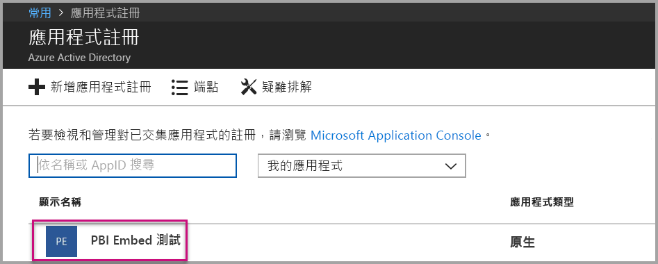

2. 選取 [設定]，然後在 [API 存取權] 底下，選取 [必要權限]。

    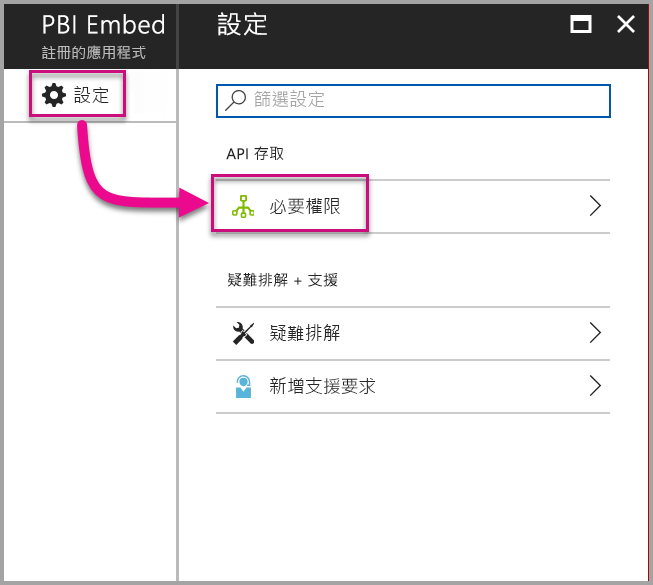

3. 選取 [Windows Azure Active Directory]，然後確定選取 [以登入使用者身分存取目錄]。 選取 [儲存]。

    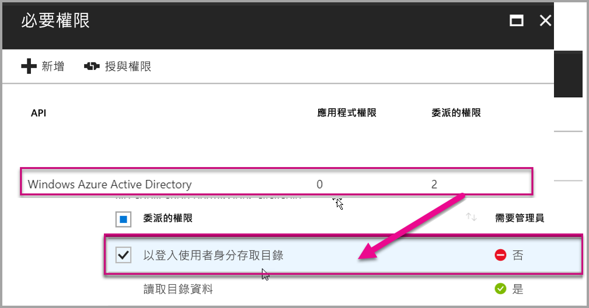

4. 選取 [加入] 。

    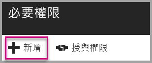

5. 選取 [選取 API]。

    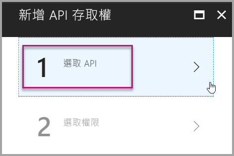

6. 選取 [Power BI 服務]，然後選取 [選取]。

    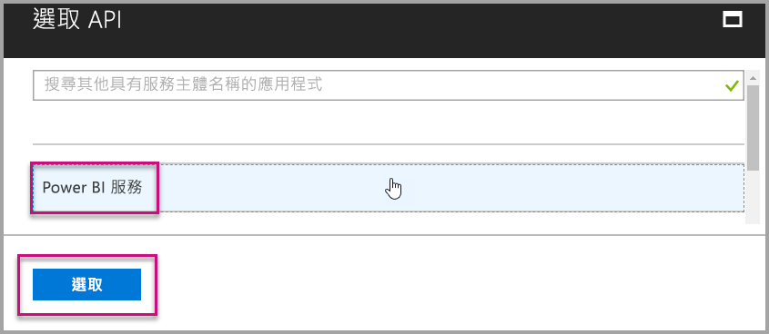

7. 選取 [委派的權限] 下方的所有權限。 完成時，請選取 [儲存]。

    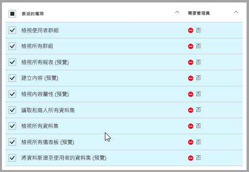

8. 在 [必要權限] 內，選取 [授與權限]。

    **授與權限**動作需要「主帳戶」，才能避免收到 Azure AD 同意的提示。 如果執行此動作的帳戶為全域管理員，則您需要將此應用程式的權限授與組織中的所有使用者。 如果執行此動作的帳戶為「主帳戶」而非全域管理員，則您只需要將此應用程式的權限授與「主帳戶」。

    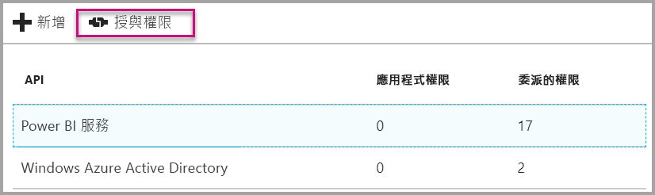

## <a name="set-up-your-power-bi-environment"></a>設定您的 Power BI 環境

### <a name="create-an-app-workspace"></a>建立應用程式工作區

如果您要為客戶內嵌報表、儀表板或磚，就必須將您的內容放在應用程式工作區內。 「主」帳戶必須是應用程式工作區的管理員。

1. 開始建立工作區。 選取 [工作區] > [建立應用程式工作區]。 在 [建立應用程式工作區] 中，放置應用程式所需存取的內容。

    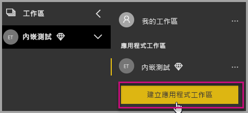

2. 提供工作區的名稱。 如果對應的 [工作區識別碼] 無法使用，請編輯它，使其具有唯一識別碼。

    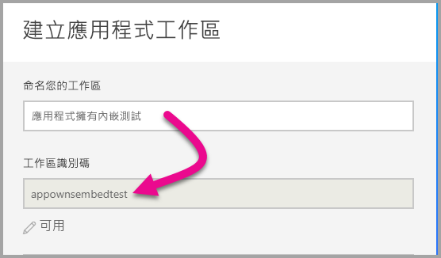

3. 您可以設定幾個選項。 如果您選擇 [公用]，則組織中的所有人都可以看到工作區中的內容。 如果選擇 [私人]，表示只有工作區的成員才能看到其內容。

    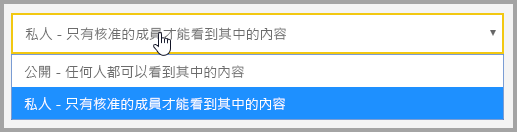

    建立群組之後，您無法變更公用/私人設定。

4. 您也可以選擇成員是否可以**編輯**還是具有**僅限檢視**存取權。

    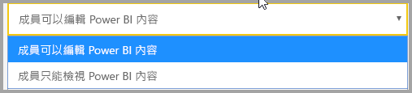

5. 新增想要讓他們存取工作區之人員的電子郵件地址，然後選取 [新增]。 您無法新增群組別名，只能新增個人。

6. 決定每一個人是成員還是系統管理員。系統管理員可以編輯工作區本身，包括新增其他成員。 除非成員具有僅限檢視存取權，否則成員可以編輯工作區中的內容。 管理員和成員都可以發佈應用程式。

    現在，您已可以檢視新的工作區。 Power BI 會建立並開啟工作區。 它會出現在您所屬工作區的清單中。 因為您是系統管理員，所以您可以選擇省略符號 (…) 返回，並透過新增成員或變更其權限來進行變更。

    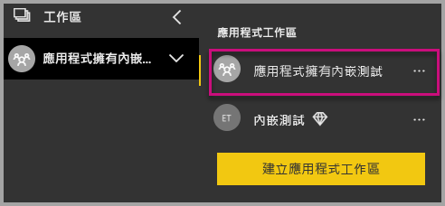

### <a name="create-and-publish-your-reports"></a>建立並發佈報表

您可以使用 Power BI Desktop 建立報表和資料集，接著將這些報表發佈到應用程式工作區。 發佈報表的一般使用者必須有 Power BI Pro 授權，才能發佈至應用程式工作區。

1. 從 GitHub 下載範例[部落格示範](https://github.com/Microsoft/powerbi-desktop-samples)。

    

2. 在 **Power BI Desktop** 中開啟範例 PBIX 報表

   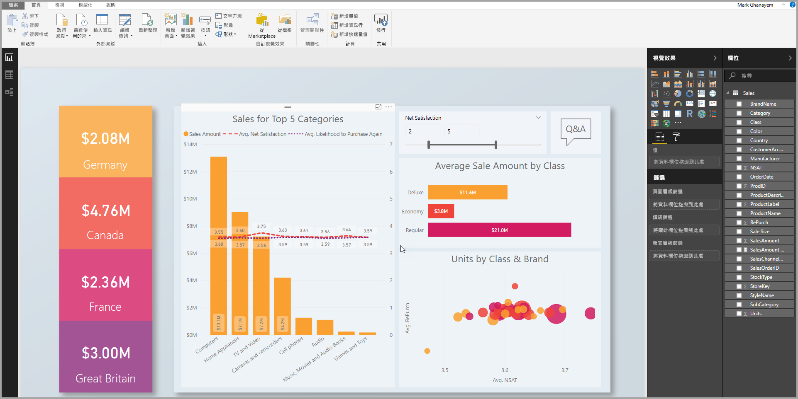

3. 發佈至「應用程式工作區」

   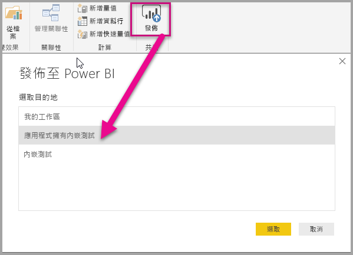

    現在，您可在線上 Power BI 服務中檢視該報表。

   

## <a name="embed-your-content-using-the-sample-application"></a>使用範例應用程式來內嵌內容

請遵循下列步驟，使用範例應用程式開始內嵌您的內容。

1. 從 GitHub 下載[應用程式擁有資料範例](https://github.com/Microsoft/PowerBI-Developer-Samples)來開始進行。

    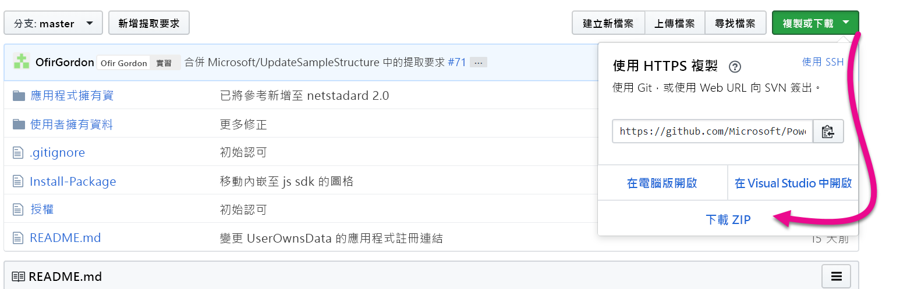

2. 開啟範例應用程式中的 Web.config 檔案。 您需要填入五個欄位，才能成功執行應用程式。 **applicationId**、**workspaceId****reportId****pbiUsername**以及 **pbiPassword**。

    

    使用從 **Azure** 取得的**應用程式識別碼**填入 **applicationId** 資訊。 應用程式會使用 **applicationId** 來向您要求權限的使用者表明其身分。 若要取得 **applicationId**，請遵循下列步驟：

    登入[Azure 入口網站](https://portal.azure.com)。

    

    在左側的功能窗格中，選取 [所有服務] 及 [應用程式註冊]。

    

    選取您想要取得其 **applicationId** 的應用程式。

    

    您應該會看到以 GUID 形式列出的「應用程式識別碼」。 請使用此**應用程式識別碼**作為應用程式的 **applicationId**。

    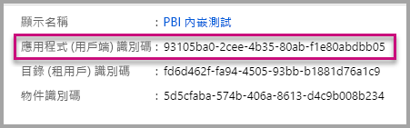

    在 **workspaceId** 資訊中，填入來自 Power BI 的**應用程式工作區 GUID**。

    

    在 **reportId** 資訊中，填入來自 Power BI 的「報表 GUID」。

    

    * 在 **pbiUsername** 中，填入 Power BI 主要使用者帳戶。
    * 在 **pbiPassword** 中，填入 Power BI 主要使用者帳戶的密碼。

3. 執行應用程式！

    首先，在 **Visual Studio** 中選取 [執行]。

    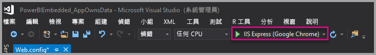

    接著，選取 [內嵌報表]。 視您選擇要進行測試之內容的不同 (報表、儀表板或磚)，接著在應用程式中選取該選項。

    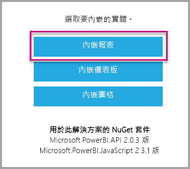

    現在，您已可以在範例應用程式中檢視該報表。

    

## <a name="embed-your-content-within-your-application"></a>在應用程式中內嵌內容

即使使用 [Power BI REST API](https://docs.microsoft.com/rest/api/power-bi/) 可以完成內嵌您內容的步驟，還是可以使用 **.NET SDK** 來撰寫本文中所述的範例程式碼。

在應用程式中為您的客戶內嵌項目，需要從 **Azure AD** 取得您主要帳戶的**存取權杖**。 需要先使用**應用程式擁有資料**，為您的 Power BI 應用程式取得 [Azure AD 存取權杖](get-azuread-access-token.md#access-token-for-non-power-bi-users-app-owns-data)，才可呼叫 [Power BI REST API](https://docs.microsoft.com/rest/api/power-bi/)。

為了使用**存取權杖**建立 Power BI 用戶端，您可以建立 Power BI 用戶端物件，以讓您與 [Power BI REST API](https://docs.microsoft.com/rest/api/power-bi/) 互動。 你可以將 **AccessToken** 與 ***Microsoft.Rest.TokenCredentials*** 物件包裝在一起來建立 Power BI 用戶端物件。

```csharp
using Microsoft.IdentityModel.Clients.ActiveDirectory;
using Microsoft.Rest;
using Microsoft.PowerBI.Api.V2;

var tokenCredentials = new TokenCredentials(authenticationResult.AccessToken, "Bearer");

// Create a Power BI Client object. it's used to call Power BI APIs.
using (var client = new PowerBIClient(new Uri(ApiUrl), tokenCredentials))
{
    // Your code to embed items.
}
```

### <a name="get-the-content-item-you-want-to-embed"></a>取得您想要內嵌的內容項目

您可以使用 Power BI 用戶端物件，擷取您想要內嵌之項目的參考。

下列程式碼範例示範如何從指定工作區中擷取第一份報表。

*取得您要內嵌的報表、儀表板或圖格的內容項目範例，位於[範例應用程式](#embed-your-content-within-a-sample-application)的 Controllers\HomeController.cs 檔案內。*

```csharp
using Microsoft.PowerBI.Api.V2;
using Microsoft.PowerBI.Api.V2.Models;

// You need to provide the workspaceId where the dashboard resides.
ODataResponseListReport reports = await client.Reports.GetReportsInGroupAsync(workspaceId);

// Get the first report in the group.
Report report = reports.Value.FirstOrDefault();
```

### <a name="create-the-embed-token"></a>建立內嵌權杖

產生可從 JavaScript API 使用的內嵌權杖。 內嵌權杖專屬於您內嵌的項目。 因此，每次您內嵌 Power BI 內容時，都必須為其建立一個新的內嵌權杖。 如需更多詳細資訊，包括要使用的 **accessLevel**，請參閱 [GenerateToken API](https://msdn.microsoft.com/library/mt784614.aspx)。

下列範例示範如何將報表的內嵌權杖新增至應用程式。

*建立報表、儀表板或圖格之內嵌權杖的範例，位於[範例應用程式](#embed-your-content-within-a-sample-application)的 Controllers\HomeController.cs 檔案內。*

```csharp
using Microsoft.PowerBI.Api.V2;
using Microsoft.PowerBI.Api.V2.Models;

// Generate Embed Token.
var generateTokenRequestParameters = new GenerateTokenRequest(accessLevel: "view");
EmbedToken tokenResponse = client.Reports.GenerateTokenInGroup(workspaceId, report.Id, generateTokenRequestParameters);

// Generate Embed Configuration.
var embedConfig = new EmbedConfig()
{
    EmbedToken = tokenResponse,
    EmbedUrl = report.EmbedUrl,
    Id = report.Id
};
```

這會針對 **EmbedConfig** 及 **TileEmbedConfig** 建立類別。 您可以在 **Models\EmbedConfig.cs** 檔案和 **Models\TileEmbedConfig.cs** 檔案中找到範例。

### <a name="load-an-item-using-javascript"></a>使用 JavaScript 載入項目

您可以使用 JavaScript 將報表載入網頁上的 div 元素中。

如需使用 JavaScript API 的完整範例，您可以使用[測試網工具](https://microsoft.github.io/PowerBI-JavaScript/demo)。 遊樂場工具是一個可測試不同類型 Power BI Embedded 範例的快速方式。 您也可以瀏覽 [PowerBI-JavaScript Wiki](https://github.com/Microsoft/powerbi-javascript/wiki) 頁面，取得 JavaScript API 的詳細資訊。

此範例使用 **EmbedConfig** 模型和 **TileEmbedConfig** 模型以及報表檢視。

*新增報表、儀表板或圖格檢視的範例，位於[範例應用程式](#embed-your-content-within-a-sample-application)的 Views\Home\EmbedReport.cshtml、Views\Home\EmbedDashboard.cshtml 或 Views\Home\Embedtile.cshtml 檔案內。*

```javascript
<script src="~/scripts/powerbi.js"></script>
<div id="reportContainer"></div>
<script>
    // Read embed application token from Model
    var accessToken = "@Model.EmbedToken.Token";

    // Read embed URL from Model
    var embedUrl = "@Html.Raw(Model.EmbedUrl)";

    // Read report Id from Model
    var embedReportId = "@Model.Id";

    // Get models. models contains enums that can be used.
    var models = window['powerbi-client'].models;

    // Embed configuration used to describe the what and how to embed.
    // This object is used when calling powerbi.embed.
    // This also includes settings and options such as filters.
    // You can find more information at https://github.com/Microsoft/PowerBI-JavaScript/wiki/Embed-Configuration-Details.
    var config = {
        type: 'report',
        tokenType: models.TokenType.Embed,
        accessToken: accessToken,
        embedUrl: embedUrl,
        id: embedReportId,
        permissions: models.Permissions.All,
        settings: {
            filterPaneEnabled: true,
            navContentPaneEnabled: true
        }
    };

    // Get a reference to the embedded report HTML element
    var reportContainer = $('#reportContainer')[0];

    // Embed the report and display it within the div container.
    var report = powerbi.embed(reportContainer, config);
</script>
```

## <a name="move-to-production"></a>移至生產環境

現在您已完成應用程式的開發，就可以為您的應用程式工作區配置專用容量。 需要專用容量才可移到生產環境。

### <a name="create-a-dedicated-capacity"></a>建立專用容量

建立專用容量，您的客戶即可用到專用資源。 您可以在 [Microsoft Azure 入口網站](https://portal.azure.com)內購買專用容量。 如需如何建立 Power BI Embedded 容量的詳細資料，請參閱 [Create Power BI Embedded capacity in the Azure portal](azure-pbie-create-capacity.md) (在 Azure 入口網站中建立 Power BI Embedded 容量)。

使用下表來判斷最符合您需求的 Power BI Embedded 容量。

| 節點容量 | 核心總數<br/>(後端 + 前端) | 後端核心 | 前端核心 | DirectQuery/即時連線限制|
| --- | --- | --- | --- | --- | --- |
| A1 |1 個虛擬核心 |0.5 個核心，3-GB 的 RAM |0.5 個核心 |每秒 0.5 |
| A2 |2 個虛擬核心 |1 個核心，5-GB 的 RAM |1 個核心 | 每秒 10 個 |
| A3 |4 個虛擬核心 |2 個核心，10-GB 的 RAM |2 個核心 | 每秒 15 個 |
| A4 |8 個虛擬核心 |4 個核心，25-GB 的 RAM |4 個核心 |每秒 30 個 |
| A5 |16 個虛擬核心 |8 個核心，50-GB 的 RAM |8 個核心 |每秒 60 個 |
| A6 |32 個虛擬核心 |16 個核心，100-GB 的 RAM |16 個核心 |每秒 120 個 |

**_在 A SKU 中，您無法使用免費的 Power BI 授權存取 Power BI 內容。_**

使用具有 PRO 授權的內嵌權杖適用於開發測試，因此 Power BI 主帳戶可產生的內嵌權杖數量有限。 需有專用容量，才可在生產環境中進行內嵌作業。 若有專用容量，即不會限制您可產生的內嵌權杖數量。 請移至 [Available Features](https://docs.microsoft.com/rest/api/power-bi/availablefeatures/getavailablefeatures) (可用功能) 來檢查指出目前內嵌使用情況百分比的使用情況值。 使用量以每個主帳戶為基礎。

如需詳細資訊，請參閱[內嵌的分析容量規劃白皮書](https://aka.ms/pbiewhitepaper)。

### <a name="assign-an-app-workspace-to-a-dedicated-capacity"></a>將應用程式工作區指派至專用容量

建立了專用容量之後，您可以將應用程式工作區指派到該專用容量。 若要指派專用容量給工作區，請遵循下列步驟。

1. 在 **Power BI 服務**中，展開 工作區，然後選取用於內嵌內容之工作區的省略符號。 然後選取 [編輯工作區]。

    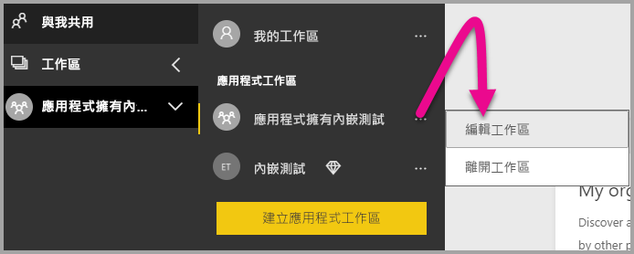

2. 展開 [進階]，接著啟用 [專用容量]，然後選取您所建立的專用容量」。 接著，選取 [儲存]。

    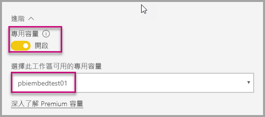

3. 在您選取 [儲存] 後，應該會在應用程式工作區名稱的旁邊看到一個**鑽石**。

    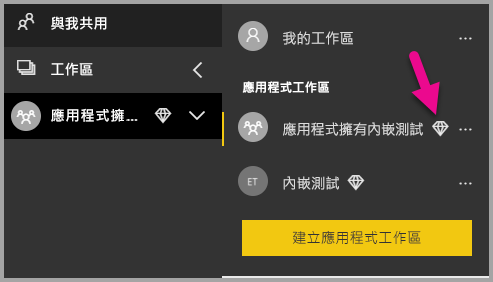

## <a name="next-steps"></a>後續步驟

在本教學課程中，您已了解如何為客戶將 Power BI 內容內嵌至應用程式。 您也可以嘗試為組織內嵌 Power BI 內容。

> [!div class="nextstepaction"]
>[為組織內嵌](embed-sample-for-your-organization.md)

有其他問題嗎？ [嘗試在 Power BI 社群提問](http://community.powerbi.com/)
