# <a name="tutorial-embed-a-power-bi-report-dashboard-or-tile-into-an-application-for-your-organization"></a>教學課程：為組織將 Power BI 報表、儀表板或圖格內嵌至應用程式

在 **Power BI** 中，可利用使用者擁有資料，將報表、儀表板或圖格內嵌至應用程式。 **使用者擁有資料**可讓應用程式延伸 Power BI 服務以使用內嵌式分析。 本教學課程會示範如何將報表整合至應用程式。 您可以使用 Power BI .NET SDK 搭配 Power BI JavaScript API，為組織將 Power BI 內嵌到應用程式中。


在本教學課程中，您會學習下列工作：
> [!div class="checklist"]
> * 在 Azure 中註冊應用程式。
> * 將 Power BI 報表內嵌到應用程式中。

## <a name="prerequisites"></a>先決條件

若要開始使用，您需要 Power BI Pro 帳戶及 Microsoft Azure 訂用帳戶：

* 如果您尚未註冊 Power BI Pro，請先[註冊免費試用](https://powerbi.microsoft.com/en-us/pricing/)，再開始進行。
* 如果您沒有 Azure 訂用帳戶，請先建立[免費帳戶](https://azure.microsoft.com/free/?WT.mc_id=A261C142F)，再開始進行。
* 設定您自己的 [Azure Active Directory (Azure AD) 租用戶](create-an-azure-active-directory-tenant.md)。
* 安裝 [Visual Studio](https://www.visualstudio.com/)，版本 2013 或更新版本。

## <a name="set-up-your-embedded-analytics-development-environment"></a>設定您的內嵌分析開發環境

在您開始將報表、儀表板或磚內嵌至您的應用程式之前，請確認已將環境設定成允許內嵌。 作為設定的一部分，請採取以下其中一個動作：

* 您可以瀏覽[內嵌設定工具](https://aka.ms/embedsetup/UserOwnsData) \(英文\) 來快速開始使用及下載範例應用程式，帶您逐步建立環境及內嵌報表。

* 若您選擇手動設定環境，請採取下列各節中的步驟。

### <a name="register-an-application-in-azure-active-directory"></a>在 Azure Active Directory 中註冊應用程式

若要讓您的應用程式存取 Power BI REST API，請使用 Azure Active Directory 註冊它。 然後您便可以為應用程式建立身分識別，指定對 Power BI REST 資源的權限。

1. 接受 [Microsoft Power BI API 條款](https://powerbi.microsoft.com/api-terms)。

2. 登入 [Azure 入口網站](https://portal.azure.com)。

    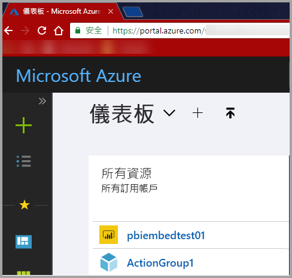

3. 在左側瀏覽窗格中，選擇 [所有服務]及 [應用程式註冊]。 然後選取 [新增應用程式註冊]。

    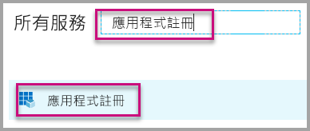</br>

    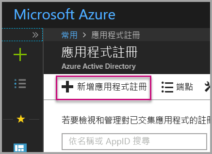

4. 遵循提示並建立新的應用程式。 針對**使用者擁有資料**，請針對 [應用程式類型] 使用 [Web 應用程式/API]。 提供 [登入 URL]，供 Azure AD 用來傳回權杖回應。 輸入您應用程式的特定值。 例如：`http://localhost:13526/`。

    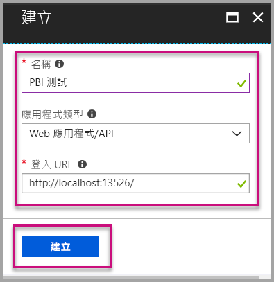

### <a name="apply-permissions-to-your-application-within-azure-active-directory"></a>在 Azure Active Directory 內將權限套用至應用程式

除了應用程式註冊頁面上所提供的內容之外，也請為應用程式啟用權限。 使用全域系統管理員帳戶登入以啟用權限。

### <a name="use-the-azure-active-directory-portal"></a>使用 Azure Active Directory 入口網站

1. 瀏覽至 Azure 入口網站內的[應用程式註冊](https://portal.azure.com/#blade/Microsoft_AAD_IAM/ApplicationsListBlade)，然後選取您要用於內嵌的應用程式。

    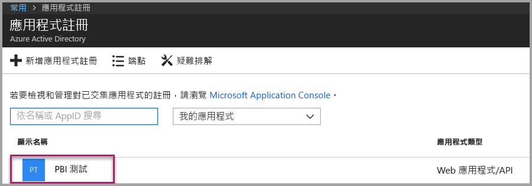

2. 選取 [設定] 。 然後在 [API 存取] 下方，選取 [必要權限]。

    

3. 選取 [Microsoft Azure Active Directory]。 然後確認已選取 [以登入使用者身分存取目錄]。 選取 [儲存]。

    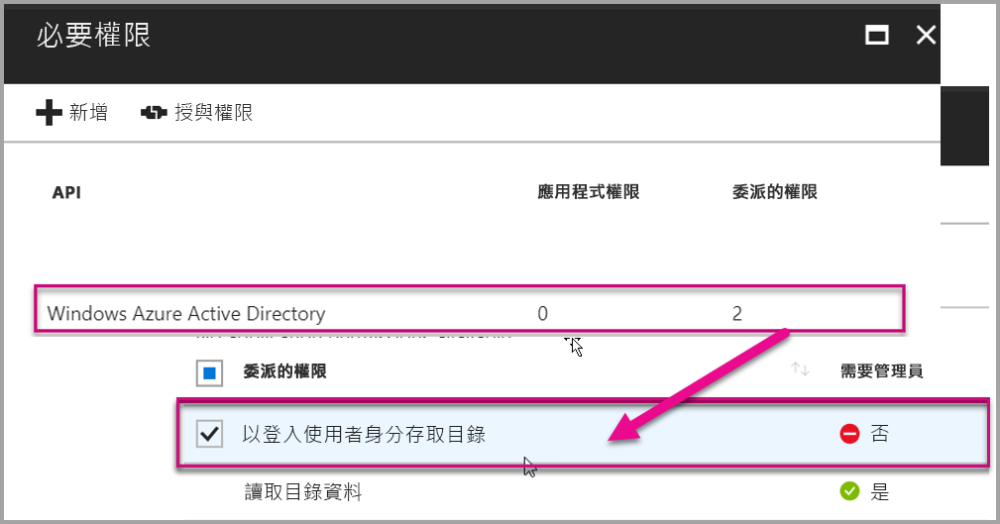

4. 選取 [加入] 。

    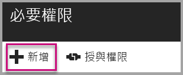

5. 選擇 [選取 API]。

    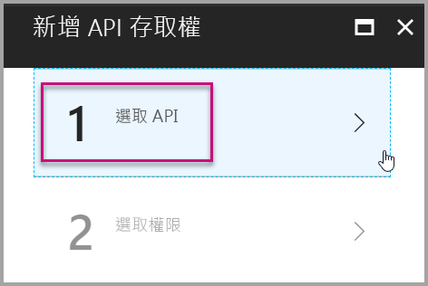

6. 選取 [Power BI 服務]。 然後選擇 [選取]。

    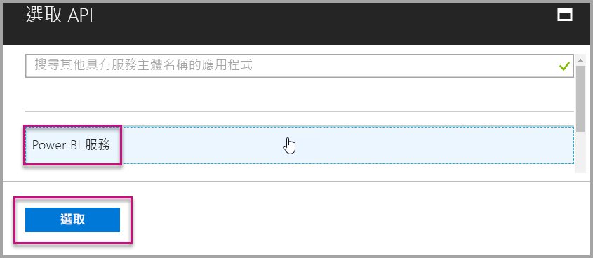

7. 選取 [委派的權限] 下方的所有權限。 逐一選取它們，以儲存選取項目。 完成時，請選取 [儲存]。

    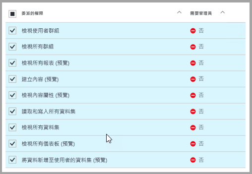

## <a name="set-up-your-power-bi-environment"></a>設定您的 Power BI 環境

### <a name="create-an-app-workspace"></a>建立應用程式工作區

如果您要為客戶內嵌報表、儀表板或磚，就必須將您的內容放在應用程式工作區內：

1. 開始建立工作區。 選取 [工作區] > [建立應用程式工作區]。 此工作區是放置應用程式所需存取內容的位置。

    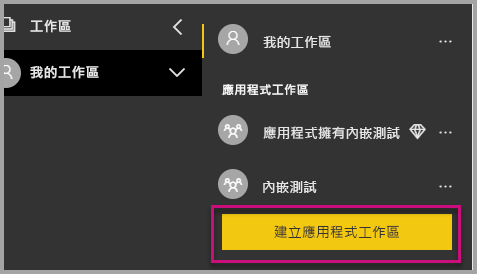

2. 提供工作區的名稱。 如果對應的 [工作區識別碼] 無法使用，請編輯它，使其具有唯一識別碼。 此名稱也必須是應用程式的名稱。

    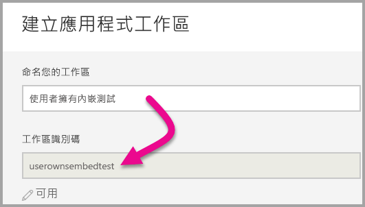

3. 您可以設定幾個選項。 如果您選擇 [公用]，則組織中的所有人都可以看到工作區中的內容。 [私人] 表示只有工作區的成員才能看到其內容。

    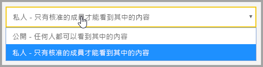

    建立群組之後，您無法變更公用或私人設定。

4. 您也可以選擇成員是否可以編輯，或是具有僅限檢視存取權。

    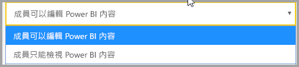

5. 新增想要讓他們存取工作區的人員電子郵件地址，然後選取 [新增]。 您無法新增群組別名，只能新增個人。

6. 決定每一個人是成員還是系統管理員。系統管理員可以編輯工作區本身，包括新增其他成員。 除非成員具有僅限檢視存取權，否則成員可以編輯工作區中的內容。 管理員和成員都可以發佈應用程式。

    現在，您已可以檢視新的工作區。 Power BI 會建立並開啟工作區。 它會顯示在您所屬工作區的清單中。 因為您是系統管理員，所以您可以選擇省略符號 (…) 返回，並透過新增成員或變更其權限來進行變更。

    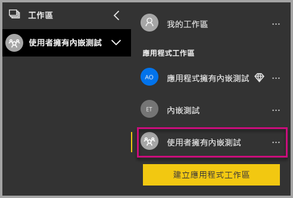

### <a name="create-and-publish-your-reports"></a>建立並發佈報表

您可以使用 Power BI Desktop 來建立您的報表和資料集。 然後您可以將那些報表發佈到應用程式工作區。 發佈報表的終端使用者必須有 Power BI Pro 授權，才能發佈至應用程式工作區。

1. 從 GitHub 下載範例[部落格示範](https://github.com/Microsoft/powerbi-desktop-samples)。

    

2. 在 Power BI Desktop 中開啟範例 .pbix 報表。

   

3. 發佈至應用程式工作區。

   

    現在，您可在線上 Power BI 服務中檢視該報表。

   

## <a name="embed-your-content-by-using-the-sample-application"></a>使用範例應用程式來內嵌內容

若要使用範例應用程式內嵌您的內容，請遵循以下步驟：

1. 若要開始使用，請從 GitHub 下載[使用者擁有資料範例](https://github.com/Microsoft/PowerBI-Developer-Samples)。 範例應用程式有三種不同類型，分別為[報表](https://github.com/Microsoft/PowerBI-Developer-Samples/tree/master/User%20Owns%20Data/integrate-report-web-app)、[儀表板](https://github.com/Microsoft/PowerBI-Developer-Samples/tree/master/User%20Owns%20Data/integrate-dashboard-web-app)和[磚](https://github.com/Microsoft/PowerBI-Developer-Samples/tree/master/User%20Owns%20Data/integrate-tile-web-app)。 本文說明的是**報表**應用程式。

    

2. 開啟範例應用程式中的 **Cloud.config** 檔案。 您必須填入一些欄位，才能成功執行應用程式：**ApplicationID** 和 **ApplicationSecret**。

    

    使用從 Azure 取得的**應用程式識別碼**，填入 **ApplicationID** 資訊。 應用程式會使用 **ApplicationID** 向您要求權限的使用者表明其身分。

    若要取得 **ApplicationID**，請遵循下列步驟：

    1. 登入 [Azure 入口網站](https://portal.azure.com)。

       

    2. 在左側瀏覽窗格中，選擇 [所有服務]及 [應用程式註冊]。

       

    3. 選取需要使用 **ApplicationID** 的應用程式。

       

    4. 您應該會看到以 GUID 形式列出的**應用程式識別碼**。 請使用此**應用程式識別碼**作為應用程式的 **ApplicationID**。

        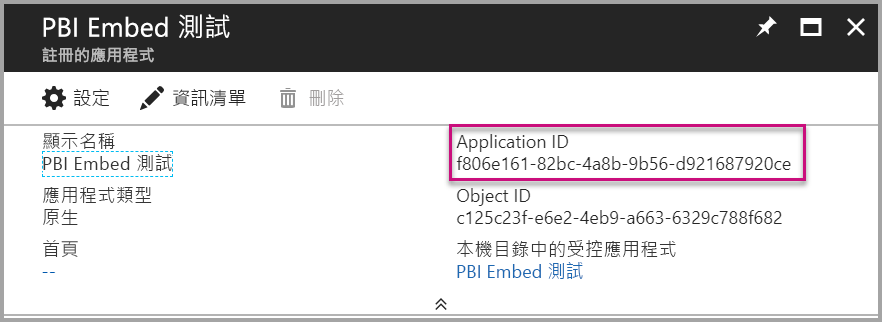

    在 **Azure** 之 [應用程式註冊] 區段的 [金鑰] 區段中，填入 **ApplicationSecret** 資訊。

    若要取得 **ApplicationSecret**，請遵循下列步驟：

    1. 登入 [Azure 入口網站](https://portal.azure.com)。

       

    2. 在左側瀏覽窗格中，選擇 [所有服務]及 [應用程式註冊]。

       

    3. 選取需要使用 **ApplicationSecret** 的應用程式。

       

    4. 選取 [設定] 。

       ![選取 [設定]](media/embed-sample-for-your-organization/embed-sample-for-your-organization-038.png)

    5. 選取 [金鑰]。

       ![選取 [金鑰]](media/embed-sample-for-your-organization/embed-sample-for-your-organization-039.png)

    6. 在 [描述] 方塊中輸入名稱，並選取期間。 然後選取 [儲存] 來取得您應用程式的**值**。 當您在儲存金鑰值後關閉 [金鑰] 窗格時，[值] 欄位只會以隱藏方式顯示。 此時，您即無法擷取金鑰值。 如果您遺失金鑰值，就必須在 Azure 入口網站中建立一個新的。

          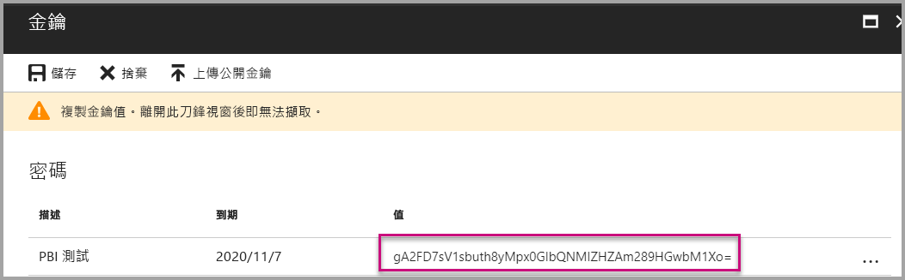

    7. 針對 **groupId**，輸入來自 Power BI 的應用程式工作區 GUID。

       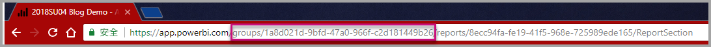

    8. 針對 **reportId**，輸入來自 Power BI 的報表 GUID。

       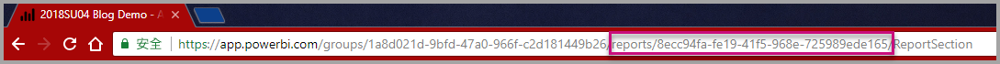

3. 執行應用程式：

    在 **Visual Studio** 中選取 [執行]。

    

    然後選取 [取得報表]。

    

    現在，您已可以在範例應用程式中檢視該報表。

    

## <a name="embed-your-content-within-your-application"></a>在應用程式中內嵌內容

雖然使用 [Power BI REST API](https://docs.microsoft.com/rest/api/power-bi/) 可以完成內嵌您內容的步驟，本文描述的範例程式碼仍是使用 .NET SDK 撰寫。

若要將報表整合至 Web 應用程式，您需要使用 Power BI REST API 或 Power BI C# SDK。 您也可以使用 Azure Active Directory 授權存取權杖來取得報表。 然後，您可以使用相同的存取權杖來載入報表。 Power BI Rest API 可讓您以程式設計方式存取特定的 Power BI 資源。 如需詳細資訊，請參閱 [Power BI REST API](https://docs.microsoft.com/rest/api/power-bi/) 及 [Power BI JavaScript API](https://github.com/Microsoft/PowerBI-JavaScript)。

### <a name="get-an-access-token-from-azure-ad"></a>從 Azure AD 取得存取權杖

在您的應用程式中，您必須從 Azure AD 取得存取權杖，才能呼叫 Power BI REST API。 如需詳細資訊，請參閱 [Authenticate users and get an Azure AD access token for your Power BI app](get-azuread-access-token.md) (驗證使用者，並為 Power BI 應用程式取得 Azure AD 存取權杖)。

### <a name="get-a-report"></a>取得報表

若要取得 Power BI 報表，請使用[取得報表](https://docs.microsoft.com/rest/api/power-bi/reports/getreports)作業來取得 Power BI 報表清單。 您可以從報表清單中取得報表識別碼。

### <a name="get-reports-by-using-an-access-token"></a>使用存取權杖取得報表

[取得報表](https://docs.microsoft.com/rest/api/power-bi/reports/getreports)作業會傳回報表清單。 您可以從報表清單中取得單一報表。

若要進行 REST API 呼叫，您必須使用 *Bearer {access token}* 的格式包含 *Authorization* 標頭。

#### <a name="get-reports-with-the-rest-api"></a>利用 REST API 取得報表

下列程式碼範例示範如何使用 **REST API** 擷取報表：

> [!NOTE]  
> [範例應用程式](#embed-your-content-using-the-sample-application)的 **Default.aspx.cs** 檔案中具有範例，可讓您取得要內嵌的內容項目。 範例包括報表、儀表板或磚。

```csharp
using Newtonsoft.Json;

//Get a Report. In this sample, you get the first Report.
protected void GetReport(int index)
{
    //Configure Reports request
    System.Net.WebRequest request = System.Net.WebRequest.Create(
        String.Format("{0}/Reports",
        baseUri)) as System.Net.HttpWebRequest;

    request.Method = "GET";
    request.ContentLength = 0;
    request.Headers.Add("Authorization", String.Format("Bearer {0}", accessToken.Value));

    //Get Reports response from request.GetResponse()
    using (var response = request.GetResponse() as System.Net.HttpWebResponse)
    {
        //Get reader from response stream
        using (var reader = new System.IO.StreamReader(response.GetResponseStream()))
        {
            //Deserialize JSON string
            PBIReports Reports = JsonConvert.DeserializeObject<PBIReports>(reader.ReadToEnd());

            //Sample assumes at least one Report.
            //You could write an app that lists all Reports
            if (Reports.value.Length > 0)
            {
                var report = Reports.value[index];

                txtEmbedUrl.Text = report.embedUrl;
                txtReportId.Text = report.id;
                txtReportName.Text = report.name;
            }
        }
    }
}

//Power BI Reports used to deserialize the Get Reports response.
public class PBIReports
{
    public PBIReport[] value { get; set; }
}
public class PBIReport
{
    public string id { get; set; }
    public string name { get; set; }
    public string webUrl { get; set; }
    public string embedUrl { get; set; }
}
```

#### <a name="get-reports-by-using-the-net-sdk"></a>使用 .NET SDK 取得報表

您可以使用 .NET SDK 擷取報表清單，而不必直接呼叫 REST API。 下列程式碼範例會示範如何列出報表：

```csharp
using Microsoft.IdentityModel.Clients.ActiveDirectory;
using Microsoft.PowerBI.Api.V2;
using Microsoft.PowerBI.Api.V2.Models;

var tokenCredentials = new TokenCredentials(<ACCESS TOKEN>, "Bearer");

// Create a Power BI Client object. It is used to call Power BI APIs.
using (var client = new PowerBIClient(new Uri(ApiUrl), tokenCredentials))
{
    // Get the first report all reports in that workspace
    ODataResponseListReport reports = client.Reports.GetReports();

    Report report = reports.Value.FirstOrDefault();

    var embedUrl = report.EmbedUrl;
}
```

### <a name="load-a-report-by-using-javascript"></a>使用 JavaScript 載入報表

您可以使用 JavaScript 將報表載入網頁上的 div 元素中。 下列程式碼範例示範如何從指定工作區擷取報表：

> [!NOTE]  
> [範例應用程式](#embed-your-content-using-the-sample-application)的 **Default.aspx** 檔案中具有範例，可讓您載入要內嵌的內容項目。 範例包括報表、儀表板或磚。

```javascript
<!-- Embed Report-->
<div> 
    <asp:Panel ID="PanelEmbed" runat="server" Visible="true">
        <div>
            <div><b class="step">Step 3</b>: Embed a report</div>

            <div>Enter an embed url for a report from Step 2 (starts with https://):</div>
            <input type="text" id="tb_EmbedURL" style="width: 1024px;" />
            <br />
            <input type="button" id="bEmbedReportAction" value="Embed Report" />
        </div>

        <div id="reportContainer"></div>
    </asp:Panel>
</div>
```

#### <a name="sitemaster"></a>Site.master

```javascript
window.onload = function () {
    // client side click to embed a selected report.
    var el = document.getElementById("bEmbedReportAction");
    if (el.addEventListener) {
        el.addEventListener("click", updateEmbedReporte, false);
    } else {
        el.attachEvent('onclick', updateEmbedReport);
    }

    // handle server side post backs, optimize for reload scenarios
    // show embedded report if all fields were filled in.
    var accessTokenElement = document.getElementById('MainContent_accessTokenTextbox');
    if (accessTokenElement !== null) {
        var accessToken = accessTokenElement.value;
        if (accessToken !== "")
            updateEmbedReport();
    }
};

// update embed report
function updateEmbedReport() {

    // check if the embed url was selected
    var embedUrl = document.getElementById('tb_EmbedURL').value;
    if (embedUrl === "")
        return;

    // get the access token.
    accessToken = document.getElementById('MainContent_accessTokenTextbox').value;

    // Embed configuration used to describe the what and how to embed.
    // This object is used when calling powerbi.embed.
    // You can find more information at https://github.com/Microsoft/PowerBI-JavaScript/wiki/Embed-Configuration-Details.
    var config = {
        type: 'report',
        accessToken: accessToken,
        embedUrl: embedUrl
    };

    // Grab the reference to the div HTML element that will host the report.
    var reportContainer = document.getElementById('reportContainer');

    // Embed the report and display it within the div container.
    var report = powerbi.embed(reportContainer, config);

    // report.on will add an event handler which prints to Log window.
    report.on("error", function (event) {
        var logView = document.getElementById('logView');
        logView.innerHTML = logView.innerHTML + "Error<br/>";
        logView.innerHTML = logView.innerHTML + JSON.stringify(event.detail, null, "  ") + "<br/>";
        logView.innerHTML = logView.innerHTML + "---------<br/>";
    }
  );
}
```

## <a name="using-a-power-bi-premium-dedicated-capacity"></a>使用 Power BI Premium 專用容量

現在您已完成應用程式的開發，就可以為您的應用程式工作區配置專用容量。

### <a name="create-a-dedicated-capacity"></a>建立專用容量

建立專用容量，您應用程式工作區中的內容即可享有專用資源。 您可以使用 [Power BI Premium](../service-premium.md) 建立專用容量。

下表列出 [Microsoft Office 365](../service-admin-premium-purchase.md) 中可用的 Power BI Premium SKU：

| 容量節點 | V 核心總數<br/>(後端 + 前端) | 後端 V 核心數 | 前端 V 核心數 | DirectQuery/即時連線限制 |
| --- | --- | --- | --- | --- | --- |
| EM1 |1 個 V 核心 |0.5 個 V 核心，10 GB RAM |0.5 個 V 核心 |每秒 3.75 個 |
| EM2 |2 個 V 核心 |1 個 V 核心，10 GB RAM |1 個 V 核心 |每秒 7.5 個 |
| EM3 |4 個 V 核心 |2 個 V 核心，10 GB RAM |2 個 V 核心 |每秒 15 個 |
| P1 |8 個 V 核心 |4 個 V 核心，25 GB RAM |4 個 V 核心 |每秒 30 個 |
| P2 |16 個 V 核心 |8 個 V 核心，50 GB RAM |8 個 V 核心 |每秒 60 個 |
| P3 |32 個 V 核心 |16 個 V 核心，100 GB RAM |16 個 V 核心 |每秒 120 個 |
| P4 |64 個 V 核心 |32 個 V 核心，200 GB RAM |32 個 V 核心 |每秒 240 個 |
| P5 |128 個 V 核心 |64 個 V 核心，400 GB RAM |64 個 V 核心 |每秒 480 個 |
> [!NOTE]
> - 當您嘗試使用 Microsoft Office 應用程式進行內嵌時，您可以搭配免費的 Power BI 授權，使用 EM SKU 來存取內容。 但是，您無法在使用 Powerbi.com 或 Power BI 行動版時，搭配免費的 Power BI 授權來存取內容。
> - 當您嘗試透過利用 Powerbi.com 或 Power BI 行動版，使用 Microsoft Office 應用程式來進行內嵌時，您可以使用免費 Power BI 授權來存取內容。

### <a name="assign-an-app-workspace-to-a-dedicated-capacity"></a>將應用程式工作區指派至專用容量

建立專用容量之後，您可以將應用程式工作區指派到該專用容量。 若要完成此處理序，請遵循下列步驟：

1. 在 Power BI 服務中，展開工作區，然後選取用於內嵌內容工作區的省略符號。 然後選取 [編輯工作區]。

    

2. 展開 [進階]，然後啟用 [專用容量]。 選取您建立的專用容量。 接著，選取 [儲存]。

    

3. 在您選取 [儲存] 後，應該會在應用程式工作區名稱的旁邊看到一個鑽石。

    

## <a name="admin-settings"></a>管理員設定

全域管理員或 Power BI 服務系統管理員可以為租用戶開啟或關閉使用 REST API 的能力。 Power BI 系統管理員可以為整個組織或個別安全性群組進行此設定。 根據預設，會為整個組織啟用這個設定。 您可以在 [Power BI 系統管理入口網站](../service-admin-portal.md)進行這些變更。

## <a name="next-steps"></a>後續步驟

在本教學課程中，您已了解如何使用 Power BI 組織帳戶將 Power BI 內容內嵌至應用程式。 您現在可以嘗試使用應用程式將 Power BI 內容內嵌至應用程式。 您也可以嘗試為客戶內嵌 Power BI 內容：

> [!div class="nextstepaction"]
> [從應用程式內嵌](embed-from-apps.md)

> [!div class="nextstepaction"]
>[對客戶進行內嵌](embed-sample-for-customers.md)

如果您有更多問題，請[嘗試詢問 Power BI 社群](http://community.powerbi.com/)。
