# <a name="tutorial-embed-power-bi-content-into-an-application-for-your-organization"></a>教學課程：為組織將 Power BI 內容內嵌至應用程式

在 **Power BI** 中，您可以利用使用者擁有資料，將報表 (Power BI 或編頁報表)、儀表板或磚內嵌至應用程式。 **使用者擁有資料**可讓應用程式延伸 Power BI 服務，使其可用內嵌式分析。 本教學課程會示範如何將報表 (Power BI 或編頁報表) 整合至應用程式。 您可以使用 Power BI .NET SDK 搭配 Power BI JavaScript API，為組織將 Power BI 內嵌到應用程式中。

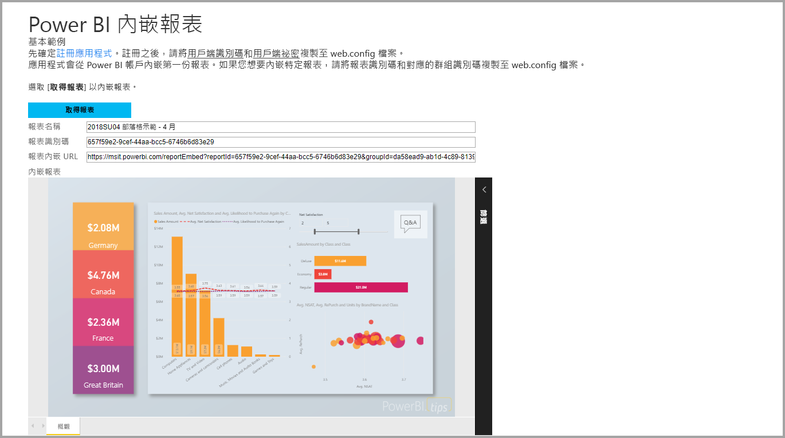

在本教學課程中，您會學習下列工作：
> [!div class="checklist"]
> * 在 Azure 中註冊應用程式。
> * 使用您的 Power BI 租用戶將 Power BI 或編頁報表內嵌到應用程式。

## <a name="prerequisites"></a>先決條件

若要開始，您必須具備：

* [Power BI Pro 帳戶](../service-self-service-signup-for-power-bi.md)。
* [Microsoft Azure](https://azure.microsoft.com/) 訂用帳戶。
* 您必須設定自己的 [Azure Active Directory 租用戶](create-an-azure-active-directory-tenant.md)。
* 若要內嵌編頁報表，您需要至少 P1 容量；請參閱[我需要針對編頁報表使用何種大小的 Premium 容量？](../paginated-reports-faq.md#what-size-premium-capacity-do-i-need-for-paginated-reports)。

如果您尚未註冊 **Power BI Pro**，請先[註冊免費試用](https://powerbi.microsoft.com/pricing/)，再開始進行。

如果您沒有 Azure 訂用帳戶，請先建立[免費帳戶](https://azure.microsoft.com/free/?WT.mc_id=A261C142F)，再開始進行。

## <a name="set-up-your-embedded-analytics-development-environment"></a>設定您的內嵌分析開發環境

在您開始將報表、儀表板或磚內嵌至您的應用程式之前，必須先確定您的環境允許使用 Power BI 內嵌。

您可以瀏覽[內嵌設定工具](https://aka.ms/embedsetup/UserOwnsData)，即可快速開始使用及下載範例應用程式，協助您逐步建立環境及內嵌報表。 在內嵌編頁報表的案例中，您需要指派至少 P1 容量給所建立的工作區。

若選擇手動設定環境，您可以繼續進行下列步驟。

### <a name="register-an-application-in-azure-active-directory"></a>在 Azure Active Directory 中註冊應用程式

請向 Azure Active Directory [註冊您的應用程式](register-app.md)，以允許該應用程式存取 [Power BI REST API](https://docs.microsoft.com/rest/api/power-bi/)。 註冊您的應用程式可讓您為應用程式建立身分識別，並指定對 Power BI REST 資源的權限。

您必須繼續註冊**伺服器端 Web 應用程式**應用程式。 您註冊伺服器端 Web 應用程式，以建立應用程式祕密。

## <a name="set-up-your-power-bi-environment"></a>設定您的 Power BI 環境

### <a name="create-a-workspace"></a>建立工作區

如果要為客戶內嵌報表、儀表板或磚，就必須將您的內容放在工作區內。 有不同類型的工作區可供您設定：[傳統工作區](../service-create-workspaces.md)或[新工作區](../service-create-the-new-workspaces.md)。

### <a name="create-and-publish-your-power-bi-reports"></a>建立並發佈您的 Power BI 報表

您可以使用 Power BI Desktop 來建立您的報表和資料集。 然後您可以將那些報表發佈到工作區。 發佈報表的終端使用者必須有 Power BI Pro 授權，才能發佈至工作區。

1. 從 GitHub 下載範例[示範](https://github.com/Microsoft/powerbi-desktop-samples)。

    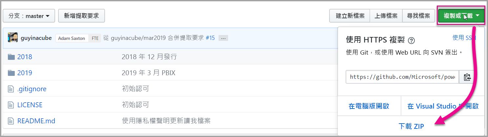

2. 在 Power BI Desktop 中開啟範例 .pbix 報表。

   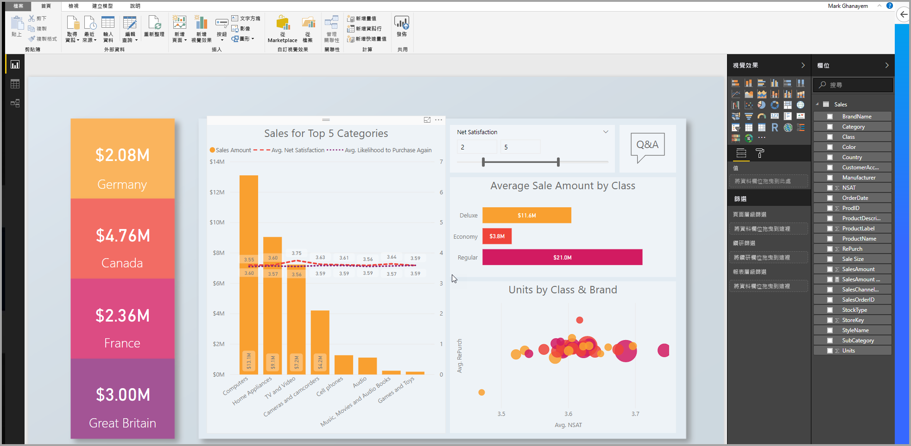

3. 發佈至工作區。

   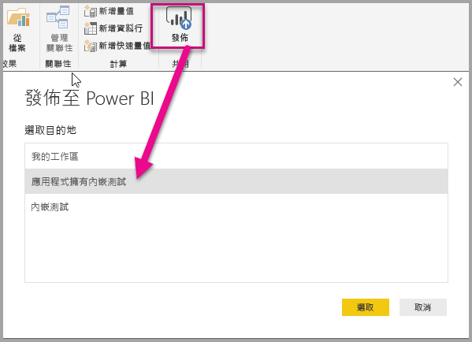

    現在，您可在線上 Power BI 服務中檢視該報表。

   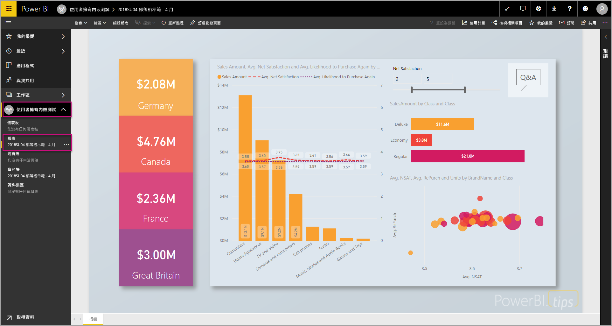
   
### <a name="create-and-publish-your-paginated-reports"></a>建立並發佈您的編頁報表

您可以使用 [Power BI 報表產生器](../paginated-reports-report-builder-power-bi.md#create-reports-in-power-bi-report-builder)來建立編頁報表。 然後，您可以[上傳報表](../paginated-reports-quickstart-aw.md#upload-the-report-to-the-service)到至少指派 P1 容量的工作區。 上傳報表的終端使用者需要擁有 Power BI Pro 授權才能發佈至工作區。
   
## <a name="embed-your-content-by-using-the-sample-application"></a>使用範例應用程式來內嵌內容

此範例刻意保持簡單以供示範之用。

請遵循下列步驟，使用範例應用程式開始內嵌您的內容。

1. 下載 [Visual Studio](https://www.visualstudio.com/) (版本 2013 或更新版本)。 務必下載最新 [NuGet 套件](https://www.nuget.org/profiles/powerbi)。

2. 從 GitHub 下載[使用者擁有資料範例](https://github.com/Microsoft/PowerBI-Developer-Samples)以開始使用。

    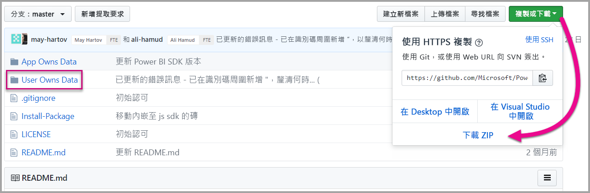

3. 開啟範例應用程式中的 **Cloud.config** 檔案。

    您需要填寫幾個欄位，才能執行應用程式。

    | 欄位 |
    |--------------------|
    | **[應用程式識別碼](#application-id)** |
    | **[工作區識別碼](#workspace-id)** |
    | **[報表識別碼](#report-id)** |
    | **[AADAuthorityUrl](#aadauthorityurl)** |

    

### <a name="application-id"></a>應用程式識別碼

使用從 **Azure** 取得的**應用程式識別碼**填入 **applicationId** 資訊。 應用程式會使用 **applicationId** 來向您要求權限的使用者表明其身分。

若要取得 **applicationId**，請遵循下列步驟：

1. 登入[Azure 入口網站](https://portal.azure.com)。

2. 在左側的瀏覽窗格中，選取 [所有服務]  ，然後選取 [應用程式註冊]  。

3. 選取需要 **applicationId** 的應用程式。

    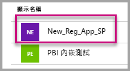

4. 有一個以 GUID 形式列出的「應用程式識別碼」  。 請使用此**應用程式識別碼**作為應用程式的 **applicationId**。

    

### <a name="workspace-id"></a>工作區識別碼

在 **workspaceId** 資訊中，填入來自 Power BI 的工作區 (群組) GUID。 您可以在登入 Power BI 服務時從 URL，或使用 Powershell 取得這項資訊。

URL <br>


Powershell <br>

```powershell
Get-PowerBIworkspace -name "User Owns Embed Test"
```

   

### <a name="report-id"></a>報表識別碼

在 **reportId** 資訊中，填入來自 Power BI 的報表 GUID。 您可以在登入 Power BI 服務時從 URL，或使用 Powershell 取得這項資訊。

Power BI 報表 URL <br>


編頁報表 URL<br>


Powershell <br>

```powershell
Get-PowerBIworkspace -name "User Owns Embed Test" | Get-PowerBIReport
```


### <a name="aadauthorityurl"></a>AADAuthorityUrl

利用使您可在組織租用戶中內嵌，或以來賓使用者身分內嵌的 URL，填滿 **AADAuthorityUrl** 資訊。

若要以您的組織租用戶內嵌，請使用 URL - *https://login.microsoftonline.com/common/oauth2/authorize* 。

若要以來賓內嵌，請使用 URL - *https://login.microsoftonline.com/report-owner-tenant-id* - 您可在其中新增報表擁有者的租用戶識別碼，以取代 *report-owner-tenant-id*。

### <a name="run-the-application"></a>執行應用程式

1. 在 **Visual Studio** 中選取 [執行]  。

    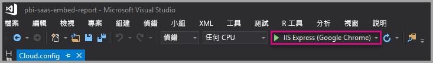

2. 接著，選取 [內嵌報表]  。 視您選擇要進行測試之內容的不同 (報表、儀表板或磚)，接著在應用程式中選取該選項。

    

3. 現在，您已可以在範例應用程式中檢視該報表。

    

## <a name="embed-your-content-within-your-application"></a>在應用程式中內嵌內容

雖然使用 [Power BI REST API](https://docs.microsoft.com/rest/api/power-bi/) 可以完成內嵌您內容的步驟，本文描述的範例程式碼仍是使用 .NET SDK 撰寫。

若要將報表整合至 Web 應用程式，您需要使用 Power BI REST API 或 Power BI C# SDK。 您也可以使用 Azure Active Directory 授權存取權杖來取得報表。 然後，您可以使用相同的存取權杖來載入報表。 Power BI Rest API 可讓您以程式設計方式存取特定的 Power BI 資源。 如需詳細資訊，請參閱 [Power BI REST API](https://docs.microsoft.com/rest/api/power-bi/) 及 [Power BI JavaScript API](https://github.com/Microsoft/PowerBI-JavaScript)。

### <a name="get-an-access-token-from-azure-ad"></a>從 Azure AD 取得存取權杖

在您的應用程式中，您必須從 Azure AD 取得存取權杖，才能呼叫 Power BI REST API。 如需詳細資訊，請參閱 [Authenticate users and get an Azure AD access token for your Power BI app](get-azuread-access-token.md) (驗證使用者，並為 Power BI 應用程式取得 Azure AD 存取權杖)。

### <a name="get-a-report"></a>取得報表

若要取得 Power BI 或編頁報表，請使用[取得報表](https://docs.microsoft.com/rest/api/power-bi/reports/getreports)作業來取得 Power BI 報表和編頁報表清單。 您可以從報表清單中取得報表識別碼。

### <a name="get-reports-by-using-an-access-token"></a>使用存取權杖取得報表

[取得報表](https://docs.microsoft.com/rest/api/power-bi/reports/getreports)作業會傳回報表清單。 您可以從報表清單中取得單一報表。

若要進行 REST API 呼叫，您必須使用 *Bearer {access token}* 的格式包含 *Authorization* 標頭。

#### <a name="get-reports-with-the-rest-api"></a>利用 REST API 取得報表

以下程式碼範例示範如何使用 REST API 擷取報表：

> [!Note]
> [範例應用程式](https://github.com/Microsoft/PowerBI-Developer-Samples)中的 Default.aspx.cs 檔案中有提供範例，其中示範了如何取得您要內嵌的內容項目。 範例包括報表、儀表板或磚。

```csharp
using Newtonsoft.Json;

//Get a Report. In this sample, you get the first Report.
protected void GetReport(int index)
{
    //Configure Reports request
    System.Net.WebRequest request = System.Net.WebRequest.Create(
        String.Format("{0}/Reports",
        baseUri)) as System.Net.HttpWebRequest;

    request.Method = "GET";
    request.ContentLength = 0;
    request.Headers.Add("Authorization", String.Format("Bearer {0}", accessToken.Value));

    //Get Reports response from request.GetResponse()
    using (var response = request.GetResponse() as System.Net.HttpWebResponse)
    {
        //Get reader from response stream
        using (var reader = new System.IO.StreamReader(response.GetResponseStream()))
        {
            //Deserialize JSON string
            PBIReports Reports = JsonConvert.DeserializeObject<PBIReports>(reader.ReadToEnd());

            //Sample assumes at least one Report.
            //You could write an app that lists all Reports
            if (Reports.value.Length > 0)
            {
                var report = Reports.value[index];

                txtEmbedUrl.Text = report.embedUrl;
                txtReportId.Text = report.id;
                txtReportName.Text = report.name;
            }
        }
    }
}

//Power BI Reports used to deserialize the Get Reports response.
public class PBIReports
{
    public PBIReport[] value { get; set; }
}
public class PBIReport
{
    public string id { get; set; }
    public string reportType { get; set }
    public string name { get; set; }
    public string webUrl { get; set; }
    public string embedUrl { get; set; }
}
```

#### <a name="get-reports-by-using-the-net-sdk"></a>使用 .NET SDK 取得報表

您可以使用 .NET SDK 擷取報表清單，而不必直接呼叫 REST API。 下列程式碼範例會示範如何列出報表：

```csharp
using Microsoft.IdentityModel.Clients.ActiveDirectory;
using Microsoft.PowerBI.Api.V2;
using Microsoft.PowerBI.Api.V2.Models;

var tokenCredentials = new TokenCredentials(<ACCESS TOKEN>, "Bearer");

// Create a Power BI Client object. It is used to call Power BI APIs.
using (var client = new PowerBIClient(new Uri(ApiUrl), tokenCredentials))
{
    // Get the first report all reports in that workspace
    ODataResponseListReport reports = client.Reports.GetReports();

    Report report = reports.Value.FirstOrDefault();

    var embedUrl = report.EmbedUrl;
}
```

### <a name="load-a-report-by-using-javascript"></a>使用 JavaScript 載入報表

您可以使用 JavaScript 將報表載入網頁上的 div 元素中。 下列程式碼範例示範如何從指定工作區擷取報表：

> [!NOTE]  
> [範例應用程式](https://github.com/Microsoft/PowerBI-Developer-Samples)的 **Default.aspx** 檔案中具有範例，可讓您載入要內嵌的內容項目。

```javascript
<!-- Embed Report-->
<div> 
    <asp:Panel ID="PanelEmbed" runat="server" Visible="true">
        <div>
            <div><b class="step">Step 3</b>: Embed a report</div>

            <div>Enter an embed url for a report from Step 2 (starts with https://):</div>
            <input type="text" id="tb_EmbedURL" style="width: 1024px;" />
            <br />
            <input type="button" id="bEmbedReportAction" value="Embed Report" />
        </div>

        <div id="reportContainer"></div>
    </asp:Panel>
</div>
```

#### <a name="sitemaster"></a>Site.master

```javascript
window.onload = function () {
    // client side click to embed a selected report.
    var el = document.getElementById("bEmbedReportAction");
    if (el.addEventListener) {
        el.addEventListener("click", updateEmbedReport, false);
    } else {
        el.attachEvent('onclick', updateEmbedReport);
    }

    // handle server side post backs, optimize for reload scenarios
    // show embedded report if all fields were filled in.
    var accessTokenElement = document.getElementById('MainContent_accessTokenTextbox');
    if (accessTokenElement !== null) {
        var accessToken = accessTokenElement.value;
        if (accessToken !== "")
            updateEmbedReport();
    }
};

// update embed report
function updateEmbedReport() {

    // check if the embed url was selected
    var embedUrl = document.getElementById('tb_EmbedURL').value;
    if (embedUrl === "")
        return;

    // get the access token.
    accessToken = document.getElementById('MainContent_accessTokenTextbox').value;

    // Embed configuration used to describe the what and how to embed.
    // This object is used when calling powerbi.embed.
    // You can find more information at https://github.com/Microsoft/PowerBI-JavaScript/wiki/Embed-Configuration-Details.
    var config = {
        type: 'report',
        accessToken: accessToken,
        embedUrl: embedUrl
    };

    // Grab the reference to the div HTML element that will host the report.
    var reportContainer = document.getElementById('reportContainer');

    // Embed the report and display it within the div container.
    var report = powerbi.embed(reportContainer, config);

    // report.on will add an event handler which prints to Log window.
    report.on("error", function (event) {
        var logView = document.getElementById('logView');
        logView.innerHTML = logView.innerHTML + "Error<br/>";
        logView.innerHTML = logView.innerHTML + JSON.stringify(event.detail, null, "  ") + "<br/>";
        logView.innerHTML = logView.innerHTML + "---------<br/>";
    }
  );
}
```

## <a name="using-a-power-bi-premium-dedicated-capacity"></a>使用 Power BI Premium 專用容量

現在您已完成應用程式的開發，即可為工作區配置專用容量。

### <a name="create-a-dedicated-capacity"></a>建立專用容量

藉由建立專用容量，您工作區中的內容即可享有專用資源。 針對編頁報表，您必須使用至少 P1 容量來支援工作區。 您可以使用 [Power BI Premium](../service-premium-what-is.md) 建立專用容量。

下表列出 [Microsoft Office 365](../service-admin-premium-purchase.md) 中可用的 Power BI Premium SKU：

| 容量節點 | V 核心總數<br/>(後端 + 前端) | 後端 V 核心數 | 前端 V 核心數 | DirectQuery/即時連線限制 |
| --- | --- | --- | --- | --- | --- |
| EM1 |1 個 V 核心 |0.5 個 V 核心，10 GB RAM |0.5 個 V 核心 |每秒 3.75 個 |
| EM2 |2 個 V 核心 |1 個 V 核心，10 GB RAM |1 個 V 核心 |每秒 7.5 個 |
| EM3 |4 個 V 核心 |2 個 V 核心，10 GB RAM |2 個 V 核心 |每秒 15 個 |
| P1 |8 個 V 核心 |4 個 V 核心，25 GB RAM |4 個 V 核心 |每秒 30 個 |
| P2 |16 個 V 核心 |8 個 V 核心，50 GB RAM |8 個 V 核心 |每秒 60 個 |
| P3 |32 個 V 核心 |16 個 V 核心，100 GB RAM |16 個 V 核心 |每秒 120 個 |
| P4 |64 個 V 核心 |32 個 V 核心，200 GB RAM |32 個 V 核心 |每秒 240 個 |
| P5 |128 個 V 核心 |64 個 V 核心，400 GB RAM |64 個 V 核心 |每秒 480 個 |

> [!NOTE]
> - 當您嘗試使用 Microsoft Office 應用程式進行內嵌時，您可以搭配免費的 Power BI 授權，使用 EM SKU 來存取內容。 但是，您無法在使用 Powerbi.com 或 Power BI 行動版時，搭配免費的 Power BI 授權來存取內容。
> - 當您嘗試透過利用 Powerbi.com 或 Power BI 行動版，使用 Microsoft Office 應用程式來進行內嵌時，您可以使用免費 Power BI 授權來存取內容。

### <a name="assign-a-workspace-to-a-dedicated-capacity"></a>將工作區指派至專用容量

建立專用容量之後，您可以將工作區指派至該專用容量。 若要完成此處理序，請遵循下列步驟：

1. 在 Power BI 服務中，展開工作區，然後選取用於內嵌內容工作區的省略符號。 然後選取 [編輯工作區]  。

    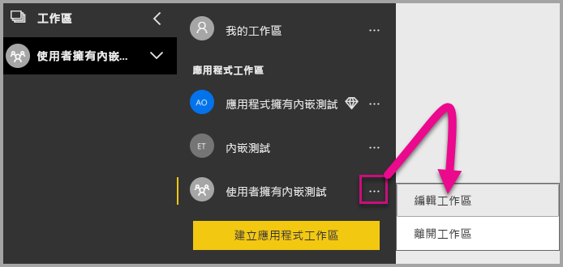

2. 展開 [進階]  ，然後啟用 [專用容量]  。 選取您建立的專用容量。 接著，選取 [儲存]  。

    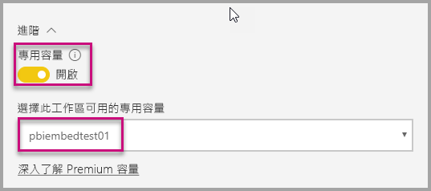

3. 在您選取 [儲存]  後，應該會在工作區名稱的旁邊看到一個鑽石。

    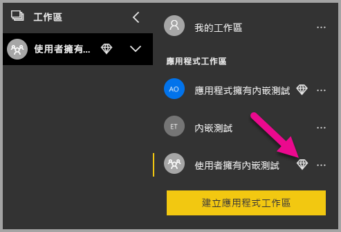

## <a name="admin-settings"></a>管理員設定

全域管理員或 Power BI 服務系統管理員可以為租用戶開啟或關閉使用 REST API 的能力。 Power BI 系統管理員可以為整個組織或個別安全性群組進行此設定。 根據預設，會為整個組織啟用這個設定。 您可以在 [Power BI 系統管理入口網站](../service-admin-portal.md)進行這些變更。

## <a name="next-steps"></a>後續步驟

在本教學課程中，您已了解如何使用 Power BI 組織帳戶將 Power BI 內容內嵌至應用程式。 您現在可以嘗試使用應用程式將 Power BI 內容內嵌至應用程式。 您也可以嘗試為您的客戶內嵌 Power BI 內容 (目前尚未支援內嵌編頁報表)：

> [!div class="nextstepaction"]
> [從應用程式內嵌](embed-from-apps.md)

> [!div class="nextstepaction"]
>[對客戶進行內嵌](embed-sample-for-customers.md)

如果您有更多問題，請[嘗試詢問 Power BI 社群](https://community.powerbi.com/)。
