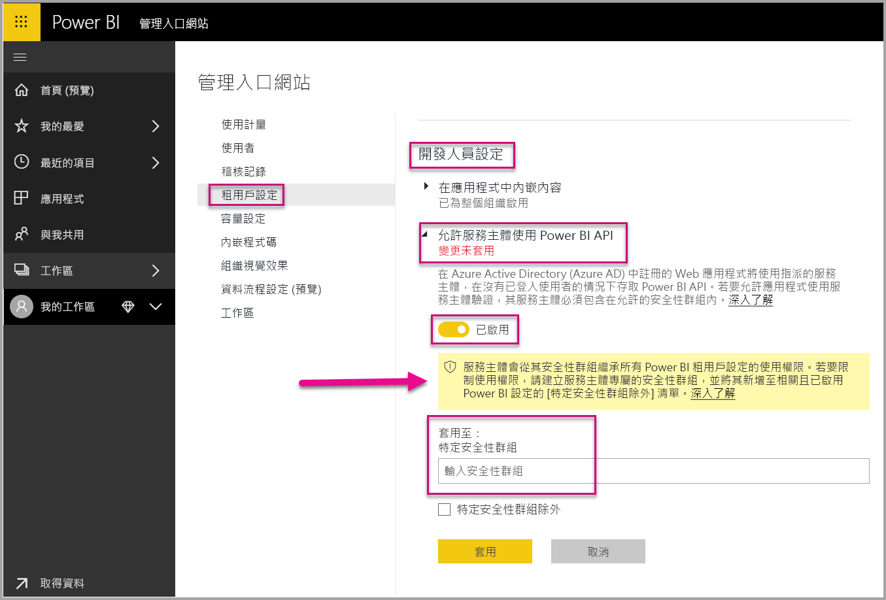
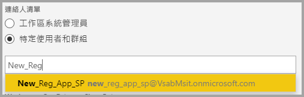
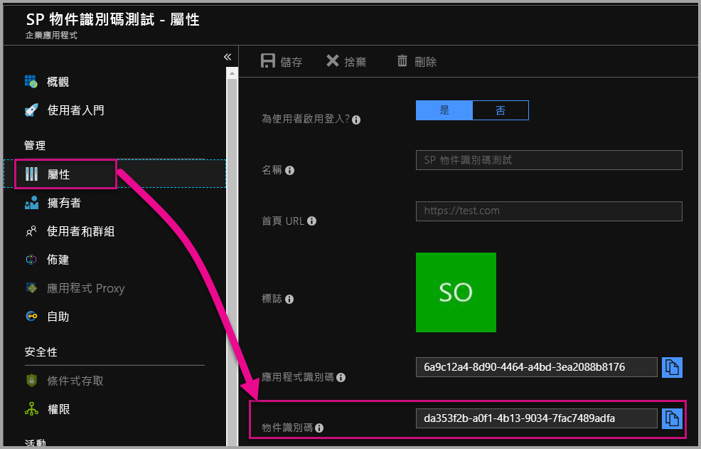

# <a name="service-principal-with-power-bi"></a>搭配 Power BI 的服務主體

有了「服務主體」  ，您就可以將 Power BI 內容內嵌至應用程式，並使用「僅限應用程式」  權杖，來使用自動化與 Power BI 搭配使用。 使用 **Power BI Embedded** 時，或**將 Power BI 工作和程序自動化**時，服務主體很有助益。

使用 Power BI Embedded 時，有使用服務主體時的優點。 主要優點是您不需要主帳戶 (Power BI Pro 授權，只是用來登入的使用者名稱和密碼)，即可驗證您的應用程式。 服務主體會使用應用程式識別碼和應用程式祕密來驗證應用程式。

將 Power BI 工作自動化時，您也可以編寫如何相應處理和管理服務主體的指令碼。

## <a name="application-and-service-principal-relationship"></a>應用程式和服務主體關聯性

若要存取保護 Azure AD 租用戶的資源，需要存取的實體表示安全性主體。 此動作同時適用於使用者 (使用者主體) 和應用程式 (服務主體)。

安全性主體會針對 Azure AD 租用戶中的使用者和應用程式定義存取原則和使用權限。 此存取原則會啟用核心功能，例如登入期間驗證使用者和應用程式，以及存取資源期間進行授權。 如需詳細資訊，請參考 [Azure Active Directory (AAD) 中的應用程式和服務主體](https://docs.microsoft.com/azure/active-directory/develop/app-objects-and-service-principals)。

當您在 Azure 入口網站中註冊 Azure AD 應用程式時，即會在 Azure AD 租用戶中建立兩個物件：

* [應用程式物件](https://docs.microsoft.com/azure/active-directory/develop/app-objects-and-service-principals#application-object)
* [服務主體物件](https://docs.microsoft.com/azure/active-directory/develop/app-objects-and-service-principals#service-principal-object)

將應用程式物件視為*全域*，表示您的應用程式用於所有租用戶，而將服務主體物件視為*本機*，表示用於特定租用戶。

應用程式物件可作為範本，常用和預設屬性*衍生*自這個範本，用於建立對應的服務主體物件。

使用應用程式的每個租用戶都需要服務主體 — 這可讓它建立用於登入的身分識別，並存取租用戶保護的資源。 單一租用戶應用程式只有一個服務主體 (在其主租用戶中)，而此服務主體是在應用程式註冊期間建立並同意的。

## <a name="service-principal-with-power-bi-embedded"></a>搭配 Power BI Embedded 的服務主體

有了服務主體，您就可以在應用程式中使用應用程式識別碼和應用程式祕密遮罩主帳戶資訊。 您不再需要將主帳戶寫入應用程式進行驗證。

因為 **Power BI API** 和 **Power BI.NET SDK** 現在支援使用服務主體進行呼叫，所以您可以使用 [Power BI REST API](https://docs.microsoft.com/rest/api/power-bi/) 與服務主體搭配。 比方說，您可以變更工作區，例如建立工作區、新增或移除工作區中的使用者，以及將內容匯入至工作區。

如果您的 Power BI 成品和資源儲存在[新的 Power BI 工作區](../service-create-the-new-workspaces.md)中，則您只能使用服務主體。

## <a name="service-principal-vs-master-account"></a>服務主體與主帳戶

使用服務主體和標準主帳戶 (Power BI Pro 授權) 進行驗證之間有差異。 下表反白顯示一些顯著的差異。

| 函式 | 主使用者帳戶 <br> (Power BI Pro 授權) | 服務主體 <br> (僅限應用程式權杖) |
|------------------------------------------------------|---------------------|-------------------|
| 可以登入 Power BI 服務  | 是 | 否 |
| 已在 Power BI 系統管理入口網站啟用 | 否 | 是 |
| [使用工作區 (v1)](../service-create-workspaces.md) | 是 | 否 |
| [使用新的工作區 (v2)](../service-create-the-new-workspaces.md) | 是 | 是 |
| 若與 Power BI Embedded 搭配使用，需要是工作區管理員 | 是 | 是 |
| 可以使用 Power BI REST API | 是 | 是 |
| 需要全域管理員才能建立 | 是 | 否 |
| 可在內部部署資料閘道上安裝和管理 | 是 | 否 |

## <a name="get-started-with-a-service-principal"></a>開始使用服務主體

與傳統使用的主帳戶相反，使用服務主體 (僅限應用程式權杖) 需要設定幾個不同的片段。 若要開始使用服務主體 (僅限應用程式權杖)，您需要設定正確的環境。

1. 在 Azure Active Directory (AAD) 中[註冊伺服器端 Web 應用程式](register-app.md)，以與 Power BI 搭配使用。 在註冊應用程式之後，您可以擷取應用程式識別碼、應用程式祕密和服務主體物件識別碼來存取您的 Power BI 內容。 您可以使用 [PowerShell](https://docs.microsoft.com/powershell/azure/create-azure-service-principal-azureps?view=azps-1.1.0) 建立服務主體。

    以下是建立新 Azure Active Directory 應用程式的範例指令碼。

    ```powershell
    # The app id - $app.appid
    # The service principal object id - $sp.objectId
    # The app key - $key.value

    # Sign in as a user that is allowed to create an app.
    Connect-AzureAD

    # Create a new AAD web application
    $app = New-AzureADApplication -DisplayName "testApp1" -Homepage "https://localhost:44322" -ReplyUrls "https://localhost:44322"

    # Creates a service principal
    $sp = New-AzureADServicePrincipal -AppId $app.AppId

    # Get the service principal key.
    $key = New-AzureADServicePrincipalPasswordCredential -ObjectId $sp.ObjectId
    ```

   > [!Important]
   > 一旦您啟用要與 Power BI 搭配使用的服務主體，應用程式的 AD 使用權限就不再生效。 然後，應用程式的使用權限會透過 Power BI 系統管理入口網站管理。

2.  **建議** - 在 Azure Active Directory (AAD) 中建立安全性群組，然後將您建立的[應用程式](https://docs.microsoft.com/azure/active-directory/develop/app-objects-and-service-principals)新增至該安全性群組。 您可以使用 [PowerShell](https://docs.microsoft.com/powershell/azure/create-azure-service-principal-azureps?view=azps-1.1.0) 建立 AAD 安全性群組。

    以下範例指令碼可建立新的安全性群組，並將應用程式新增至該安全性群組。

    ```powershell
    # Required to sign in as a tenant admin
    Connect-AzureAD

    # Create an AAD security group
    $group = New-AzureADGroup -DisplayName <Group display name> -SecurityEnabled $true -MailEnabled $false -MailNickName notSet

    # Add the service principal to the group
    Add-AzureADGroupMember -ObjectId $($group.ObjectId) -RefObjectId $($sp.ObjectId)
    ```

3. 身為 Power BI 管理員，您必須在 Power BI 管理入口網站的 [開發人員設定]  中啟用服務主體。 將您在 Azure AD 中建立的安全性群組新增至 [開發人員設定]  中的特定安全性群組區段。 您也可以為整個組織啟用服務主體存取。 在該案例中，不需要步驟 2。

   > [!Important]
   > 服務主體可以存取為整個組織啟用的任何租用戶設定，或為具有服務主體作為群組一部分的安全性群組而啟用。 若要限制對特定租用戶設定的服務主體存取權，請僅允許對特定安全性群組的存取權，或為服務主體建立專用安全性群組並將其排除。

    

4. 設定您的 [Power BI 環境](embed-sample-for-customers.md#set-up-your-power-bi-environment)。

5. 以「管理員」  身分將服務主體新增至您建立的新工作區。 您可以透過 [API](https://docs.microsoft.com/rest/api/power-bi/groups/addgroupuser) 或使用 Power BI 服務管理這項工作。

    

6. 現在選擇在範例應用程式或您自己的應用程式中內嵌內容。

    * [使用範例應用程式來內嵌內容](embed-sample-for-customers.md#embed-content-using-the-sample-application)
    * [在應用程式中內嵌內容](embed-sample-for-customers.md#embed-content-within-your-application)

7. 現在您已準備好[移至生產環境](embed-sample-for-customers.md#move-to-production)。

## <a name="migrate-to-service-principal"></a>遷移至服務主體

如果您目前使用主帳戶與 Power BI 或 Power BI Embedded 搭配，則可以遷移來使用服務主體。

完成[開始使用服務主體](#get-started-with-a-service-principal)一節中的前三個步驟，一旦完成，請遵循以下資訊。

如果您已在 Power BI 中使用[新工作區](../service-create-the-new-workspaces.md)，則以「管理員」  身分將服務主體新增至 Power BI 成品。 不過，如果您是使用[傳統工作區](../service-create-workspaces.md)，請將 Power BI 成品與資源複製到或移至新工作區，然後以「管理員」  身分將服務主體新增至這些工作區。

沒有任何 UI 功能，可將 Power BI 成品和資源從某個工作區移至另一個工作區，因此您需要使用 [API](https://powerbi.microsoft.com/pt-br/blog/duplicate-workspaces-using-the-power-bi-rest-apis-a-step-by-step-tutorial/) 來完成這項工作。 使用 API 與服務主體搭配時，您需要服務主體物件識別碼。

### <a name="how-to-get-the-service-principal-object-id"></a>如何取得服務主體物件識別碼

若要將服務主體指派給新的工作區，請使用 [Power BI REST API](https://docs.microsoft.com/rest/api/power-bi/groups/addgroupuser)。 若要參考作業的服務主體或進行變更，請使用**服務主體物件識別碼** — 例如，以管理員身分將服務主體套用至工作區。

以下是從 Azure 入口網站取得服務主體物件識別碼的步驟。

1. 在 Azure 入口網站中建立新的應用程式註冊。  

2. 然後，在 [本機目錄中的受控應用程式]  下，選取您所建立的應用程式名稱。

   

    > [!NOTE]
    > 上圖中的物件識別碼不是與服務主體搭配使用的物件識別碼。

3. 選取 [屬性]  來查看物件識別碼。

    

以下是使用 PowerShell 擷取服務主體物件識別碼的範例指令碼。

   ```powershell
   Get-AzureADServicePrincipal -Filter "DisplayName eq '<application name>'"
   ```

## <a name="considerations-and-limitations"></a>考量與限制

* 服務主體只會使用[新的工作區](../service-create-the-new-workspaces.md)。
* 使用服務主體時，不支援 [我的工作區]  。
* 需要專用容量才能移至生產環境。
* 您無法使用服務主體登入 Power BI 入口網站。
* 需有 Power BI 管理員權限，才能在 Power BI 管理入口網站的開發人員設定中啟用服務主體。
* 您無法使用服務主體安裝或管理內部部署資料閘道。
* [為組織內嵌](embed-sample-for-your-organization.md)應用程式無法使用服務主體。
* 不支援[資料流程](../service-dataflows-overview.md)管理。
* 服務主體目前不支援任何管理員 API。
* 搭配 [Azure Analysis Services](https://docs.microsoft.com/azure/analysis-services/analysis-services-overview) 資料來源使用服務主體時，服務主體本身必須具有 Azure Analysis Services 執行個體權限。 基於此目的使用包含服務主體的安全性群組將無法正常運作。

## <a name="next-steps"></a>後續步驟

* [註冊應用程式](register-app.md)
* [適用於您客戶的 Power BI Embedded](embed-sample-for-customers.md)
* [Azure Active Directory 中的應用程式和服務主體物件](https://docs.microsoft.com/azure/active-directory/develop/app-objects-and-service-principals)
* [搭配服務主體使用內部部署資料閘道的資料列層級安全性](embedded-row-level-security.md#on-premises-data-gateway-with-service-principal)
