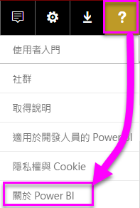
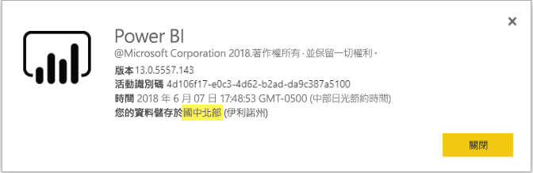

# <a name="frequently-asked-questions-about-power-bi-embedded"></a>關於 Power BI Embedded 的常見問題集

* 如果您有其他問題，請[嘗試詢問 Power BI 社群](https://community.powerbi.com/)。
* 仍有問題嗎？ 瀏覽 [Power BI 支援頁面](https://powerbi.microsoft.com/support/)。

## <a name="general"></a>一般

### <a name="what-is-power-bi-embedded"></a>什麼是 Power BI Embedded？

[Microsoft Power BI Embedded (PBIE)](azure-pbie-what-is-power-bi-embedded.md) 讓應用程式開發人員不必從頭開始建置自己的資料視覺效果及控制項，就能在應用程式中內嵌出色的完全互動式報表。

### <a name="who-is-the-target-audience-for-power-bi-embedded"></a>Power BI Embedded 的目標對象是誰？

撰寫應用程式的開發人員和軟體公司，亦即獨立軟體廠商 (ISV)。

### <a name="how-is-power-bi-embedded-different-from-power-bi-the-service"></a>Power BI Embedded 和 Power BI 服務有何不同？

Power BI 是軟體即服務分析解決方案，為組織提供最重要商務資料的單一檢視。

Microsoft 為 ISV 開發了 Power BI Embedded，這些 ISV 希望將視覺效果內嵌到他們的應用程式，以協助客戶制訂分析決策。 這可讓 ISV 不必自行建置自己的分析解決方案。 [Embedded 分析](embedding.md)讓企業用戶能夠存取商務資料並對其執行查詢，以在應用程式內產生見解。


### <a name="what-is-the-difference-between-power-bi-premium-and-power-bi-embedded"></a>Power BI Premium 與 Power BI Embedded 之間的差異為何？

Power BI Premium 是專為企業打造的容量，其單一檢視集結了組織、夥伴、客戶及供應商，適合想要完整 BI 解決方案的企業使用。 Power BI Premium 可協助您的組織制定決策。 Power BI Premium 是 SaaS 產品，可讓使用者透過 Power BI 行動裝置應用程式、內部開發的應用程式或在 Power BI 入口網站取用內容。

Power BI Embedded 適用於想要將視覺效果內嵌到應用程式的 ISV。 因為 Power BI Embedded 適用於應用程式開發人員，不論該應用程式的客戶是組織內部或外部的任何人員，都能取用儲存在 Power BI Embedded 容量中的內容，進而協助您的客戶制定決策。 您無法透過單鍵發佈到 Web 或 SharePoint 來共用 Power BI Embedded 容量內容。

### <a name="what-is-the-microsoft-recommendation-for-when-a-customer-should-buy-power-bi-premium-vs-power-bi-embedded"></a>Microsoft 對於客戶購買 Power BI Premium 與 Power BI Embedded 的時機有什麼建議？

Microsoft 建議企業購買 Power BI Premium，企業級的自助雲端 BI 解決方案。 我們建議 ISV 為其雲端提供的內嵌分析元件購買 Power BI Embedded。 不過，客戶對於想要購買的產品沒有限制。

在某些情況下，除了應用程式內嵌外，ISV (通常規模較大的) 會想要使用 P SKU，在組織內獲得預先封裝 Power BI 服務的額外優勢。 有些企業只想建置企業營運應用程式並在其中內嵌分析，而不想使用預先封裝的 Power BI 服務，也可能決定使用 Azure 中的 A SKU。

### <a name="how-many-embed-tokens-can-i-create"></a>我可以建立多少內嵌權杖？

具有 PRO 授權的內嵌權杖適用於開發測試，因此 Power BI 主帳戶或[服務主體](embed-service-principal.md)可產生的內嵌權杖數量有限。 [購買容量](#technical)以在生產環境中進行內嵌作業。 購買容量後，您可產生的內嵌權杖數量就不受限制。 請移至 [Available Features](https://docs.microsoft.com/rest/api/power-bi/availablefeatures) (可用功能) 來檢查指出目前內嵌使用情況百分比的使用情況值。

## <a name="technical"></a>技術

### <a name="what-is-the-difference-between-the-a-skus-in-azure-and-the-em-skus-in-office-365"></a>Azure 中的 A SKU 和 Office 365 中的 EM SKU 有何差異？

PowerBI.com 是企業軟體即服務 (SaaS) 解決方案，其中包括社群共同作業、電子郵件訂閱和其他功能。 PowerBI.com 可協助 ISV 管理他們的內嵌分析解決方案內容與租用戶層級設定。

Power BI Embedded 是一組 API 的平台即服務 (Paas)，可供開發人員用來建立內嵌分析解決方案。

以下是功能差異的部分清單。

| 特徵 | Power BI Embedded | Power BI Premium 容量 | Power BI Premium 容量 |
|----------------------------------------------------------------------------------|-------------------|---------------------------|---------------------------|
|   | SKU-Azure 容量 | EM SKU-O365 容量 | P SKU-O365 容量 |
| 從 Power BI 工作區內嵌成品 | 是 | 是 | 是 |
| 在內嵌應用程式中為組織取用 Power BI 報表  | 否 | 是 | 是 |
| 在內嵌應用程式中為客戶取用 Power BI 報表 | 是 | 是 | 是 |
| 在 SharePoint 中取用 Power BI 報表 | 否 | 是 | 是 |
| 在 Dynamics 中取用 Power BI 報表 | 否 | 是 | 是 |
| 在 Teams 中取用 Power BI 報表 (行動裝置應用程式除外) | 否 | 是 | 是 |
| 使用 Powerbi.com 和 Power BI 行動版中的免費 Power BI 授權存取內容 | 否 | 否 | 是 |
| 使用內嵌在 MS Office 應用程式中的免費 Power BI 授權存取內容 | 否 | 是 | 是 |

### <a name="power-bi-now-offers-three-skus-for-embedding-a-skus-em-skus-and-p-skus-which-one-should-i-purchase-for-my-scenario"></a>Power BI 現在提供三種 SKU 以供內嵌：A SKU、EM SKU 及 P SKU。 我該為案例購買哪一種？

|  |A SKU (Power BI Embedded)  |EM SKU (Power BI Premium)  |P SKU (Power BI Premium)  |
|---------|---------|---------|---------|
|購買  |Azure 入口網站 |Office |Office |
|使用案例 | 在您自己的應用程式中內嵌內容 | <li> 在您自己的應用程式中內嵌內容 <br><br><br> <li> 在 MS Office 應用程式中內嵌內容： <br> - [SharePoint](https://powerbi.microsoft.com/blog/integrate-power-bi-reports-in-sharepoint-online/) <br> - [Teams (行動裝置應用程式除外)](https://powerbi.microsoft.com/blog/power-bi-teams-up-with-microsoft-teams/) <br> - [Dynamics 365](https://docs.microsoft.com/dynamics365/customer-engagement/basics/add-edit-power-bi-visualizations-dashboard) | <li> 在您自己的應用程式中內嵌內容 <br><br><br> <li> 在 MS Office 應用程式中內嵌內容： <br> - [SharePoint](https://powerbi.microsoft.com/blog/integrate-power-bi-reports-in-sharepoint-online/) <br> - [Teams (行動裝置應用程式除外)](https://powerbi.microsoft.com/blog/power-bi-teams-up-with-microsoft-teams/) <br> - [Dynamics 365](https://docs.microsoft.com/dynamics365/customer-engagement/basics/add-edit-power-bi-visualizations-dashboard) <br><br><br> <li> 透過 [Power BI 服務](https://powerbi.microsoft.com/)與 Power BI 使用者共用內容  |
|計費 |每小時 |每月 |每月 |
|承諾用量  |無承諾用量 |每年  |每月/每年 |
|差異 |完整彈性 - 可以在 Azure 入口網站中，或透過 API 相應增加/減少、暫停/繼續資源  |您可用於在 SharePoint Online 與 Microsoft Teams 中內嵌內容 (行動裝置應用程式除外) |在相同容量中結合應用程式內嵌及使用 Power BI 服務 |

### <a name="what-are-the-prerequisites-to-create-a-pbie-capacity-in-azure"></a>在 Azure 中建立 PBIE 容量的必要條件為何？

* 登入您組織的目錄 (不支援 Microsoft 帳戶)。
* 您須有 Power BI 租用戶，也就是您目錄中至少須有一位使用者已註冊 Power BI。 
* 您在組織目錄中須有 Azure 訂用帳戶。

### <a name="how-can-i-monitor-power-bi-embedded-capacity-consumption"></a>如何監視 Power BI Embedded 容量耗用量？

* [使用 Power BI 管理入口網站](../service-admin-portal.md#power-bi-embedded)。

* 下載 Power BI 中的[計量應用程式](https://docs.microsoft.com/power-bi/service-admin-premium-monitor-capacity)。

* 使用 [Azure 診斷記錄](azure-pbie-diag-logs.md)。

### <a name="can-my-capacity-scale-automatically-to-adjust-to-my-app-consumption"></a>我的容量規模可以自動調整成應用程式取用量嗎？

雖然目前沒有自動調整，但所有 API 都能隨時調整。

### <a name="why-creatingscalingresuming-a-capacity-results-in-putting-the-capacity-into-a-suspended-state"></a>為什麼建立/調整/繼續容量會讓容量進入暫止狀態？

容量佈建 (調整/繼續/建立) 可能會失敗。 您可以使用「取得詳細資料 API」來檢查容量的佈建狀態：[Capacities - Get Details](https://docs.microsoft.com/rest/api/power-bi-embedded/capacities/getdetails) (容量 - 取得詳細資料)。

### <a name="can-i-only-create-power-bi-embedded-capacities-in-a-specific-region"></a>是否只能在特定區域中建立 Power BI Embedded 容量？

利用[多地理位置 (預覽)](embedded-multi-geo.md) 功能，您可以在不同於 Power BI 主租用戶位置的區域中購買 [Power BI Embedded 容量](azure-pbie-create-capacity.md)

### <a name="why-cant-i-see-a-workspace-although-i-have-permissions"></a>為什麼我有權限卻看不到工作區？

當授與使用者工作區、應用程式或成品的權限時，可能無法立即透過 API 呼叫使用。
結果可能是在 'GET' API 回應中遺失的成品，或在嘗試使用成品時發生錯誤。
使用者可以藉由呼叫 [refreshUserPermissions API](https://docs.microsoft.com/rest/api/power-bi/users/refreshuserpermissions) (會更新使用者的權限) 來解決這個問題。


### <a name="how-can-i-find-my-pbi-tenant-region"></a>如何尋找我的 PBI 租用戶區域？

您可以使用 PBI 入口網站尋找您的 PBI 租用戶區域。

[https://app.powerbi.com/](https://app.powerbi.com/ ) > ? > 關於 Power BI




### <a name="what-does-the-cloud-solution-provider-csp-channel-support"></a>雲端解決方案提供者 (CSP) 通道支援什麼？

* 您可以針對具有訂用帳戶類型 CSP 的租用戶建立 PBIE
* 夥伴帳戶可以登入客戶的租用戶，並為客戶租用戶購買 PBIE，以及指定客戶租用戶使用者為 Power BI 的容量管理員

### <a name="why-do-i-get-an-unsupported-account-message"></a>為什麼會收到不受支援帳戶的訊息？

Power BI 需要您使用組織帳戶註冊。 不支援使用 Microsoft 帳戶嘗試註冊 Power BI。

### <a name="can-i-use-apis-to-create-and-manage-azure-capacities"></a>我可以使用 API 來建立和管理 Azure 容量嗎？

是，您可以使用 Powershell Cmdlet 和 Azure Resource Manager REST API 來建立及管理 PBIE 資源。

* [Rest API](https://docs.microsoft.com/rest/api/power-bi-embedded/) 
* [Powershell Cmdlet](https://docs.microsoft.com/powershell/module/azurerm.powerbiembedded/)

### <a name="what-is-the-pbi-embedded-dedicated-capacity-role-in-a-pbi-embedded-solution"></a>PBI Embedded 解決方案中的 PBI Embedded 專用容量角色是什麼？

若要[將解決方案升階到生產環境](embed-sample-for-customers.md#move-to-production)，您需要將應用程式使用的 Power BI 內容 (工作區) 指派至 Power BI Embedded (A SKU) 容量。

### <a name="in-what-azure-regions-is-pbi-embedded-available"></a>哪些 Azure 區域提供 PBI Embedded？

[PAM](https://ecosystemmanager.azurewebsites.net/home) (EcoManager) - 請參閱產品可用性管理員

可用區域 (16 - 與 Power BI 相同的區域)

* 美國 (6) - 美國東部、美國東部 2、美國中北部、美國中南部、美國西部、美國西部 2
* 歐洲 (2) - 北歐、西歐
* 亞太地區 (2) - 東南亞、東亞
* 巴西 (1) - 巴西南部
* 日本 (1) - 日本東部
* 澳大利亞 (1) - 澳大利亞東南部
* 印度 (1) - 印度西部
* 加拿大 (1) - 加拿大中部
* 英國 (1) - 英國南部

### <a name="what-is-power-bi-embeddeds-authentication-model"></a>Power BI Embedded 的驗證模型是什麼？

Power BI Embedded 會繼續使用 Azure AD 進行主使用者 (指定的 Power BI Pro 授權使用者) 驗證，或搭配[服務主體](embed-service-principal.md)在 Power BI 中驗證應用程式。  

 ISV 可以為其應用程式實作自己的驗證和授權。

如果您已經有 Azure AD 租用戶，您可以使用您現有的目錄。 您也可以為您的內嵌應用程式內容安全性建立新 Azure AD 租用戶。

若要取得 AAD 權杖，可以使用其中一個 [Azure Active Directory 驗證程式庫](https://docs.microsoft.com/azure/active-directory/develop/active-directory-authentication-libraries)。 有適用於多種平台的用戶端程式庫。

### <a name="my-application-already-uses-aad-for-user-authentication-how-can-we-use-this-identity-when-authenticating-to-power-bi-in-a-user-owns-data-scenario"></a>我的應用程式已使用 AAD 來驗證使用者。 在「使用者擁有資料」情節中，驗證到 Power BI 時，如何使用此身分識別？

其為標準 OAuth 代表流程 (<https://docs.microsoft.com/azure/active-directory/develop/web-api>)。 您需要設定您的應用程式以要求 Power BI 服務 (具有必要範圍) 權限。 一旦您有應用程式的使用者權杖，只需要以使用者存取權杖呼叫 ADAL API AcquireTokenAsync 並指定 Power BI 資源 URL 作為資源識別碼：

```csharp
var context = new AD.AuthenticationContext(authorityUrl);
var userAssertion = new AD.UserAssertion(userAccessToken);
var clientAssertion = new AD.ClientAssertionCertificate(MyAppId, MyAppCertificate)
var authenticationResult = await context.AcquireTokenAsync(resourceId, clientAssertion, userAssertion);
```

### <a name="what-object-id-is-the-service-principal-object-id"></a>哪個物件識別碼是服務主體物件識別碼？

已註冊應用程式主畫面的「物件識別碼」  ，是應用程式的物件識別碼。

在「本機目錄中的受控應用程式 > 屬性」  區段中找到的物件識別碼，是您需要使用的服務主體物件識別碼。 此物件識別碼用於參考作業的服務主體，或變更服務主體物件識別碼。 例如將服務主體作為系統管理員套用至工作區。

### <a name="how-is-power-bi-embedded-different-from-other-azure-services"></a>Power BI Embedded 和 Azure 服務有何不同？

您必須先有 Power BI 帳戶，才能在 Azure 中購買 Power BI Embedded。 您的 Power BI Embedded 部署區域會決定 Power BI 帳戶。 在 Azure 中管理您的 Power BI Embedded 資源，能夠：

* 相應增加/減少
* 新增容量管理員
* 暫停/繼續服務

使用 PowerBI.com 對 Power BI Embedded 容量指派/解除指派工作區。

### <a name="what-content-pack-data-types-can-you-embed"></a>我可以內嵌哪些內容套件資料類型？

您「不能」  內嵌從內容套件資料集建置的**儀表板**和**磚**。 但是，您「可以」  內嵌從內容套件資料集建置的**報表**。

### <a name="what-is-the-difference-between-using-row-level-security-rls-vs-javascript-filters"></a>使用資料列層級安全性 (RLS) 和 JavaScript篩選的差別在哪裡？

其中一個方法是關於控制特定使用者可看到什麼，而另一種則是關於將使用者的檢視最佳化，所以使用 RLS 和 JavaScript 篩選的時機常令人感到混淆。

對於 RLS，ISV 開發人員可控制屬於建立模型和產生內嵌權杖的資料篩選。 終端使用者只會看到 ISV 允許使用者看到的內容。 在此案例，使用者可選擇查看少於篩選結果的內容，但無法略過 RLS 設定並查看超出所允許的內容。

對於用戶端篩選 (JavaScript)，ISV 可能可決定終端使用者在初始檢視中看到的內容，但無法控制終端使用者可能會套用至檢視本身的變更。 由於使用者 Javascript 用戶端程式碼可以在後端觸發資料篩選，因此不能將其視為安全。

請參考 [RLS 對 JavaScript 篩選](embedded-row-level-security.md#using-rls-vs-javascript-filters) 以取得詳細資料。

### <a name="how-do-i-manage-permissions-for-service-principals-with-power-bi"></a>如何使用 Power BI 管理服務主體的使用權限？

一旦您啟用要與 Power BI 搭配使用的[服務主體](embed-service-principal.md)，應用程式的 AD 使用權限就不再生效。 然後，應用程式的使用權限會透過 Power BI 系統管理入口網站管理。

服務主體會從其安全性群組繼承所有 Power BI 租用戶設定的使用權限。 若要限制使用權限，請建立服務主體專屬的安全性群組，並將其新增至相關已啟用 Power BI 設定的 [特定安全性群組除外]  清單。

以「管理員」  身分將服務主體新增至新的新工作區時，此情況很重要。 您可以透過 [API](https://docs.microsoft.com/rest/api/power-bi/groups/addgroupuser) 或使用 Power BI 服務管理這項工作。

### <a name="when-to-use-an-application-id-vs-a-service-principal-object-id"></a>何時使用應用程式識別碼與服務主體物件識別碼？

**[應用程式識別碼](embed-sample-for-customers.md#application-id)** 用來在傳遞應用程式識別碼進行驗證時建立存取權杖。

若要參考作業的服務主體或進行變更，請使用 **[服務主體物件識別碼](embed-service-principal.md#how-to-get-the-service-principal-object-id)** — 例如，以管理員身分將服務主體套用至工作區。

### <a name="can-you-manage-an-on-premises-data-gateway-with-service-principal"></a>可以使用服務主體管理內部部署資料閘道嗎？

您無法如同使用主帳戶一般，使用[服務主體](embed-service-principal.md)來管理內部部署資料閘道 (資料閘道)。

有了主帳戶，您可以安裝資料閘道、將使用者新增至閘道、連接到資料來源，以及執行其他系統管理工作。

有了服務主體，您可以使用 SQL Server Analysis Services (SSAS) 內部部署即時連線資料來源，設定[資料列層級安全性 (RLS)](embedded-row-level-security.md#on-premises-data-gateway-with-service-principal)。 如此一來，在與 **Power BI Embedded** 整合時，您可以使用服務主體來管理使用者，以及其對 SSAS 中資源的存取。

### <a name="can-you-sign-into-the-power-bi-service-with-service-principal"></a>可以使用服務主體登入 Power BI 服務嗎？

否 - 您無法使用服務主體登入 Power BI 入口網站。

此外，您也無法以外部應用程式 (SaaS 內嵌) 中的使用者身分使用內容，只在您產生內嵌權杖時才可以。

### <a name="what-are-the-best-practices-to-improve-performance"></a>提升效能的最佳做法為何？

[Power BI Embedded 效能](embedded-performance-best-practices.md)

## <a name="licensing"></a>授權

### <a name="how-do-i-purchase-power-bi-embedded"></a>如何購買 Power BI Embedded？

Power BI Embedded 透過 Azure 提供。

### <a name="what-happens-if-i-already-purchased-power-bi-premium-and-now-i-want-some-power-bi-embedded-in-azure-benefits"></a>如果我已經購買 Power BI Premium，而現在想要 Azure 中 Power BI Embedded 的某些優勢，會發生什麼情況？

客戶會繼續為任何現有的 Power BI Premium 購買項目付費，直到目前合約期限結束為止；接著，如有必要，可在該時間點切換 Power BI Premium 購買項目。

### <a name="do-i-still-have-to-buy-power-bi-premium-to-get-access-to-power-bi-embedded"></a>我仍必須購買 Power BI Premium 才能存取 Power BI Embedded 嗎？

否，Power BI Embedded 即包含您將解決方案部署及散發到客戶時的必要容量 (以 Azure 為基礎)。

### <a name="whats-the-purchase-commitment-for-power-bi-embedded"></a>Power BI Embedded 有什麼購買承諾？

客戶可以小時為單位變更使用量。 Power BI Embedded 服務沒有每月或年度承諾用量。

### <a name="how-does-the-usage-of-power-bi-embedded-show-up-on-my-bill"></a>Power BI Embedded 的使用量會如何在帳單上顯示？

Power BI Embedded 會依據部署的節點類型，以可預測的每小時費率開立帳單。 只要資源在使用中的狀態，即使您未使用，也會向您計費。 您必須暫停您的資源以停止計費。

### <a name="who-needs-a-power-bi-pro-license-for-power-bi-embedded-and-why"></a>誰會需要 Power BI Pro 授權以使用 Power BI Embedded？為什麼？

您需要 Power BI Pro 授權或[服務主體](embed-service-principal.md)以使用 REST API。 若要將報表新增至 Power BI 工作區，分析師需要具備 Power BI 授權，或使用服務主體。 若要管理 Power BI 租用戶和容量，系統管理員必須具備 Power BI Pro 授權。

由於 Power BI Embedded 允許使用 Power BI 入口網站來管理及驗證內嵌內容，因此必須有 Power BI Pro 授權才能在 PowerBI.com 中驗證應用程式，以取得正確存放庫中的報表存取。

不過，若要在您的應用程式內[建立/編輯內嵌報表](https://github.com/Microsoft/PowerBI-JavaScript/wiki/Create-Report-in-Embed-View)，使用者不需要 Pro 授權，因為該使用者根本不需要是 Power BI 使用者。

### <a name="can-i-get-started-for-free"></a>可以免費開始使用嗎？

是，您可以在 Power BI Embedded 使用 [Azure 點數](https://azure.microsoft.com/free/)。

### <a name="can-i-get-a-trial-experience-for-power-bi-embedded-in-azure"></a>可以取得 Azure 中的 Power BI Embedded 試用體驗嗎？

因為 Power BI Embedded 是 Azure 的一部分，所以您可以使用[註冊 Azure 時收到的美金 $200 元點數](https://azure.microsoft.com/free/)來使用服務。

### <a name="is-power-bi-embedded-available-for-national-clouds-us-government-germany-china"></a>國家/地區雲端 (美國政府、德國、中國) 是否提供 Power BI Embedded？

[國家/地區雲端](embed-sample-for-customers-national-clouds.md)也提供 Power BI Embedded。

### <a name="is-power-bi-embedded-available-for-non-profits-and-educational"></a>Power BI Embedded 是否可用於非營利及教育用途？

非營利及教育機構沒有特殊的 Azure 價格。

## <a name="power-bi-workspace-collection"></a>Power BI 工作區集合

### <a name="what-is-power-bi-workspace-collection"></a>什麼是 Power BI 工作區集合？

**Power BI 工作區集合** (**Power BI Embedded** 第 1 版) 是一個以 **Power BI 工作區集合** Azure 資源為基礎的解決方案。 此解決方案可讓您透過使用「Power BI 工作區集合」  解決方案底下的 Power BI 內容、專用 API 與工作區集合金鑰來向 Power BI 驗證應用程式，為客戶建立 **Power BI Embedded** 應用程式。

### <a name="can-i-migrate-from-power-bi-workspace-collection-to-power-bi-embedded"></a>我是否可以從「Power BI 工作區集合」移轉至 Power BI Embedded？

1. 您可以使用移轉工具，將「Power BI 工作區集合」  內容複製到 Power BI - https://docs.microsoft.com/power-bi/developer/migrate-from-powerbi-embedded#content-migration 。

2. 從使用 Power BI 內容的 **Power BI Embedded** 應用程式 POC 開始著手。

3. 做好進入生產環境的準備之後，購買 **Power BI Embedded** 專用容量，然後將您的 Power BI 內容 (工作區) 指派給該容量。

    > [!Note]
    > 您可以在以 **Power BI Embedded** 解決方案平行進行建置的同時，繼續使用「Power BI 工作區集合」  。 準備就緒之後，您便可以將客戶移至新的 **Power BI Embedded** 解決方案，然後淘汰「Power BI 工作區集合」  解決方案。

如需詳細資訊，請參考[如何將 Power BI 工作區集合內容移轉至 Power BI Embedded](https://docs.microsoft.com/power-bi/developer/migrate-from-powerbi-embedded)

### <a name="is-power-bi-workspace-collection-on-a-deprecation-path"></a>Power BI 工作區集合是否即將淘汰？

是，但已經在使用 **Power BI 工作區集合**解決方案的客戶可以繼續使用，直到淘汰為止。 客戶也可以建立新的工作區集合，以及任何仍然使用「Power BI 工作區集合」  解決方案的 **Power BI Embedded** 應用程式。

不過，這也表示任何 **Power BI 工作區集合**解決方案都不會再新增新功能。 我們鼓勵客戶規劃移轉至新的 **Power BI Embedded** 解決方案。

### <a name="when-is-power-bi-workspace-collection-support-discontinued"></a>何時會中止「Power BI 工作區集合」支援？

已經在使用「Power BI 工作區集合」  解決方案的客戶可以繼續使用它，直到 2018 年 6 月底，或直到其支援合約終止為止。

### <a name="in-what-regions-can-i-create-a-pbi-workspace-collection"></a>我可以在哪些區域建立 PBI 工作區集合？

可用的區域包括：澳大利亞東南部、巴西南部、加拿大中部、美國東部 2、日本東部、美國中北部、北歐、美國中南部、東南亞、英國南部、西歐、印度西部及美國西部。

### <a name="why-should-i-migrate-from-pbi-workspace-collection-to-power-bi-embedded"></a>為何我應該從「Power BI 工作區集合」移轉至 Power BI Embedded？

**Power BI Embedded** 解決方案具有 **Power BI 工作區集合**所沒有的一些新功能和處理能力。

一些功能包括：
* 所有 PBI 資料來源都收到支援。 僅支援兩個 **Power BI 工作區集合**資料來源受到。 
* 問與答、重新整理、書籤、內嵌儀表板與圖格以及自訂功能表等新功能只有在 **Power BI Embedded** 解決方案中才有支援。
* 容量計費模型。

## <a name="embedding-setup-tool"></a>內嵌安裝工具

### <a name="what-is-the-embedding-setup-tool"></a>什麼是內嵌安裝工具？

[內嵌安裝工具](https://aka.ms/embedsetup)可讓您快速開始使用及下載應用程式範例，以開始使用 Power BI 進行內嵌。

### <a name="which-solution-should-i-choose"></a>我可以選擇什麼解決方案？

* [對客戶進行內嵌](embedding.md#embedding-for-your-customers)，可讓您將儀表板和報告內嵌至沒有 Power BI 帳戶的使用者。 執行[對客戶進行內嵌](https://aka.ms/embedsetup/AppOwnsData)解決方案。
* [對組織進行內嵌](embedding.md#embedding-for-your-organization)可讓您擴充 Power BI 服務。 執行[對組織進行內嵌](https://aka.ms/embedsetup/UserOwnsData)解決方案。

### <a name="ive-downloaded-the-sample-app-which-solution-do-i-choose"></a>我已經下載了應用程式範例，要選擇哪個解決方案？

若您使用**為客戶進行內嵌**體驗，請儲存並解壓縮 *PowerBI-Developer-Samples.zip* 檔案。 接著開啟 *PowerBI-Developer-Samples-master\App Owns Data*資料夾，然後執行 *PowerBIEmbedded_AppOwnsData.sln* 檔案。

若您使用**為組織進行內嵌**體驗，請儲存並解壓縮 *PowerBI-Developer-Samples.zip* 檔案。 接著開啟 *PowerBI-Developer-Samples-master\User Owns Data\integrate-report-web-app* 資料夾，然後執行 *pbi-saas-embed-report.sln* 檔案。

### <a name="how-can-i-edit-my-registered-application"></a>如何編輯已註冊的應用程式？

若要了解如何編輯 Azure AD 註冊的應用程式，請參閱[快速入門：更新 Azure Active Directory 中註冊應用程式](https://docs.microsoft.com/azure/active-directory/develop/quickstart-v1-update-azure-ad-app)。

### <a name="how-can-i-edit-my-power-bi-user-profile-or-data"></a>如何編輯我的 Power BI 使用者設定檔或資料？

您可以在[此處](https://docs.microsoft.com/power-bi/service-basic-concepts)了解如何編輯您的 Power BI 資料。

如需詳細資訊，請參閱[為您的內嵌應用程式進行疑難排解](embedded-troubleshoot.md)。

有其他問題嗎？ [試試 Power BI 社群](https://community.powerbi.com/)
