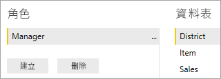

# <a name="use-row-level-security-with-power-bi-embedded-content"></a>搭配 Power BI 內嵌內容使用資料列層級安全性
資料列層級安全性 (RLS) 可用來限制報表或資料集中資料的使用者存取權，讓多位不同的使用者可以在使用相同報表的同時，各自看到不同的資料。 從 Power BI 內嵌報表時，可利用 RLS。

如果您要為非 Power BI 使用者內嵌 (應用程式擁有資料)，這通常是 ISV 案例，則本文很適合您！ 您必須設定代表使用者和角色的內嵌權杖。 請繼續閱讀以了解如何執行這項操作。

如果您要內嵌至組織內的 Power BI 使用者 (使用者擁有資料)，RLS 的運作方式會像是直接在 Power BI 服務中運作一樣。 您不需要在應用程式中執行其他動作。 如需詳細資訊，請參閱 [Power BI 的資料列層級安全性 (RLS)](../service-admin-rls.md)。


若要利用 RLS，請務必了解三個主要概念：使用者、角色和規則。 讓我們分別探討：

**使用者** – 這些是檢視報表的實際終端使用者。 在 Power BI Embedded 中，使用者是由內嵌權杖中的使用者名稱屬性所識別。

**角色** – 使用者會有隸屬的角色。 角色是規則的容器，可以命名為「銷售經理」或「銷售代表」等。您會在 Power BI Desktop 中建立角色。 如需詳細資訊，請參閱 [Power BI Desktop 的資料列層級安全性 (RLS)](../desktop-rls.md)。

**規則** – 角色擁有規則，而這些規則是將套用至資料的實際篩選。 可能是簡單的「國家/地區 = 美國」，也可能更動態。
在本文的其餘部分，我們將提供撰寫 RLS 後再於內嵌應用程式中取用的範例。 我們的範例使用[零售分析範例](http://go.microsoft.com/fwlink/?LinkID=780547) PBIX 檔案。


## <a name="adding-roles-with-power-bi-desktop"></a>使用 Power BI Desktop 新增角色
我們的零售分析範例顯示所有零售連鎖商店的銷售額。 若沒有 RLS，不論是哪位區域經理登入及檢視報表，都會看到相同的資料。 高階管理階層決定每位區域經理只能看到其所管理的商店銷售額；若要這樣做，我們可以使用 RLS。

RLS 是在 Power BI Desktop 中撰寫。 我們可以在資料集和報表處於開啟狀態時，切換至圖表檢視來查看下列結構描述：


以下是此結構描述需要注意的一些事項：

* 所有量值 (例如 [總銷售額]) 會儲存在 [銷售] 事實資料表中。
* 有四個額外的相關維度資料表：[項目]、[時間]、[商店] 和 [區域]。
* 關聯線上的箭頭表示篩選可以從一個資料表流向另一個資料表的方向。 例如，如果在 [時間[日期]] 上套用篩選，在目前的結構描述中，它只會進一步篩選 [銷售] 資料表中的值。 由於關聯線上的所有箭頭都指向而不是背離 [銷售] 資料表，因此其他資料表不會受此篩選的影響。
* [區域] 資料指出每個區域的經理：
  
    ![[區域] 資料表中的資料列](media/embedded-row-level-security/powerbi-embedded-district-table.png)

根據此結構描述，如果我們將篩選套用至 [區域] 資料表中的 [區域經理] 資料行，而且該篩選符合檢視報表的使用者，則該篩選也會進一步篩選 [商店] 和 [銷售] 資料表，僅顯示該區域經理的資料。

其做法如下：

1. 在 [模型] 索引標籤上，選取 [管理角色]。
   
    ![Power BI Desktop 中的 [模型] 索引標籤](media/embedded-row-level-security/powerbi-embedded-manage-roles.png)
2. 建立稱為**經理**的新角色。
   
    
3. 在 [區域] 資料表中，輸入下列 DAX 運算式：**[區域經理] = USERNAME()**。
   
    
4. 若要確認規則正常運作，請在 [模型] 索引標籤上，選取[以角色身分檢視]，然後選取您剛建立的 [經理] 角色，以及 [其他使用者]。 輸入 **Andrew Ma** 作為使用者。
   
    ![[以角色身分檢視] 對話方塊](media/embedded-row-level-security/powerbi-embedded-new-role-view.png)
   
    報表現在會顯示您以 **Andrew Ma** 登入的資料。

套用篩選，我們在此套用的篩選會進一步篩選 [區域]、[商店] 和 [銷售] 資料表中的所有記錄。 不過，由於 [銷售] 和 [時間]、[銷售] 和 [項目] 以及 [項目] 和 [時間] 資料表之間關聯性的篩選方向，因此不會進一步篩選。 若要深入了解雙向交叉篩選，請下載 [Bidirectional cross-filtering in SQL Server Analysis Services 2016 and Power BI Desktop](http://download.microsoft.com/download/2/7/8/2782DF95-3E0D-40CD-BFC8-749A2882E109/Bidirectional%20cross-filtering%20in%20Analysis%20Services%202016%20and%20Power%20BI.docx) (SQL Server Analysis Services 2016 和 Power BI Desktop 中的雙向交叉篩選) 技術白皮書。

## <a name="applying-user-and-role-to-an-embed-token"></a>將使用者和角色套用至內嵌權杖
現在您已設定 Power BI Desktop 角色，您的應用程式需要一些調整才能利用這些角色。

使用者會由您的應用程式驗證和授權，而內嵌權杖可用來授權該使用者存取特定 Power BI Embedded 報表。 Power BI Embedded 沒有關於您使用者身分識別的任何特定資訊。 您必須傳遞一些額外的內容作為身分識別形式內嵌權杖的一部分，RLS 才能運作。 這可以藉由 [GenerateToken](https://msdn.microsoft.com/library/mt784614.aspx) API 來完成。

[GenerateToken](https://msdn.microsoft.com/library/mt784614.aspx) API 接受表示相關資料集的身分識別清單。 目前只能提供一個身分識別。 儀表板內嵌未來將會新增對多個資料集的支援。 您必須傳遞下列項目作為身分識別的一部分，RLS 才能運作。

* **使用者名稱 (必要項)**– 這是套用 RLS 規則時可用來協助識別使用者的字串。 只能列出單一使用者。
* **角色 (必要項)** – 含有套用資料列層級安全性規則時要選取之角色的字串。 如果傳遞多個角色，則應該以字串陣列形式來傳遞。
* **資料集 (必要項)** – 適用於您要內嵌之報表的資料集。 只能在資料集清單中提供一個資料集。 儀表板內嵌未來將會支援多個資料集。

您可以在 **PowerBIClient.Reports** 上使用 **GenerateTokenInGroup** 方法來建立內嵌權杖。 目前僅支援報表。

例如，您可以變更 [PowerBIEmbedded_AppOwnsData](https://github.com/Microsoft/PowerBI-Developer-Samples/tree/master/App%20Owns%20Data) 範例。 *Home\HomeController.cs line 76 and 77* 無法從：

```
// Generate Embed Token.
var generateTokenRequestParameters = new GenerateTokenRequest(accessLevel: "view");

var tokenResponse = await client.Reports.GenerateTokenInGroupAsync(GroupId, report.Id, generateTokenRequestParameters);
```

更新為

```
var generateTokenRequestParameters = new GenerateTokenRequest("View", null, identities: new List<EffectiveIdentity> { new EffectiveIdentity(username: "username", roles: new List<string> { "roleA", "roleB" }, datasets: new List<string> { "datasetId" }) });

var tokenResponse = await client.Reports.GenerateTokenInGroupAsync("groupId", "reportId", generateTokenRequestParameters);
```

如果您呼叫 REST API，更新的 API 現在會接受名為**身分識別**的其他 JSON 陣列，其中包含使用者名稱、字串角色清單和字串資料集清單，例如：

```
{
    "accessLevel": "View",
    "identities": [
        {
            "username": "EffectiveIdentity",
            "roles": [ "Role1", "Role2" ],
            "datasets": [ "fe0a1aeb-f6a4-4b27-a2d3-b5df3bb28bdc" ]
        }
    ]
}
```

現在，結合所有項目，當有人登入您的應用程式檢視此報表時，他們只能看到依照資料列層級安全性的定義所允許檢視的資料。

## <a name="working-with-analysis-services-live-connections"></a>使用 Analysis Services 即時連線
內部部署伺服器可以搭配 Analysis Services 即時連線使用資料列層級安全性。 使用這種類型的連線時，您應該了解幾個特定概念。

針對使用者名稱屬性提供的有效身分識別，必須為具備 Analysis Services 伺服器權限的 Windows 使用者。

**內部部署資料閘道設定**

使用 Analysis Services 即時連線時，會用到[內部部署資料閘道](../service-gateway-onprem.md)。 使用所列的身分識別產生內嵌權杖時，主帳戶必須列為閘道的系統管理員。 如果未列出主帳戶，就不會將資料列層級安全性套用至資料屬性。 非閘道的系統管理員可以提供角色，但必須指定自己的使用者名稱以作為有效的身分識別。

**使用角色**

您可以使用內嵌權杖中的身分識別來提供角色。 如果未提供任何角色，則會使用所提供的使用者名稱來解析相關聯的角色。

## <a name="considerations-and-limitations"></a>考量與限制
* 使用內嵌權杖時，在 Power BI 服務中將使用者指派給角色不會影響 RLS。
* 雖然 Power BI 服務不會將 RLS 設定套用至系統管理員或具有編輯權限的成員，但當您使用內嵌權杖提供身分識別時，則會將它套用至資料。
* 只有報表讀取/寫入才支援在呼叫 GenerateToken 時傳遞身分識別資訊。 稍後將會推出其他資源的支援。
* 內部部署伺服器支援 Analysis Services 即時連線。
* 不支援 Azure Analysis Services 即時連線。
* 如果基礎資料集不需要 RLS，GenerateToken 要求**不得**包含有效的身分識別。
* 如果基礎資料集是雲端模型 (快取模型或 DirectQuery)，有效的身分識別必須包含至少一個角色。 否則，不會發生角色指派。
* 身分識別清單中只能提供一個身分識別。 我們未來將使用清單為儀表板內嵌啟用多重身分識別權杖。

有其他問題嗎？ [嘗試在 Power BI 社群提問](https://community.powerbi.com/)

