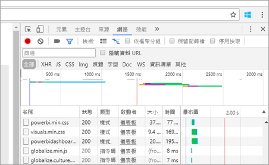

# <a name="troubleshooting-your-embedded-application"></a>為您的內嵌應用程式進行疑難排解

本文探討您在從 Power BI 內嵌內容時，可能會遇到的幾個常見問題。

## <a name="app-registration"></a>應用程式註冊

**應用程式註冊失敗**

Azure 入口網站內的錯誤訊息或 Power BI 應用程式註冊頁面會提到權限不足。 若要註冊應用程式，您必須是 Azure AD 租用戶的系統管理員，或必須允許非系統管理員的使用者進行應用程式註冊註冊。

**註冊新應用程式時，Power BI 服務未在 Azure 入口網站中顯示**

至少須有一個使用者註冊 Power BI。 如果您沒有看到 **Power BI 服務**在 API 清單中列出，代表尚無使用者註冊 Power BI。

## <a name="rest-api"></a>REST API

**API 呼叫傳回 401**

Fiddler 擷取可能需要進一步調查。 可能缺少必要的權限範圍，而無法在 Azure AD 中註冊應用程式。 請在 Azure 入口網站中，驗證 Azure AD 應用程式註冊的必要範圍存在。

**API 呼叫傳回 403**

Fiddler 擷取可能需要進一步調查。 403 錯誤的原因可能有很多種。

* Azure AD 驗證權杖過期。
* 驗證的使用者不是群組 (應用程式工作區) 的成員。
* 驗證的使用者不是群組 (應用程式工作區) 的管理員。
* 授權標頭可能未正確列出。 請確認沒有錯字。

應用程式的後端必須先重新整理權杖，再呼叫 GenerateToken。

```
    GET https://wabi-us-north-central-redirect.analysis.windows.net/metadata/cluster HTTP/1.1
    Host: wabi-us-north-central-redirect.analysis.windows.net
    ...
    Authorization: Bearer eyJ0eXAiOi...
    ...
 
    HTTP/1.1 403 Forbidden
    ...
     
    {"error":{"code":"TokenExpired","message":"Access token has expired, resubmit with a new access token"}}
```

**提供有效的身分識別時無法產生權杖**

若提供了有效的身分識別，GenerateToken 可能因為數種原因而失敗。

* 資料集不支援有效的身分識別
* 未提供使用者 Username
* 未提供 Role
* 未提供 DatasetId
* 使用者沒有正確的權限

若要驗證是哪一個原因，請嘗試下列方法。

* 執行 [get dataset](https://msdn.microsoft.com/library/mt784653.aspx)。 屬性 IsEffectiveIdentityRequired 是否為 true？
* 任何 EffectiveIdentity 都必須有 Username。
* 若 IsEffectiveIdentityRolesRequired 為 true，就必須有 Role。
* 任何 EffectiveIdentity 都必須有 DatasetId。
* 若是 Analysis Services，主使用者必須為閘道管理員。

## <a name="data-sources"></a>資料來源

**ISV 希望相同的資料來源有不同的認證**

一位主使用者可以有資料來源的一組認證。 若要使用其他認證，請建立額外的主使用者。 接著，在每個主使用者的環境中個別指派不同的認證，然後使用該使用者的 Azure AD 權杖內嵌。

## <a name="content-rendering"></a>內容轉譯

**內嵌內容的轉譯獲取用失敗或逾時**

請確認內嵌權杖未過期。 請務必檢查內嵌權杖到期日並予以重新整理。 如需詳細資訊，請參閱[使用 JavaScript SDK 重新整理權杖](https://github.com/Microsoft/PowerBI-JavaScript/wiki/Refresh-token-using-JavaScript-SDK-example)。

**報表或儀表板未載入**

若使用者無法查看報表或儀表板，請確認報表或儀表板在 powerbi.com 中正確載入。若報表或儀表板未在 powerbi.com 中載入，就無法在應用程式中運作。

**報表或儀表板執行緩慢**

請從 Power BI Desktop 或在 powerbi.com 中開啟檔案，然後驗證效能達到可接受的程度，能排除應用程式或內嵌 API 的問題。

## <a name="tools-for-troubleshooting"></a>疑難排解的工具

### <a name="fiddler-trace"></a>Fiddler 追蹤

[Fiddler](http://www.telerik.com/fiddler) 是 Telerik 提供的免費工具，可用來監視 HTTP 流量。  您可以從用戶端電腦使用 Power BI API 來回查看。 這可能會顯示錯誤和其他相關資訊。


### <a name="f12-in-browser-for-front-end-debugging"></a>在瀏覽器中按 F12 以進行前端偵錯

按 F12 會在您的瀏覽器中啟動開發人員視窗。 這提供了查看網路流量及其他資訊的功能。



如需常見問題集的回答，請參閱 [Power BI Embedded 常見問題集](embedded-faq.md)。

有其他問題嗎？ [試試 Power BI 社群](http://community.powerbi.com/)