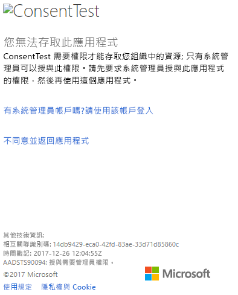

# <a name="troubleshooting-your-embedded-application"></a>為您的內嵌應用程式進行疑難排解

本文探討您在從 Power BI 內嵌內容時，可能會遇到的幾個常見問題。

## <a name="tools-for-troubleshooting"></a>疑難排解的工具

### <a name="fiddler-trace"></a>Fiddler 追蹤

[Fiddler](http://www.telerik.com/fiddler) 是 Telerik 提供的免費工具，可用來監視 HTTP 流量。  您可以從用戶端電腦使用 Power BI API 來回查看。 這可能會顯示錯誤和其他相關資訊。


### <a name="f12-in-browser-for-front-end-debugging"></a>在瀏覽器中按 F12 以進行前端偵錯

按 F12 會在您的瀏覽器中啟動開發人員視窗。 這提供了查看網路流量及其他資訊的功能。


### <a name="extracting-error-details-from-power-bi-response"></a>從 Power BI 回應擷取錯誤詳細資料

此程式碼片段示範如何從 HTTP 例外狀況擷取錯誤詳細資料：

```
public static string GetExceptionText(this HttpOperationException exc)
{
    var errorText = string.Format("Request: {0}\r\nStatus: {1} ({2})\r\nResponse: {3}",
    exc.Request.Content, exc.Response.StatusCode, (int)exc.Response.StatusCode, exc.Response.Content);
    if (exc.Response.Headers.ContainsKey("RequestId"))
    {
        var requestId = exc.Response.Headers["RequestId"].FirstOrDefault();
        errorText += string.Format("\r\nRequestId: {0}", requestId);
    }

    return errorText;
}
```
我們建議您記錄要求識別碼 (和錯誤詳細資料以作為疑難排解之用)。
聯繫 Microsoft 支援服務時，請提供要求識別碼。

## <a name="app-registration"></a>應用程式註冊

**應用程式註冊失敗**

Azure 入口網站內的錯誤訊息或 Power BI 應用程式註冊頁面會提到權限不足。 若要註冊應用程式，您必須是 Azure AD 租用戶的系統管理員，或必須允許非系統管理員的使用者進行應用程式註冊註冊。

**註冊新應用程式時，Power BI 服務未在 Azure 入口網站中顯示**

至少須有一個使用者註冊 Power BI。 如果您沒有看到 **Power BI 服務**在 API 清單中列出，代表尚無使用者註冊 Power BI。

## <a name="rest-api"></a>REST API

**API 呼叫傳回 401**

Fiddler 擷取可能需要進一步調查。 可能缺少必要的權限範圍，而無法在 Azure AD 中註冊應用程式。 請在 Azure 入口網站中，驗證 Azure AD 應用程式註冊的必要範圍存在。

**API 呼叫傳回 403**

Fiddler 擷取可能需要進一步調查。 403 錯誤的原因可能有很多種。

* 使用者已超過共用容量上可產生的內嵌權杖數量。 您需要購買 Azure 容量來產生內嵌權杖，並將工作區指派給該容量。 請參閱[在 Azure 入口網站中建立 Power BI Embedded 容量](https://docs.microsoft.com/azure/power-bi-embedded/create-capacity)。
* Azure AD 驗證權杖過期。
* 驗證的使用者不是群組 (應用程式工作區) 的成員。
* 驗證的使用者不是群組 (應用程式工作區) 的管理員。
* 授權標頭可能未正確列出。 請確認沒有錯字。

應用程式的後端必須先重新整理權杖，再呼叫 GenerateToken。

```
    GET https://wabi-us-north-central-redirect.analysis.windows.net/metadata/cluster HTTP/1.1
    Host: wabi-us-north-central-redirect.analysis.windows.net
    ...
    Authorization: Bearer eyJ0eXAiOi...
    ...
 
    HTTP/1.1 403 Forbidden
    ...
     
    {"error":{"code":"TokenExpired","message":"Access token has expired, resubmit with a new access token"}}
```

## <a name="authentication"></a>驗證

### <a name="authentication-failed-with-aadsts70002-or-aadsts50053"></a>驗證因 AADSTS70002 或 AADSTS50053 而失敗

**(AADSTS70002: 驗證認證時發生錯誤。AADSTS50053: 使用不正確的使用者識別碼或密碼，嘗試登入太多次)**

如果您使用 Power BI Embedded 並利用 Azure AD Direct Authentication，而且您在登入時收到訊息，例如 ***error:unauthorized_client,error_description:AADSTS70002: 驗證認證時發生錯誤。AADSTS50053: 您使用了不正確的使用者識別碼或密碼嘗試登入太多次***，這是因為根據預設，直接驗證已從 2018/6/14 起關閉。

您可以使用 [Azure AD 原則](https://docs.microsoft.com/en-us/azure/active-directory/manage-apps/configure-authentication-for-federated-users-portal#enable-direct-authentication-for-legacy-applications)重新加以開啟，而其範圍可以是組織或[服務主體](https://docs.microsoft.com/en-us/azure/active-directory/develop/active-directory-application-objects#service-principal-object)。

建議您只依應用程式，個別加以啟用。

若要建立此原則，您需要是要在其中建立並指派原則之目錄的**全域管理員**。 下列範例指令碼示範如何建立原則，並將它指派給此應用程式的 SP：

1. 安裝 [Azure AD Preview PowerShell 模組](https://docs.microsoft.com/en-us/powershell/azure/active-directory/install-adv2?view=azureadps-2.0)。

2. 逐行執行下列 PowerShell 命令 (因此，確定變數 $sp 沒有 1 個以上的應用程式)。

```powershell
Connect-AzureAD
```

```powershell
$sp = Get-AzureADServicePrincipal -SearchString "Name_Of_Application"
```

```powershell
$policy = New-AzureADPolicy -Definition @("{`"HomeRealmDiscoveryPolicy`":{`"AllowCloudPasswordValidation`":true}}") -DisplayName EnableDirectAuth -Type HomeRealmDiscoveryPolicy -IsOrganizationDefault $false
```

```powershell
Add-AzureADServicePrincipalPolicy -Id $sp.ObjectId -RefObjectId $policy.Id 
```

指派原則之後，請先等候約 15 到 20 秒進行傳播，再測試。

**提供有效的身分識別時無法產生權杖**

若提供了有效的身分識別，GenerateToken 可能因為數種原因而失敗。

* 資料集不支援有效的身分識別
* 未提供使用者 Username
* 未提供 Role
* 未提供 DatasetId
* 使用者沒有正確的權限

若要驗證是哪一個原因，請嘗試下列方法。

* 執行 [get dataset](https://docs.microsoft.com/rest/api/power-bi/datasets)。 屬性 IsEffectiveIdentityRequired 是否為 true？
* 任何 EffectiveIdentity 都必須有 Username。
* 若 IsEffectiveIdentityRolesRequired 為 true，就必須有 Role。
* 任何 EffectiveIdentity 都必須有 DatasetId。
* 若是 Analysis Services，主使用者必須為閘道管理員。

### <a name="aadsts90094-the-grant-requires-admin-permission"></a>AADSTS90094: 授與需要管理員權限

**_徵兆：_**</br>
非管理使用者第一次嘗試登入應用程式並授與同意時，會取得下列錯誤：
* ConsentTest 需要存取您組織中只有管理員才能授與之資源的權限。 請先要求管理員授與此應用程式的權限，您才能使用它。
* AADSTS90094: 授與需要管理員權限。

    

管理使用者可以成功登入並授與同意。

**_根本原因：_**</br>
已停用租用戶的使用者同意。

**_可能有數個修正程式：_**

*啟用整個租用戶的使用者同意 (所有使用者、所有應用程式)*
1. 在 Azure 入口網站中，巡覽到 [Azure Active Directory] => [使用者和群組] => [使用者設定]
2. 啟用 [使用者可同意應用程式代表自己存取公司資料] 設定，然後儲存變更

    

*由管理員授與權限*：由管理員將權限授與應用程式 - 針對整個租用戶或特定使用者。

## <a name="data-sources"></a>資料來源

**ISV 希望相同的資料來源有不同的認證**

一位主使用者可以有資料來源的一組認證。 若要使用其他認證，請建立額外的主使用者。 接著，在每個主使用者的環境中個別指派不同的認證，然後使用該使用者的 Azure AD 權杖內嵌。

## <a name="content-rendering"></a>內容轉譯

**內嵌內容的轉譯獲取用失敗或逾時**

請確認內嵌權杖未過期。 請務必檢查內嵌權杖到期日並予以重新整理。 如需詳細資訊，請參閱[使用 JavaScript SDK 重新整理權杖](https://github.com/Microsoft/PowerBI-JavaScript/wiki/Refresh-token-using-JavaScript-SDK-example)。

**報表或儀表板未載入**

若使用者無法查看報表或儀表板，請確認報表或儀表板在 powerbi.com 中正確載入。 若報表或儀表板未在 powerbi.com 中載入，就無法在應用程式中運作。

**報表或儀表板執行緩慢**

請從 Power BI Desktop 或在 powerbi.com 中開啟檔案，然後驗證效能達到可接受的程度，能排除應用程式或內嵌 API 的問題。

## <a name="onboarding-experience-tool-for-embedding"></a>內嵌的上線體驗工具

您可以完成[上線體驗工具](https://aka.ms/embedsetup)以快速下載應用程式範例。 之後，您可以比較自己的應用程式與範例。

### <a name="prerequisites"></a>先決條件

使用上線體驗工具之前，請驗證您具備所有適當的必要條件。 您需要 **Power BI Pro** 帳戶和 **Microsoft Azure** 訂用帳戶。

* 如果您尚未註冊 **Power BI Pro**，請先[註冊免費試用](https://powerbi.microsoft.com/en-us/pricing/)，再開始進行。
* 如果您沒有 Azure 訂用帳戶，請先建立[免費帳戶](https://azure.microsoft.com/free/?WT.mc_id=A261C142F)，再開始進行。
* 您必須設定自己的 [Azure Active Directory 租用戶](create-an-azure-active-directory-tenant.md)。
* 您必須安裝 [Visual Studio](https://www.visualstudio.com/) (2013 版或更新版本)。

### <a name="common-issues"></a>常見問題

當您試用上線體驗工具時，可能會遇到的幾個常見問題有：

#### <a name="using-the-embed-for-your-customers-sample-application"></a>使用對客戶進行內嵌的應用程式範例

若您使用**對客戶進行內嵌**體驗，請儲存並解壓縮 *PowerBI-Developer-Samples.zip* 檔案。 接著開啟 *PowerBI-Developer-Samples-master\App Owns Data*資料夾，然後執行 *PowerBIEmbedded_AppOwnsData.sln* 檔案。

當您選取 [授與權限] 時 (授與權限步驟)，收到下列錯誤：

    AADSTS70001: Application with identifier <client ID> was not found in the directory <directory ID>

解決方案會關閉快顯，請等候幾秒後再試一次。 您可能需要重複這個動作數次。 時間間隔造成問題，導致無法在可供外部 API 使用時，完成應用程式註冊流程。

執行應用程式範例時，會出現下列錯誤訊息：

    Password is empty. Please fill password of Power BI username in web.config.

此錯誤之所以發生，是因為唯一未插入應用程式範例中的值，是您的使用者密碼。 請在解決方案中開啟 Web.config 檔案，並以您的使用者密碼填入 pbiPassword 欄位。

#### <a name="using-the-embed-for-your-organization-sample-application"></a>使用對組織進行內嵌的應用程式範例

若您使用**對組織進行內嵌**體驗，請儲存並解壓縮 *PowerBI-Developer-Samples.zip* 檔案。 接著開啟 *PowerBI-Developer-Samples-master\User Owns Data\integrate-report-web-app* 資料夾，然後執行 *pbi-saas-embed-report.sln* 檔案。

當您執行**對組織進行內嵌**應用程式範例時，收到下列錯誤：

    AADSTS50011: The reply URL specified in the request does not match the reply URLs configured for the application: <client ID>

這是因為為網頁伺服器應用程式指定的重新導向 URL 與範例的 URL 不同。 如果您想要註冊範例應用程式，則請使用 `http://localhost:13526/` 作為重新導向 URL。

若您想編輯已註冊的應用程式，請了解如何編輯[已註冊 AAD 的應用程式](https://docs.microsoft.com/azure/active-directory/develop/active-directory-integrating-applications#updating-an-application)，讓應用程式可提供 Web API 的存取。

若您想編輯 Power BI 使用者設定檔或資料，則請了解如何編輯 [Power BI 資料](https://docs.microsoft.com/en-us/power-bi/service-basic-concepts)。

如需詳細資訊，請參閱 [Power BI Embedded 常見問題集](embedded-faq.md)。

有其他問題嗎？ [試試 Power BI 社群](http://community.powerbi.com/)