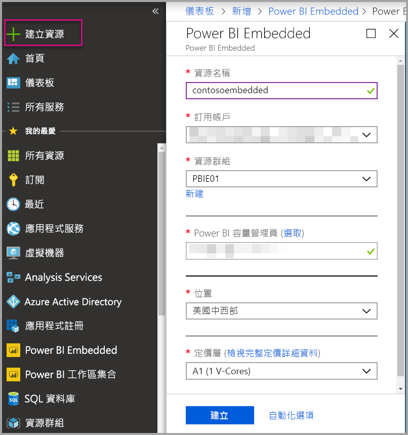
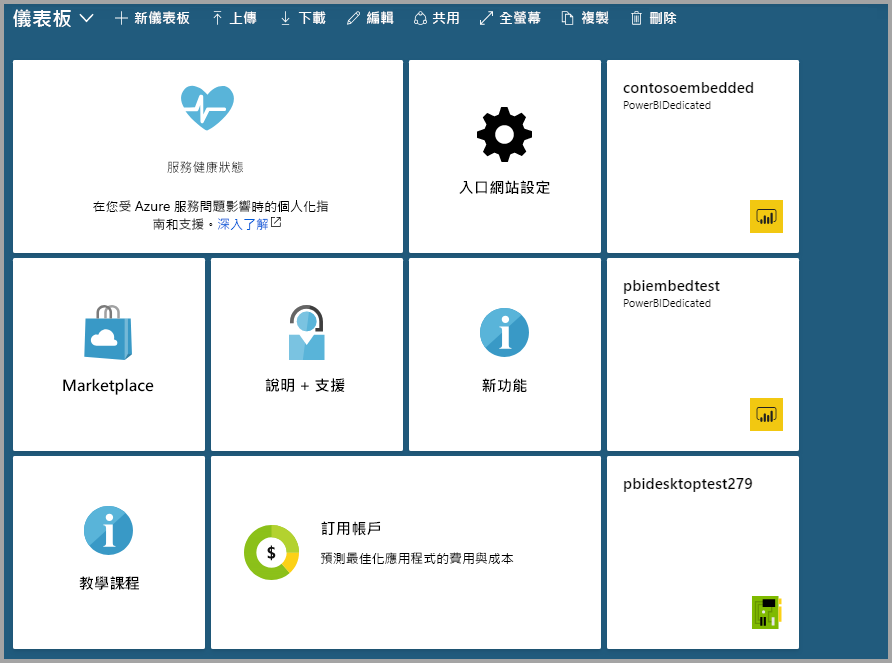

# 在 Azure 入口網站中建立 Power BI Embedded 容量

本文逐步解說如何在 Microsoft Azure 中建立 [Power BI Embedded](azure-pbie-what-is-power-bi-embedded.md) 容量。 Power BI Embedded 可協助您快速將令人讚嘆的視覺效果、報表和儀表板新增至您的應用程式，藉以簡化 Power BI 功能。

如果您沒有 Azure 訂用帳戶，請先建立[免費帳戶](https://azure.microsoft.com/free/)，再開始進行。

> [!VIDEO https://www.youtube.com/embed/aXrvFfg_iSk]

## 開始之前

若要完成本快速入門，您需要：

* **Azure 訂用帳戶：** 請瀏覽 [Azure 免費試用版](https://azure.microsoft.com/free/)以建立帳戶。
* **Azure Active Directory：** 您的訂用帳戶必須與 Azure Active Directory (AAD) 租用戶相關聯。 此外，您必須使用該租用戶中的帳戶登入 Azure。 不支援 Microsoft 帳戶。 若要深入了解，請參閱[驗證和使用者權限](https://docs.microsoft.com/azure/analysis-services/analysis-services-manage-users)。
* **Power BI 租用戶：** 您的 AAD 租用戶中至少一個帳戶必須已註冊 Power BI。
* **資源群組：** 使用您已擁有的資源群組或[建立新的資源群組](https://docs.microsoft.com/azure/azure-resource-manager/resource-group-overview)。

## 建立容量

1. 登入[Azure 入口網站](https://portal.azure.com/)。

2. 在搜尋方塊中，搜尋 *Power BI Embedded*。

3. 在 Power BI Embedded 中，選取 [建立]  。

4. 填入必要的資訊，然後選取 [建立]  。

    

    |設定 |描述 |
    |---------|---------|
    |**資源名稱**|要識別容量的名稱。 除了 Azure 入口網站，資源名稱還會顯示在 Power BI 管理入口網站中。|
    |**訂用帳戶**|您要用來建立容量的訂用帳戶。|
    |**資源群組**|包含此新容量的資源群組。 從現有的資源群組中挑選，或建立另一個。 如需詳細資訊，請參閱 [Azure Resource Manager 概觀](https://docs.microsoft.com/azure/azure-resource-manager/resource-group-overview)。|
    |**Power BI 容量管理員**|Power BI 容量管理員可以在 Power BI 管理入口網站中檢視容量，並將指派權限授與其他使用者。 根據預設，容量管理員是您的帳戶。 容量管理員必須在您的 Power BI 租用戶中。|
    |**位置**|針對您的租用戶裝載 Power BI 的位置。 您的預設位置是您的主區域，但您可以使用 [多地理位置選項](embedded-multi-geo.md)來變更該位置。
    |**定價層**|選取符合您需求的 SKU (V 核心計數和記憶體大小)。  如需詳細資訊，請參閱 [Power BI Embedded 定價](https://azure.microsoft.com/pricing/details/power-bi-embedded/)|

您可以瀏覽至 [所有服務]   > [Power BI Embedded]  查看容量是否就緒。 或者，您可以從通知區段中或從刀鋒視窗內選取 [釘選到儀表板]  ，瀏覽至儀表板以查看新容量。

## 後續步驟

若要使用新的 Power BI Embedded 容量，請瀏覽至 Power BI 管理入口網站來指派工作區。 如需詳細資訊，請參閱[管理 Power BI Premium 和 Power BI Embedded 內的容量](https://powerbi.microsoft.com/documentation/powerbi-admin-premium-manage/)。

如果您不需要使用此容量，您可以將它暫停來停止計費。 如需詳細資訊，請參閱[在 Azure 入口網站中暫停和啟動您的 Power BI Embedded 容量](azure-pbie-pause-start.md)。

若要在您的應用程式中開始內嵌 Power BI 內容，請參閱[如何內嵌您的 Power BI 儀表板、報表及磚](https://powerbi.microsoft.com/documentation/powerbi-developer-embedding-content/)。

有其他問題嗎？ [嘗試在 Power BI 社群提問](https://community.powerbi.com/)