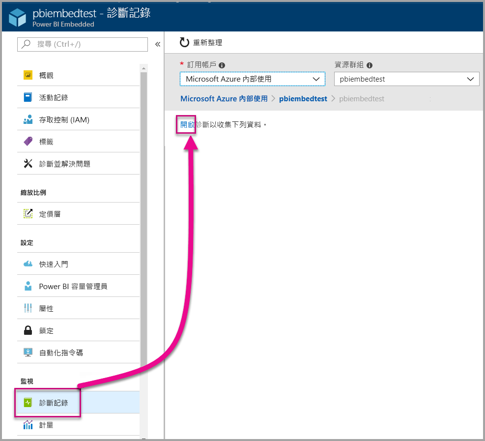
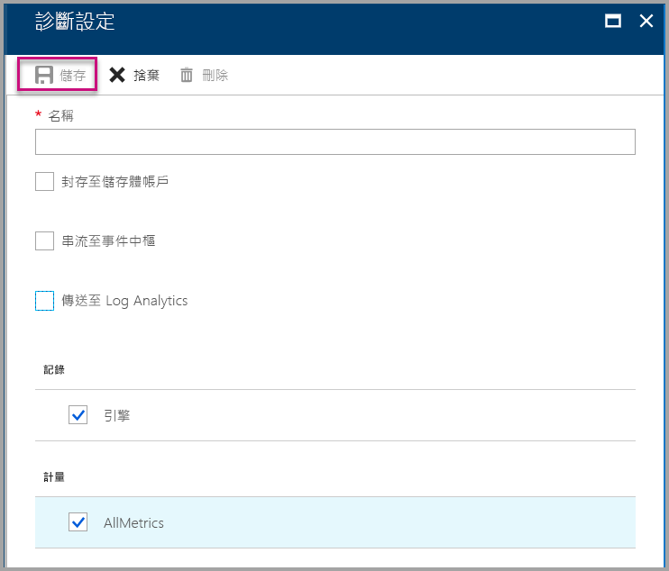
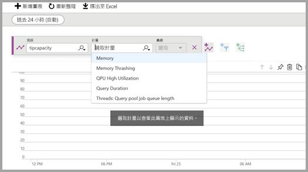
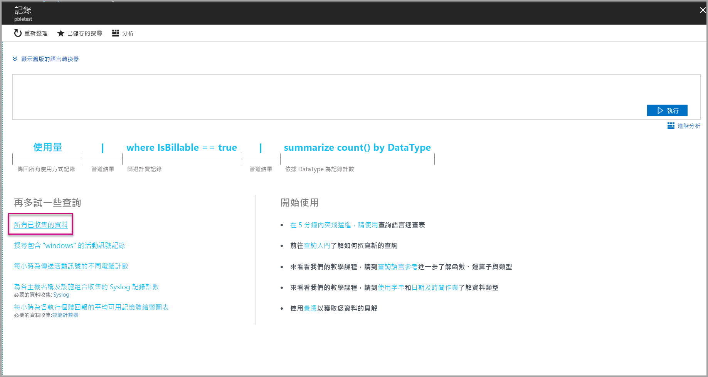
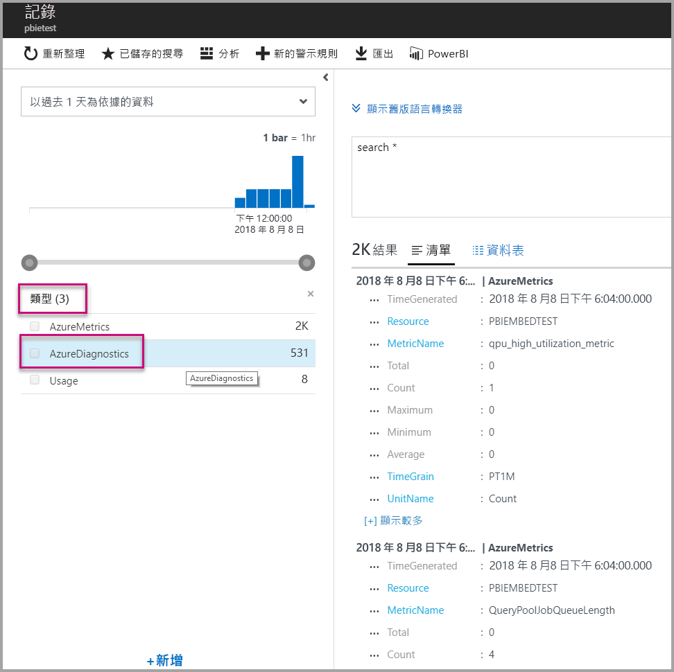
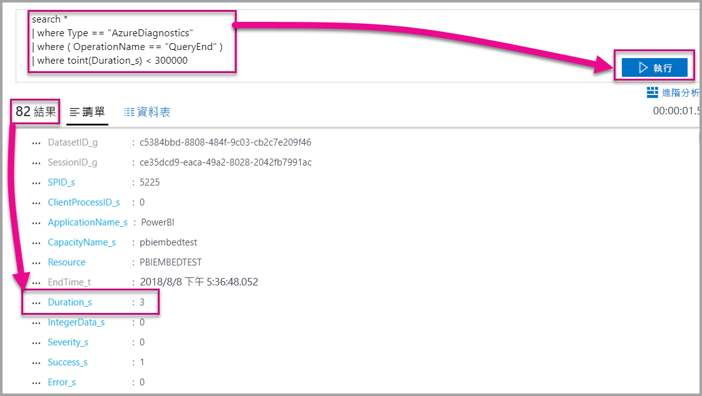
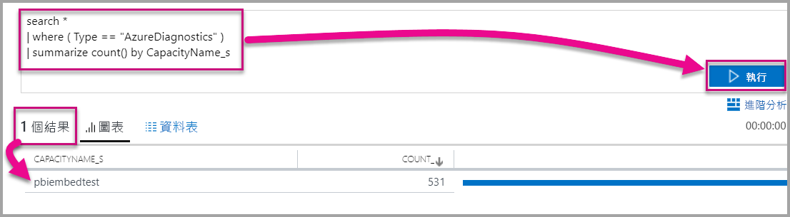

# <a name="diagnostic-logging-for-power-bi-embedded-in-azure"></a>Azure 中 Power BI Embedded 的診斷記錄

您可以使用 [Azure 資源診斷記錄檔](https://docs.microsoft.com/azure/monitoring-and-diagnostics/monitoring-overview-of-diagnostic-logs)來記錄容量的許多事件，將它們輸入分析工具並取得資源行為的見解。

使用診斷可以回答一些狀況，例如：

* 長時間執行或有問題之查詢的偵測。
* [容量計量](https://powerbi.microsoft.com/blog/power-bi-developer-community-april-update/) \(英文\) 的衍生。
* 追蹤特定資料集的使用狀況。

## <a name="set-up-diagnostics-logging"></a>設定診斷記錄

### <a name="azure-portal"></a>Azure 入口網站

1. 在 [Azure 入口網站](https://portal.azure.com) > [Power BI Embedded] 資源中，選取導覽窗格中的 [診斷記錄檔]  ，然後選取 [開啟診斷]  。

    

2. 在 [診斷設定]  中，指定下列選項：

    * **名稱** - 輸入要建立之診斷設定的名稱。

    * **封存至儲存體帳戶** - 若要使用此選項，您需要連線到現有的儲存體帳戶。 請參閱[建立儲存體帳戶](https://docs.microsoft.com/azure/storage/common/storage-create-storage-account)，並依照指示建立儲存體帳戶。 接著，透過在入口網站中返回此頁面來選取您的儲存體帳戶。 新建立的儲存體帳戶可能需要幾分鐘之後才會出現在下拉式功能表中。 記錄檔儲存體是 JSON 格式。
    * **串流至事件中樞** - 若要使用此選項，您需要連線到現有的「事件中樞」命名空間和事件中樞。 若要深入了解，請參閱[使用 Azure 入口網站來建立事件中樞命名空間和事件中樞](https://docs.microsoft.com/azure/event-hubs/event-hubs-create)。
    * **傳送至 Log Analytics** - 若要使用此選項，請使用現有的工作區，或依照下列步驟在入口網站中[建立新的工作區](https://docs.microsoft.com/azure/log-analytics/log-analytics-quick-collect-azurevm#create-a-workspace)以建立新的 Log Analytics 工作區。 這利用 [Azure Log Analytics](https://docs.microsoft.com/azure/log-analytics/log-analytics-overview)，它提供內建分析、儀表板管理和通知功能。 您可以使用 Log Analytics 來連線到其他資源的更多資料，並取得跨所有您的應用程式資源的單一、完整資料檢視。 您也可以將它[一鍵連結到 Power BI](https://docs.microsoft.com/azure/log-analytics/log-analytics-powerbi)。
    如需在 Log Analytics 中檢視記錄的詳細資訊，請參閱[檢視 Log Analytics 中的記錄檔](https://docs.microsoft.com/azure/log-analytics/log-analytics-activity)。
    * **引擎** - 選取此選項來記錄下面[列出的一組引擎事件](#whats-logged)。
    * **AllMetrics** - 選取此選項來儲存[計量](https://docs.microsoft.com/azure/analysis-services/analysis-services-monitor#server-metrics)中的詳細資訊資料。 如果您是封存到儲存體帳戶，您可以選取診斷記錄檔的保留期間。 保留期間到期之後，系統會自動刪除記錄檔。

3. 選取 [儲存]  。

    若要變更診斷記錄檔的儲存方式，您可以返回此頁面來修改設定。

    

### <a name="using-powershell-to-enable-diagnostics"></a>使用 PowerShell 來啟用診斷

若要透過使用 PowerShell 來啟用計量和診斷記錄，請使用下列命令：

* 若要將診斷記錄檔儲存在儲存體帳戶中，請使用此命令：

    ```powershell
    Set-AzureRmDiagnosticSetting -ResourceId [your resource id] -StorageAccountId [your storage account id] -Enabled $true
    ```
    儲存體帳戶識別碼是您想要將記錄檔傳送至該儲存體帳戶的資源識別碼。

* 若要將診斷記錄檔串流至事件中樞，請使用此命令：

    ```powershell
    Set-AzureRmDiagnosticSetting -ResourceId [your resource id] -ServiceBusRuleId [your service bus rule id] -Enabled $true
    ```
* Azure 服務匯流排規則識別碼是此格式的字串：

    ```powershell
    {service bus resource ID}/authorizationrules/{key name}
    ```

* 若要將診斷記錄檔傳送到 Log Analytics 工作區，請使用此命令：

    ```powershell
        Set-AzureRmDiagnosticSetting -ResourceId [your resource id] -WorkspaceId [resource id of the log analytics workspace] -Enabled $true
    ```

* 您可以使用下列命令取得您 Log Analytics 工作區的資源識別碼：

    ```powershell
    (Get-AzureRmOperationalInsightsWorkspace).ResourceId
    ```

您可以結合這些參數來啟用多個輸出選項。

### <a name="rest-api"></a>REST API

了解如何[使用 Azure 監視器 REST API 變更診斷設定](https://docs.microsoft.com/rest/api/monitor/) \(英文\)。 

### <a name="resource-manager-template"></a>Resource Manager 範本

了解如何[使用 Resource Manager 範本在建立資源時自動啟用診斷設定](https://docs.microsoft.com/azure/monitoring-and-diagnostics/monitoring-enable-diagnostic-logs-using-template)。

## <a name="whats-logged"></a>記錄的內容？

您可以選取 [引擎]  和/或 [AllMetrics]  類別。

### <a name="engine"></a>引擎

引擎類別會指示資源記錄下列事件，且每個事件上都有屬性：

|     事件名稱     |     事件描述     |
|----------------------------|----------------------------------------------------------------------------------|
|    稽核登入    |    記錄自開始追蹤以來連線到引擎事件的所有新連線。    |
|    工作階段初始化    |    記錄自開始追蹤以來的所有工作階段初始化事件。    |
|    Vertipaq 查詢開始    |    記錄自開始追蹤以來的所有 VertiPaq SE 查詢開始事件。    |
|    查詢開始    |    記錄自開始追蹤以來的所有查詢開始事件。    |
|    查詢結束    |    記錄自開始追蹤以來的所有查詢結束事件。    |
|    Vertipaq 查詢結束    |    記錄自開始追蹤以來的所有 Vertipaq 查詢結束事件。    |
|    稽核登出    |    記錄自開始追蹤以來的所有從引擎中斷連線事件。    |
|    Error    |    記錄自開始追蹤以來的所有引擎錯誤事件。    |

<br>
<br>

| 屬性名稱 | Vertipaq 查詢結束範例 | 屬性描述 |
|-------------------|---------------------------------------------------------------------------------------------------------------------------------------------------------------------------------------------------------|--------------------------------------------------------------------------------------------------------------------------|
| EventClass | XM_SEQUERY_END | 「事件類別」是用來將事件分類。 |
| EventSubclass | 0 | 「事件子類別」提供有關每個事件類別的額外資訊。 (例如 0:VertiPaq Scan) |
| RootActivityId | ff217fd2-611d-43c0-9c12-19e202a94f70 | 根活動識別碼。 |
| CurrentTime | 2018-04-06T18:30:11.9137358Z | 事件開始的時間 (當可用時)。 |
| StartTime | 2018-04-06T18:30:11.9137358Z | 事件開始的時間 (當可用時)。 |
| JobID | 0 | 進度的工作識別碼。 |
| ObjectID | 464 | 物件識別碼 |
| ObjectType | 802012 | ObjectType |
| EndTime | 2018-04-06T18:30:11.9137358Z | 事件結束的時間。 |
| Duration | 0 | 事件花費的時間量 (毫秒)。 |
| SessionType | 使用者 | 工作階段類型 (引發作業的實體)。 |
| ProgressTotal | 0 | 整體進度。 |
| IntegerData | 0 | 整數資料。 |
| Severity | 0 | 例外狀況的嚴重性層級。 |
| Success | 1 | 1 = 成功。 0 = 失敗 (例如，1 表示權限檢查成功，而 0 表示該檢查失敗)。 |
| Error | 0 | 給定事件的錯誤號碼。 |
| ConnectionID | 3 | 唯一的連線識別碼。 |
| DatasetID | 5eaa550e-06ac-4adf-aba9-dbf0e8fd1527 | 資料集 (使用者的陳述式在其中執行) 的識別碼。 |
| SessionID | 3D063F66-A111-48EE-B960-141DEBDA8951 | 工作階段 GUID。 |
| SPID | 180 | 伺服器處理序識別碼。 這可唯一識別使用者工作階段。 這直接對應到 XML/A 所使用的工作階段 GUID。 |
| ClientProcessID | null | 用戶端應用程式的處理序識別碼。 |
| ApplicationName | null | 建立對伺服器連線之用戶端應用程式的名稱。 |
| CapacityName | pbi641fb41260f84aa2b778a85891ae2d97 | Power BI Embedded 容量資源的名稱。 |


### <a name="allmetrics"></a>AllMetrics

選取 [AllMetrics]  選項會記錄您可以搭配 Power BI Embedded 資源來使用之所有計量的資料。

   

## <a name="manage-your-logs"></a>管理您的記錄檔

記錄檔通常在設定記錄之後的幾個小時內就可用。 您可以選擇在儲存體帳戶中管理記錄檔：

* 使用標準 Azure 存取控制方法，透過限制可存取的人來保護您的記錄檔。
* 刪除您不想再保留在儲存體帳戶中的記錄檔。
* 請務必設定保留期限，以將舊的記錄檔從儲存體帳戶刪除。

## <a name="view-logs-in-log-analytics"></a>檢視 Log Analytics 中的記錄檔

計量和伺服器事件會與 Log Analytics 中的 xEvents 整合以進行並排分析。 您也可以將 Log Analytics 設定成從其他 Azure 服務接收事件，這樣可提供整個架構的診斷記錄全面檢視。

若要在 Log Analytics 中檢視診斷資料，請從左側功能表或 [管理] 區域開啟 [記錄檔]  頁面，如下所示。


現在您已經啟用了資料收集，請在 [記錄檔]  中選取 [所有已收集的資料]  。



在 [類型]  中，選取 [AzureDiagnostics]  ，然後選取 [套用]  。 AzureDiagnostics 包含引擎事件。 請留意，系統隨即建立一個 Log Analytics 查詢。



請選取 [EventClass\_s]  或其中一個事件名稱，Log Analytics 就會繼續建構查詢。 請務必儲存您的查詢，以供日後重複使用。

請務必查看 [Log Analytics](https://docs.microsoft.com/azure/log-analytics/)，它提供的網站可讓您針對收集的資料進行增強查詢、儀表板管理和警示功能。

### <a name="queries"></a>查詢

有數百個您可以使用的查詢。 以下是一些可協助您開始使用的查詢。 若要深入了解如何使用新的「記錄搜尋」查詢語言，請參閱[了解 Log Analytics 中的記錄搜尋](https://docs.microsoft.com/azure/log-analytics/log-analytics-log-search)。

* 完成時間不超過五分鐘 (300,000 毫秒) 的查詢傳回。

    ```
    search *
    | where Type == "AzureDiagnostics"
    | where ( OperationName == "QueryEnd" )
    | where toint(Duration_s) < 300000
    ```

    

* 識別容量名稱。

    ```
    search *
    | where ( Type == "AzureDiagnostics" )
    | summarize count() by CapacityName_s 
    ```

    

## <a name="next-steps"></a>後續步驟

您可以深入了解 Azure 資源診斷記錄。

> [!div class="nextstepaction"]
> [Azure 資源診斷記錄](https://docs.microsoft.com/azure/monitoring-and-diagnostics/monitoring-overview-of-diagnostic-logs)

> [!div class="nextstepaction"]
> [Set-AzureRmDiagnosticSetting](https://docs.microsoft.com/powershell/module/azurerm.insights/Set-AzureRmDiagnosticSetting) \(英文\)
