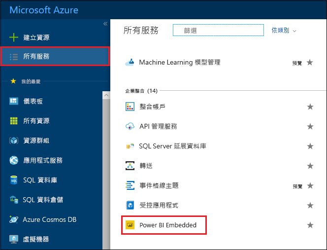
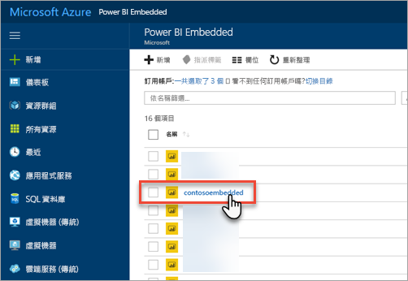
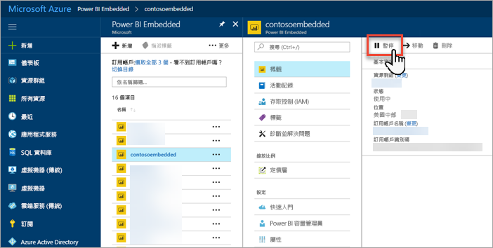
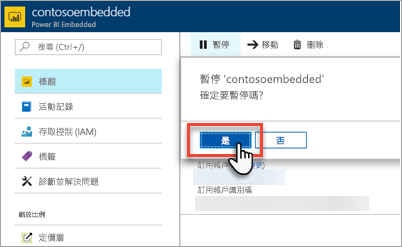
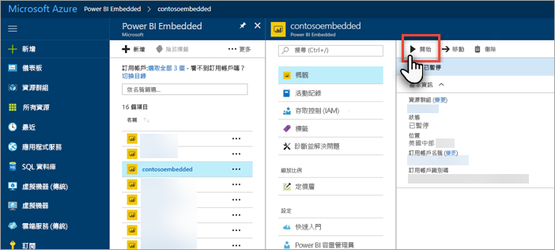

# 在 Azure 入口網站中暫停和啟動您的 Power BI Embedded 容量

本文逐步解說如何在 Microsoft Azure 中暫停和啟動 Power BI Embedded 容量。 假設您已建立 Power BI Embedded 容量。 如果您尚未建立，請參閱[在 Azure 入口網站中建立 Power BI Embedded 容量](azure-pbie-create-capacity.md)以開始進行。

如果您沒有 Azure 訂用帳戶，請先建立[免費帳戶](https://azure.microsoft.com/free/)，再開始進行。

## 暫停您的容量

暫停容量可防止計費。 如果您有一段時間不需要使用容量，暫停您的容量會很有幫助。 請使用下列步驟來暫停您的容量。

> [!NOTE]
> 暫停容量可防止在 Power BI 中使用內容。 請務必從您的容量取消指派工作區後再暫停，以避免中斷。

1. 登入[Azure 入口網站](https://portal.azure.com/)。

2. 選取 [所有服務]   > [Power BI Embedded]  查看您的容量。

    

3. 選取您要暫停的容量。

    

4. 在容量詳細資料中選取 [暫停]  。

    

5. 選取 [是]  確認您要暫停容量。

    

## 啟動您的容量

您可以啟動容量來繼續使用。 啟動您的容量也會繼續計費。

1. 登入[Azure 入口網站](https://portal.azure.com/)。

2. 選取 [所有服務]   > [Power BI Embedded]  查看您的容量。

    

3. 選取您要啟動的容量。

    

4. 在容量詳細資料中選取 [啟動]  。

    

5. 選取 [是]  確認您要啟動容量。

    

如有任何內容指派給此容量，啟動後即可使用。

## 後續步驟

如果您想要相應增加或減少您的容量，請參閱[調整您的 Power BI Embedded 容量規模](azure-pbie-scale-capacity.md)。

若要在您的應用程式中開始內嵌 Power BI 內容，請參閱[如何內嵌您的 Power BI 儀表板、報表及磚](https://powerbi.microsoft.com/documentation/powerbi-developer-embedding-content/)。

有其他問題嗎？ [嘗試在 Power BI 社群提問](https://community.powerbi.com/)