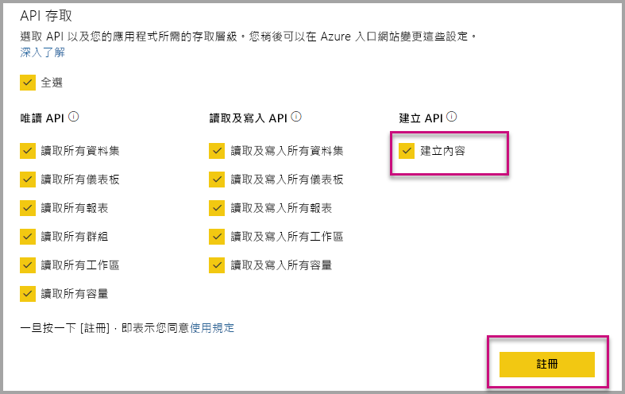

# 在為您的組織內嵌時，自動安裝 Power BI 應用程式

若要透過應用程式內嵌內容，執行內嵌的使用者必須具備[應用程式的存取權](../../collaborate-share/service-create-distribute-apps.md)。 若已為使用者安裝應用程式，則內嵌作業可以順暢執行。 如需詳細資訊，請參閱[透過應用程式內嵌報表或儀表板](embed-from-apps.md)。 由 PowerBI.com 中的定義來看，我們可以說所有應用程式都能[自動安裝](https://powerbi.microsoft.com/blog/automatically-install-apps/)。 不過，此動作是在租用戶層級進行，然後套用至所有應用程式。

## 在內嵌時自動安裝應用程式

如果使用者具備應用程式的存取權，但未安裝應用程式，則內嵌會失敗。 因此，在透過應用程式進行內嵌時，您可以允許在內嵌時自動安裝應用程式以避免這些失敗。 此動作表示如果使用者嘗試內嵌的應用程式尚未安裝，則系統會自動為您安裝。 如此一來，您所需的內容即可立即內嵌，讓使用者擁有順暢的體驗。

## 為 Power BI 使用者內嵌 (使用者擁有資料)

若要為您的使用者自動安裝應用程式，您必須在[註冊應用程式](register-app.md#register-with-the-power-bi-application-registration-tool)時提供應用程式「內容建立」權限，或新增此權限 (若您已註冊應用程式)。

接著，您必須在內嵌 URL 中提供應用程式識別碼。 若要提供應用程式識別碼，應用程式建立者必須先安裝應用程式，然後使用其中一個支援的 [Power BI Rest API](https://docs.microsoft.com/rest/api/power-bi/) 呼叫 ([取得報表](https://docs.microsoft.com/rest/api/power-bi/reports/getreports)或是[取得儀表板](https://docs.microsoft.com/rest/api/power-bi/dashboards/getdashboards))。 接著，應用程式建立者必須接受來自 REST API 回應的內嵌 URL。 如果內容是來自應用程式，則應用程式識別碼會出現在 URL 中。  內嵌 URL 之後，即可使用它來定期內嵌。

## 安全內嵌

若要使用應用程式的自動安裝功能，應用程式建立者必須先安裝應用程式、移至 PowerBI.com 上的應用程式、巡覽至報表，然後以一般方式取得該連結。 針對使用該連結的應用程式，只要具備該應用程式存取權的所有其他使用者，均可內嵌報表。

## 考量與限制

* 在此案例中，您只可內嵌報表和儀表板。

* 這項功能目前不支援「應用程式擁有資料」及 SharePoint 內嵌案例。