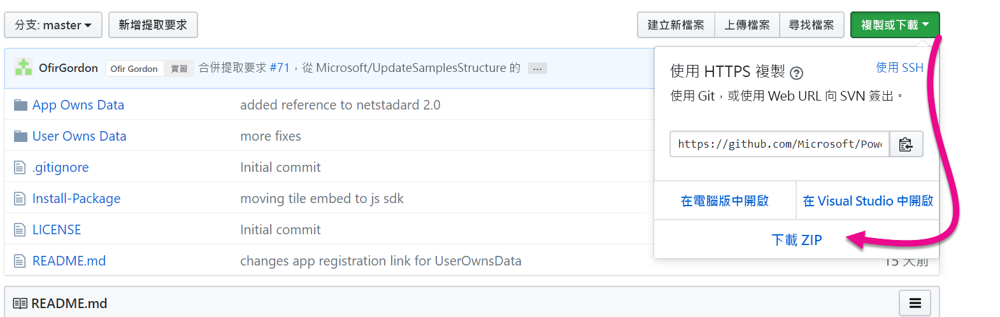
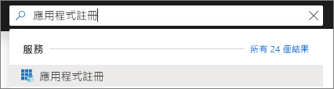
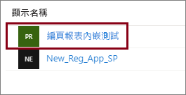
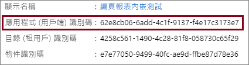
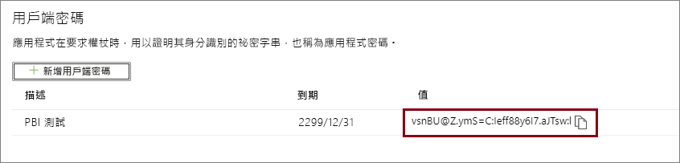
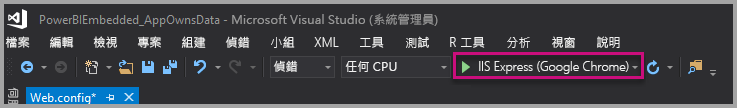
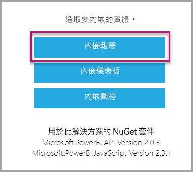

# <a name="tutorial-embed-power-bi-paginated-reports-into-an-application-for-your-customers"></a>教學課程：為客戶將 Power BI 編頁報表內嵌至您的應用程式

使用 **Azure 中的 Power BI Embedded** 或**內嵌在 Office 的 Power BI**，可利用應用程式擁有的資料，將編頁報表內嵌至應用程式。 **應用程式擁有的資料**即是應用程式使用 Power BI 作為其內嵌的分析平台。 身為 **ISV** 或**開發人員**，您可以建立會顯示應用程式 (完全整合且互動) 中編頁報表的 Power BI 內容，而使用者完全不需要有 Power BI 授權。 本教學課程示範如何使用 Power BI .NET SDK 搭配 Power BI JavaScript API，將編頁報表整合至應用程式。


在本教學課程中，您會了解如何：
> [!div class="checklist"]
> * 在 Azure 中註冊應用程式。
> * 將 Power BI 編頁報表內嵌到應用程式中。

## <a name="prerequisites"></a>必要條件

若要開始，您必須具備：

* [服務主體 (僅限應用程式權杖)](embed-service-principal.md)
* [Microsoft Azure](https://azure.microsoft.com/) 訂用帳戶
* 您自己的 [Azure Active Directory 租用戶](create-an-azure-active-directory-tenant.md)設定
* 至少有一個 A4 或 P1 [容量](#create-a-dedicated-capacity)，並已啟用[編頁報表](../../admin/service-admin-premium-workloads.md#paginated-reports)工作負載

如果您沒有 Azure 訂用帳戶，請先建立[免費帳戶](https://azure.microsoft.com/free/?WT.mc_id=A261C142F)，再開始進行。

> [!IMPORTANT]
> * 您必須使用**服務主體**。 不支援主要使用者。
> * 不支援需要單一登入 (SSO) 的資料來源。 如需支援的資料集和驗證方法清單，請參閱 [Power BI 編頁報表支援的資料來源](../../paginated-reports/paginated-reports-data-sources.md)。 
> * 不支援將 Power BI 資料集作為[資料來源](../../connect-data/service-get-data.md)。

## <a name="set-up-your-power-bi-environment"></a>設定您的 Power BI 環境

內嵌編頁報表需要將工作區指派給專用容量，並將報表上傳至工作區。

### <a name="create-an-app-workspace"></a>建立應用程式工作區

因為您使用[服務主體](embed-service-principal.md)登入您的應用程式，您需要使用[新的工作區](../../collaborate-share/service-create-the-new-workspaces.md)。 身為「服務主體」，您也必須是與應用程式相關之應用程式工作區的系統管理員或成員。

### <a name="create-a-dedicated-capacity"></a>建立專用容量

在您匯入或上傳編頁報表以進行內嵌之前，必須至少將包含報表的工作區指派至 A4 或 P1 容量。 有兩種類型的容量可供您選擇：
* **Power BI Premium** - 若要內嵌編頁報表，需要 *P* SKU 容量。 內嵌 Power BI 內容時，此解決方案稱為「Power BI 內嵌」。 如需此訂用帳戶的詳細資訊，請參閱[什麼是 Power BI Premium？](../../admin/service-premium-what-is.md)
* **Azure Power BI Embedded** - 您可以在 [Microsoft Azure 入口網站](https://portal.azure.com)中購買專用容量。 此訂用帳戶會使用 *A* SKU。 若要內嵌編頁報表，您至少需要一個 *A4* 訂用帳戶。 如需如何建立 Power BI Embedded 容量的詳細資料，請參閱 [Create Power BI Embedded capacity in the Azure portal](azure-pbie-create-capacity.md) (在 Azure 入口網站中建立 Power BI Embedded 容量)。

下表說明每個 SKU 的資源和限制。 若要判斷最符合需求的容量，請參閱[我該為案例購買哪一種 SKU](https://docs.microsoft.com/power-bi/developer/embedded-faq#which-solution-should-i-choose) 資料表。

| 容量節點 | V 核心總數 | 後端 V 核心 | RAM (GB) | 前端 V 核心 | 
| --- | --- | --- | --- | --- |
| P1/A4 | 8 | 4 | 25 | 4 |
| P2/A5 | 16 | 8 | 50 | 8 |
| P3/A6 | 32 | 16 | 100 | 16 |
| | | | | |

### <a name="assign-an-app-workspace-to-a-dedicated-capacity"></a>將應用程式工作區指派至專用容量

建立了專用容量之後，您可以將應用程式工作區指派到該專用容量。

若要使用[服務主體](embed-service-principal.md)，將專用容量指派工作區，請使用 [Power BI REST API](https://docs.microsoft.com/rest/api/power-bi/capacities/groups_assigntocapacity)。 使用 Power BI REST API 時，請務必使用[服務主體物件識別碼](embed-service-principal.md)。

### <a name="create-and-upload-your-paginated-reports"></a>建立並上傳您的編頁報表

您可以使用 [Power BI 報表產生器](../../paginated-reports/paginated-reports-report-builder-power-bi.md#create-reports-in-power-bi-report-builder)來建立編頁報表，然後[將報表上傳至服務](../../paginated-reports/paginated-reports-quickstart-aw.md#upload-the-report-to-the-service)。

您可以使用 [Power BI REST API](https://docs.microsoft.com/rest/api/power-bi/imports/postimportingroup)，將編頁報表匯入至新的工作區。

## <a name="embed-content-using-the-sample-application"></a>使用範例應用程式來內嵌內容

此範例刻意保持簡單以供示範之用。 您或開發人員可以視需要來保護應用程式祕密。

請遵循下列步驟，使用範例應用程式開始內嵌您的內容。

1. 下載 [Visual Studio](https://www.visualstudio.com/) (版本 2013 或更新版本)。 務必下載最新 [NuGet 套件](https://www.nuget.org/profiles/powerbi)。

2. 從 GitHub 下載[應用程式擁有資料範例](https://github.com/Microsoft/PowerBI-Developer-Samples)來開始進行。

    

3. 開啟範例應用程式中的 **Web.config** 檔案。 您需要填寫幾個欄位，才能執行應用程式。 對 **AuthenticationType** 選擇 **ServicePrincipal**。

    填寫下列欄位：
    * [applicationId](#application-id)
    * [workspaceId](#workspace-id)
    * [reportId](#report-id)
    * [applicationsecret](#application-secret)
    * [tenant](#tenant)

    > [!Note]
    > 此範例中的預設 **AuthenticationType** 是 MasterUser。 請確定您將它變更為 **ServicePrincipal**。 


    

### <a name="application-id"></a>應用程式識別碼

使用從 **Azure** 取得的**應用程式識別碼**填入 **applicationId** 資訊。 應用程式會使用 **applicationId** 來向您要求權限的使用者表明其身分。

若要取得 **applicationId**，請遵循下列步驟：

1. 登入[Azure 入口網站](https://portal.azure.com)。

2. 在左側導覽窗格中，選取 [所有服務]，並搜尋 [應用程式註冊]。

    

3. 選取需要 **applicationId** 的應用程式。

    

4. 有一個以 GUID 形式列出的「應用程式識別碼」。 請使用此**應用程式識別碼**作為應用程式的 **applicationId**。

    

### <a name="workspace-id"></a>工作區識別碼

在 **workspaceId** 資訊中，填入來自 Power BI 的應用程式工作區 (群組) GUID。 您可以在登入 Power BI 服務時從 URL，或使用 PowerShell 取得此資訊。

URL <br>


PowerShell <br>

```powershell
Get-PowerBIworkspace -name "Paginated Report Embed"
```

   

### <a name="report-id"></a>報表識別碼

在 **reportId** 資訊中，填入來自 Power BI 的報表 GUID。 您可以在登入 Power BI 服務時從 URL，或使用 PowerShell 取得此資訊。

URL<br>


PowerShell <br>

```powershell
Get-PowerBIworkspace -name "Paginated Report Embed" | Get-PowerBIReport
```


### <a name="application-secret"></a>應用程式祕密

在 **Azure** 之 [應用程式註冊] 區段的 [金鑰] 區段中，填入 **ApplicationSecret** 資訊。

若要取得 **ApplicationSecret**，請遵循下列步驟：

1. 登入 [Azure 入口網站](https://portal.azure.com)。

2. 在左側的導覽窗格中，選取 [所有服務]，並搜尋 [應用程式註冊]。

    

3. 選取需要使用 **ApplicationSecret** 的應用程式。

    

4. 選取 [管理] 底下的 [憑證及祕密]。

5. 選取 [新增用戶端祕密]。

6. 在 [描述] 方塊中輸入名稱，並選取期間。 然後選取 [儲存] 來取得您應用程式的**值**。 當您在儲存金鑰值後關閉 [金鑰] 窗格時，[值] 欄位只會以隱藏方式顯示。 此時，您即無法擷取金鑰值。 如果您遺失金鑰值，就必須在 Azure 入口網站中建立一個新的。

    

### <a name="tenant"></a>租用戶

在 **tenant** 資訊中，填入您的 azure 租用戶識別碼。 您可以在登入 Power BI 服務時從 [Azure AD 系統管理中心](/onedrive/find-your-office-365-tenant-id)，或使用 Powershell 取得此資訊。

### <a name="run-the-application"></a>執行應用程式

1. 在 **Visual Studio** 中選取 [執行]。

    

2. 接著，選取 [內嵌報表]。

    

3. 現在，您已可以在範例應用程式中檢視該報表。

    

## <a name="embed-power-bi-paginated-reports-within-your-application"></a>在應用程式中內嵌 Power BI 編頁報表

即使使用 [Power BI REST API](https://docs.microsoft.com/rest/api/power-bi/) 可以完成內嵌您的 Power BI 編頁報表的步驟，本文描述的範例程式碼仍是使用 **.NET SDK** 撰寫。

在應用程式中針對客戶內嵌 Power BI 編頁報表時，您必須先具有 **Azure AD** [服務主體](embed-service-principal.md)，並取得 Power BI 應用程式的 [Azure AD 存取權杖](get-azuread-access-token.md#access-token-for-non-power-bi-users-app-owns-data)，之後才能呼叫 [Power BI REST API](https://docs.microsoft.com/rest/api/power-bi/)。

為了使用**存取權杖**建立 Power BI 用戶端，請建立 Power BI 用戶端物件，以讓您與 [Power BI REST API](https://docs.microsoft.com/rest/api/power-bi/) 互動。 你可以將 **AccessToken** 與 ***Microsoft.Rest.TokenCredentials*** 物件包裝在一起來建立 Power BI 用戶端物件。

```csharp
using Microsoft.IdentityModel.Clients.ActiveDirectory;
using Microsoft.Rest;
using Microsoft.PowerBI.Api.V2;

var tokenCredentials = new TokenCredentials(authenticationResult.AccessToken, "Bearer");

// Create a Power BI Client object. it's used to call Power BI APIs.
using (var client = new PowerBIClient(new Uri(ApiUrl), tokenCredentials))
{
    // Your code to embed items.
}
```

### <a name="get-the-paginated-report-you-want-to-embed"></a>取得您要內嵌的編頁報表

您可以使用 Power BI 用戶端物件，擷取您想要內嵌之項目的參考。

下列程式碼範例示範如何從指定工作區中擷取第一份報表。

*取得您要內嵌的報表、儀表板或圖格的內容項目範例，位於[範例應用程式](https://github.com/Microsoft/PowerBI-Developer-Samples)的 Services\EmbedService.cs 檔案內。*

```csharp
using Microsoft.PowerBI.Api.V2;
using Microsoft.PowerBI.Api.V2.Models;

// You need to provide the workspaceId where the dashboard resides.
ODataResponseListReport reports = await client.Reports.GetReportsInGroupAsync(workspaceId);

// Get the first report in the group.
Report report = reports.Value.FirstOrDefault();
```

### <a name="create-the-embed-token"></a>建立內嵌權杖

產生可從 JavaScript API 使用的內嵌權杖。 若要為內嵌 Power BI 編頁報表建立內嵌權杖，請使用 [Reports GenerateTokenInGroup](https://docs.microsoft.com/rest/api/power-bi/embedtoken/reports_generatetokeningroup) \(英文\) API。

您可以在[範例應用程式](https://github.com/Microsoft/PowerBI-Developer-Samples)的  *Services\EmbedService.cs* 檔案內取得建立內嵌權杖的範例。

```csharp
using Microsoft.PowerBI.Api.V2;
using Microsoft.PowerBI.Api.V2.Models;

// Generate Embed Token.
var generateTokenRequestParameters = new GenerateTokenRequest(accessLevel: "view");
EmbedToken tokenResponse = client.Reports.GenerateTokenInGroup(workspaceId, report.Id, generateTokenRequestParameters);

// Generate Embed Configuration.
var embedConfig = new EmbedConfig()
{
    EmbedToken = tokenResponse,
    EmbedUrl = report.EmbedUrl,
    Id = report.Id
};
```

### <a name="load-an-item-using-javascript"></a>使用 JavaScript 載入項目

您可以使用 JavaScript 將編頁報表載入網頁上的 div 元素中。

如需使用 JavaScript API 的完整範例，您可以使用[測試網工具](https://microsoft.github.io/PowerBI-JavaScript/demo)。 遊樂場工具是一個可測試不同類型 Power BI Embedded 範例的快速方式。 您也可以瀏覽 [PowerBI-JavaScript Wiki](https://github.com/Microsoft/powerbi-javascript/wiki) 頁面，取得 JavaScript API 的詳細資訊。

## <a name="next-steps"></a>後續步驟

在本教學課程中，您已了解如何為客戶將 Power BI 編頁報表內嵌至應用程式。 您也可以嘗試為客戶或組織內嵌 Power BI 內容。

> [!div class="nextstepaction"]
>[內嵌客戶的內容](embed-sample-for-customers.md)

> [!div class="nextstepaction"]
>[內嵌組織的內容](embed-sample-for-your-organization.md)

有其他問題嗎？ [嘗試在 Power BI 社群提問](https://community.powerbi.com/)
