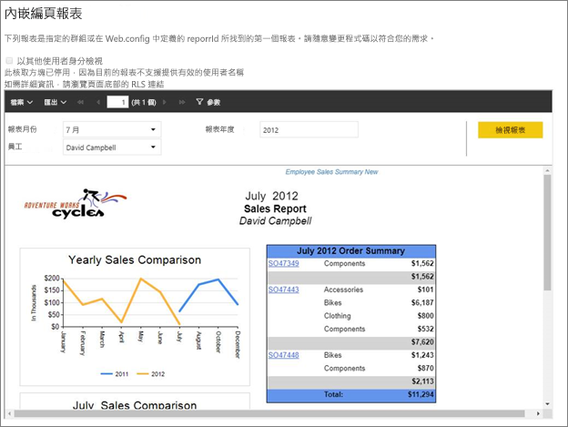
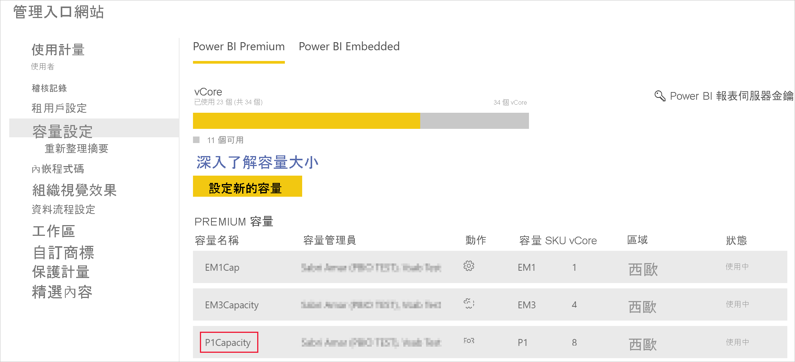
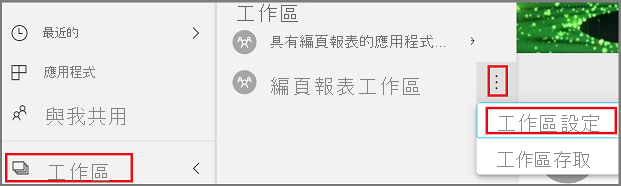
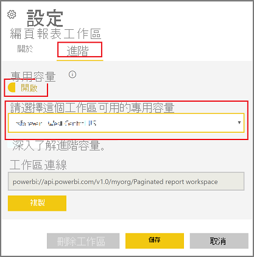
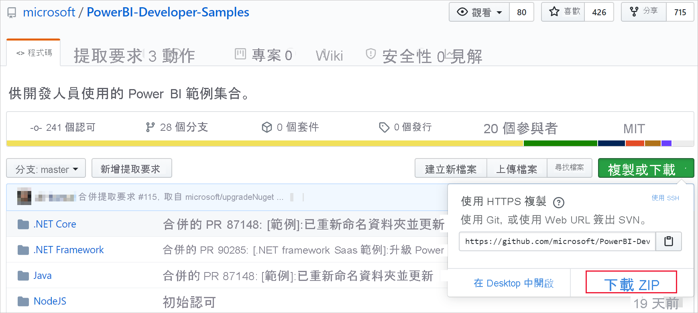
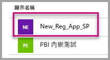
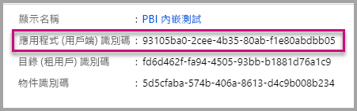
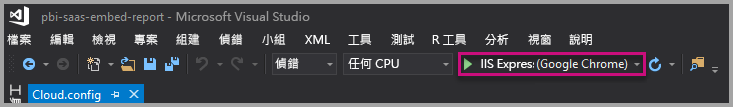

# <a name="tutorial-embed-power-bi-paginated-reports-into-an-application-for-your-organization"></a>教學課程：為組織將 Power BI 編頁報表內嵌至應用程式

在 **Power BI** 中，您可以使用「使用者擁有資料」案例，為組織將編頁報表內嵌至應用程式。

編頁報表是設計用來進行高品質列印的報表。 這些報表通常會包含很多資料，並以可讓其符合列印頁面的方式呈現。
若要了解 Power BI 支援編頁報表的方式，請參閱[什麼是 Power BI Premium 中的編頁報表？](https://docs.microsoft.com/power-bi/paginated-reports-report-builder-power-bi)

**使用者擁有資料**可讓應用程式延伸 Power BI 服務，使其可用內嵌式分析。 此教學課程示範如何將編頁報表整合至應用程式。

您可以使用 Power BI .NET SDK 搭配 Power BI JavaScript API，為組織將 Power BI 內嵌到應用程式中。



在本教學課程中，您會學習下列工作：
> [!div class="checklist"]
> * 在 Azure 中註冊應用程式。
> * 使用您的 Power BI 租用戶將 Power BI 編頁報表內嵌到應用程式。

## <a name="prerequisites"></a>必要條件
若要開始，您必須具備：

* [Power BI Pro 帳戶](../../admin/service-admin-purchasing-power-bi-pro.md)。

* 您必須設定自己的 [Azure Active Directory 租用戶](create-an-azure-active-directory-tenant.md)。

* 至少有 P1 容量。 請參閱[我需要針對編頁報表使用何種大小的 Premium 容量？](../../paginated-reports/paginated-reports-faq.md#what-size-premium-capacity-do-i-need-for-paginated-reports)

如果您尚未註冊 **Power BI Pro**，請先[註冊免費試用](https://powerbi.microsoft.com/pricing/)，再開始進行。

## <a name="set-up-your-power-bi-environment"></a>設定您的 Power BI 環境

請遵循此節中的指示以設定 Power BI 來內嵌您的編頁報表。

### <a name="register-a-server-side-web-application-app"></a>註冊伺服器端 Web 應用程式

請遵循[註冊要與 Power BI 搭配使用的 Azure AD 應用程式](register-app.md)中的指示來註冊伺服器端 Web 應用程式。

>[!NOTE]
>註冊應用程式時，請務必執行下列動作：
>* 取得應用程式祕密
>* 將 **Report.ReadAll** 權限 (範圍) 套用到您的應用程式。

### <a name="create-a-dedicated-capacity"></a>建立專用容量

建立專用容量，您應用程式工作區中的內容即可享有專用資源。 針對編頁報表，您必須使用至少 P1 容量來備份您的應用程式工作區。 您可以使用 [Power BI Premium](../../admin/service-premium-what-is.md) 建立專用容量。

下表列出可用來針對 [Microsoft Office 365](../../admin/service-admin-premium-purchase.md) 中的編頁報表建立專用容量的 Power BI Premium SKU：

| 容量節點 | V 核心總數<br/>(後端 + 前端) | 後端 V 核心數 | 前端 V 核心數 | DirectQuery/即時連線限制 |
| --- | --- | --- | --- | --- | --- |
| P1 |8 個 V 核心 |4 個 V 核心，25 GB RAM |4 個 V 核心 |每秒 30 個 |
| P2 |16 個 V 核心 |8 個 V 核心，50 GB RAM |8 個 V 核心 |每秒 60 個 |
| P3 |32 個 V 核心 |16 個 V 核心，100 GB RAM |16 個 V 核心 |每秒 120 個 |
| P4 |64 個 V 核心 |32 個 V 核心，200 GB RAM |32 個 V 核心 |每秒 240 個 |
| P5 |128 個 V 核心 |64 個 V 核心，400 GB RAM |64 個 V 核心 |每秒 480 個 |
|||||

### <a name="enable-paginated-reports-workload"></a>啟用編頁報表工作負載

您必須在您的專用容量上啟用編頁報表工作負載。

1. 登入 [Power BI > [管理入口網站] > [容量設定]](https://app.powerbi.com/admin-portal/capacities)。

2. 選取具有您要上傳編頁報表之目標工作區的容量。

    

3. 展開 [工作負載]。

    ![展開 [工作負載]](media/embed-paginated-reports-organization/expand-workloads.png)

4. 啟用編頁報表工作負載。

    

### <a name="assign-an-app-workspace-to-a-dedicated-capacity"></a>將應用程式工作區指派至專用容量

建立專用容量之後，您可以將應用程式工作區指派到該專用容量。 若要完成此處理序，請遵循下列步驟：

1. 在 Power BI 服務內，展開工作區，然後選取您用來內嵌內容之工作區的 [更多]。 然後選取 [工作區設定]。

    

2. 選取 [Premium]，然後啟用 [專用容量]。 選取您建立的專用容量。 接著，選取 [儲存]。

    

3. 在您選取 [儲存] 後，應該會在應用程式工作區名稱的旁邊看到一個鑽石。

    

### <a name="create-and-publish-your-power-bi-paginated-reports"></a>建立並發佈您的 Power BI 編頁報表

您可以使用 [Power BI 報表產生器](../../paginated-reports/paginated-reports-report-builder-power-bi.md#create-reports-in-power-bi-report-builder)來建立編頁報表。 然後，您可以[上傳報表](../../paginated-reports/paginated-reports-quickstart-aw.md#upload-the-report-to-the-service)到已至少指派 P1 容量的應用程式工作區，然後開啟[編頁報表工作負載](#enable-paginated-reports-workload)。 上傳報表的使用者需要擁有 Power BI Pro 授權才能發佈至應用程式工作區。
   
## <a name="embed-your-content-by-using-the-sample-application"></a>使用範例應用程式來內嵌內容

此範例刻意保持簡單以供示範之用。

請遵循下列步驟，使用範例應用程式開始內嵌您的內容。

1. 下載 [Visual Studio](https://www.visualstudio.com/) (版本 2013 或更新版本)。 務必下載最新 [NuGet 套件](https://www.nuget.org/profiles/powerbi)。

2. 下載 [PowerBI-Developer-Samples](https://github.com/Microsoft/PowerBI-Developer-Samples) \(英文\)，然後開啟 [.NET Framework] > [Embed for your organization] > [integrate-web-app] > [PBIWebApp]。

    

3. 開啟範例應用程式中的 **Cloud.config** 檔案，然後填入下列欄位以執行您的應用程式：
    * [應用程式識別碼](#application-id)
    * [Workspace ID](#workspace-id) \(工作區識別碼\)
    * [Report ID](#report-id) \(報表識別碼\)
    * [AADAuthorityUrl](#aadauthorityurl)

    

### <a name="application-id"></a>應用程式識別碼

使用從 **Azure** 取得的**應用程式識別碼**填入 **applicationId** 資訊。 應用程式會使用 **applicationId** 來向您要求權限的使用者表明其身分。

若要取得 **applicationId**，請遵循下列步驟：

1. 登入[Azure 入口網站](https://portal.azure.com)。

2. 在左側的功能窗格中，選取 [所有服務] 及 [應用程式註冊]。

3. 選取需要 **applicationId** 的應用程式。

    

4. 有一個以 GUID 形式列出的「應用程式識別碼」。 請使用此**應用程式識別碼**作為應用程式的 **applicationId**。

    

### <a name="workspace-id"></a>工作區識別碼

在 **workspaceId** 資訊中，填入來自 Power BI 的應用程式工作區 (群組) GUID。 您可以在登入 Power BI 服務時從 URL，或使用 PowerShell 取得此資訊。

URL <br>


PowerShell <br>

```powershell
Get-PowerBIworkspace -name "User Owns Embed Test"
```

   

### <a name="report-id"></a>報表識別碼

在 **reportId** 資訊中，填入來自 Power BI 的報表 GUID。 您可以在登入 Power BI 服務時從 URL，或使用 PowerShell 取得此資訊。


PowerShell <br>

```powershell
Get-PowerBIworkspace -name "User Owns Embed Test" | Get-PowerBIReport -Name "Sales Paginated Report"
```


### <a name="aadauthorityurl"></a>AADAuthorityUrl

利用使您可在組織租用戶中內嵌，或以來賓使用者身分內嵌的 URL，填滿 **AADAuthorityUrl** 資訊。

若要以您的組織租用戶內嵌，請使用 URL - *https://login.microsoftonline.com/common/oauth2/authorize* 。

若要以來賓內嵌，請使用 URL - *https://login.microsoftonline.com/report-owner-tenant-id* - 您可在其中新增報表擁有者的租用戶識別碼，以取代 *report-owner-tenant-id*。

### <a name="run-the-application"></a>執行應用程式

1. 在 **Visual Studio** 中選取 [執行]。

    

2. 接著，選取 [內嵌報表]。 視您選擇要進行測試之內容的不同 (報表、儀表板或磚)，接著在應用程式中選取該選項。

    

3. 現在，您已可以在範例應用程式中檢視該報表。

    

## <a name="next-steps"></a>後續步驟

在此教學課程中，您已了解如何使用 Power BI 組織帳戶將 Power BI 編頁報表內嵌至應用程式。 

> [!div class="nextstepaction"]
> [從應用程式內嵌](embed-from-apps.md)

> [!div class="nextstepaction"]
>[內嵌客戶的 Power BI 內容](embed-sample-for-customers.md)

> [!div class="nextstepaction"]
>[為客戶內嵌 Power BI 編頁報表](embed-paginated-reports-customers.md)

如果您有更多問題，請[嘗試詢問 Power BI 社群](http://community.powerbi.com/)。