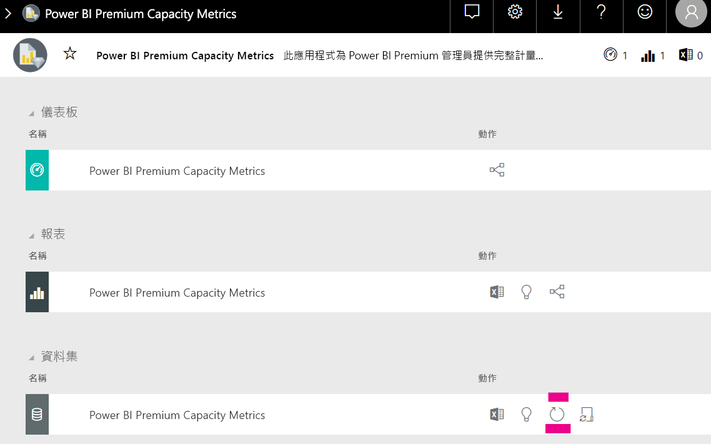

# Power BI 內嵌式分析中的容量規劃

計算 Power BI 內嵌式分析部署所需的容量類型可能會很複雜。 這是因為此計算是以多個參數為基礎，其中有些很難預測。

在規劃您的容量時，需要考慮的一些事項包括：

* 您所使用的資料模型
* 必要查詢的數目與複雜度
* 應用程式使用量的每小時分佈
* 資料重新整理頻率
* 難以預測的其他使用模式。

此文章的目的是為了讓 Power BI 內嵌式分析的容量規劃更輕鬆，方法是透過引進 [Power BI 專用容量負載評估工具](https://github.com/microsoft/PowerBI-Tools-For-Capacities/tree/master/LoadTestingPowerShellTool/) \(英文\)，該工具是針對 Power BI 內嵌式分析容量 (*A*、*EM* 或 *P* SKU) 的負載測試自動化而建立。

## 規劃工具

 [Power BI 專用容量負載評估工具](https://github.com/microsoft/PowerBI-Tools-For-Capacities/tree/master/LoadTestingPowerShellTool/) \(英文\) 可以協助您了解容量可以處理多少使用者負載。 其會使用 PowerShell 針對您的容量建立自動化的負載測試，並讓您選擇要測試的報表，以及要模擬的並行使用者人數。

此工具會透過持續以新的篩選值來轉譯每份報表 (以防止因為報表快取而誤以為效能良好) 產生容量的負載，直到針對服務驗證工具所需的權杖過期為止。

### 使用規劃工具

執行此工具時，請留意您容量的現有負載，並確定不會在使用率最高的時間內執行負載測試。

以下是您可以如何使用規劃工具的一些範例。

* 容量管理員可以進一步了解其容量在指定時間範圍內可處理的使用者人數。
* 報表作者可以了解使用 Power BI Desktop 的[效能分析器](https://docs.microsoft.com/power-bi/desktop-performance-analyzer)來測量的使用者負載效果。
* 您可以在瀏覽器上看到即時轉譯的情況。
* 使用 SQL Server Profiler，您可以[連線至測量之容量的 XMLA 端點](https://powerbi.microsoft.com/blog/power-bi-open-platform-connectivity-with-xmla-endpoints-public-preview/) \(英文\)，以查看正在執行的查詢。
* 負載測試效果會顯示在 Premium 容量計量應用程式的 [資料集] 頁面中。 容量管理員可以使用此工具來產生負載，並查看該負載的顯示方式。

### 檢閱測試結果

若要在測試執行後查看計量應用程式中負載測試的效果，請遵循下列指示。 在測試開始產生負載的時間內，最多預期會有 15 分鐘的延遲，直到計量中顯示負載為止。

1. 展開[計量應用程式](../../service-admin-premium-monitor-capacity.md)登陸頁面的 [資料集]  索引標籤。
2. 透過按一下 [立即重新整理]  ，以起始隨選重新整理。 管理員應該這麼做。

    

## Power BI 容量工具 GitHub 存放庫

建立的 [Power BI 容量工具 GitHub 存放庫](https://github.com/microsoft/PowerBI-Tools-For-Capacities) \(英文\) 是用來裝載容量規劃工具和其他未來的工具與公用程式。

此存放庫是開放原始碼，而且鼓勵使用者參與、新增與 Power BI Premium 和 Embedded 容量相關的其他工具，並改善現有的工具。

## 後續步驟

> [!div class="nextstepaction"]
>[Power BI 內嵌式分析中的容量和 SKU](embedded-capacity.md)

> [!div class="nextstepaction"]
>[Power BI Embedded 的效能最佳做法](embedded-performance-best-practices.md)