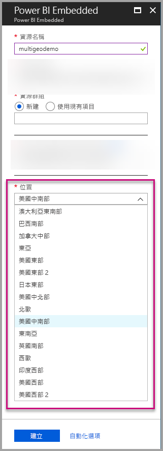
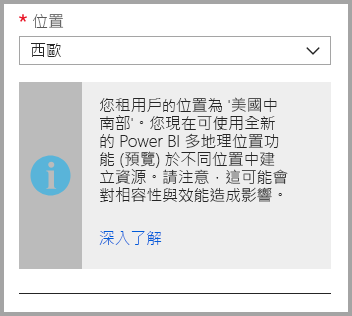
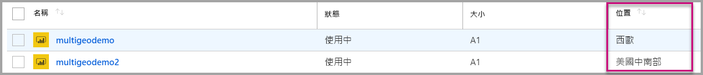
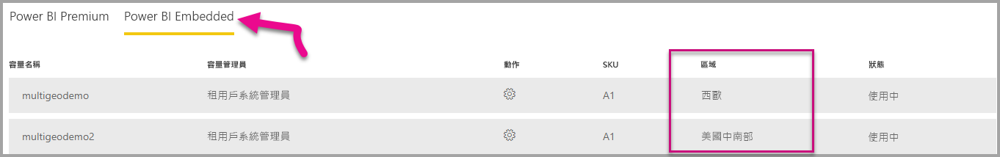

# Power BI Embedded 的多地理位置支援

針對使用 Power BI Embedded 建置應用程式，並將分析功能內嵌到其應用程式的 ISV 與組織，**Power BI Embedded 的多地理位置支援**意謂著他們現在可以在全球的不同區域部署其資料。

現在使用 **Power BI Embedded** 的客戶可以使用**多地理位置**選項設定 **A 容量** (以 [Power BI Premium 使用多地理位置來支援的相同功能與限制](../../service-admin-premium-Multi-Geo.md)為基礎)。

## 使用多地理位置建立新的 Power BI Embedded 容量資源

在 [建立資源]  畫面上，您必須選擇您容量的位置。 到目前為止，它只限制於您 Power BI 租用戶的位置，因此只有單一位置可用。 使用多地理位置時，您可以選擇不同的區域來部署您的容量。

請注意，當開啟位置下拉式功能表時。您的主租用戶是預設選取項目。
  

選擇不同的位置時，會顯示訊息提示您確定您了解該選取項目的意義。

## 檢視容量位置

當在 Azure 入口網站中移至主 Power BI Embedded 管理頁面時，您可以看到您的容量位置。

您也可以在 Powerbi.com 的系統管理入口網站中找到。 在系統管理入口網站中，選擇 [容量設定]，然後切換到 [Power BI Embedded] 索引標籤。

[深入了解如何使用 Power BI Embedded 建立容量](azure-pbie-create-capacity.md)。

## 管理現有的容量位置

建立新容量之後，即無法變更 Power BI Embedded 資源位置。

若要將您的 Power BI 內容移到不同的區域，請依照下列步驟執行：

1. 在不同的區域中[建立新容量](azure-pbie-create-capacity.md)。

2. 將所有工作區從現有容量指派到新容量。

3. 刪除或暫停舊容量。

請注意，若決定刪除容量而不重新指派其內容，則該容量中的所有內容都會移到共用容量，亦即主區段。

## 多地理位置的 API 支援

為支援搭配多地理位置透過 API 來管理容量，我們對現有 API 進行了一些變更：

1. **[取得容量](https://docs.microsoft.com/rest/api/power-bi/capacities/getcapacities)** - API 會傳回使用者可存取的容量清單。 回應現在包含名為 'region' 的額外屬性，此屬性指定容量的位置。

2. **[指派到容量](https://docs.microsoft.com/rest/api/power-bi/capacities)** - API　允許將給定的工作區指派到容量。 此作業不允許您將工作區指派給您主區域以外的容量或在不同的區域之間移動工作區。 若要執行此作業，使用者或[服務主體](embed-service-principal.md)仍需要工作區的系統管理權限，以及目標容量上的系統管理或指派權限。

3. **[Azure Resource Manager API](https://docs.microsoft.com/rest/api/power-bi-embedded/capacities)** - 所有 Azure Resource Manager API 作業 (包括「建立」  與「刪除」  ) 都支援多地理位置。

## 限制與考量

* 初始資料轉送之前，請確認在區域之間開始進行的任何移動都會遵循所有公司與政府的合規性需求。

* 儲存於遠端區域中的快取查詢會在該區域中保持待用狀態。 不過，傳輸過程中的其他資料可能會往返於不同的地理位置之間。

* 在多地理位置的環境中，將資料從某個區域移至另一個區域時，來源資料可能會在資料移動來源區域中保留最多 30 天。 在該期間內，使用者無法存取該資料。 系統會在 30 天的期間內，將資料從這個區域中移除並加以銷毀。

* 多地理位置通常不會產生較佳的效能。 載入報表與儀表板等動作，仍然會向主區域要求中繼資料。

## 後續步驟

參考下面的連結以深入了解 Power BI Embedded 容量與所有容量的多地理位置選項。

* [什麼是 Power BI Embedded？](azure-pbie-what-is-power-bi-embedded.md)

* [建立 Power BI Embedded 容量](azure-pbie-create-capacity.md)

* [Power BI Premium 容量中的多地理位置](../../service-admin-premium-multi-geo.md)

有其他問題嗎？ [嘗試在 Power BI 社群提問](https://community.powerbi.com/)