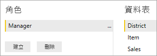
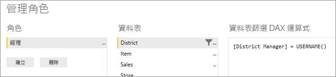
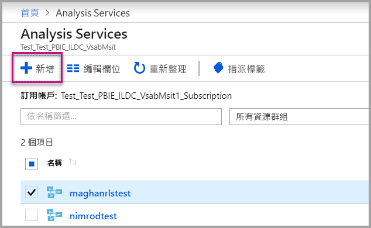
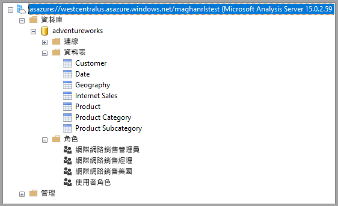
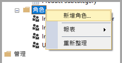
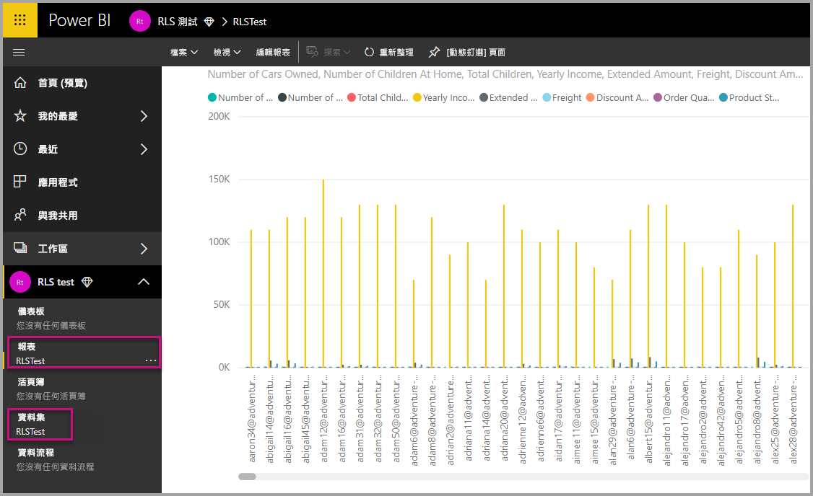
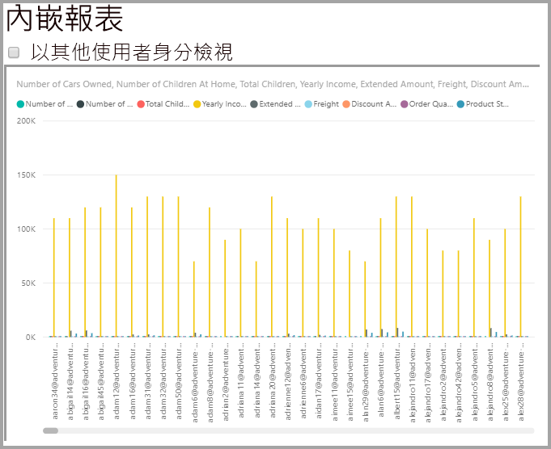
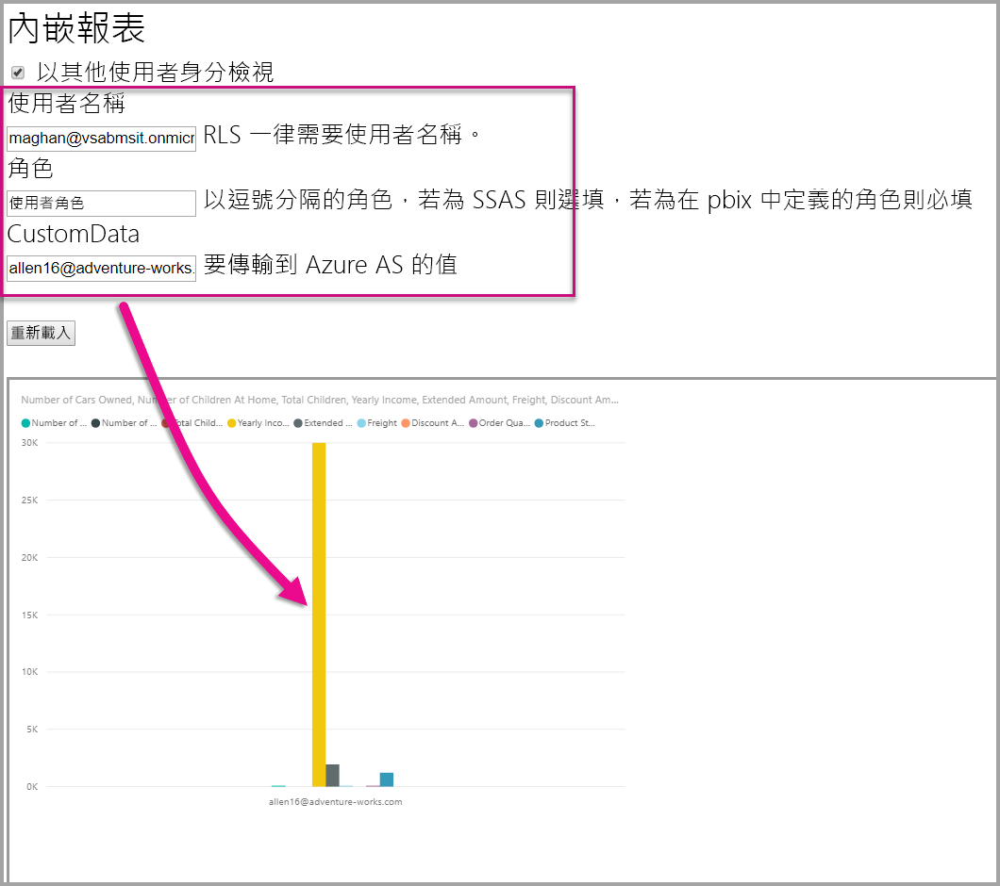
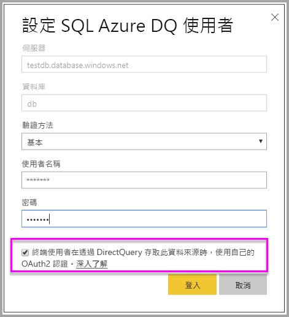
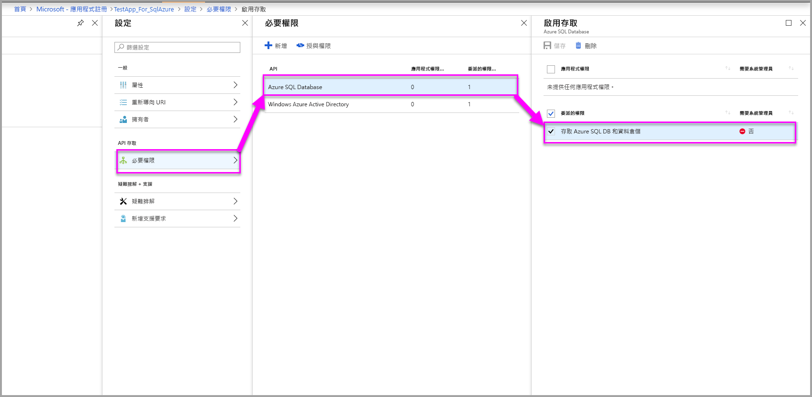

# <a name="row-level-security-with-power-bi-embedded"></a>搭配 Power BI Embedded 的資料列層級安全性

**資料列層級安全性 (RLS)** 可用來限制使用者存取儀表板、磚、報表和資料集內的資料。 不同的使用者可在看見不同的資料時使用這些相同的成品。 內嵌支援 RLS。

如果您要為非 Power BI 使用者內嵌 (應用程式擁有資料)，這通常是 ISV 案例，則本文很適合您！ 為使用者和角色設定帳戶的內嵌權杖。

如果您要內嵌至組織內的 Power BI 使用者 (使用者擁有資料)，RLS 的運作方式會像是直接在 Power BI 服務中運作一樣。 您不需要在應用程式中執行其他動作。 如需詳細資訊，請參閱 [Power BI 的資料列層級安全性 (RLS)](../../service-admin-rls.md)。


若要利用 RLS，請務必了解三個主要概念：使用者、角色和規則。 讓我們仔細探討這些概念：

**使用者**– 檢視成品 (儀表板、圖格、報表或資料集) 的終端使用者。 在 Power BI Embedded 中，使用者是由內嵌權杖中的使用者名稱屬性所識別。

**角色** – 使用者會有隸屬的角色。 角色是規則的容器，可以命名為「銷售經理」  或「銷售代表」  等。您會在 Power BI Desktop 中建立角色。 如需詳細資訊，請參閱 [Power BI Desktop 的資料列層級安全性 (RLS)](../../desktop-rls.md)。

**規則** – 角色擁有規則，而這些規則是將套用至資料的實際篩選。 規則可以是簡單的「國家/地區 = 美國」，或更動態的項目。
本文的其他部分有提供範例，示範如何在撰寫 RLS 後再於內嵌應用程式中加以取用。 我們的範例使用[零售分析範例](https://go.microsoft.com/fwlink/?LinkID=780547) PBIX 檔案。


## <a name="adding-roles-with-power-bi-desktop"></a>使用 Power BI Desktop 新增角色

我們的**零售分析範例**顯示所有零售連鎖商店的銷售額。 若沒有 RLS，不論是哪位區域經理登入並檢視報表，都會看到相同的資料。 高階管理階層決定每位區域經理只能看到其所管理商店的銷售額。 使用 RLS 讓高階管理階層能夠根據區域經理限制資料。

RLS 是在 Power BI Desktop 中撰寫。 我們可以在資料集和報表處於開啟狀態時，切換至圖表檢視來查看下列結構描述：


以下是此結構描述需要注意的一些事項：

* 所有量值 (例如 [總銷售額]  ) 會儲存在 [銷售]  事實資料表中。
* 有四個額外的相關維度資料表：[項目]  、[時間]  、[商店]  和 [區域]  。
* 關聯線上的箭頭表示篩選可以從一個資料表流向另一個資料表的方向。 例如，如果在 [時間[日期]]  上套用篩選，在目前的結構描述中，它只會進一步篩選 [銷售]  資料表中的值。 由於關聯線上的所有箭頭都指向而不是背離 [銷售] 資料表，因此其他資料表不會受此篩選的影響。
* [區域]  資料指出每個區域的經理：
  
    ![[區域] 資料表中的資料列](media/embedded-row-level-security/powerbi-embedded-district-table.png)

根據此結構描述，若我們將篩選套用至 [區域]  資料表中的 [區域經理]  資料行，且該篩選符合檢視報表的使用者時，就會進一步篩選 [商店]  和 [銷售]  資料表，進而顯示該區域經理的資料。

其做法如下：

1. 在 [模型]  索引標籤上，選取 [管理角色]  。

    ![Power BI Desktop 中的 [模型] 索引標籤](media/embedded-row-level-security/powerbi-embedded-manage-roles.png)
2. 建立稱為**經理**的新角色。

    
3. 在 [區域]  資料表中，輸入此 DAX 運算式： **[區域經理] = USERNAME()** 。

    
4. 若要確認規則正常運作，請在 [模型]  索引標籤上選取 [以角色身分檢視]  ，然後選取您建立的 [經理]  角色，以及 [其他使用者]  。 輸入 **AndrewMa** 作為使用者。

    ![[以角色身分檢視] 對話方塊](media/embedded-row-level-security/powerbi-embedded-new-role-view.png)

    報表會顯示您以 **AndrewMa** 登入的資料。

套用篩選，我們在此套用的篩選會進一步篩選 [區域]  、[商店]  和 [銷售]  資料表中的所有記錄。 不過，由於 [銷售]  和 [時間]  、[銷售]  和 [項目]  以及 [項目]  和 [時間]  之間關聯性的篩選方向，因此資料表不會進一步篩選。 若要深入了解雙向交叉篩選，請下載 [Bidirectional cross-filtering in SQL Server Analysis Services 2016 and Power BI Desktop](https://download.microsoft.com/download/2/7/8/2782DF95-3E0D-40CD-BFC8-749A2882E109/Bidirectional%20cross-filtering%20in%20Analysis%20Services%202016%20and%20Power%20BI.docx) (SQL Server Analysis Services 2016 和 Power BI Desktop 中的雙向交叉篩選) 技術白皮書。

## <a name="applying-user-and-role-to-an-embed-token"></a>將使用者和角色套用至內嵌權杖

您現在已經設定好 Power BI Desktop 角色，現在要對應用程式執行一些工作才能利用這些角色。

使用者會由您的應用程式驗證和授權，而內嵌權杖可用來授與該使用者存取特定 Power BI Embedded 報表。 Power BI Embedded 沒有關於您使用者身分識別的任何特定資訊。 您必須傳遞一些額外的內容作為身分識別形式內嵌權杖的一部分，RLS 才能運作。 您可以使用 [Embed Token](https://docs.microsoft.com/rest/api/power-bi/embedtoken) (內嵌權杖) API 傳遞身分識別。

API 接受表示相關資料集的身分識別清單。 您必須傳遞下列項目作為身分識別的一部分，RLS 才能運作。

* **username (必要項)** - 為套用 RLS 規則時可用來協助識別使用者的字串。 只能列出單一使用者。 您可以使用 *ASCII* 字元建立使用者名稱。
* **角色 (必要項)** – 含有套用資料列層級安全性規則時要選取之角色的字串。 如果傳遞多個角色，則應該以字串陣列形式來傳遞。
* **dataset (必要項)** - 適用於您所要內嵌成品的資料集。

您可以在 **PowerBIClient.Reports** 上使用 **GenerateTokenInGroup** 方法來建立內嵌權杖。

例如，您可以變更 [PowerBIEmbedded_AppOwnsData](https://github.com/Microsoft/PowerBI-Developer-Samples/tree/master/App%20Owns%20Data) 範例。 *Services\EmbedService.cs* 第 76 和 77 行無法從：

```csharp
// Generate Embed Token.
var generateTokenRequestParameters = new GenerateTokenRequest(accessLevel: "view");

var tokenResponse = await client.Reports.GenerateTokenInGroupAsync(GroupId, report.Id, generateTokenRequestParameters);
```

to

```csharp
var generateTokenRequestParameters = new GenerateTokenRequest("View", null, identities: new List<EffectiveIdentity> { new EffectiveIdentity(username: "username", roles: new List<string> { "roleA", "roleB" }, datasets: new List<string> { "datasetId" }) });

var tokenResponse = await client.Reports.GenerateTokenInGroupAsync("groupId", "reportId", generateTokenRequestParameters);
```

如果您要呼叫 REST API，可使用已更新 API 現在接受的額外 JSON 陣列，名稱為 **identities**，其中包含使用者名稱、字串角色清單和字串資料集清單。 

使用以下程式碼作為範例：

```json
{
    "accessLevel": "View",
    "identities": [
        {
            "username": "EffectiveIdentity",
            "roles": [ "Role1", "Role2" ],
            "datasets": [ "fe0a1aeb-f6a4-4b27-a2d3-b5df3bb28bdc" ]
        }
    ]
}
```

現在，結合所有的項目後，當有人登入應用程式檢視此成品時，他們只能看到依照資料列層級安全性定義所允許檢視的資料。

## <a name="working-with-analysis-services-live-connections"></a>使用 Analysis Services 即時連線

內部部署伺服器可以搭配 Analysis Services 即時連線使用資料列層級安全性。 使用這種類型的連線時，您應該了解幾個特定概念。

針對使用者名稱屬性提供的有效身分識別，必須為具備 Analysis Services 伺服器權限的 Windows 使用者。

>[!NOTE]
> 搭配 [Azure Analysis Services](https://docs.microsoft.com/azure/analysis-services/analysis-services-overview) 資料來源使用服務主體時，服務主體本身必須具有 Azure Analysis Services 執行個體權限。 基於此目的使用包含服務主體的安全性群組將無法正常運作。

### <a name="on-premises-data-gateway-configuration"></a>內部部署資料閘道設定

使用 Analysis Services 即時連線時，會用到[內部部署資料閘道](../../service-gateway-onprem.md)。 使用所列的身分識別產生內嵌權杖時，主帳戶必須列為閘道的系統管理員。 如果未列出主帳戶，就不會將資料列層級安全性套用至資料屬性。 非閘道的系統管理員可以提供角色，但必須指定自己的使用者名稱以作為有效的身分識別。

### <a name="use-of-roles"></a>使用角色

您可以使用內嵌權杖中的身分識別來提供角色。 如果未提供任何角色，則會使用所提供的使用者名稱來解析相關聯的角色。

### <a name="using-the-customdata-feature"></a>使用 CustomData 功能

CustomData 功能僅適用於位於 **Azure Analysis Services** 中的模型，而且僅適用於 **Connect live** (即時連線) 模式。 不同於使用者和角色，您無法在 .pbix 檔案中設定自訂資料功能。 使用自訂資料功能產生權杖時，您必須具有使用者名稱。

將 **Azure Analysis Services** 作為資料來源使用，並檢視應用程式中的 Power BI 資料時，CustomData 功能可讓您新增資料列篩選 (檢視應用程式中連線至 Azure Analysis Services 的 Power BI 資料)。

CustomData 功能讓您可使用 CustomData 連接字串屬性傳遞任意文字 (字串)。 Analysis Services 會透過 *CUSTOMDATA()* 函式使用此值。

使用 *CUSTOMDATA()* 函式是取得 **Azure Analysis Services** 中動態 RLS (使用篩選評估的動態值) 的唯一方式。

您可以在角色 DAX 查詢中使用，也可以在量值 DAX 查詢中不搭配任何角色使用。
CustomData 功能是下列成品之權杖產生功能的一部分：儀表板、報表和磚。 儀表板可以有多個 CustomData 身分識別 (每個磚/模型一個)。

#### <a name="customdata-sdk-additions"></a>CustomData SDK 新增項目

已將 CustomData 字串屬性新增至產生權杖案例中的有效身分識別。

```json
[JsonProperty(PropertyName = "customData")]
public string CustomData { get; set; }
```

您可以使用下列呼叫，透過自訂資料來建立身分識別：

```csharp
public EffectiveIdentity(string username, IList<string> datasets, IList<string> roles = null, string customData = null);
```

#### <a name="customdata-sdk-usage"></a>CustomData SDK 使用方式

若您呼叫 REST API，您可在各個身分識別中新增自訂資料，例如：

```json
{
    "accessLevel": "View",
    "identities": [
        {
            "username": "EffectiveIdentity",
            "roles": [ "Role1", "Role2" ],
            "customData": "MyCustomData",
            "datasets": [ "fe0a1aeb-f6a4-4b27-a2d3-b5df3bb28bdc" ]
        }
    ]
}
```

這裡為使用 Power BI Embedded 應用程式開始設定 CustomData() 功能的步驟。

1. 建立您的 Azure Analysis Services 資料庫。 接著透過 [SQL Server Management Studio](https://docs.microsoft.com/sql/ssms/download-sql-server-management-studio-ssms?view=sql-server-2017) 登入 Azure Analysis Services 伺服器。

    

    

2. 在 Analysis Services 伺服器中建立角色。

    

3. 進行 [一般]  設定。  在這裡提供**角色名稱**然後將資料庫權限設定為僅限 [讀取]  。

    ![建立角色 - 進行 [一般] 設定](media/embedded-row-level-security/azure-analysis-services-database-create-role-general-settings.png)

4. 進行 [成員資格]  設定。 在這裡新增受此角色影響的使用者。

    ![建立角色 - 進行 [成員資格] 設定](media/embedded-row-level-security/azure-analysis-services-database-create-role-membership.png)

5. 使用 *CUSTOMDATA()* 函式設定 [資料列篩選]  DAX 查詢。

    ![建立角色 - 設定 [資料列篩選]](media/embedded-row-level-security/azure-analysis-services-database-create-role-row-filters.png)

6. 建置 PBI 報表並將其發佈至具專用容量的工作區。

    

7. 利用 Power BI API 在您的應用程式中使用 CustomData 功能。  使用自訂資料功能產生權杖時，您必須具有使用者名稱。 使用者名稱必須與主要使用者的 UPN 相等。 主要使用者必須為您所建立角色的成員。 若未指定任何角色，則會將主要使用者為成員的所有角色用於 RLS 評估。

    使用[服務主體](embed-service-principal.md)時，您也需要執行上述步驟來代替使用主要帳戶。 產生內嵌權杖時，將[服務主體物件識別碼](embed-service-principal.md#how-to-get-the-service-principal-object-id)用作使用者名稱。

    > [!Note]
    > 當您準備將應用程式部署至生產環境時，終端使用者不應看到主要使用者帳戶欄位或選項。

    檢視用於新增 CustomData 功能的[程式碼](#customdata-sdk-additions)。

8. 您現在可先在應用程式內檢視報表，再套用自訂資料值來查看您報表包含的所有資料。

    

    接著套用自訂資料值，來查看報表如何顯示一組不同的資料。
    

## <a name="using-rls-vs-javascript-filters"></a>使用 RLS 與JavaScript 篩選

決定篩選報表中的資料時，可使用**資料列層級安全性 (RLS)** 或 **JavaScript 篩選**。

[資料列層級安全性](../../service-admin-rls.md)是篩選位於資料模型層級之資料的功能。 您的後端資料來源會控制 RLS 的設定。 依據您的資料模型，產生內嵌權杖會為工作階段設定使用者名稱和角色。 用戶端程式碼無法將其覆寫、移除或控制，這也是人們認為 RLS 安全的原因。 我們建議使用 RLS 來安全地篩選資料。 您可以利用下列其中一種方式來使用 RLS 篩選資料。

* [設定 Power BI 報表中的角色](../../desktop-rls.md)。
* 設定資料來源層級的角色 (僅限 Analysis Services 即時連線)。
* 以程式設定的方式搭配 [Embed Token](https://docs.microsoft.com/rest/api/power-bi/embedtoken/datasets_generatetokeningroup) (內嵌權杖) 使用 `EffectiveIdentity`。 使用內嵌權杖時，實際的篩選會透過特定工作階段的內嵌權杖傳遞。

[JavaScript 篩選](https://github.com/Microsoft/PowerBI-JavaScript/wiki/Filters#page-level-and-visual-level-filters) 可用來讓使用者取用資料的已縮減、已限定範圍或已篩選檢視。 然而，使用者仍擁有模型結構描述資料表、資料行和計量的存取權，且可能可以存取該處的任何資料。 不可透過用戶端篩選 API 限制資料的存取權，僅能使用 RLS 執行此動作。

## <a name="token-based-identity-with-azure-sql-database"></a>Azure SQL Database 的權杖型身分識別

**權杖型身分識別**允許您使用 **Azure SQL Database** 的 **Azure Active Directory (AAD)** 存取權杖為內嵌權杖指定有效的身分識別。

在 **Azure SQL Database** 中保存其資料的客戶現在可以享受新功能，以便在與 **Power BI Embedded** 整合時管理使用者及其對 Azure SQL 中資料的存取。

當您產生內嵌權杖時，可以在 Azure SQL 中指定使用者有效的身分識別。 您可以透過將 AAD 存取權杖傳遞至伺服器來指定使用者有效的身分識別。 存取權杖用於從 Azure SQL 中僅針對該特定工作階段提取該使用者的相關資料。

其可以用來管理 Azure SQL 中每個使用者的檢視，或作為多租用戶資料庫中的特定客戶來登入 Azure SQL。 它也可以在 Azure SQL 中對該工作階段套用資料列層級安全性，並僅擷取該工作階段的相關資料，而不需要管理 Power BI 中的 RLS。

此類有效身分識別問題直接適用於 Azure SQL Server 上的 RLS 規則。 當從 Azure SQL Server 查詢資料時，Power BI Embedded 會使用所提供的存取權杖。 由於 USER_NAME() SQL 函數，可以存取使用者的 UPN (為其提供存取權杖)。

權杖型身分識別僅適用於專用容量上的 DirectQuery 模型 - 連線到 Azure SQL Database，該資料庫設定為允許 AAD 驗證 ([深入了解 Azure SQL Database 的 AAD 驗證](https://docs.microsoft.com/azure/sql-database/sql-database-manage-logins))。 必須將資料集其資料來源設定為使用使用者的 OAuth2 認證，才能使用權杖型身分識別。

   

### <a name="token-based-identity-sdk-additions"></a>權杖型身分識別 SDK 新增項目

權杖產生案例中的有效身分識別中已新增身分識別 Blob 屬性。

```JSON
[JsonProperty(PropertyName = "identityBlob")]
public IdentityBlob IdentityBlob { get; set; }
```

IdentityBlob 類型是一個包含值字串屬性的簡單 JSON 結構

```JSON
[JsonProperty(PropertyName = "value")]
public string value { get; set; }
```

您可以使用下列呼叫，透過身分識別 Blob 來建立 EffectiveIdentity：

```C#
public EffectiveIdentity(string username, IList<string> datasets, IList<string> roles = null, string customData = null, IdentityBlob identityBlob = null);
```

可以使用下列呼叫建立身分識別 Blob。

```C#
public IdentityBlob(string value);
```

### <a name="token-based-identity-rest-api-usage"></a>權杖型身分識別 REST API 使用方式

若您呼叫 [REST API](/rest/api/power-bi/embedtoken/reports_generatetokeningroup#definitions)，您可在各個身分識別中新增身分識別 Blob。

```JSON
{
    "accessLevel": "View",
    "identities": [
        {
            "datasets": ["fe0a1aeb-f6a4-4b27-a2d3-b5df3bb28bdc"],
        "identityBlob": {
            "value": "eyJ0eXAiOiJKV1QiLCJh…."
         }
        }
    ]
}
```

身分識別 Blob 中提供的值應該是 Azure SQL Server 的有效存取權杖 (資源 URL 為 (<https://database.windows.net/>)。

   > [!Note]
   > 若要能夠為 Azure SQL 建立存取權杖，應用程式必須具備**存取 Azure SQL DB 和資料倉儲**委派權限到 Azure 入口網站中 AAD 應用程式註冊設定上的 **Azure SQL Database** API。

   

## <a name="on-premises-data-gateway-with-service-principal"></a>搭配服務主體的內部部署資料閘道

使用 SQL Server Analysis Services (SSAS) 內部部署即時連線資料來源來設定資料列層級安全性 (RLS) 的客戶，可以享有新的[服務主體](embed-service-principal.md)功能，以在與 **Power BI Embedded** 整合時，管理使用者和其對 SSAS 中資料的存取。

使用 [Power BI REST API](https://docs.microsoft.com/rest/api/power-bi/)，可讓您使用[服務主體物件](https://docs.microsoft.com/azure/active-directory/develop/app-objects-and-service-principals#service-principal-object)，為內嵌權杖的 SSAS 內部部署即時連線指定有效的身分識別。

直到目前為止，若要能夠為 SSAS 內部部署即時連線指定有效的身分識別，產生內嵌權杖的主使用者必須是閘道管理員。現在，不需要使用者是閘道管理員，閘道管理員即可將該資料來源的專用權限授與使用者，讓使用者可在產生內嵌權杖時，覆寫有效的身分識別。 這項新功能可讓您使用服務主體，為即時 SSAS 連線進行內嵌。

若要啟用此案例，閘道管理員可以使用[新增資料來源使用者 REST API](https://docs.microsoft.com/rest/api/power-bi/gateways/adddatasourceuser)，將 Power BI Embedded 的 *ReadOverrideEffectiveIdentity* 權限授與服務主體。

您無法使用系統管理入口網站設定此權限。 此權限只能使用 API 來設定。 在系統管理入口網站中，會指出具有這類權限的使用者和 SPN。

## <a name="considerations-and-limitations"></a>考量與限制

* 使用內嵌權杖時，在 Power BI 服務中將使用者指派給角色並不影響 RLS。
* 雖然 Power BI 服務不會將 RLS 設定套用至系統管理員或具有編輯權限的成員，但當您使用內嵌權杖提供身分識別時，則會將它套用至資料。
* 內部部署伺服器支援 Analysis Services 即時連線。
* Azure Analysis Services 即時連線支援依角色篩選。 可以使用 CustomData 進行動態篩選。
* 如果基礎資料集不需要 RLS，則 GenerateToken 要求「不得」  包含有效的身分識別。
* 如果基礎資料集是雲端模型 (快取模型或 DirectQuery)，有效的身分識別必須包含至少一個角色，否則不會發生角色指派。
* 身分識別清單可讓多個身分識別權杖用於儀表板內嵌。 對於所有其他成品，此清單包含單一身分識別。

### <a name="token-based-identity-limitations"></a>權杖型身分識別限制

* 僅當擁有專用容量時，您才能使用 RLS。
* RLS 不適用於內部部署 SQL Server。

有其他問題嗎？ [嘗試在 Power BI 社群提問](https://community.powerbi.com/)
