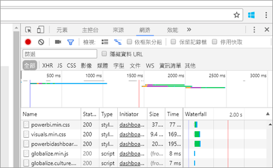
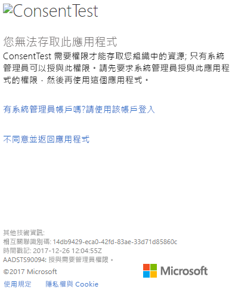
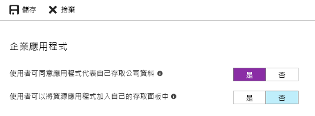

# <a name="troubleshoot-your-embedded-application"></a>為您的內嵌應用程式進行疑難排解

此文章討論您在內嵌來自 Power BI 的內容時，可能會遇到的一些常見問題。

## <a name="tools-to-troubleshoot"></a>疑難排解工具

### <a name="fiddler-trace"></a>Fiddler 追蹤

[Fiddler](https://www.telerik.com/fiddler) 是 Telerik 所提供的免費工具，可監視 HTTP 流量。  您可以從用戶端電腦使用 Power BI API 來查看流量。 此工具可能會顯示錯誤與其他相關資訊。


### <a name="f12-in-browser-for-front-end-debugging"></a>在瀏覽器中按 F12 以進行前端偵錯

按 F12 會在您的瀏覽器中啟動開發人員視窗。 此工具提供了查看網路流量與其他資訊的功能。



### <a name="extract-error-details-from-power-bi-response"></a>從 Power BI 回應擷取錯誤詳細資料

此程式碼片段示範如何從 HTTP 例外狀況擷取錯誤詳細資料：

```csharp
public static string GetExceptionText(this HttpOperationException exc)
{
    var errorText = string.Format("Request: {0}\r\nStatus: {1} ({2})\r\nResponse: {3}",
    exc.Request.Content, exc.Response.StatusCode, (int)exc.Response.StatusCode, exc.Response.Content);
    if (exc.Response.Headers.ContainsKey("RequestId"))
    {
        var requestId = exc.Response.Headers["RequestId"].FirstOrDefault();
        errorText += string.Format("\r\nRequestId: {0}", requestId);
    }

    return errorText;
}
```

我們建議您記錄要求識別碼 (與錯誤詳細資料以作為疑難排解之用)。
聯繫 Microsoft 支援服務時，請提供要求識別碼。

## <a name="app-registration"></a>應用程式註冊

### <a name="app-registration-failure"></a>應用程式註冊失敗

Azure 入口網站內的錯誤訊息或 Power BI 應用程式註冊頁面提到權限不足。 若要註冊應用程式，您必須是 Azure AD 租用戶的系統管理員，或必須允許非系統管理員的使用者進行應用程式註冊。

### <a name="power-bi-service-doesnt-appear-in-the-azure-portal-when-registering-a-new-app"></a>註冊新應用程式時，Power BI 服務未在 Azure 入口網站中顯示

至少須有一個使用者註冊 Power BI。 如果 API 清單中未列出 [Power BI 服務]  ，代表尚無使用者註冊 Power BI。

## <a name="rest-api"></a>REST API

### <a name="api-call-returning-401"></a>API 呼叫傳回 401

Fiddler 擷取可能需要進一步調查。 可能缺少必要的權限範圍，而無法在 Azure AD 中註冊應用程式。 請在 Azure 入口網站中，驗證 Azure AD 應用程式註冊的必要範圍存在。

### <a name="api-call-returning-403"></a>API 呼叫傳回 403

Fiddler 擷取可能需要進一步調查。 403 錯誤的原因可能有很多種。

* 使用者已超過共用容量上可產生的內嵌權杖數量。 購買 Azure 容量來產生內嵌權杖，並將工作區指派給該容量。 請參閱[在 Azure 入口網站中建立 Power BI Embedded 容量](https://docs.microsoft.com/azure/power-bi-embedded/create-capacity)。
* Azure AD 驗證權杖過期。
* 驗證的使用者不是群組 (工作區) 成員。
* 驗證的使用者不是群組 (工作區) 系統管理員。
* 已驗證的使用者不具有權限。 可以使用 [refreshUserPermissions API](https://docs.microsoft.com/rest/api/power-bi/users/refreshuserpermissions) 來更新權限
* 授權標頭可能未正確列出。 請確認沒有錯字。

應用程式的後端必須先重新整理權杖，再呼叫 GenerateToken。

    ```
    GET https://wabi-us-north-central-redirect.analysis.windows.net/metadata/cluster HTTP/1.1
    Host: wabi-us-north-central-redirect.analysis.windows.net
    ...
    Authorization: Bearer eyJ0eXAiOi...
    ...

    HTTP/1.1 403 Forbidden
    ...

    {"error":{"code":"TokenExpired","message":"Access token has expired, resubmit with a new access token"}}
    ```

## <a name="authentication"></a>驗證

### <a name="authentication-failed-with-aadsts90002-tenant-authorize-not-found"></a>驗證因 AADSTS90002 而失敗：找不到租用戶的 'authorize'

 如果您在登入時收到如下訊息：***error: invalid_request, error_description:AADSTS90002：找不到租用戶的 'authorize'***，這是因為 ADAL 4.x 不支援 "https://login.microsoftonline.com/{Tenant}/oauth2/authorize/" 作為授權單位 URL。
 
若要解決此問題，您應該從授權單位 URL 的結尾修剪 "oauth2/authorize/"；如需參考，請參閱 [Power BI 開發人員範例](https://github.com/Microsoft/PowerBI-Developer-Samples)。

 請從 ADAL 4.x 版本資訊中查閱 [Better Authority validation](https://github.com/AzureAD/azure-activedirectory-library-for-dotnet/wiki/Changes-adalnet-4.0#better-authority-validation) (更好的授權單位驗證)。

### <a name="authentication-failed-with-aadsts70002-or-aadsts50053"></a>驗證因 AADSTS70002 或 AADSTS50053 而失敗

**_(AADSTS70002：驗證認證時發生錯誤。AADSTS50053：使用不正確的使用者識別碼或密碼，嘗試登入太多次)_**

如果您使用 Power BI Embedded 與 Azure AD 直接驗證，且在登入時收到如下訊息 ***error:unauthorized_client, error_description:AADSTS70002：驗證認證時發生錯誤。AADSTS50053：您嘗試使用不正確的使用者識別碼或密碼登入太多次***，這是因為從 2018 年 6 月 14 日起直接驗證已預設為停用。

您可使用以組織或[服務主體](https://docs.microsoft.com/azure/active-directory/develop/active-directory-application-objects#service-principal-object)為範圍的 [Azure AD 原則](https://docs.microsoft.com/azure/active-directory/manage-apps/configure-authentication-for-federated-users-portal#enable-direct-authentication-for-legacy-applications)，重新加以開啟。

建議您只依據個別應用程式啟用此原則。

若要建立此原則，您需要是要在其中建立並指派原則目錄的**全域管理員**。 下列範例指令碼示範如何建立原則，並將它指派給此應用程式的 SP：

1. 安裝 [Azure AD Preview PowerShell 模組](https://docs.microsoft.com/powershell/azure/active-directory/install-adv2?view=azureadps-2.0)。

2. 逐行執行下列 PowerShell 命令 (以確認變數 $sp 最後不會有一個以上的應用程式)。

```powershell
Connect-AzureAD
```

```powershell
$sp = Get-AzureADServicePrincipal -SearchString "Name_Of_Application"
```

```powershell
$policy = New-AzureADPolicy -Definition @("{`"HomeRealmDiscoveryPolicy`":{`"AllowCloudPasswordValidation`":true}}") -DisplayName EnableDirectAuth -Type HomeRealmDiscoveryPolicy -IsOrganizationDefault $false
```

```powershell
Add-AzureADServicePrincipalPolicy -Id $sp.ObjectId -RefObjectId $policy.Id 
```

指派原則之後，請先等候約 15 到 20 秒進行傳播，再測試。

### <a name="generate-token-fails-when-providing-effective-identity"></a>提供有效的身分識別時無法產生權杖

若提供了有效的身分識別，GenerateToken 可能因為數種原因而失敗。

* 資料集不支援有效的身分識別
* 未提供 Username
* 未提供 Role
* 未提供 DatasetId
* 使用者沒有正確的權限

若要驗證是哪一個原因，請嘗試下列步驟。

* 執行 [get dataset](https://docs.microsoft.com/rest/api/power-bi/datasets)。 屬性 IsEffectiveIdentityRequired 是否為 true？
* 任何 EffectiveIdentity 都必須有 Username。
* 若 IsEffectiveIdentityRolesRequired 為 true，就必須有 Role。
* 任何 EffectiveIdentity 都必須有 DatasetId。
* 若是 Analysis Services，主使用者必須為閘道管理員。

### <a name="aadsts90094-the-grant-requires-admin-permission"></a>AADSTS90094：需要管理員權限才能授與

**_徵兆：_**<br>
非系統管理員使用者第一次嘗試登入應用程式並授與同意時，會收到下列其中一個錯誤：

* ConsentTest 需要存取您組織中只有管理員才能授與之資源的權限。 請先要求系統管理員授與此應用程式的權限，您才能使用這個應用程式。
* AADSTS90094：授與需要管理員權限。

    

管理使用者可以成功登入並授與同意。

**_根本原因：_**<br>
已停用租用戶的使用者同意。

**_可能有數個修正程式：_**

*啟用整個租用戶的使用者同意 (所有使用者、所有應用程式)*

1. 在 Azure 入口網站中，瀏覽到 [Azure Active Directory] => [使用者和群組] => [使用者設定]
2. 啟用 [使用者可同意應用程式代表自己存取公司資料] 設定，然後儲存變更

    

由系統管理員針對整個租用戶或特定使用者，將權限授與  應用程式。

### <a name="cs1061-error"></a>錯誤 CS1061

如果您遇到「'AuthenticationContext' 不包含 'AcquireToken' 的定義，且找不到任何接受 'AuthenticationContext' 類型第一個引數的可存取 'AcquireToken' (是否遺漏 using 指示詞或組件參考？) 」錯誤，請下載 [Microsoft.IdentityModel.Clients.ActiveDirectory](https://www.nuget.org/packages/Microsoft.IdentityModel.Clients.ActiveDirectory/2.22.302111727)。

## <a name="data-sources"></a>資料來源

### <a name="isv-wants-to-have-different-credentials-for-the-same-data-source"></a>ISV 希望相同的資料來源有不同的認證

一位主使用者可以有資料來源的一組認證。 若要使用其他認證，請建立額外的主使用者。 接著，在每個主使用者的環境中個別指派不同的認證，然後使用該使用者的 Azure AD 權杖內嵌。

## <a name="troubleshoot-your-embedded-application-with-the-ierror-object"></a>使用 IError 物件為您的內嵌應用程式進行疑難排解

[從 **JavaScript SDK** 使用從 *error* 事件傳回的 **IError 物件**](https://github.com/Microsoft/PowerBI-JavaScript/wiki/Troubleshooting-and-debugging-of-embedded-parts)來針對您的應用程式進行偵錯並深入了解錯誤原因。

取得 IError 物件之後，您應該看看符合您使用之內嵌類型的適當常見錯誤表格。 比較 **IError 屬性**與該表格中的屬性，並尋找可能的失敗原因。

### <a name="typical-errors-when-embedding-for-power-bi-users"></a>針對 Power BI 內嵌時的典型錯誤

| 訊息 | 詳細訊息 | 錯誤碼 | 可能的原因 |
|-------------------------------------------------------|-----------------------------------------------------------------------------------------------------------------------------|-----------|--------------------------------------------------------|
| TokenExpired | 存取權杖到期，使用新的存取權杖重新提交 | 403 | 到期的權杖  |
| PowerBIEntityNotFound | 取得報表失敗 | 404 | <li> 錯誤的報表識別碼 <li> 報表不存在  |
| 參數無效 | 未指定 powerbiToken 參數 | N/A | <li> 未提供任何存取權杖 <li> 未提供任何報表識別碼 |
| LoadReportFailed | 無法初始化 - 無法解析叢集 | 403 | * 錯誤的存取權杖 * 內嵌類型與權杖類型不符 |
| PowerBINotAuthorizedException | 取得報表失敗 | 401 | <li> 錯誤的群組識別碼 <li> 未經授權的群組 |
| TokenExpired | 存取權杖到期，使用新的存取權杖重新提交。 無法轉譯下述標題的報表視覺效果：<visual title> | N/A | 查詢資料已到期權杖 |
| OpenConnectionError | 無法顯示視覺效果。 無法轉譯下述標題的報表視覺效果：<visual title> | N/A | 當與容量關聯的報表已在工作階段中開啟時，已暫停或刪除的容量 |
| ExplorationContainer_FailedToLoadModel_DefaultDetails | 無法載入與此報表關聯的模型結構描述。 確定您可以連線到伺服器，然後再試一次。 | N/A | <li> 容量已暫停 <li> 容量已刪除 |

### <a name="typical-errors-when-embedding-for-non-power-bi-users-using-an-embed-token"></a>針對非 Power BI 使用者內嵌的典型錯誤 (使用內嵌權杖)

| 訊息 | 詳細訊息 | 錯誤碼 | 原因 |
|-------------------------------------------------------|-------------------------------------------------------------------------------------------------------------------------------|------------|-------------------------------------------------|
| TokenExpired | 存取權杖到期，使用新的存取權杖重新提交 | 403 | 到期的權杖  |
| LoadReportFailed | 取得報表失敗 | 404 | <li> 錯誤的報表識別碼 <li> 報表不存在  |
| LoadReportFailed | 取得報表失敗 | 403 | 報表識別碼與權杖不相符 |
| LoadReportFailed | 取得報表失敗 | 500 | 報表提供的識別碼不是 GUID |
| 參數無效 | 未指定 powerbiToken 參數 | N/A | <li> 未提供任何存取權杖 <li> 未提供任何報表識別碼 |
| LoadReportFailed | 無法初始化 - 無法解析叢集 | 403 | 錯誤的權杖類型，錯誤的權杖 |
| PowerBINotAuthorizedException | 取得報表失敗 | 401 | 錯誤/未經授權的群組識別碼 |
| TokenExpired | 存取權杖到期，使用新的存取權杖重新提交。 無法轉譯下述標題的報表視覺效果：<visual title> | N/A | 查詢資料已到期權杖 |
| OpenConnectionError | 無法顯示視覺效果。 無法轉譯下述標題的報表視覺效果：<visual title> | N/A | 當與容量關聯的報表已在工作階段中開啟時，已暫停或刪除的容量 |
| ExplorationContainer_FailedToLoadModel_DefaultDetails | 無法載入與此報表關聯的模型結構描述。 確定您可以連線到伺服器，然後再試一次。 | N/A | <li> 容量已暫停 <li> 容量已刪除 |

## <a name="content-rendering"></a>內容轉譯

### <a name="performance"></a>效能

[Power BI Embedded 效能](embedded-performance-best-practices.md)

### <a name="rendering-or-consumption-of-embedded-content-fails-or-times-out"></a>內嵌內容的轉譯或取用失敗或逾時

請確認內嵌權杖未過期。 請務必檢查內嵌權杖到期日並予以重新整理。 如需詳細資訊，請參閱[使用 JavaScript SDK 重新整理權杖](https://github.com/Microsoft/PowerBI-JavaScript/wiki/Refresh-token-using-JavaScript-SDK-example)。

### <a name="report-or-dashboard-doesnt-load"></a>報表或儀表板未載入

若使用者無法查看報表或儀表板，請確認報表或儀表板在 powerbi.com 中正確載入。 若報表或儀表板未在 powerbi.com 中載入，就無法在應用程式中運作。

### <a name="report-or-dashboard-is-performing-slowly"></a>報表或儀表板執行緩慢

請從 Power BI Desktop 或在 powerbi.com 中開啟檔案，然後驗證效能達到可接受的程度，能排除應用程式或內嵌 API 的問題。

## <a name="embed-setup-tool"></a>內嵌安裝工具

您可以完成[內嵌安裝工具](https://aka.ms/embedsetup)以快速下載應用程式範例。 之後，您可以比較自己的應用程式與範例。

### <a name="prerequisites"></a>必要條件

使用內嵌安裝工具之前，請驗證您具備所有適當的必要條件。 您需要 **Power BI Pro** 帳戶和 **Microsoft Azure** 訂用帳戶。

* 如果您尚未註冊 **Power BI Pro**，請先[註冊免費試用](https://powerbi.microsoft.com/pricing/)，再開始進行。
* 如果您沒有 Azure 訂用帳戶，請先建立[免費帳戶](https://azure.microsoft.com/free/?WT.mc_id=A261C142F)，再開始進行。
* 您必須設定自己的 [Azure Active Directory 租用戶](create-an-azure-active-directory-tenant.md)。
* 您必須安裝 [Visual Studio](https://www.visualstudio.com/) (2013 版或更新版本)。

### <a name="common-issues"></a>常見問題

當您試用內嵌安裝工具時，可能會遇到下列幾個常見問題：

#### <a name="using-the-embed-for-your-customers-sample-application"></a>使用對客戶進行內嵌的應用程式範例

若您使用**為客戶進行內嵌**體驗，請儲存並解壓縮 *PowerBI-Developer-Samples.zip* 檔案。 接著開啟 *PowerBI-Developer-Samples-master\App Owns Data*資料夾，然後執行 *PowerBIEmbedded_AppOwnsData.sln* 檔案。

當您選取 [授與權限]  時 (授與權限步驟)，收到下列錯誤：

    AADSTS70001: Application with identifier <client ID> wasn't found in the directory <directory ID>

解決方案會關閉快顯，請等候幾秒後再試一次。 您可能需要重複這個動作數次。 時間間隔造成問題，導致當外部 API 可使用應用程式註冊流程時無法完成流程。

執行應用程式範例時，會出現下列錯誤訊息：

    Password is empty. Please fill password of Power BI username in web.config.

此錯誤之所以發生，是因為您的使用者密碼是唯一未插入應用程式範例中的值。 請在解決方案中開啟 Web.config 檔案，並以您的使用者密碼填入 pbiPassword 欄位。

若您收到錯誤 - AADSTS50079：使用者必須使用多重要素驗證。

    Need to use an AAD account that doesn't have MFA enabled.

#### <a name="using-the-embed-for-your-organization-sample-application"></a>使用對組織進行內嵌的應用程式範例

若您使用**為組織進行內嵌**體驗，請儲存並解壓縮 *PowerBI-Developer-Samples.zip* 檔案。 接著開啟 *PowerBI-Developer-Samples-master\User Owns Data\integrate-report-web-app* 資料夾，然後執行 *pbi-saas-embed-report.sln* 檔案。

當您執行**對組織進行內嵌**應用程式範例時，收到下列錯誤：

    AADSTS50011: The reply URL specified in the request doesn't match the reply URLs configured for the application: <client ID>

此錯誤是由於為網頁伺服器應用程式指定的重新導向 URL 與範例的 URL 不同所致。 如果您想要註冊範例應用程式，則請使用 `https://localhost:13526/` 作為重新導向 URL。

若您想編輯已註冊的應用程式，請了解如何[更新 Azure AD 註冊 的應用程式](https://docs.microsoft.com/azure/active-directory/develop/quickstart-v1-update-azure-ad-app)，讓應用程式可提供 Web API 的存取權。

若您想編輯 Power BI 使用者設定檔或資料，則請了解如何編輯 [Power BI 資料](https://docs.microsoft.com/power-bi/service-basic-concepts)。

若您收到錯誤 - AADSTS50079：使用者必須使用多重要素驗證。

    Need to use an AAD account that doesn't have MFA enabled.

如需詳細資訊，請參閱 [Power BI Embedded 常見問題集](embedded-faq.md)。

有其他問題嗎？ [試試 Power BI 社群](https://community.powerbi.com/)

若需要進一步的協助，請[連絡客戶支援](https://powerbi.microsoft.com/support/pro/?Type=documentation&q=power+bi+embedded)，或[透過 Azure 入口網站建立支援票證](https://ms.portal.azure.com/#blade/Microsoft_Azure_Support/HelpAndSupportBlade/newsupportrequest)，並提供您遇到的錯誤訊息。

## <a name="next-steps"></a>後續步驟

如需詳細資訊，請參閱[常見問題集](embedded-faq.md)。

有其他問題嗎？ [試試 Power BI 社群](https://community.powerbi.com/)
