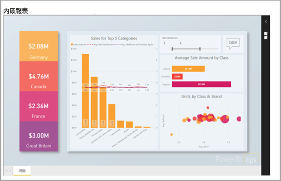
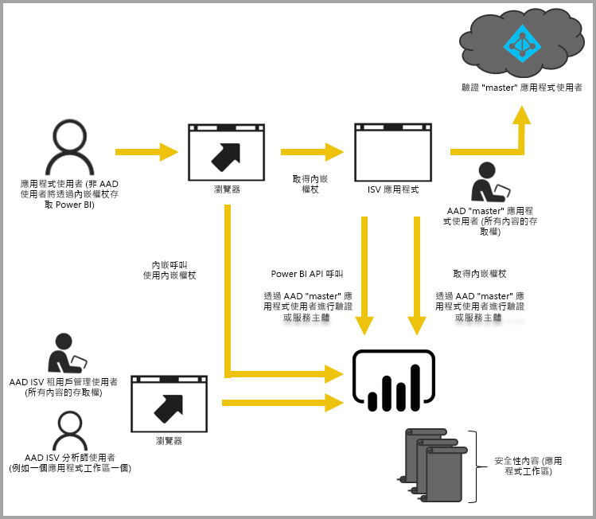

# 搭配 Power BI 使用內嵌式分析

Power BI 服務 (SaaS) 和 Azure 中的 Power BI Embedded 服務 (PaaS) 都有 API 可供內嵌您的儀表板和報表。 在內嵌內容時，這可讓您存取最新的 Power BI 功能，例如儀表板、閘道及工作區。

您可以完成[內嵌安裝工具](https://aka.ms/embedsetup)以快速開始使用並下載應用程式範例。

選擇最適合您的方案：

* [對組織進行內嵌](embedding.md#embedding-for-your-organization)可讓您擴充 Power BI 服務。 若要這樣做，請實作[對組織進行內嵌](https://aka.ms/embedsetup/UserOwnsData)解決方案。
* [對客戶進行內嵌](embedding.md#embedding-for-your-customers)，可讓您將儀表板和報表內嵌至沒有 Power BI 帳戶的使用者。 若要這樣做，請實作[對客戶進行內嵌](https://aka.ms/embedsetup/AppOwnsData)解決方案。

## 使用 API

內嵌 Power BI 內容有兩個主要案例：
- 對您組織的使用者 (擁有 Power BI 授權) 進行內嵌。 
 
- 對您的使用者與客戶進行內嵌，而不需要 Power BI 授權。 

這兩個案例都允許使用 [Power BI REST API](https://docs.microsoft.com/rest/api/power-bi/)。

針對沒有 Power BI 授權的客戶和使用者，將儀表板和報告內嵌至您的自訂應用程式，並使用相同的 API 來服務組織或客戶。 您的客戶會看到應用程式管理的資料。 此外，您組織的 Power BI 使用者可另外選擇要直接在 Power BI 中，還是在內嵌應用程式內容中檢視「他們的資料」  。 您可以針對內嵌需求而完整利用 JavaScript 和 REST API。

若要了解內嵌運作方式，請參閱 [JavaScript 內嵌範例](https://microsoft.github.io/PowerBI-JavaScript/demo/)。

## 對組織進行內嵌

**對組織進行內嵌**可讓您擴充 Power BI 服務。 這種類型的內嵌需要應用程式的使用者登入 Power BI 服務，才能檢視內容。 貴組織中有人登入之後，他們只能在 Power BI 服務中存取他們自己的和某人已經與他們共用的儀表板和報表。

組織內嵌範例包括內部應用程式，例如 [SharePoint Online](https://powerbi.microsoft.com/blog/integrate-power-bi-reports-in-sharepoint-online/)、[Microsoft Teams 整合 (您必須具有系統管理員權限)](https://powerbi.microsoft.com/blog/power-bi-teams-up-with-microsoft-teams/) 和 [Microsoft Dynamics](https://docs.microsoft.com/dynamics365/customer-engagement/basics/add-edit-power-bi-visualizations-dashboard)。

若要對組織進行內嵌，請參閱[教學課程：為組織將 Power BI 內容內嵌至應用程式](embed-sample-for-your-organization.md)。

針對 Power BI 使用者內嵌時，可透過 [JavaScript API](https://github.com/Microsoft/PowerBI-JavaScript) 來使用自助功能，例如編輯、儲存等。

您可以完成[內嵌安裝工具](https://aka.ms/embedsetup/UserOwnsData)來開始並下載應用程式範例，該應用程式範例會引導您整合組織的報表。

## 對客戶進行內嵌

**對客戶進行內嵌**，可讓您針對沒有 Power BI 帳戶的使用者內嵌儀表板和報表。 這種類型的內嵌也稱為 *Power BI Embedded*。

[Power BI Embedded](azure-pbie-what-is-power-bi-embedded.md) 是一種 **Microsoft Azure** 服務，可讓獨立軟體廠商 (ISV) 和開發人員將視覺效果、報表和儀表板快速內嵌到應用程式中。 這種內嵌是透過以容量為基礎的每小時計量付費模型來完成。

Power BI Embedded 可為 ISV、其開發人員及客戶帶來好處。 例如，ISV 可以免費使用 Power BI Desktop 開始建立視覺效果。 ISV 可藉由減少視覺效果分析開發工作，利用差異化的資料體驗來加快應用程式上市的速度，並從競爭對手中脫穎而出。 ISV 也可以選擇針對他們運用內嵌分析所創造的價值收取較高費用。

使用 Power BI Embedded，您的客戶完全不需要了解 Power BI。 您可以使用兩種不同的方法來建立內嵌應用程式：
- Power BI Pro 帳戶 
- 服務主體 

Power BI Pro 帳戶將成為應用程式的主帳戶 (將其視為 Proxy 帳戶)。 此帳戶可讓您產生內嵌權杖，以允許存取應用程式的 Power BI 儀表板和報表。

[服務主體](embed-service-principal.md)可以使用「僅限應用程式」  權杖，將 Power BI 內容內嵌至應用程式。 它也可讓您產生內嵌權杖，以允許存取應用程式的 Power BI 儀表板和報表。

使用 Power BI Embedded 的開發人員可以花時間專注在建置其應用程式的核心功能，而不是將時間耗費在開發視覺效果和分析。 他們可以快速滿足客戶報表和儀表板的需求，且輕鬆地內嵌完整記載的 API 和 SDK。 透過在應用程式中啟用輕鬆巡覽資料探勘，ISV 可讓客戶在來自任何裝置的內容中進行資料驅動的快速決策。

> [!IMPORTANT]
> 雖然內嵌需要 Power BI 服務，但您的客戶不需要擁有 Power BI 帳戶就能檢視應用程式的內嵌內容。 

當準備好進入生產環境時，必須將工作區指派給專用容量。 Microsoft Azure 中的 Power BI Embedded 提供與您應用程式搭配使用的[專用容量](azure-pbie-create-capacity.md)。

如需內嵌的詳細資料，請參閱[如何內嵌 Power BI 內容](embed-sample-for-customers.md)。

## 後續步驟

現在，您可以嘗試將 Power BI 內容內嵌至應用程式，或嘗試對您的客戶內嵌 Power BI 內容。

> [!div class="nextstepaction"]
> [為組織內嵌](embed-sample-for-your-organization.md)

> [!div class="nextstepaction"]
> [什麼是 Power BI Embedded？](azure-pbie-what-is-power-bi-embedded.md)

> [!div class="nextstepaction"]
>[對客戶進行內嵌](embed-sample-for-customers.md)

有其他問題嗎？ [嘗試在 Power BI 社群提問](https://community.powerbi.com/)
