# <a name="power-bi-embedded-migration-tool"></a>Power BI Embedded 移轉工具

此移轉工具可以用來將報表從 Power BI Embedded Azure 服務 (PaaS) 複製至 Power BI 服務 (SaaS)。

將內容從工作區集合移轉至 Power BI 服務時，可以同時移轉至目前解決方案，且不需要任何關機時間。

## <a name="limitations"></a>限制

* 已推送的資料集無法進行下載，並且需要使用 Power BI 服務的 Power BI REST API 進行重建。
* 在 2016 年 11 月 26 日之前匯入的 PBIX 檔案將無法進行下載。

## <a name="download"></a>下載

您可以從 [GitHub](https://github.com/Microsoft/powerbi-migration-sample) 下載移轉工具範例。 您可以下載存放庫的 ZIP，也可以在本機進行複製。 下載之後，您可以在 Visual Studio 內開啟 *powerbi-migration-sample.sln*，來建置和執行移轉工具。

## <a name="migration-plans"></a>移轉計劃

您的移轉計劃只是將 Power BI Embedded 中的內容編成目錄的中繼資料，以及想要將它們發佈至 Power BI 服務的方式。

### <a name="start-with-a-new-migration-plan"></a>從新的移轉計劃開始

移轉計劃是 Power BI Embedded 中可用項目的中繼資料，接著會移至 Power BI 服務。 移轉計劃會儲存為 XML 檔案。

您會想要從建立新的移轉計劃開始。 若要建立新的移轉計劃，請執行下列動作。

1. 選取 [檔案] >  **[New Migration Plan ]** (新增移轉計劃)。

    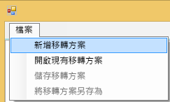

2. 在 [選取 Power BI Embedded 資源群組] 對話方塊中，您會想要選取 [環境] 下拉式清單，並選取 [生產環境]。

3. 系統將提示您登入。 您將使用 Azure 訂用帳戶登入。

   > [!IMPORTANT]
   > 這**不是**用來登入 Power BI 的組織帳戶。

4. 選取 Azure 訂用帳戶，以儲存您的 Power BI Embedded 工作區集合。

    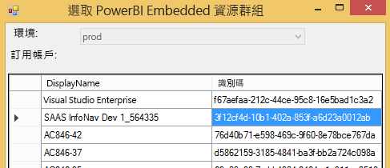
5. 在訂用帳戶清單下方，選取包含您工作區集合的 [資源群組]，然後選取 [選取]。

    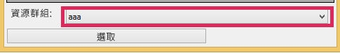

6. 選取 [分析]。 這會取得 Azure 訂用帳戶內項目的清查，以讓您開始您的計劃。

    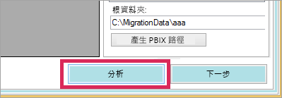

   > [!NOTE]
   > 根據工作區集合數目以及工作區集合中的內容量，分析程序可能需要幾分鐘的時間。

7. **分析**會在完成時，提示您儲存移轉計劃。

此時，您已將移轉計劃連接到 Azure 訂用帳戶。 請閱讀下列內容，了解如何使用移轉計劃的流程。 這包括 [Analyze & Plan Migration] (分析和規劃移轉)、[下載]、[建立群組] 和 [上傳]。

### <a name="save-your-migration-plan"></a>儲存移轉計劃

您可以儲存移轉計劃，供日後使用。 這將會建立包含您移轉計劃中所有資訊的 XML 檔案。

若要儲存移轉計劃，請執行下列動作。

1. 選取 [檔案] > [Save Migration Plan ] \(儲存移轉計劃)。

    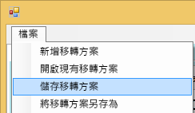

2. 提供您檔案的名稱，或使用產生的檔案名稱，然後選取 [儲存]。

### <a name="open-an-existing-migration-plan"></a>開啟現有移轉計劃

您可以開啟已儲存的移轉計劃，繼續進行移轉。

若要開啟現有移轉計劃，請執行下列動作。

1. 選取 [檔案] > [Open Existing Migration Plan] \(開啟現有移轉計劃)。

    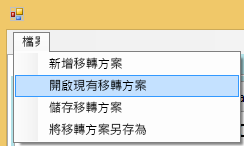

2. 選取您的移轉檔案，然後選取 [開啟]。

## <a name="step-1-analyze--plan-migration"></a>步驟 1：分析和規劃移轉

[Analyze & Plan Migration] \(分析和規劃移轉\) 索引標籤可供檢視 Azure 訂用帳戶資源群組中的目前內容。

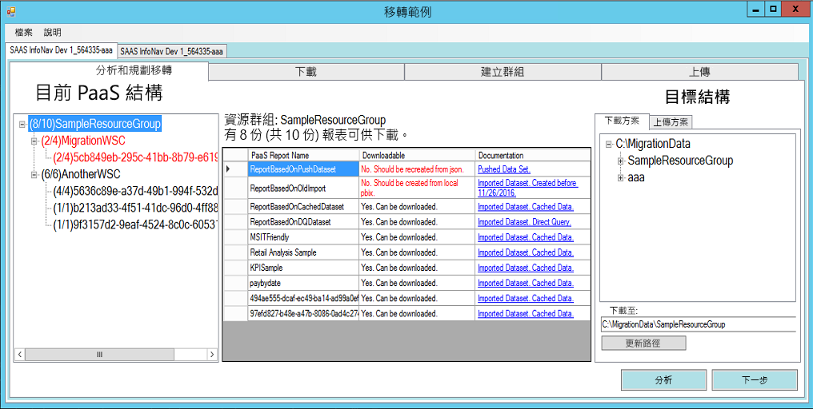

例如，我們將會查看 *SampleResourceGroup*。

### <a name="paas-topology"></a>PaaS 拓撲

這會列出 [資源群組] > [工作區集合] > [工作區]。 資源群組和工作區集合將會顯示易記名稱。 工作區將會顯示 GUID。

清單中的項目也會以 (#/#) 格式顯示色彩和數字。 這指出可下載的報表數目。
黑色表示可以下載所有報表。

紅色表示無法下載一些報表。 左邊的數字指出可下載的報表總數。 右邊的數字指出群組內的報表總數。

您可以選取 PaaS 拓撲內的項目，以在 [報表] 區段中顯示報表。

### <a name="reports"></a>報表

[報表] 區段將會列出可用的報表，並指出是否可供下載。


### <a name="target-structure"></a>目標結構

您可以在**目標結構**中告訴工具項目的下載位置與其上傳方式。

#### <a name="download-plan"></a>下載方案

會自動為您建立路徑。 您可以視需要變更此路徑。 若您變更路徑，則需要選取 [更新路徑]。

> [!NOTE]
> 這不會實際執行下載。 這只會指定報表下載目標位置的結構。

#### <a name="upload-plan"></a>上傳方案

您可以在這裡指定要用於 Power BI 服務內所建立工作區的前置詞。 前置詞後面會是 Azure 中現有工作區的 GUID。

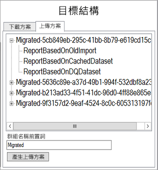

> [!NOTE]
> 這不會實際在 Power BI 服務內建立群組。 這只會定義群組的命名結構。

如果您變更前置詞，則需要選取 [Generate Upload Plan] (產生上傳計劃)。

您可以在群組上按一下滑鼠右鍵，然後選擇直接重新命名上傳計劃內的群組 (如有需要)。

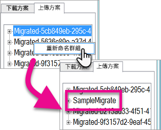

> [!NOTE]
> 「群組」的名稱不得包含空格或無效字元。

## <a name="step-2-download"></a>步驟 2：下載

在 [下載] 索引標籤上，您會看到報表和相關聯中繼資料的清單。 您可以看到匯出狀態與先前匯出狀態。

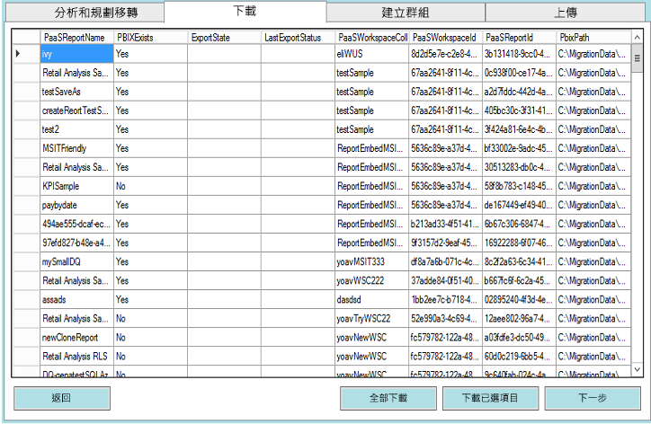

您有兩個選項。

* 選取特定報表，然後選取 [Download Selected] (下載選取的項目)。
* 選取 [Download All] \(全部下載)。

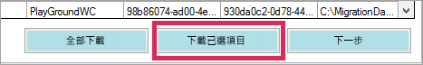

若是成功下載，您會看到 [完成] 狀態，而且它會反映 PBIX 檔案是否存在。

下載完成之後，請選取 [建立群組] 索引標籤。

## <a name="step-3-create-groups"></a>步驟 3：建立群組

在您下載可用的報表之後，可以移至 [建立群組] 索引標籤。此索引標籤將根據您建立的移轉計劃，在 Power BI 服務內建立工作區。 這會使用您在 [分析和規劃移轉] 內 [上傳] 索引標籤上提供的名稱來建立工作區。

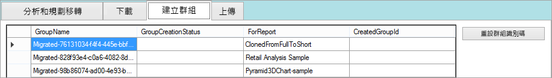

若要建立工作區，您可以選取 [建立選取的群組] 或 [建立所有缺少的群組]。

當您選取其中一個選項時，系統會提示您登入。 *您想要將認證用於要在其上建立工作區的 Power BI 服務。*

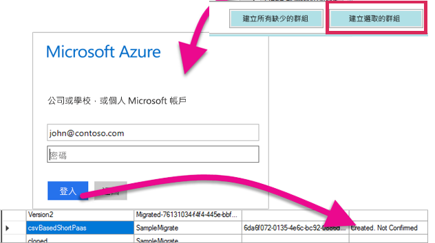

這會在 Power BI 服務內建立工作區。 這不會將報表上傳至工作區。

您可以登入 Power BI 並驗證工作區存在與否來確認已建立工作區。 您會注意到工作區中沒有內容。


建立工作區之後，您可以移至 [上傳] 索引標籤。

## <a name="step-4-upload"></a>步驟 4：上傳

在 [上傳] 索引標籤上，這會將報表上傳至 Power BI 服務。 您會在 [下載] 索引標籤上看到我們已下載的報表清單，以及根據您移轉計劃的目標群組名稱。

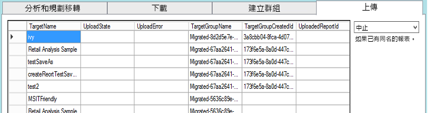

您可以上傳選取的報表，或上傳所有報表。 您也可以重設上傳狀態來重新上傳項目。

您也可以選擇選取在有同名的報表時要怎麼處理。 您可以選擇 [中止]、[忽略] 和 [覆寫]。


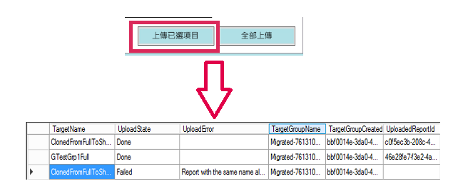

### <a name="duplicate-report-names"></a>重複的報表名稱

如果您有同名的報表，但知道它是不同的報表，則需要變更報表的 **TargetName**。 您可以手動編輯移轉計劃 XML 來變更名稱。

您需要關閉移轉工具才能進行變更，然後重新開啟此工具和移轉計劃。

在上述範例中，其中一個複製的報表失敗，並指出已有同名的報表。 如果我們查看移轉計劃 XML，則會看到下列情況。

```xml
<ReportMigrationData>
    <PaaSWorkspaceCollectionName>SampleWorkspaceCollection</PaaSWorkspaceCollectionName>
    <PaaSWorkspaceId>4c04147b-d8fc-478b-8dcb-bcf687149823</PaaSWorkspaceId>
    <PaaSReportId>525a8328-b8cc-4f0d-b2cb-c3a9b4ba2efe</PaaSReportId>
    <PaaSReportLastImportTime>1/3/2017 2:10:19 PM</PaaSReportLastImportTime>
    <PaaSReportName>cloned</PaaSReportName>
    <IsPushDataset>false</IsPushDataset>
    <IsBoundToOldDataset>false</IsBoundToOldDataset>
    <PbixPath>C:\MigrationData\SampleResourceGroup\SampleWorkspaceCollection\4c04147b-d8fc-478b-8dcb-bcf687149823\cloned-525a8328-b8cc-4f0d-b2cb-c3a9b4ba2efe.pbix</PbixPath>
    <ExportState>Done</ExportState>
    <LastExportStatus>OK</LastExportStatus>
    <SaaSTargetGroupName>SampleMigrate</SaaSTargetGroupName>
    <SaaSTargetGroupId>6da6f072-0135-4e6c-bc92-0886d8aeb79d</SaaSTargetGroupId>
    <SaaSTargetReportName>cloned</SaaSTargetReportName>
    <SaaSImportState>Failed</SaaSImportState>
    <SaaSImportError>Report with the same name already exists</SaaSImportError>
</ReportMigrationData>
```

針對失敗的項目，我們可以變更 SaaSTargetReportName 的名稱。

```xml
<SaaSTargetReportName>cloned2</SaaSTargetReportName>
```

我們接著可以在移轉工具中重新開啟計劃，並上傳失敗的報表。

回到 Power BI，即可在工作區中看到報表和資料集已上傳。

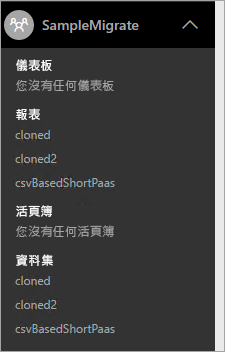

<a name="upload-local-file"></a>

### <a name="upload-a-local-pbix-file"></a>上傳本機 PBIX 檔案

您可以上傳 Power BI Desktop 檔案的本機版本。 您需要關閉工具，並編輯 XML，然後將本機 PBIX 的完整路徑放到 **PbixPath** 屬性中。

```xml
<PbixPath>[Full Path to PBIX file]</PbixPath>
```

在您編輯 XML 之後，請在移轉工具內重新開啟計劃，並上傳報表。

<a name="directquery-reports"></a>

### <a name="directquery-reports"></a>DirectQuery 報表

您需要更新 DirectQuery 報表的連接字串。 這可以在 *powerbi.com* 內完成，也可以透過程式設計方式從 Power BI Embedded (PaaS) 查詢連接字串。 如需範例，請參閱[從 PaaS 報表擷取 DirectQuery 連接字串](migrate-code-snippets.md#extract-directquery-connection-string-from-paas-report)。

您接著可以更新 Power BI 服務 (SaaS) 內資料集的連接字串，並設定資料來源的認證。 您可以查看下列範例，以了解做法。

* [更新 DirectQuery 連接字串是 SaaS 工作區](migrate-code-snippets.md#update-directquery-connection-string-is-saas-workspace)
* [在 SaaS 工作區中設定 DirectQuery 認證](migrate-code-snippets.md#set-directquery-credentials-in-saas-workspace)

## <a name="embedding"></a>內嵌

既然，報表已從 Power BI Embedded Azure 服務移轉至 Power BI 服務，您現在可以更新應用程式，並開始將報表內嵌在此工作區中。

如需詳細資訊，請參閱[如何將 Power BI Embedded 工作區集合內容移轉至 Power BI](migrate-from-powerbi-embedded.md)。

## <a name="next-steps"></a>後續步驟

[內嵌在 Power BI 之中](embedding.md)  
[如何將 Power BI Embedded 工作區集合內容移轉至 Power BI](migrate-from-powerbi-embedded.md)  
[何謂 Power BI Premium](../../admin/service-premium-what-is.md)  
[JavaScript API Git 存放庫](https://github.com/Microsoft/PowerBI-JavaScript)  
[Power BI C# Git 存放庫](https://github.com/Microsoft/PowerBI-CSharp)  
[JavaScript 內嵌示範](https://microsoft.github.io/PowerBI-JavaScript/demo/)  
[Power BI Premium 技術白皮書](https://aka.ms/pbipremiumwhitepaper)  

有其他問題嗎？ [嘗試在 Power BI 社群提問](https://community.powerbi.com/)