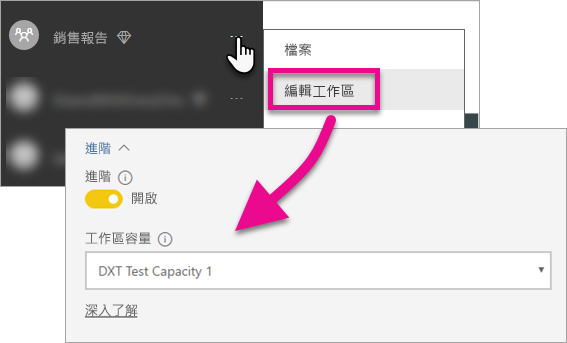

# 內嵌 Power BI 儀表板、報表和磚

了解您在應用程式中內嵌 Power BI 內容時必須採取的步驟。

Microsoft [宣佈 Power BI Premium](https://powerbi.microsoft.com/blog/microsoft-accelerates-modern-bi-adoption-with-power-bi-premium/)，這是一種新容量授權模型，可提高使用者如何存取、共用和散發內容的彈性。 此供應項目也會提供 Power BI 服務的額外延展性和效能。 此外也宣佈 Power BI Embedded，可讓您在 Microsoft Azure 中建立容量。 Power BI Embedded 著重於應用程式和客戶。 

本文將探討如何內嵌組織和客戶的 Power BI 內容。 這兩個案例的步驟類似。 對客戶進行內嵌的特定步驟時，將會進行圖說文字。

您需要使用應用程式執行幾個步驟，來達成這項作業。 我們將探討可讓您在應用程式內建立和使用已內嵌內容所需的步驟。

> [!NOTE]
> Power BI API 仍然將應用程式工作區稱為群組。 任何對群組的引述都表示您處理的是應用程式工作區。

## 步驟 1︰設定內嵌的分析開發環境

在您開始將儀表板和報表內嵌到應用程式之前，需要確定環境設定成允許進行內嵌。 在安裝時，您必須執行下列作業。

* [確認擁有 Azure Active Directory 租用戶](embedding-content.md#azureadtenant)
* [建立 Power BI Pro 帳戶](embedding-content.md#proaccount)
* [註冊 Azure Active Directory 應用程式和權限](embedding-content.md#appreg)

> [!NOTE]
> 開發應用程式時，不需要 Power BI 容量。 應用程式開發人員必須擁有 Power BI Pro 授權。

### Azure Active Directory 租用戶

您需要有 Azure Active Directory (Azure AD) 租用戶，才能內嵌 Power BI 中的項目。 此租用戶必須至少要有一個 Power BI Pro 使用者。 您也必須在租用戶內定義 Azure AD 應用程式。 您可以利用現有 Azure AD 租用戶，或特別針對內嵌用途建立新的 Azure AD 租用戶。

如果您是對客戶進行內嵌，您必須判斷要使用的租用戶設定。

* 使用現有的公司 Power BI 租用戶嗎？
* 您的應用程式使用不同的租用戶嗎？
* 每個客戶都使用個別租用戶嗎？

如果您不想使用現有的租用戶，而決定為應用程式或每個客戶建立新租用戶，請參閱[建立 Azure Active Directory 租用戶](create-an-azure-active-directory-tenant.md)或[如何取得 Azure Active Directory 租用戶](https://docs.microsoft.com/azure/active-directory/develop/active-directory-howto-tenant)。

### 建立 Power BI Pro 使用者帳戶

您只需要單一 Power BI Pro 帳戶，就能內嵌內容。 不過，您可能想要有幾個不同的使用者具有項目的特定存取權。 以下探討租用戶內可能要考慮的使用者。

下列帳戶必須存在於您的租用戶內，並且獲指派 Power BI Pro 授權。 需要 Power BI Pro 授權，才能使用 Power BI 中的應用程式工作區。

#### 組織/租用戶系統管理員使用者

如果對客戶進行內嵌，建議不要使用您的組織/租用戶全域管理員使用者作為應用程式所使用的帳戶。 這會將應用程式帳戶在租用戶內的存取權最小化。 建議管理員使用者是基於內嵌而建立之所有應用程式工作區的管理員。

#### 將建立內容之分析師的帳戶

您可能有多位使用者建立 Power BI 的內容。 針對每位建立內容並將其部署至 Power BI 的分析師，您都需要有其 Power BI Pro 帳戶。

#### 用於對客戶進行內嵌的應用程式「主」使用者帳戶

主帳戶是應用程式將在內嵌客戶內容時使用的帳戶。 此案例通常適用於 ISV 應用程式。 主帳戶其實是您組織內唯一需要的帳戶。 它也可以用作系統管理員和分析師帳戶，但不建議這麼做。 應用程式後端將會儲存此帳戶的認證，並使用它取得 Azure AD 授權權杖以與 Power BI API 搭配使用。 這個帳戶將用來產生應用程式用於客戶的內嵌權杖。

主帳戶只是具有用於應用程式之 Power BI Pro 授權的一般使用者。 該帳戶必須是正用於內嵌之應用程式工作區的管理員。

###  應用程式註冊和權限

您必須在 Azure AD 中註冊應用程式，才能進行 REST API 呼叫。 如需詳細資訊，請參閱[註冊 Azure AD 應用程式以內嵌 Power BI 內容](register-app.md)。

### 建立應用程式工作區

如果您要內嵌客戶的儀表板和報表，則必須將這些儀表板和報表放在應用程式工作區內。 上面所提及的「主」帳戶必須是應用程式工作區的管理員。

[!INCLUDE [powerbi-service-create-app-workspace](../includes/powerbi-service-create-app-workspace.md)]

### 建立和上傳報表

您可以使用 Power BI Desktop 建立報表和資料集，接著將這些報表發佈到應用程式工作區。 發佈報表的一般使用者必須有 Power BI Pro 授權，才能發佈至應用程式工作區。

## 步驟 2︰內嵌內容

在應用程式內，您必須向 Power BI 進行驗證。 如果您要內嵌客戶的內容，您會將「主」 帳戶的認證儲存在應用程式內。 如需詳細資訊，請參閱 [Authenticate users and get an Azure AD access token for your Power BI app](get-azuread-access-token.md) (驗證使用者，並為 Power BI 應用程式取得 Azure AD 存取權杖)。

驗證後，請在應用程式中使用 Power BI REST API 及 JavaScript API，將儀表板及報表內嵌至應用程式。 

若要**對組織進行內嵌**，請參閱下列逐步解說：

* [將儀表板整合到應用程式](integrate-dashboard.md)
* [將磚整合到應用程式](integrate-tile.md)
* [將報表整合到應用程式](integrate-report.md)

若要**對客戶進行內嵌** (適用於 ISV)，請參閱下列文章：

* [將儀表板、磚或報表整合至應用程式](embed-sample-for-customers.md)

對客戶進行內嵌時，需要有內嵌權杖。 若要深入了解，請參閱 [GenerateToken](https://msdn.microsoft.com/library/mt784614.aspx)。

## 步驟 3：將解決方案升階至生產環境

進入生產環境需要一些額外的步驟。

### 對組織進行內嵌

如果您要對組織進行內嵌，則只需要讓人員知道如何到達您的應用程式。 

若應用程式工作區 (群組) 提供容量，免費使用者就可以取用從該工作區內嵌的內容。 請將免費使用者列為應用程式工作區 (群組) 成員，以免收到 401 未授權錯誤。 下表列出 Office 365 中可用的 Power BI Premium SKU。

| 節點容量 | 核心總數 (後端 + 前端) | 後端核心 | 前端核心 | DirectQuery/即時連線限制 | 尖峰時間的頁面呈現上限 |
| --- | --- | --- | --- | --- | --- |
| EM3 |4 個 v 核心 |2 個核心，10GB RAM |2 個核心 | |601-1,200 |
| P1 |8 個 v 核心 |4 個核心，25GB RAM |4 個核心 |每秒 30 個 |1,201-2,400 |
| P2 |16 個 v 核心 |8 個核心，50GB RAM |8 個核心 |每秒 60 個 |2,401-4,800 |
| P3 |32 個 v 核心 |16 個核心，100GB RAM |16 個核心 |每秒 120 個 |4,801-9600 |

> [!NOTE]
> 您必須是租用戶內的全域或帳務管理員，才能購買 Power BI Premium。 如需如何購買 Power BI Premium 的資訊，請參閱[如何購買 Power BI Premium](../service-admin-premium-purchase.md)。

### 對客戶進行內嵌

如果您要對客戶進行內嵌，則會想要執行下列作業。

* 如果您要使用不同的租用戶進行開發，則必須確定生產環境中具有應用程式工作區、儀表板和報表。 請務必在 Azure AD 中建立生產租用戶的應用程式，並指派適當的應用程式權限，如步驟 1 所示。
* 購買符合您需求的容量。 您可以使用下表來了解您可能需要的 Power BI Embedded 容量 SKU。 如需詳細資料，請參閱[內嵌的分析容量規劃白皮書](https://aka.ms/pbiewhitepaper)。 當您準備好購買時，可以在 [Microsoft Azure 入口網站](https://portal.azure.com)內進行。 如需如何建立 Power BI Embedded 容量的詳細資料，請參閱 [Create Power BI Embedded capacity in the Azure portal](https://docs.microsoft.com/azure/power-bi-embedded/create-capacity) (在 Azure 入口網站中建立 Power BI Embedded 容量)。

| 節點容量 | 核心總數 (後端 + 前端) | 後端核心 | 前端核心 | DirectQuery/即時連線限制 | 尖峰時間的頁面呈現上限 |
| --- | --- | --- | --- | --- | --- |
| A1 |1 個 v 核心 |.5 個核心，3GB RAM |.5 個核心 | |1-300 |
| A2 |2 個 v 核心 |1 個核心，5GB RAM |1 個核心 | |301-600 |
| A3 |4 個 v 核心 |2 個核心，10GB RAM |2 個核心 | |601-1,200 |
| A4 |8 個 v 核心 |4 個核心，25GB RAM |4 個核心 |每秒 30 個 |1,201-2,400 |
| A5 |16 個 v 核心 |8 個核心，50GB RAM |8 個核心 |每秒 60 個 |2,401-4,800 |
| A6 |32 個 v 核心 |16 個核心，100GB RAM |16 個核心 |每秒 120 個 |4,801-9600 |

* 在 [進階] 下，編輯應用程式工作區，並將它指派給容量。

    

* 將更新過的應用程式部署至生產環境，然後開始內嵌 Power BI 儀表板和報表。

## 管理員設定

全域管理員 (或 Power BI 服務管理員) 可以為租用戶開啟或關閉使用 REST API 的功能。 Power BI 管理員可以為整個組織或個別安全性群組進行此設定。 依據預設，會為整個組織啟用這個設定。 這會透過 [Power BI 管理入口網站](../service-admin-portal.md)完成。

## 後續步驟

[內嵌在 Power BI 之中](embedding.md)  
[如何將 Power BI Embedded 工作區集合內容移轉至 Power BI](migrate-from-powerbi-embedded.md)  
[何謂 Power BI Premium](../service-premium.md)  
[如何購買 Power BI Premium](../service-admin-premium-purchase.md)  
[JavaScript API Git 存放庫](https://github.com/Microsoft/PowerBI-JavaScript)  
[Power BI C# Git 存放庫](https://github.com/Microsoft/PowerBI-CSharp)  
[JavaScript 內嵌示範](https://microsoft.github.io/PowerBI-JavaScript/demo/)  
[內嵌的分析容量規劃白皮書](https://aka.ms/pbiewhitepaper)  
[Power BI Premium 技術白皮書](https://aka.ms/pbipremiumwhitepaper)  

有其他問題嗎？ [嘗試在 Power BI 社群提問](http://community.powerbi.com/)

