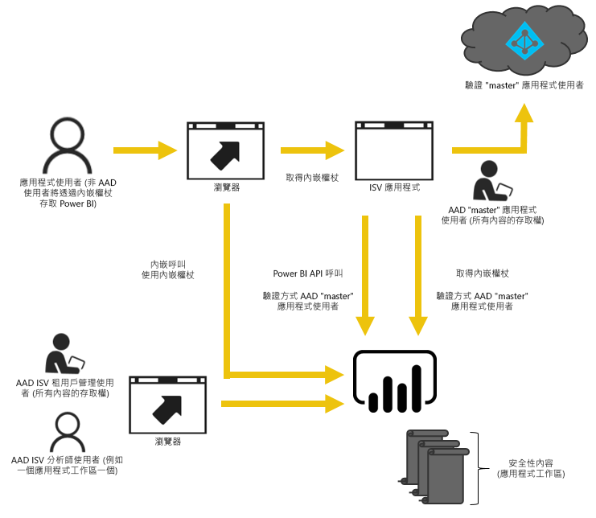

# Power BI 的內嵌功能
Power BI 提供 API 來將您的儀表板和報表內嵌至應用程式。 Power BI API 在內嵌內容時，會提供一組一致的功能以及最新 Power BI 功能的存取權 (例如儀表板、閘道和應用程式工作區)。

## 單一 API
內嵌 Power BI 內容時有兩個主要案例。  內嵌貴組織中有 Power BI 授權的使用者，以及內嵌使用者和客戶而不要求他們有 Power BI 授權。 這兩個案例都允許使用 Power BI REST API。 

針對沒有 Power BI 授權的客戶和使用者，將儀表板和報告內嵌至您的自訂應用程式，並使用相同的 API 來服務組織或客戶。 您的客戶會看到應用程式所管理的資料。 針對貴組織中的 Power BI 使用者，他們可以另外選擇要直接在 Power BI 中，還是在內嵌應用程式內容中檢視自己的資料。 您可以針對內嵌需求而完整利用 JavaScript 和 REST API。

若要檢視內嵌運作方式的範例，請參閱 [JavaScript 內嵌範例](https://microsoft.github.io/PowerBI-JavaScript/demo/)。

## 對組織進行內嵌
對組織進行內嵌可讓您擴充 Power BI 服務。 當應用程式的使用者需要檢視其內容時，就需要登入 Power BI 服務。 貴組織中有人登入之後，他們只能在 Power BI 服務中存取他們自己的和已經與他們共用的儀表板和報告。 

對組織進行內嵌的範例包括內部 Web 應用程式、SharePoint Online 網頁組件和 Microsoft Teams 整合。

若要對組織進行內嵌，請參閱下列文章：

* [將報表整合到應用程式](integrate-report.md)
* [將儀表板整合到應用程式](integrate-dashboard.md)
* [將磚整合到應用程式](integrate-tile.md)

針對 Power BI 使用者內嵌時，可透過 [JavaScript API](https://github.com/Microsoft/PowerBI-JavaScript) 來使用自助功能，例如編輯、儲存等。

您可以透過 [Onboarding experience tool to embed for your organization](https://aka.ms/embedsetup/UserOwnsData) (為組織內嵌的入門訓練體驗工具) 來快速開始及下載範例應用程式，該應用程式會引導您整合貴組織的報表。

## 對客戶進行內嵌
對客戶進行內嵌，可讓您將儀表板和報告內嵌至沒有 Power BI 帳戶的使用者。 您的客戶完全不需要了解 Power BI。 若要建立內嵌的應用程式，至少需要一個 Power BI Pro 帳戶。 Power BI Pro 帳戶將成為應用程式的主帳戶。 將這個當作 Proxy 帳戶。 Power BI Pro 帳戶也可讓您產生內嵌權杖，以提供存取 Power BI 服務內應用程式所擁有/管理的儀表板和報告。 

對客戶進行內嵌的範例包括銷售給其他公司的 ISV 應用程式。

若要內嵌儀表板、報表和磚，您使用的 API 應該與對組織進行內嵌時所用的 API 相同。

> [!IMPORTANT]
> 雖然內嵌相依於 Power BI 服務，但客戶不相依於 Power BI。 他們不需要註冊 Power BI，即可檢視應用程式中的內嵌內容。
> 

當您準備好進入生產環境時，必須將應用程式工作區指派給容量。 Microsoft Azure 中的 Power BI Embedded 提供用於應用程式的容量。

如需有關如何內嵌的詳細資訊，請參閱[如何內嵌 Power BI 儀表板、報告和圖格](embedding-content.md)。

您可以透過 [Onboarding experience tool to embed for your organization](https://aka.ms/embedsetup/AppOwnsData) (為客戶內嵌的入門訓練體驗工具) 來快速開始及下載範例應用程式，該應用程式會引導您將報表整合至您的應用程式。

如果您在 Azure 內使用 Power BI 工作區集合服務，請參閱[從 Power BI 工作區集合 Azure 服務移轉內容](migrate-from-powerbi-embedded.md)以取得如何移轉內容的資訊。

## 後續步驟
[如何內嵌 Power BI 儀表板、報告和圖格](embedding-content.md)  
[如何將 Power BI Embedded 工作區集合內容移轉至 Power BI](migrate-from-powerbi-embedded.md)  
[何謂 Power BI Premium](../service-premium.md)  
[JavaScript API Git 存放庫](https://github.com/Microsoft/PowerBI-JavaScript)  
[Power BI C# Git 存放庫](https://github.com/Microsoft/PowerBI-CSharp)  
[JavaScript 內嵌示範](https://microsoft.github.io/PowerBI-JavaScript/demo/)  
[內嵌的分析容量規劃白皮書](https://aka.ms/pbiewhitepaper)  
[Power BI Premium 技術白皮書](https://aka.ms/pbipremiumwhitepaper)  

有其他問題嗎？ [嘗試在 Power BI 社群提問](http://community.powerbi.com/)

