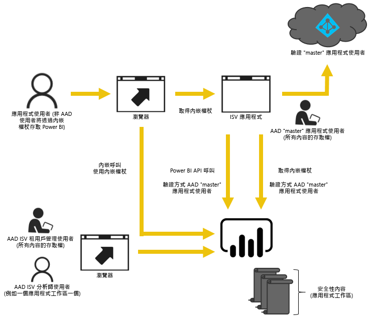
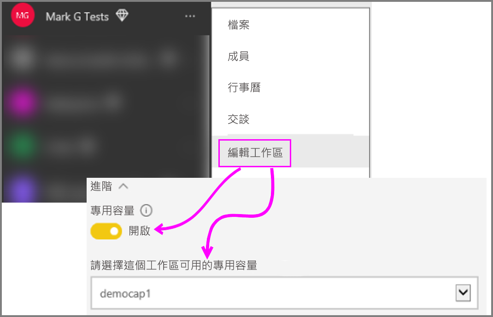

# 如何將 Power BI 工作區集合內容遷移至 Power BI Embedded
了解如何從 Power BI 工作區集合遷移至 Power BI Embedded，並利用內嵌在應用程式中的進階功能。

Microsoft 最近[宣告 Power BI Embedded](https://powerbi.microsoft.com/blog/power-bi-embedded-capacity-based-skus-coming-to-azure/)，這是一種新容量授權模型，可提高使用者如何存取、共用和散發內容的彈性。 此供應項目也會提供額外延展性和效能。

使用 Power BI Embedded，在內嵌內容時，您會有一個 API 介面、一組一致的功能以及最新 Power BI 功能的存取權 (例如儀表板、閘道和應用程式工作區)。 接著，您即可開始使用 Power BI Desktop 並移至具有 Power BI Embedded 的部署。

目前的 Power BI 工作區集合在有限的時間內仍會繼續提供服務。 Enterprise 合約的客戶在現有合約到期後仍可繼續存取服務；透過直接或 CSP 通路取得 Power BI 工作區集合的客戶，自 Power BI Embedded 正式發行一年內，仍可繼續存取服務。  本文會提供從 Power BI 工作區集合遷移至新 Power BI Embedded 體驗的指引，以及應用程式中預期變更的內容。

> [!IMPORTANT]
> 雖然遷移與 Power BI Embedded 相依，但是使用**內嵌權杖**時未與應用程式使用者的 Power BI 相依。 他們不需要註冊 Power BI，即可檢視應用程式中的內嵌內容。 您可以使用 Embedded 的這個內嵌方法，來服務 Power BI 使用者。
> 

在您開始移轉至新 Power BI Embedded 之前，您可以快速瀏覽逐步解說，會使用 [Embedding setup tool](https://aka.ms/embedsetup) (內嵌安裝工具) 來協助您設定新 Power BI Embedded 環境。

選擇最適合您的方案：
* **對客戶進行內嵌** - 若您對 [app owns data](https://aka.ms/embedsetup/AppOwnsData) (應用程式擁有資料) 方案有興趣。 [正在對客戶進行內嵌](embedding.md#embedding-for-your-customers)，可讓您將儀表板和報告內嵌至沒有 Power BI 帳戶的使用者。 
* **對組織進行內嵌** - 若您對 [user owns data](https://aka.ms/embedsetup/UserOwnsData) (使用者擁有資料) 方案有興趣。 [對組織進行內嵌](embedding.md#embedding-for-your-organization)可讓您擴充 Power BI 服務。

## 準備移轉
您需要執行許多準備事項才能從 Power BI 工作區集合遷移至 Power BI Embedded。 您必須要有租用戶，以及具有 Power BI Pro 授權的使用者。

1. 請確定您可以存取 Azure Active Directory (Azure AD) 租用戶。
   
    您必須判斷要使用的租用戶設定。
   
   * 使用現有的公司 Power BI 租用戶嗎？
   * 您的應用程式使用不同的租用戶嗎？
   * 每個客戶都使用個別租用戶嗎？
     
     如果您決定建立應用程式或每個客戶的新租用戶，請參閱[建立 Azure Active Directory 租用戶](create-an-azure-active-directory-tenant.md)或[如何取得 Azure Active Directory 租用戶](https://docs.microsoft.com/azure/active-directory/develop/active-directory-howto-tenant)。
2. 在將作為應用程式 "master" 帳戶的這個新租用戶內建立使用者。 該帳戶需要註冊 Power BI，而且需要獲指派 Power BI Pro 授權。

## Azure AD 內的帳戶
下列帳戶必須存在於您的租用戶內。

> [!NOTE]
> 這些帳戶必須擁有 Power BI Pro 授權，才能使用應用程式工作區。
>

1. 租用戶系統管理員使用者。
   
    建議這位使用者是基於內嵌而建立之所有應用程式工作區的成員。
2. 將建立內容之分析師的帳戶。
   
    應該視需要將這些使用者指派給應用程式工作區。
3. 應用程式 *master* 使用者帳戶或 Embedded 帳戶。
   
    應用程式後端將會儲存此帳戶的認證，並使用它取得 Azure AD 權杖以與 Power BI REST API 搭配使用。 這個帳戶將用來產生應用程式的內嵌權杖。 這個帳戶也需要是針對內嵌而建立之應用程式工作區的管理員。
   
> [!NOTE]
> 此為貴組織中的一般使用者帳戶，將用於內嵌。
>

## 應用程式註冊和權限
您必須在 Azure AD 內註冊應用程式，並授與特定權限。

### 註冊應用程式
您必須在 Azure AD 中註冊應用程式，才能進行 REST API 呼叫。 這包括在 Power BI 應用程式註冊頁面以外，還要前往 Azure 入口網站套用其他設定。 如需詳細資訊，請參閱[註冊 Azure AD 應用程式以內嵌 Power BI 內容](register-app.md)。

您應使用應用程式**主要**帳戶註冊應用程式。

## 建立應用程式工作區 (必要項)
如果您的應用程式會服務多個客戶，則可利用應用程式工作區來提供更佳的隔離。 在您的客戶之間，會隔離儀表板和報表。 您接著可以使用每個應用程式工作區的 Power BI 帳戶，進一步隔離客戶之間的應用程式體驗。

> [!IMPORTANT]
> 您無法使用個人工作區來利用內嵌至非 Power BI 使用者。
> 
> 

您需要有具有 Pro 授權的使用者，才能在 Power BI 內建立應用程式工作區。 建立應用程式工作區的 Power BI 使用者預設會是該工作區的系統管理員。

> [!NOTE]
> 應用程式*主要*帳戶必須是工作區的管理員。
> 
> 

## 內容移轉
將內容從工作區集合遷移至 Power BI Embedded，可以同時遷移至目前解決方案，而且不需要任何關機時間。

有**遷移工具**可用來協助您將 Power BI 工作區集合的內容複製到 Power BI Embedded。 尤其是當您有許多內容時。 如需詳細資訊，請參閱 [Power BI Embedded 移轉工具](migrate-tool.md)。

內容移轉主要依賴兩個 API。

1. 下載 PBIX - 此 API 可以下載在 2016 年 10 月後上傳至 Power BI 的 PBIX 檔案。
2. 匯入 PBIX - 此 API 會將任何 PBIX 上傳至 Power BI。

如需某些相關程式碼片段，請參閱[從 Power BI 工作區集合遷移內容的程式碼片段](migrate-code-snippets.md)。

### 報表類型
有數種類型的報表，而每種報表都需要略有不同的移轉流程。

#### 快取資料集和報表
快取資料集指的是具有已匯入資料的 PBIX 檔案，而不是具有即時連線或 DirectQuery 連線。

**流程**

1. 從 PaaS 工作區，呼叫下載 PBIX API。
2. 儲存 PBIX。
3. 對 SaaS 工作區呼叫匯入 PBIX。

#### DirectQuery 資料集和報表
**流程**

1. 呼叫 GET https://api.powerbi.com/v1.0/collections/{collection_id}/workspaces/{wid}/datasets/{dataset_id}/Default.GetBoundGatewayDataSources 並儲存已接收的連接字串。
2. 從 PaaS 工作區，呼叫下載 PBIX API。
3. 儲存 PBIX。
4. 對 SaaS 工作區呼叫匯入 PBIX。
5. 呼叫 POST  https://api.powerbi.com/v1.0/myorg/datasets/{dataset_id}/Default.SetAllConnections 更新連接字串
6. 呼叫 GET https://api.powerbi.com/v1.0/myorg/datasets/{dataset_id}/Default.GetBoundGatewayDataSources 取得 GW 識別碼和資料來源識別碼
7. 呼叫 PATCH https://api.powerbi.com/v1.0/myorg/gateways/{gateway_id}/datasources/{datasource_id} 更新使用者的認證

#### 舊資料集和報表
這些是在 2016 年 10 月之前建立的資料集/報表。 下載 PBIX 不支援 2016 年 10 月之前上傳的 PBIX

**流程**

1. 從開發環境取得 PBIX (內部原始檔控制)。
2. 對 SaaS 工作區呼叫匯入 PBIX。

#### 推送資料集和報表
下載 PBIX 不支援「推送 API」資料集。 無法將「推送 API」資料集資料從 PaaS 移植至 SaaS。

**流程**

1. 呼叫含資料集 Json 的「建立資料集」API，以在 SaaS 工作區中建立資料集。
2. 重建已建立資料集* 的報表。

嘗試下列動作，可能可以使用一些因應措施將推送 API 報表從 PaaS 遷移至 SaaS。

1. 將某些虛擬 PBIX 上傳至 PaaS 工作區。
2. 複製推送 API 報表，並將它繫結至步驟 1 中的虛擬 PBIX。
3. 下載含虛擬 PBIX 的推送 API 報表。
4. 將虛擬 PBIX 上傳至 SaaS 工作區。
5. 在 SaaS 工作區中建立推送資料集。
6. 將報表重新繫結至推送 API 資料集。

## 建立和上傳新報表
除了您從 Power BI 工作區集合所遷移的內容之外，還可以使用 Power BI Desktop 建立報表和資料集，然後將這些報表發佈至應用程式工作區。 發佈報表的一般使用者必須有 Power BI Pro 授權，才能發佈至應用程式工作區。

## 重建應用程式
1. 您需要修改應用程式，以使用 Power BI REST API 以及 powerbi.com 內的報表位置。
2. 使用應用程式的 *master* 帳戶，以重建 AuthN/AuthZ 驗證。 您可以利用使用[內嵌權杖](https://docs.microsoft.com/rest/api/power-bi/embedtoken)來允許這位使用者代表其他使用者執行動作。
3. 將報表從 powerbi.com 內嵌到應用程式。

## 將您的使用者對應至 Power BI 使用者
在應用程式內，您會將在應用程式內管理的使用者對應至應用程式的 *master* Power BI 認證。 這個 Power BI *master* 帳戶的認證將會儲存在應用程式內，並且用來建立內嵌權杖。

## 當您準備好用於生產環境時，該怎麼辦
當您準備好進入生產環境時，必須執行下列作業。

* 如果您要使用不同的租用戶進行開發，則必須確定生產環境中具有應用程式工作區、儀表板和報表。 您也必須確定已在 Azure AD 中建立生產租用戶的應用程式，並獲指派適當的應用程式權限，如步驟 1 所示。
* 購買符合您需求的容量。 若要深入了解您所需的數量及容量類型，請參閱 [Power BI Embedded 分析容量規劃白皮書](https://aka.ms/pbiewhitepaper)。 您可以在 Azure 中[購買容量](https://portal.azure.com/#create/Microsoft.PowerBIDedicated)。
* 在進階下，編輯應用程式工作區，並將它指派給進階容量。
 
    
    
* 將更新過的應用程式部署至生產環境，然後開始從 Power BI Embedded 內嵌報表。

## 移轉之後
您應該在 Azure 內執行一些清除工作。

* 移除 Power BI 工作區集合之 Azure Embedded 內已部署解決方案的所有工作區。
* 刪除任何存在於 Azure 內的工作區集合。

## 後續步驟
[內嵌在 Power BI 之中](embedding.md)  
[Power BI 工作區集合遷移工具](migrate-tool.md)  
[從 Power BI 工作區集合遷移內容的程式碼片段](migrate-code-snippets.md)  
[如何內嵌 Power BI 儀表板、報告和圖格](embedding-content.md)  
[何謂 Power BI Premium](../service-premium.md)  
[JavaScript API Git 存放庫](https://github.com/Microsoft/PowerBI-JavaScript)  
[Power BI C# Git 存放庫](https://github.com/Microsoft/PowerBI-CSharp)  
[JavaScript 內嵌示範](https://microsoft.github.io/PowerBI-JavaScript/demo/)  
[工作區集合分析容量規劃白皮書](https://aka.ms/pbiewhitepaper)  
[Power BI Premium 技術白皮書](https://aka.ms/pbipremiumwhitepaper)  

有其他問題嗎？ [嘗試在 Power BI 社群提問](http://community.powerbi.com/)
