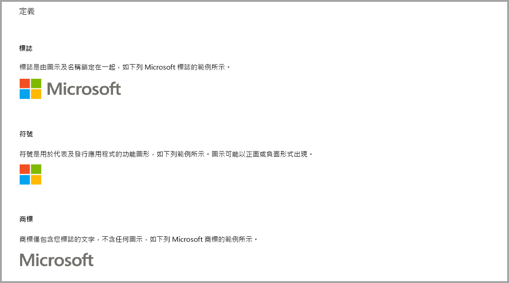
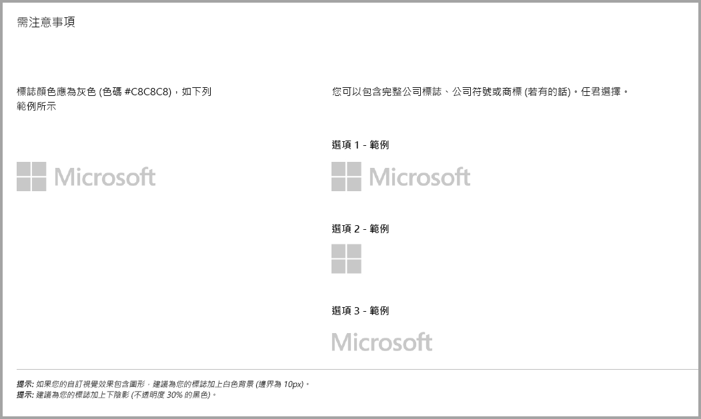
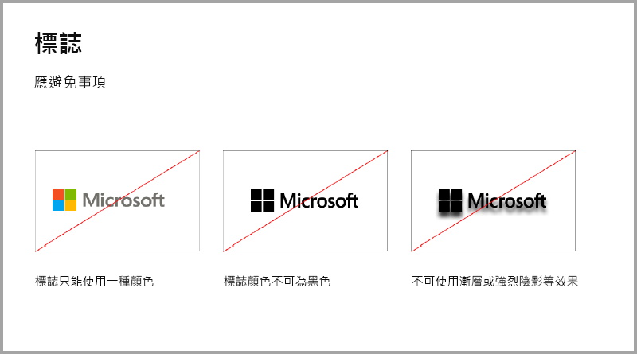
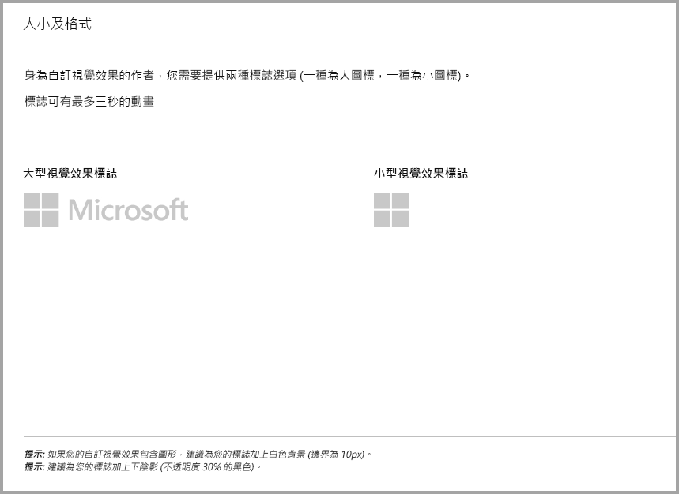
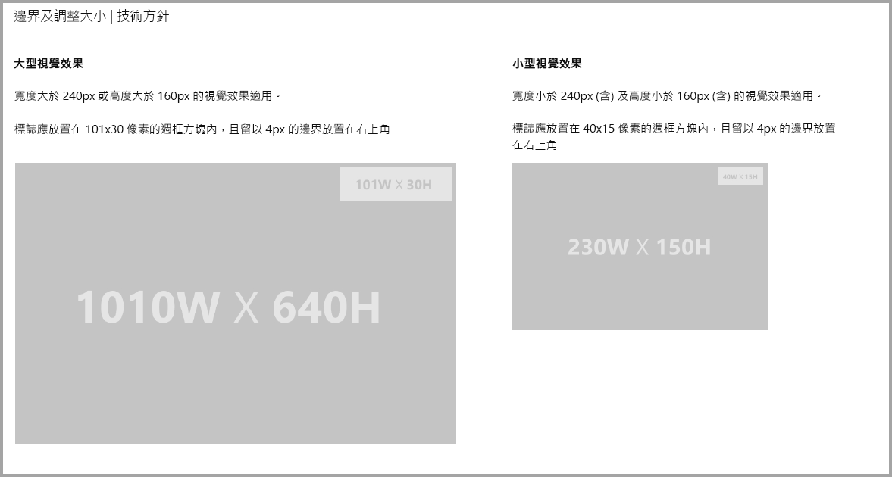
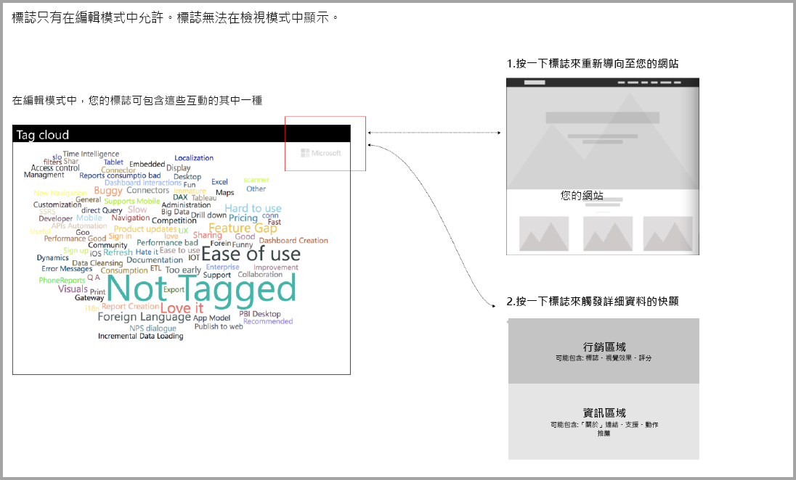

# 需要另外購買的 Power BI 視覺效果指導方針

到目前為止，**Marketplace (AppSource)** 只接受免費的 Power BI 視覺效果。 這項原則即將變更，因此貼上「可能需要另外購買」價格標籤的視覺效果也可以提交給 **AppSource**。 可能需要另外購買之視覺效果類似於 Office 市集中的在應用程式內購買 (IAP) 增益集。 開發人員也可以在經過 **AppSource** 小組核准，確定符合認證需求之後，再提交這些經認證的視覺效果，如[經認證的自訂視覺效果](../power-bi-custom-visuals-certified.md)一文中所述。

> [!Note]
> 視覺效果不得存取外部服務或資源，才能通過驗證。

## 提交程序將有何變更？

開發人員會透過賣方儀表板將其 IAP 視覺效果上傳至 AppSource，如同上傳免費的視覺效果。 為了指出提交的視覺效果具有 IAP 功能，開發人員應該在賣方儀表板備註中註明：「需要在應用程式內購買的視覺效果」。 此外，開發人員需要提供授權金鑰或權杖，讓驗證小組可驗證 IAP 功能。 一旦視覺效果經過驗證及核准，則 IAP 視覺效果的 AppSource 清單會在定價選項下方指出「可能需要另外購買」。

## 什麼是具有 IAP 功能的 Power BI 視覺效果？

IAP 視覺效果是免費的視覺效果並提供免費功能，但您可能需要額外付費取得其他功能來操作這些視覺效果。 開發人員必須在視覺效果的描述中，通知使用者有哪些需要另外購買才能運作的功能。 目前，Microsoft 不提供原生應用程式開發介面 (API) 以支援在應用程式內購買和增益集。對於這些購買項目，開發人員可以使用任何第三方付款系統。 請參閱我們的市集[原則](https://docs.microsoft.com/office/dev/store/validation-policies#2-apps-or-add-ins-can-display-certain-ads)。

## 標誌指導方針

本節描述在視覺效果中新增標誌和標誌類型的規格。

> [!NOTE]
> 只有在編輯模式中，才會允許標誌。 在檢視模式中，無法顯示標誌。

## 最佳作法

### 視覺效果登陸頁面

利用登陸頁面向使用者釐清可如何使用您的視覺效果，以及何處可購買授權。 不要包含會自動觸發的影片。 請只新增可協助改善使用者體驗的資料，例如授權購買詳細資料的相關資訊或連結，以及如何使用 IAP 功能。

### 授權金鑰和權杖

為了使用者方便起見，請在格式窗格頂端新增授權金鑰或權杖相關欄位，讓使用者更容易找到這些項目。

## 後續步驟

了解如何將自訂視覺效果發佈至 [AppSource](office-store.md) 供其他人探索及使用。
