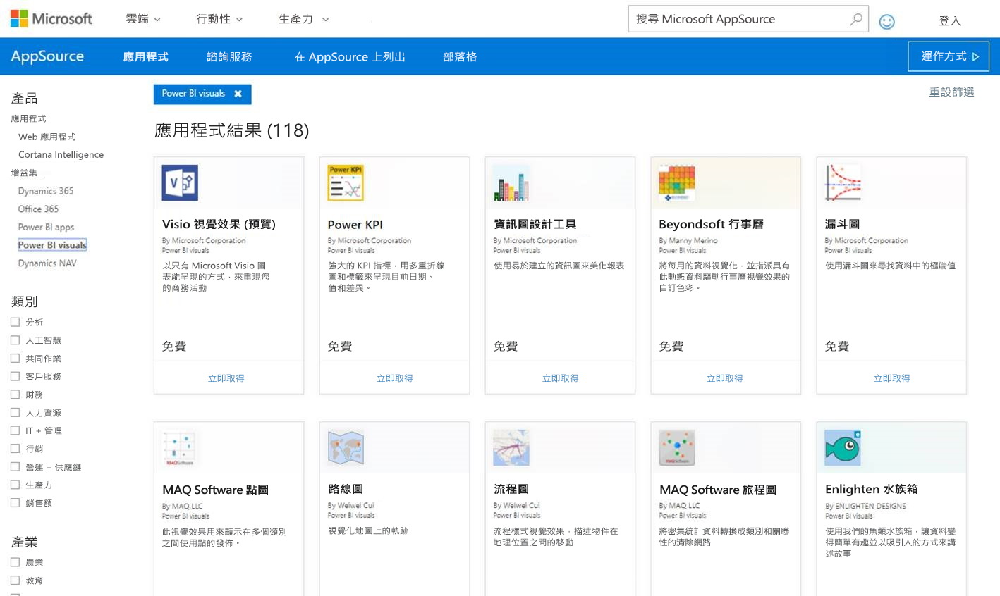
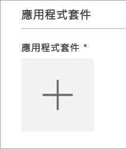
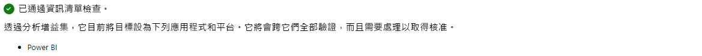
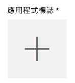
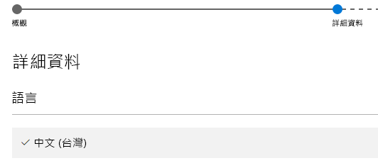

# 在 AppSource 上發佈 Power BI 視覺效果

了解如何將自訂視覺效果發佈至 AppSource 供其他人探索及使用。

一旦建立了自訂的視覺效果後，您可能需要發佈至 AppSource 供其他人探索及使用。 您需要先做一些準備才能執行此作業。 如需如何建立自訂視覺效果的詳細資訊，請參閱[開發 Power BI 自訂視覺效果](visuals/custom-visual-develop-tutorial.md)。

   

## 什麼是 AppSource？

**AppSource** 是針對 Microsoft 產品和服務尋找 SaaS 應用程式與增益集的地方。 [AppSource](https://appsource.microsoft.com/marketplace/apps?product=power-bi-visuals) 為上百萬名 Office 365、Dynamics 365、Cortana Intelligence 等的使用者提供了尋找解決方案的管道，讓使用者能夠以更有效率、更確切且更得心應手的方式搞定工作。

## 準備提交您的自訂視覺效果

當您閱讀完我們的 [Power BI 視覺效果指導方針](guidelines-powerbi-visuals.md)、完成程式碼撰寫且[測試您的自訂視覺效果](https://github.com/Microsoft/PowerBI-visuals/blob/master/Tutorial/SubmissionTesting.md)並將它封裝到 pbiviz 檔案後，您應該也備妥下列項目以便提交。

| 項目 | 必要 | 描述 |
| --- | --- | --- |
| Pbiviz 套件包含所有必要的中繼資料 |是 |視覺效果名稱 顯示名稱 GUID 版本 描述 作者名稱和電子郵件 |
| .pbix 報表檔案範例 |是 |為展示您的視覺效果，您應該協助使用者熟悉該視覺效果。 您應該強調視覺效果為使用者帶來的價值，並提供範例使用方式、格式化選項等等。您也可以在結尾新增「提示」  頁面，提供一些像是提示與祕訣、要避免的事項等等。 .pbix 報表範例檔案必須離線工作，不能有任何外部連線 |
| 圖示 |是 |您應該包含店面中會出現的自訂視覺效果標誌。 格式可以是 .png、.jpg、.jpeg 或 .gif。 它必須剛好是 300 px (寬度) x 300 px (高度)。 **重要！** 提交圖示之前，請仔細檢閱[簡短指南](https://docs.microsoft.com/office/dev/store/craft-effective-appsource-store-images) \(英文\)。 |
| 螢幕擷取畫面 |是 |您必須提供至少一張螢幕擷取畫面。 格式可以是 .png、.jpg、.jpeg 或 .gif。 它必須剛好是 1366 px (寬度) x 768 px (高度)。 檔案大小不能大於 1024 KB。 「為提高使用率，請新增文字泡泡以表達每張螢幕擷取畫面所顯示重要功能的價值定位。」  |
| 支援下載連結 |是 |提供 URL 以支援使用您視覺效果發生問題的客戶。 系統會輸入此連結作為您 SellerDashboard 清單的一部分，當使用者在 AppSource 上存取您視覺效果的清單時會看到。 URL 的格式應該包含 https:// 或 http:// 。 |
| 隱私權文件連結 |是 |為使用您視覺效果的客戶提供隱私權原則連結。 系統會輸入此連結作為您 SellerDashboard 清單的一部分，當使用者在 AppSource 上存取您視覺效果的清單時會看到。 連結的格式應該包含 https:// 或 http:// 。 |
| 使用者授權合約 (EULA) |是 |您必須上傳 EULA 檔案。 您可以使用自己的 EULA 或 Power BI Office 市集 Power BI 視覺效果的預設 EULA。 若要使用預設的 EULA，請將下列 URL 貼至賣方儀表板的 [使用者授權合約] 檔案上傳對話方塊中︰[https://visuals.azureedge.net/app-store/Power BI - Default Custom Visual EULA.pdf](https://visuals.azureedge.net/app-store/Power%20BI%20-%20Default%20Custom%20Visual%20EULA.pdf) \(英文\)。 |
| 影片連結 |否 |為提高使用者對您自訂視覺效果的興趣，建議您提供有關視覺效果的影片連結。 URL 的格式應該包含 https:// 或 http:// 。 |
| GitHub 儲存機制 |否 |為讓其他開發人員對您的程式碼提供意見反應和建議改良，最好在 [GitHub](https://www.github.com) 儲存機制有視覺效果和範例資料來源的有效公用連結。 |

## 提交至 Power BI

提交從傳送電子郵件給 Power BI 視覺效果提交小組開始。 您可傳送電子郵件至 [pbivizsubmit@microsoft.com](mailto:pbivizsubmit@microsoft.com)。

> [!IMPORTANT]
> 您必須先在 pbiviz.json 檔案中填妥下列欄位，然後才能建立 .pbiviz 套件：“description”、“supportUrl”、“author“、“name” 及 “email”。

在您的電子郵件中附上 **.pbiviz 檔案**與**範例報告 .pbix 檔案**。 Power BI 小組會回覆指示和要上傳的應用程式套件 XML 檔案。 需要有此 XML 應用程式套件，才能透過 Office 開發人員中心提交您的視覺效果。

> [!NOTE]
> 為改善品質並確保現有的報告不中斷，現有視覺效果的更新經市集核准後，要再 2 週才會投放到生產環境。

## 提交至 AppSource

從 Power BI 小組取得應用程式套件 XML 後，請瀏覽至[開發人員中心](https://sellerdashboard.microsoft.com/Application/Summary)以將視覺效果提交至 AppSource。

> [!NOTE]
> 您必須擁有有效的 Office 程式開發人員帳戶，才能登入 [Office 開發人員中心](https://dev.office.com/)。 Office 開發人員帳戶必須是 Microsoft 帳戶 (Live ID，例如 hotmail.com 或 outlook.com)。

> [!IMPORTANT]
> 您必須先將附有 .pbiviz 檔案和 .pbix 檔案的電子郵件傳送至 Power BI 小組，然後再提交至 AppSource。 這樣可讓 Power BI 小組將這些檔案上傳到公用的共用伺服器。 否則，市集就無法擷取檔案。 每個新的視覺效果提交、現有視覺效果的更新及對拒絕的提交修正，都必須傳送這些檔案。

### 提交視覺效果的程序

請遵循下列步驟以完成提交。

1. 選取 [新增應用程式]  。

    

2. 選取 [Power BI 自訂視覺效果]  然後選取 [下一步]  。

3. 選取 [應用程式套件]  下的 **+** ，然後在開啟的檔案對話方塊中選取從 Power BI 小組收到的應用程式套件 XML 檔案。

    

4. 您應該會收到這是有效 Power BI 應用程式套件的核准。

    

5. 填寫 [一般資訊]  詳細資料。

   * *提交標題：* 您的提交在開發人員中心的命名方式
   * *版本：* 版本號碼是從您的增益集應用程式套件自動填入。
   * *發行日期 (UTC)：* 選取應用程式在市集發行的日期。 如果選擇未來的日期，則市集要到該日期才會提供應用程式。
   * *類別：* 第一個類別會自動填入 "Data Visualization + BI"。 這是所有 Power BI 視覺效果的標記方式。 您最多可以提供 2 個額外的類別，方便使用者搜尋您的視覺效果
   * 「測試備註」：  選擇性，如果您想要為 Microsoft 軟體測試人員提供一些指示。
   * 「我的應用程式需要、支援、包含或使用密碼或加密」：  保持取消核取
   * 「將此增益集放在 iPad 上的 Office 增益集目錄中」：  保持取消核取
6. 選取**應用程式標誌** 下的 **+** ，上傳您的視覺效果標誌。 然後在開啟的檔案對話方塊中選取圖示檔。 檔案必須是 .png、.jpg、.jpeg 或 .gif。 它必須剛好是 300px (寬度) x 300px (高度)，大小不能大於 512 KB。

    

7. 填寫 [支援文件]  詳細資料。

   * 支援文件連結
   * 隱私權文件連結
   * 影片連結
   * 使用者授權合約 (EULA)

       您必須上傳 EULA 檔案。 您可以使用自己的 EULA 或 Power BI Office 市集 Power BI 視覺效果的預設 EULA。 若要使用預設的 EULA，請將下列 URL 貼至賣方儀表板的 [使用者授權合約] 檔案上傳對話方塊中︰[https://visuals.azureedge.net/app-store/Power BI - Default Custom Visual EULA.pdf](https://visuals.azureedge.net/app-store/Power%20BI%20-%20Default%20Custom%20Visual%20EULA.pdf) \(英文\)。

8. 選取 [下一步]  前往 [詳細資料]  頁面。

9. 選取 [語言]  並從清單中挑選語言。

    

10. 填寫 [描述] 詳細資料。

    * *應用程式名稱 (用於此語言)：* 輸入店面中應該出現的應用程式標題。
    * *簡短描述：* 輸入店面中應該出現的應用程式簡短描述，最多 100 個字元。 此描述會和標誌一起出現在最上層頁面。 您可以使用 pbiviz 套件的描述。
    * *完整描述：* 提供更詳細的應用程式描述，客戶將會在應用程式詳細資料頁面看到此完整描述。 如果您想讓視覺效果成為開放原始碼，讓社群加以改進，請在這裡提供公用存放庫 (如 GitHub) 的連結。

11. 至少上傳一張螢幕擷取畫面。 格式可以是 .png、.jpg、.jpeg 或 .gif。 它必須剛好是 1366 px (寬度) x 768 px (高度)。 檔案大小不能大於 1024 KB。 「為提高使用率，請新增文字泡泡以表達每張螢幕擷取畫面所顯示重要功能的價值定位。」 

12. 如果您想要新增更多語言，請選取 [新增語言]  並重複步驟 10 和 11。 新增更多語言有利於使用者使用自己的語言檢視自訂的視覺效果詳細資料。 未列出的語言會預設為第一個選取的語言。

13. 當您完成新增語言時，請選取 [下一步]  前往 [封鎖存取]  頁面。

14. 如果您想要防止特定國家或地區的客戶使用或購買您的應用程式，請核取此方塊並從清單中選取。

15. 選取 [下一步]  前往 [定價]  頁面。

16. 目前只有「免費」  的視覺效果支援，而且不允許在視覺效果中購買其他項目 (應用程式內購買)。 選取 [此應用程式免費]  。

    > [!NOTE]
    > 如果您選取除了「免費」以外的選項或在應用程式內購買已提交的視覺效果內容，此提交將會遭到拒絕。

17. 您現在可以選取 [儲存為草稿]  於稍後提交，或選取 [提交送審]  向 Office 市集提交自訂的視覺效果。

## 追蹤提交狀態和使用方式

您可以檢閱[驗證原則](https://dev.office.com/officestore/docs/validation-policies#13-power-bi-custom-visuals)。

提交之後，您就能夠在[應用程式儀表板](https://sellerdashboard.microsoft.com/Application/Summary/)中檢視提交狀態。

## 認證您的視覺效果

建立視覺效果之後，您可以選擇讓您的視覺效果通過認證。 這表示它可以在 Power BI 服務內執行，還可以與服務的其他功能一起使用，例如匯出至 PowerPoint。 如需詳細資訊，請參閱[讓自訂視覺化「通過證認」  ](../developer/power-bi-custom-visuals-certified.md)。

## 後續步驟

[Developing a Power BI custom visual](visuals/custom-visual-develop-tutorial.md) (開發 Power BI 自訂視覺效果)  
[Power BI 中的視覺效果](../visuals/power-bi-report-visualizations.md)  
[Power BI 中的自訂視覺效果](../developer/power-bi-custom-visuals.md)  
[讓自訂視覺效果「通過認證」  ](../developer/power-bi-custom-visuals-certified.md)

有其他問題嗎？ [嘗試在 Power BI 社群提問](https://community.powerbi.com/)
