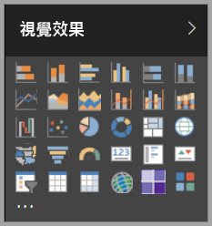

# Power BI 的視覺效果

Power BI 隨附許多現成的 Power BI 視覺效果。 這些視覺效果可在 [Power BI Desktop](https://powerbi.microsoft.com/desktop/) 和 [Power BI 服務](https://app.powerbi.com)的 [視覺效果] 窗格中取得，而且可用於建立和編輯 Power BI 內容。

您可以從 Microsoft [AppSource](https://nam06.safelinks.protection.outlook.com/?url=https%3A%2F%2Fappsource.microsoft.com%2Fen-us%2Fmarketplace%2Fapps%3Fpage%3D1%26product%3Dpower-bi-visuals&data=02%7C01%7CKesem.Sharabi%40microsoft.com%7C6d9286afacb3468d4cde08d740b76694%7C72f988bf86f141af91ab2d7cd011db47%7C1%7C0%7C637049028749147718&sdata=igWm0e1vXdgGcbyvngQBrHQVAkahPnxPC1ZhUPntGI8%3D&reserved=0) 或透過 Power BI，取得更多 Power BI 視覺效果。 這些視覺效果是由 Microsoft 和 Microsoft 合作夥伴所建立，並由 AppSource 驗證小組進行測試和驗證。

您也可以開發自己的 Power BI 視覺效果，以供您、貴組織或整個 Power BI 社群使用。

## 預設 Power BI 視覺效果

這些是現成的 Power BI 視覺效果，可從 *Power BI Desktop* 和 *Power BI 服務*中的 [視覺效果] 窗格取得。

若要從 [視覺效果] 窗格取消釘選 Power BI 視覺效果，請以滑鼠右鍵按一下該視覺效果並選取 [取消釘選]  。

若要在 [視覺效果] 窗格中還原預設 Power BI 視覺效果，請按一下 [匯入自訂視覺效果]  ，然後選取 [還原預設視覺效果]  。 

## AppSource Power BI 視覺效果

Microsoft 和社群成員貢獻出 Power BI 視覺效果以造福大眾，並將其發佈至 [AppSource](https://appsource.microsoft.com/marketplace/apps?product=power-bi-visuals)。 您可以下載這些視覺效果並將其新增至 Power BI 報表。 Microsoft 已測試並核准這些 Power BI 視覺效果的功能與品質。

### 什麼是 AppSource？

[AppSource](office-store.md) 是 Microsoft 軟體的應用程式、增益集和延伸模組所在位置。 AppSource 為上百萬名 Office 365、Azure、Dynamics 365、Cortana 及 Power BI 等產品的使用者提供尋找解決方案的管道，讓使用者能夠以更有效率且切實地完成工作。

### 經認證的 Power BI 視覺效果

經認證的 Power BI 視覺效果是 [AppSource](https://nam06.safelinks.protection.outlook.com/?url=https%3A%2F%2Fappsource.microsoft.com%2Fen-us%2Fmarketplace%2Fapps%3Fpage%3D1%26product%3Dpower-bi-visuals&data=02%7C01%7CKesem.Sharabi%40microsoft.com%7C6d9286afacb3468d4cde08d740b76694%7C72f988bf86f141af91ab2d7cd011db47%7C1%7C0%7C637049028749147718&sdata=igWm0e1vXdgGcbyvngQBrHQVAkahPnxPC1ZhUPntGI8%3D&reserved=0) 中的視覺效果，符合某些經 Microsoft Power BI 小組測試並核准的指定程式碼需求。 測試的目的是要檢查視覺效果是否不會存取外部服務或資源。

若要檢視已認證的 Power BI 視覺效果清單，或提交您自己的視覺效果，請參閱[經認證的 Power BI 視覺效果](power-bi-custom-visuals-certified.md)。

### Power BI 視覺效果範例

AppSource 上的每個 Power BI 視覺效果都有一個資料範例，說明視覺效果的運作方式。 若要下載範例，請在 [AppSource](https://nam06.safelinks.protection.outlook.com/?url=https%3A%2F%2Fappsource.microsoft.com%2Fen-us%2Fmarketplace%2Fapps%3Fpage%3D1%26product%3Dpower-bi-visuals&data=02%7C01%7CKesem.Sharabi%40microsoft.com%7C6d9286afacb3468d4cde08d740b76694%7C72f988bf86f141af91ab2d7cd011db47%7C1%7C0%7C637049028749147718&sdata=igWm0e1vXdgGcbyvngQBrHQVAkahPnxPC1ZhUPntGI8%3D&reserved=0) 中選取 Power BI 視覺效果，然後從 [試用範例]  區段中，按一下 [範例報表]  連結。

## 組織存放區

Power BI 系統管理員核准 Power BI 視覺效果，並將其部署到其組織。 這可讓報表作者輕鬆地探索、更新及使用這些 Power BI 視覺效果。 系統管理員可以使用更新版本、停用和啟用 Power BI 視覺效果等動作，輕鬆地管理這些視覺效果。

若要存取組織存放區，請在 [視覺效果]  窗格中，按一下 [匯入自訂視覺效果]  ，選取 [從 Marketplace 匯入]  ，然後在 [Power BI 視覺效果]  視窗的頂端，選取 [我的組織]  索引標籤。

[深入了解組織視覺效果](power-bi-custom-visuals-organization.md)。

## 視覺效果檔案

Power BI 視覺效果是一種套件，其中所包含程式碼可用來轉譯提供給自訂視覺效果的資料。 任何人都可以建立自訂視覺效果，並將它封裝為單一 `.pbiviz` 檔案，以便之後可匯入到 Power BI 報表中。

若要匯入 Power BI 視覺效果，請在 [視覺效果]  窗格中，按一下 [匯入自訂視覺效果]  並選取 [從檔案匯入]  。

如果您是 Web 開發人員，而且想要建立自己的視覺效果並將其新增至 AppSource，您可以了解如何[開發 Power BI 視覺效果](visuals/custom-visual-develop-tutorial.md)和[將 Power BI 視覺效果發佈至 AppSource](office-store.md)。

> [!WARNING]
> Power BI 視覺效果的程式碼可能會有安全性或隱私權風險。 請確定您信任作者和 Power BI 視覺效果來源，再將其匯入到報表。

## 後續步驟

* 如果您是開發人員，請從[開發 Power BI 視覺效果](./visuals/custom-visual-develop-tutorial.md)教學課程著手。

* 了解 [Power BI 視覺效果專案的架構方式](./visuals/visual-project-structure.md)。

* 探索 [Power BI 視覺效果指南](guidelines-powerbi-visuals.md)。

有其他問題嗎？ 請嘗試 [Power BI Power BI 視覺效果的常見問題集](power-bi-custom-visuals-faq.md)頁面，或 [Power BI 社群](http://community.powerbi.com/)。