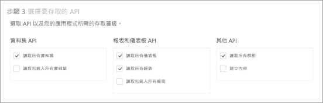
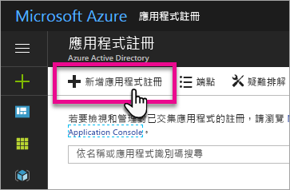
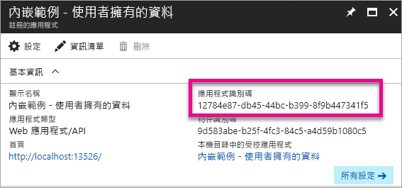
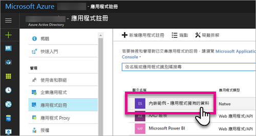
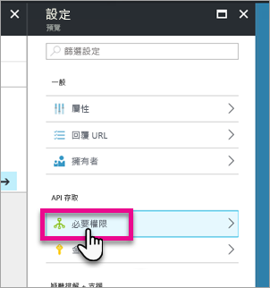
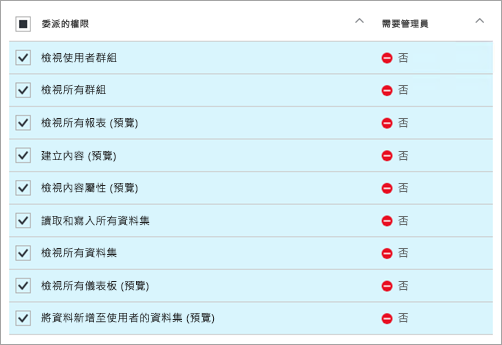
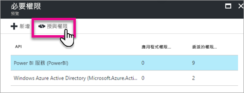

# <a name="register-an-azure-ad-app-to-embed-power-bi-content"></a>註冊 Azure AD 應用程式以內嵌 Power BI 內容
了解如何在 Azure Active Directory (Azure AD) 內註冊應用程式，以用來內嵌 Power BI 內容。

您可以向 Azure AD 註冊應用程式，讓您的應用程式存取 Power BI REST API。 這可讓您為應用程式建立身分識別，並指定對 Power BI REST 資源的權限。

> [!IMPORTANT]
> 註冊 Power BI 應用程式之前，您需要有 [Azure Active Directory 租用戶和組織使用者](create-an-azure-active-directory-tenant.md)。 如果您尚未以租用戶中的使用者來註冊 Power BI，則無法成功完成應用程式註冊。
> 
> 

有兩種方式可以註冊您的應用程式。 第一種方法是使用 [Power BI 應用程式註冊工具](https://dev.powerbi.com/apps/)；或者，您也可以在 Azure 入口網站直接註冊。 由於 Power BI 應用程式註冊工具只需填寫幾個欄位，所以算是最簡簡單的途徑。 如果您要變更應用程式，請使用 Azure 入口網站。

## <a name="register-with-the-power-bi-app-registration-tool"></a>使用 Power BI 應用程式註冊工具來註冊
您必須在 **Azure Active Directory** 中註冊應用程式，才能建立應用程式的身分識別，以及指定對於 Power BI REST 資源的權限。 當您註冊應用程式時，例如主控台應用程式或網站，您會收到識別碼，應用程式會使用此識別碼，向要求權限的使用者表明自己的身分。

以下是使用 Power BI 應用程式註冊工具來註冊應用程式的方法：

1. 請前往 [dev.powerbi.com/apps](https://dev.powerbi.com/apps)。
2. 選取 [使用您的現有帳戶登入]。
3. 提供 [應用程式名稱]。
4. [應用程式類型] 選取項目取決於您使用的應用程式類型。
   
   * 若是在用戶端裝置上執行的應用程式，請使用 [原生應用程式]。 如果您要內嵌客戶的內容，而不論實際應用程式是什麼，您需要選擇 [原生應用程式]。 即使是 Web 應用程式亦然。
   * 若是 Web 應用程式或 Web API，請使用 [伺服器端 Web 應用程式]。

5. 輸入 [重新導向 URL] 和 [首頁 URL] 的值。 [重新導向 URL] 適用於任何有效的 URL。
   
    只有當您選擇 [伺服器端 Web 應用程式] 作為應用程式類型時，才可使用 [首頁 URL]。
   
    若為「為客戶進行內嵌」 及 *integrate-dashboard-web-app* 範例，重新導向 URL 為 `http://localhost:13526/redirect`。 若為報表及磚範例，重新導向 URL 為 `http://localhost:13526/`。
6. 為可存取的應用程式選擇 API。 如需 Power BI 存取權限的詳細資訊，請參閱 [Power BI Permissions (Power BI 權限)](power-bi-permissions.md)。
   
    
7. 選取 [註冊應用程式]。
   
    然後會為您提供 [用戶端識別碼]，如果您選取 [伺服器端 Web 應用程式]，您會收到 [用戶端密碼]。 之後若有需要，可從 Azure 入口網站中擷取**用戶端識別碼**。 如果您遺失 [用戶端密碼]，則必須在 Azure 入口網站中建立一個新的。

8. 您必須覽到 Azure，才能選取 [授與權限]。
> [!Note]
    > 必須是 Azure 租用戶中的全域系統管理員才能完成此操作
>

* 移至 Azure。
* 搜尋並選取 [應用程式註冊]。
* 選擇您的應用程式。
* 選取 [設定] 。
* 選取 [必要權限]。
* 選取 [Power BI 服務] 來驗證您在應用程式註冊網站選取的權限。
* 選取 [授與權限]。

現在，您可以在自訂應用程式中，使用已註冊的應用程式來與 Power BI 服務互動。

> [!IMPORTANT]
> 如果要內嵌客戶的內容，您必須在 Azure 入口網站中設定其他權限。 如需詳細資訊，請參閱[將權限套用至應用程式](#apply-permissions-to-your-application)。
> 

## <a name="register-with-the-azure-portal"></a>使用 Azure 入口網站註冊
註冊應用程式的另一個選項是直接在 Azure 入口網站中進行。 若要註冊您的應用程式，請遵循下列步驟。

1. 接受 [Microsoft Power BI API 條款](https://powerbi.microsoft.com/api-terms)。
2. 登入[Azure 入口網站](https://portal.azure.com)。
3. 在頁面的右上角選取您的帳戶，以選擇您的 Azure AD 租用戶。
4. 在左側導覽窗格中，選擇 [更多服務]，選取 [安全性 + 識別] 下的 [應用程式註冊]，然後選取 [新增應用程式註冊]。
   
    
5. 遵循提示並建立新的應用程式。
   
   * 對於 Web 應用程式，請提供登入 URL，也就是應用程式的基底 URL，可供使用者登入，例如 http://localhost:13526。
   * 若是原生應用程式，請提供 [重新導向 URI]，供 Azure AD 用來傳回權杖回應。 輸入您應用程式特定的值。例如 http://myapplication/redirect

如需如何在 Azure Active Directory 中註冊應用程式的詳細資訊，請參閱[整合應用程式與 Azure Active Directory](https://docs.microsoft.com/azure/active-directory/develop/active-directory-integrating-applications)

## <a name="how-to-get-the-client-id"></a>如何取得用戶端識別碼
當您註冊應用程式時，您會收到**用戶端識別碼**。  [用戶端識別碼] 會要求應用程式授與使用者權限，以識別自己的身分。

以下是取得用戶端識別碼的方法：

1. 登入[Azure 入口網站](https://portal.azure.com)。
2. 在頁面的右上角選取您的帳戶，以選擇您的 Azure AD 租用戶。
3. 在左側導覽窗格中，選擇 [更多服務]，然後選取 [應用程式註冊]。
4. 選取您想要擷取用戶端識別碼的應用程式。
5. 您會看到以 GUID 形式列出的 [應用程式識別碼]。 這就是應用程式的用戶端識別碼。
   
    

## <a name="apply-permissions-to-your-application-within-azure-ad"></a>在 Azure AD 中將權限套用至應用程式
> [!IMPORTANT]
> 本節只適用於**內嵌組織內容**的應用程式。
> 

除了應用程式註冊頁面中所提供的權限之外，您還需要啟用應用程式的額外權限。 您可以透過 Azure AD 入口網站或以程式設計方式來完成這項作業。

建議您登入用於內嵌的「主」帳戶，或全域管理員帳戶。

### <a name="using-the-azure-ad-portal"></a>使用 Azure AD 入口網站
1. 瀏覽至 Azure 入口網站內的[應用程式註冊](https://portal.azure.com/#blade/Microsoft_AAD_IAM/ApplicationsListBlade)，然後選取您要用於內嵌的應用程式。
   
    
2. 選取 [API 存取] 下方的 [必要權限]。
   
    

3. 在 [必要權限] 內，選取 [Power BI 服務 (Power BI)]。
   
    
   
   > [!NOTE]
   > 如果您直接在 Azure AD 入口網站中建立應用程式，則 [Power BI 服務 (Power BI)] 可能不存在。 如果不存在，請選取 [+ 新增]，然後選取 [1 選取 API]。 選取 API 清單中的 [Power BI 服務]，然後選取 [選取]。  如果 [+ 新增] 內沒有 [Power BI 服務 (Power BI)]，請註冊 Power BI 和至少一位使用者。
   > 
   > 
4. 選取 [委派的權限] 下方的所有權限。 您必須逐一選取它們，才能儲存選取項目。 完成時，請選取 [儲存]。
   
    
5. 在 [必要權限] 內，選取 [授與權限]。
   
    主帳戶需要**授與權限**動作，以避免收到 Azure AD 要求權限的提示。 若執行此動作的帳戶為全域管理員，您可將此應用程式的權限授與組織中的所有使用者。 若執行此動作的帳戶為「主帳戶」而非全域管理員，您只可將此應用程式的權限授與「主帳戶」。
   
    

### <a name="applying-permissions-programmatically"></a>以程式設計方式套用權限
1. 您必須取得租用戶內的現有服務主體 (使用者)。 如需如何執行這項作業的資訊，請參閱 [Get servicePrincipal](https://developer.microsoft.com/en-us/graph/docs/api-reference/beta/api/serviceprincipal_get)。
   
    您可以呼叫沒有 {id} 的 *Get servicePrincipal* API，而且它將讓您取得租用戶內的所有服務主體。
2. 使用應用程式用戶端識別碼作為 **appId** 屬性，以檢查服務主體。
3. 如果您的應用程式遺失服務方案，則請建立新的服務方案。
   
    ```
    Post https://graph.microsoft.com/beta/servicePrincipals
    Authorization: Bearer ey..qw
    Content-Type: application/json
    {
    "accountEnabled" : true,
    "appId" : "{App_Client_ID}",
    "displayName" : "{App_DisplayName}"
    }
    ```
4. 將應用程式權限授與 Power BI API
   
   如果您使用現有的租用戶，且不想要代表所有租用戶使用者來授與權限，則可以將 **contentType** 的值替換為 **Principal**，以將權限授與特定使用者。

   **consentType** 的值可以提供 **AllPrincipals** 或 **Principal**。

   * **AllPrincipals** 只能由租用戶系統管理員用來代表租用戶中的所有使用者授與權限。
   * **Principal** 則會用於代表特定使用者授與權限。 在此情況下，額外的屬性應該新增至要求的本文 - *principalId={User_ObjectId}*。
    
    主帳戶需要「授與權限」，以避免收到 要求 Azure AD 同意的提示，這在進行非互動式登入時無法完成。
   
    ```
    Post https://graph.microsoft.com/beta/OAuth2PermissionGrants
    Authorization: Bearer ey..qw
    Content-Type: application/json
    { 
    "clientId":"{Service_Plan_ID}",
    "consentType":"AllPrincipals",
    "resourceId":"c78b2585-1df6-41de-95f7-dc5aeb7dc98e",
    "scope":"Dataset.ReadWrite.All Dashboard.Read.All Report.Read.All Group.Read Group.Read.All Content.Create Metadata.View_Any Dataset.Read.All Data.Alter_Any",
    "expiryTime":"2018-03-29T14:35:32.4943409+03:00",
    "startTime":"2017-03-29T14:35:32.4933413+03:00"
    }
    ```

5.  授與應用程式權限給 Azure Active Directory (AAD)
   
    **consentType** 的值可以提供 **AllPrincipals** 或 **Principal**。

    * **AllPrincipals** 只能由租用戶系統管理員用來代表租用戶中的所有使用者授與權限。
    * **Principal** 則會用於代表特定使用者授與權限。 在此情況下，額外的屬性應該新增至要求的本文 - *principalId={User_ObjectId}*。
    
    主帳戶需要「授與權限」，以避免收到 要求 Azure AD 同意的提示，這在進行非互動式登入時無法完成。

 ```
    Post https://graph.microsoft.com/beta/OAuth2PermissionGrants
    Authorization: Bearer ey..qw
    Content-Type: application/json
    { 
    "clientId":"{Service_Plan_ID}",
    "consentType":"AllPrincipals",
    "resourceId":"61e57743-d5cf-41ba-bd1a-2b381390a3f1",
    "scope":"User.Read Directory.AccessAsUser.All",
    "expiryTime":"2018-03-29T14:35:32.4943409+03:00",
    "startTime":"2017-03-29T14:35:32.4933413+03:00"
    }
 ```

## <a name="next-steps"></a>後續步驟
既然您已在 Azure AD 中註冊應用程式，就必須在應用程式中驗證使用者。 若要深入了解，請參閱[為 Power BI 應用程式驗證使用者及取得 Azure AD 存取權杖](get-azuread-access-token.md)。

有其他問題嗎？ [嘗試在 Power BI 社群提問](http://community.powerbi.com/)