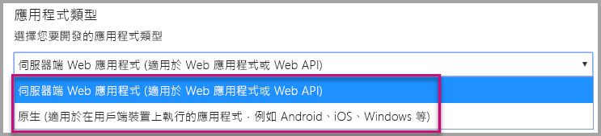
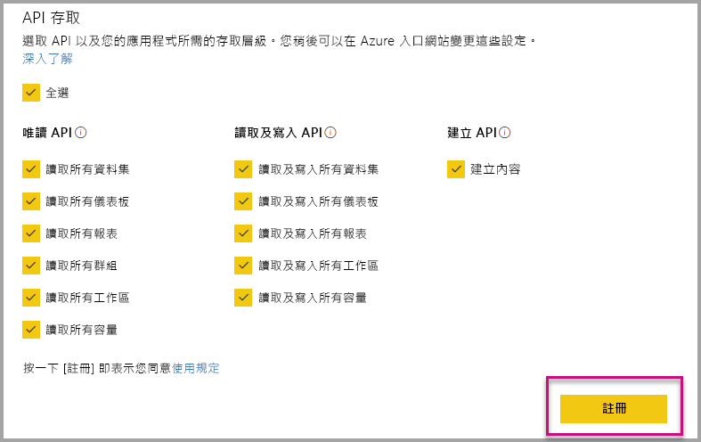
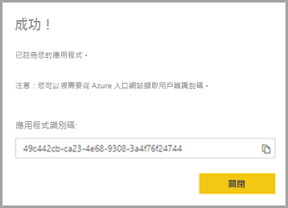
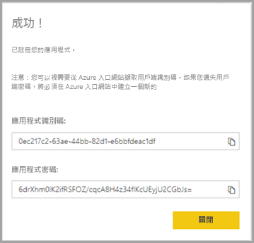
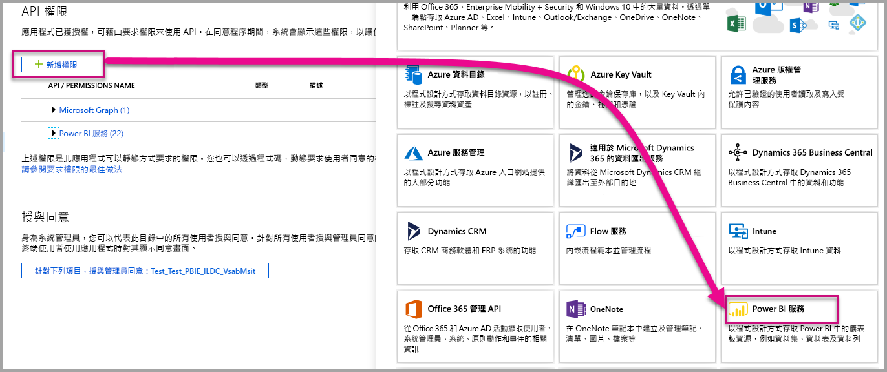

# <a name="register-an-azure-ad-application-to-use-with-power-bi"></a>註冊要與 Power BI 搭配使用的 Azure AD 應用程式

了解如何在 Azure Active Directory (Azure AD) 內註冊應用程式，以用來內嵌 Power BI 內容。

您可以向 Azure AD 註冊應用程式，讓您的應用程式存取 [Power BI REST API](https://docs.microsoft.com/rest/api/power-bi/)。 註冊您的應用程式之後，您可以為您的應用程式建立身分識別，並指定對 Power BI REST 資源的權限。

> [!IMPORTANT]
> 註冊 Power BI 應用程式之前，您需要有 [Azure Active Directory 租用戶和組織使用者](create-an-azure-active-directory-tenant.md)。 如果您尚未以租用戶中的使用者來註冊 Power BI，則無法成功完成應用程式註冊。

有兩種方式可以註冊您的應用程式。 一種是使用 [Power BI 應用程式註冊工具](https://dev.powerbi.com/apps/)，一種是直接在 Azure 入口網站中註冊。 Power BI 應用程式註冊工具更方便使用，因為只需填寫幾個欄位。 如果您要變更應用程式，請使用 Azure 入口網站。

## <a name="register-with-the-power-bi-application-registration-tool"></a>使用 Power BI 應用程式註冊工具來註冊

在 **Azure Active Directory** 中註冊應用程式，以為您的應用程式建立身分識別，並指定對 Power BI REST 資源的權限。 當您註冊應用程式 (例如主控台應用程式或網站) 時，您會收到一組識別碼，讓應用程式用於向要求權限的使用者表明自己的身分。

以下是使用 Power BI 應用程式註冊工具來註冊應用程式的方法：

1. 請前往 [dev.powerbi.com/apps](https://dev.powerbi.com/apps)。

2. 選取 [使用您的現有帳戶登入]  ，然後選取 [下一步]  。

3. 提供「應用程式名稱」  。

4. 提供「應用程式類型」  。

    以下是您為什麼選擇**原生**與**伺服器端 Web 應用程式**作為應用程式類型的差異。

    原生：
    * 您計劃建立一個應用程式，[其設計旨在供您的客戶](embed-sample-for-customers.md)使用主使用者帳戶 (用於登入 Power BI 的 Power BI Pro 授權) 進行驗證。

    伺服器端 Web 應用程式：
    * 您計劃建立一個[為您組織設計的](embed-sample-for-your-organization.md)應用程式。
    * 您計劃建立一個應用程式，[其設計旨在供您的客戶](embed-sample-for-customers.md)使用服務主體進行驗證。
    * 您計劃建立 Web 應用程式或 Web API。

    

5. 如果您選取了**伺服器端 Web 應用程式**作為應用程式類型，則繼續輸入 [首頁 URL]  和 [重新導向 URL]  的值。 [重新導向 URL]  可使用任何有效的 URL，且應與您已建立的應用程式對應。 如果您選取了 [原生]  ，則繼續進行步驟 6。

6. 選擇您應用程式需要的 Power BI API。 如需 Power BI 存取權限的詳細資訊，請參閱 [Power BI Permissions (Power BI 權限)](power-bi-permissions.md)。 然後，選取 [註冊]  。

    

    > [!Important]
    > 如果您啟用要與 Power BI 搭配使用的服務主體，則 Azure Active Directory 使用權限不再生效。 使用權限是透過 Power BI 系統管理入口網站管理。

7. 如果您選擇 [原生]  作為應用程式類型，接著會為您提供「應用程式識別碼」  。 如果您選取 [伺服器端 Web 應用程式]  作為應用程式類型，則會收到「應用程式識別碼」  和「應用程式祕密」  。

    > [!Note]
    > 日後如有需要，可從 Azure 入口網站中擷取「應用程式識別碼」  。 如果您遺失「應用程式密碼」  ，則必須在 Azure 入口網站內建立一個新的。

| 原生 | 伺服器端 Web 應用程式 |
|--------|-----------------------------|
|  |  |

現在，您可以在自訂應用程式中，使用已註冊的應用程式來與 Power BI 服務互動，以及與 Power BI Embedded 互動。

## <a name="register-with-the-azure-portal"></a>使用 Azure 入口網站註冊

註冊應用程式的另一個選項是直接在 Azure 入口網站中進行。 若要註冊您的應用程式，請遵循下列步驟。

1. 接受 [Microsoft Power BI API 條款](https://powerbi.microsoft.com/api-terms)。

2. 登入[Azure 入口網站](https://portal.azure.com)。

3. 在頁面的右上角選取您的帳戶，以選擇您的 Azure AD 租用戶。

4. 在左側導覽窗格中，前往 [所有服務]  ，選取 [應用程式註冊]  ，然後選取 [新增註冊]  。

5. 遵循提示並建立新的應用程式。

   如需如何在 Azure Active Directory 中註冊應用程式的詳細資訊，請參閱[向 Azure Active Directory 註冊應用程式](https://docs.microsoft.com/azure/active-directory/develop/quickstart-v2-register-an-app)

## <a name="how-to-get-the-application-id"></a>如何取得應用程式識別碼

當您註冊應用程式時，您會收到[應用程式識別碼](embed-sample-for-customers.md#application-id)。  [應用程式識別碼]  會要求應用程式將使用權限授與使用者，以識別自己的身分。

## <a name="how-to-get-the-service-principal-object-id"></a>如何取得服務主體物件識別碼

使用 [Power BI API](https://docs.microsoft.com/rest/api/power-bi/) 時，請務必使用[服務主體物件識別碼](embed-service-principal.md#how-to-get-the-service-principal-object-id)定義作業，來參考服務主體 - 例如，以管理員身分將服務主體套用至工作區。

## <a name="apply-permissions-to-your-application-within-azure-ad"></a>在 Azure AD 中將權限套用至應用程式

除了應用程式註冊頁面中所提供的權限之外，您還需要啟用應用程式的額外權限。 您可以透過 Azure AD 入口網站或以程式設計方式來完成這項工作。

建議您登入用於內嵌的「主」  帳戶，或全域系統管理員帳戶。

### <a name="using-the-azure-ad-portal"></a>使用 Azure AD 入口網站

1. 瀏覽至 Azure 入口網站內的[應用程式註冊](https://portal.azure.com/#blade/Microsoft_AAD_RegisteredApps/ApplicationsListBlade/quickStartType//sourceType/)，然後選取您要用於內嵌的應用程式。

2. 選取 [管理]  下方的 [API 權限]  。

3. 在 [API 權限]  中，選取 [新增權限]  ，然後選取 [Power BI 服務]  。

    

4. 在 [委派權限]  的下方，選取您需要的特定權限。 逐一選取它們，以儲存選取項目。 完成時，請選取 [儲存]  。

5. 選取 [授與同意]  。

    *主帳戶*需要**授與同意**動作，才不會收到需要 Azure AD 同意的提示。 若執行此動作的帳戶為全域管理員，您可將此應用程式的權限授與組織中的所有使用者。 若執行此動作的帳戶為「主帳戶」  而非全域管理員，您只可將此應用程式的權限授與「主帳戶」  。

### <a name="applying-permissions-programmatically"></a>以程式設計方式套用權限

1. 您必須取得租用戶內的現有服務主體 (使用者)。 如需如何執行這項作業的資訊，請參閱 [servicePrincipal](https://docs.microsoft.com/graph/api/resources/serviceprincipal?view=graph-rest-beta)。

    您可以呼叫沒有 {ID} 的 *Get servicePrincipal* API，而且它將讓您取得租用戶內的所有服務主體。

2. 使用應用程式識別碼作為 **appId** 屬性，以檢查服務主體。

3. 如果您的應用程式遺失服務方案，則請建立新的服務方案。

    ```json
    Post https://graph.microsoft.com/beta/servicePrincipals
    Authorization: Bearer ey..qw
    Content-Type: application/json
    {
    "accountEnabled" : true,
    "appId" : "{App_Client_ID}",
    "displayName" : "{App_DisplayName}"
    }
    ```

4. 將應用程式權限授與 Power BI API

   如果您是使用現有的租用戶，且不想要代表所有租用戶使用者來授與權限，則可以將 **contentType** 的值替換為 **Principal**，以將權限授與特定使用者。

   **consentType** 的值可以提供 **AllPrincipals** 或 **Principal**。

   * **AllPrincipals** 只能由租用戶系統管理員用來代表租用戶中的所有使用者授與權限。
   * **Principal** 則會用於代表特定使用者授與權限。 在此情況下，額外的屬性應該新增至要求的本文 - *principalId={User_ObjectId}* 。

     您必須為主帳戶「授與權限」  ，以避免收到要求 Azure AD 同意的提示，這在進行非互動式登入時無法完成。

     ```json
     Post https://graph.microsoft.com/beta/OAuth2PermissionGrants
     Authorization: Bearer ey..qw
     Content-Type: application/json
     {
     "clientId":"{Service_Plan_ID}",
     "consentType":"AllPrincipals",
     "resourceId":"c78a3685-1ce7-52cd-95f7-dc5aea8ec98e",
     "scope":"Dataset.ReadWrite.All Dashboard.Read.All Report.Read.All Group.Read Group.Read.All Content.Create Metadata.View_Any Dataset.Read.All Data.Alter_Any",
     "expiryTime":"2018-03-29T14:35:32.4943409+03:00",
     "startTime":"2017-03-29T14:35:32.4933413+03:00"
     }
     ```

    **resourceId** *c78a3685-1ce7-52cd-95f7-dc5aea8ec98e* 並非一體適用，而是取決於租用戶。 此值為 Azure Active Directory (AAD) 租用戶中「Power BI 服務」應用程式的 objectId。

    使用者可以隨時從 Azure 入口網站上取得此值：
    1. https://portal.azure.com/#blade/Microsoft_AAD_IAM/StartboardApplicationsMenuBlade/AllApps

    2. 在搜尋方塊中搜尋 [Power BI 服務]

5. 授與應用程式權限給 Azure Active Directory (AAD)

   **consentType** 的值可以提供 **AllPrincipals** 或 **Principal**。

   * **AllPrincipals** 只能由租用戶系統管理員用來授與權限給租用戶中的所有使用者。
   * **Principal** 則會用於將權限授與特定使用者。 在此情況下，額外的屬性應該新增至要求的本文 - *principalId={User_ObjectId}* 。

   您必須為主帳戶「授與權限」  ，以避免收到要求 Azure AD 同意的提示，這在進行非互動式登入時無法完成。

   ```json
   Post https://graph.microsoft.com/beta/OAuth2PermissionGrants
   Authorization: Bearer ey..qw
   Content-Type: application/json
   { 
   "clientId":"{Service_Plan_ID}",
   "consentType":"AllPrincipals",
   "resourceId":"61e57743-d5cf-41ba-bd1a-2b381390a3f1",
   "scope":"User.Read Directory.AccessAsUser.All",
   "expiryTime":"2018-03-29T14:35:32.4943409+03:00",
   "startTime":"2017-03-29T14:35:32.4933413+03:00"
   }
   ```

## <a name="next-steps"></a>後續步驟

既然您已在 Azure AD 中註冊應用程式，就必須在應用程式中驗證使用者。 若要深入了解，請參閱[為 Power BI 應用程式驗證使用者及取得 Azure AD 存取權杖](get-azuread-access-token.md)。

有其他問題嗎？ [嘗試在 Power BI 社群提問](https://community.powerbi.com/)