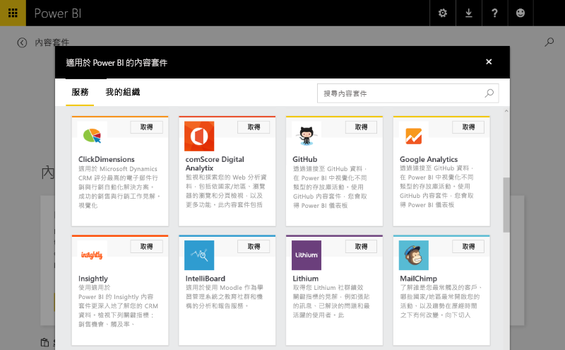
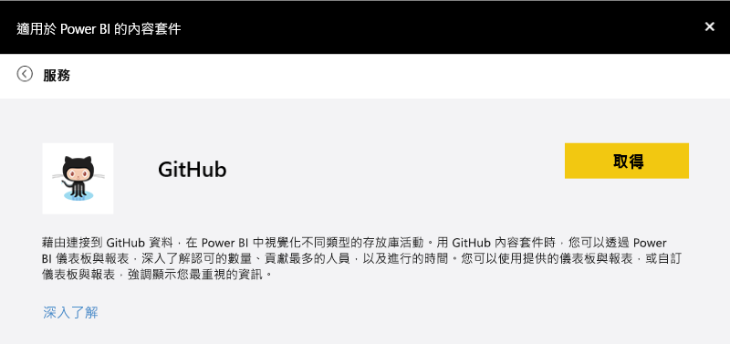
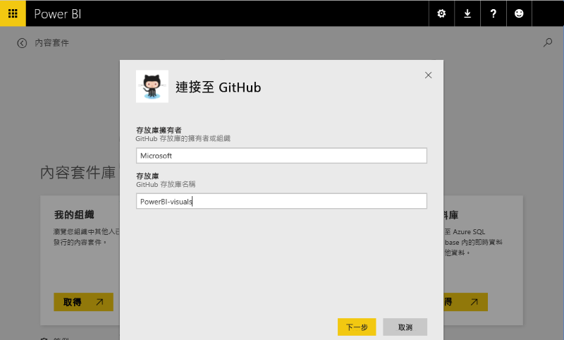
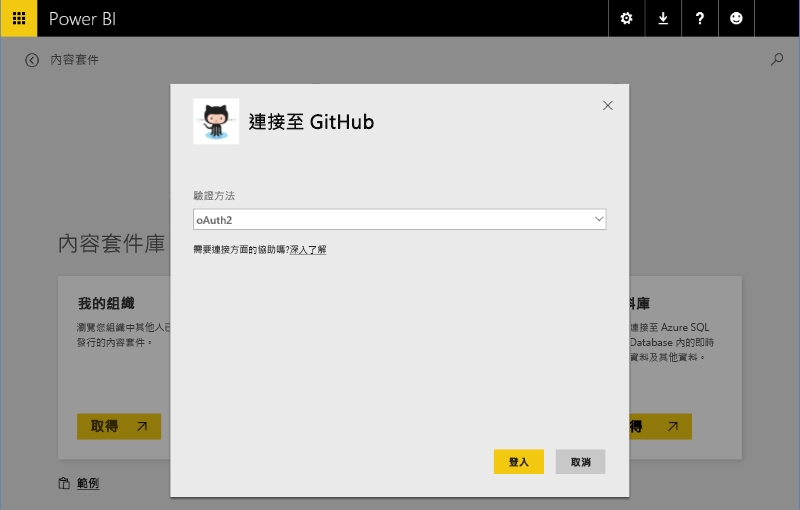
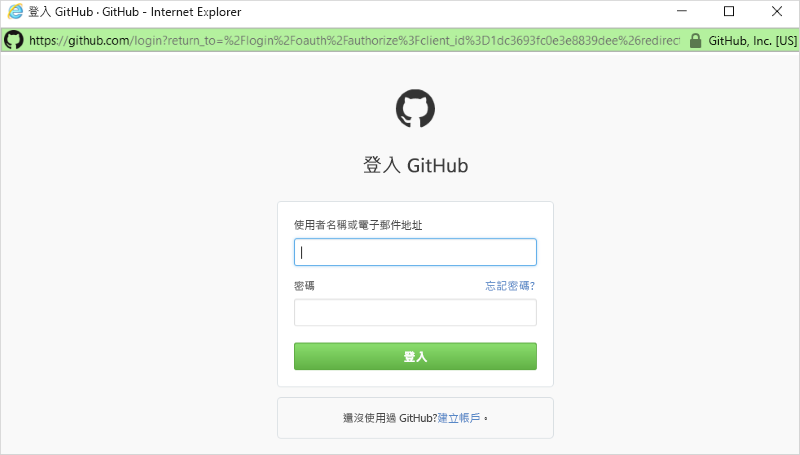
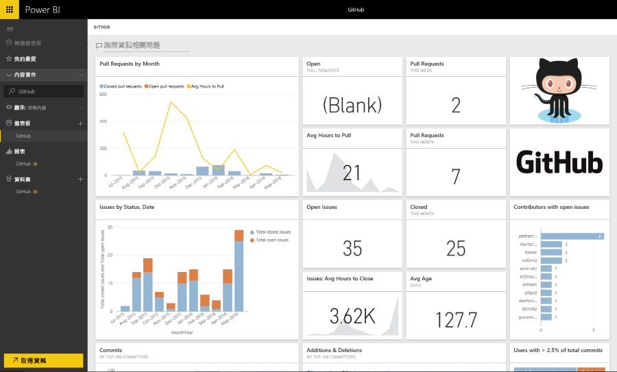

# Power BI 中的範本內容套件體驗
本節將提供連線至 ISV [內容套件](../service-connect-to-services.md)之使用者的一般體驗重點。 

透過連接到已發行的內容套件 (網址為 https://app.powerbi.com/getdata/services)，自行嘗試連線體驗 (例如如下所述的 [GitHub 內容套件](https://app.powerbi.com/getdata/services/github))。

## 連接
若要開始使用，使用者可瀏覽內容套件庫並選取要連接的內容套件。 內容套件項目會提供名稱、圖示和描述性文字，以為使用者提供更多資訊。

## 參數
選取之後，系統將提示使用者提供參數 (如有必要)。 在內容套件建立期間，作者會以宣告方式提供 [參數] 對話方塊。

目前參數 UI 是非常基本的功能，無法列舉下拉式清單且資料輸入驗證會限制為 regex。

## 認證
提供參數之後，系統將提示使用者登入。  如果來源支援多種類型的驗證，則使用者將選擇適當的選項。 如果來源需要 OAuth，則使用者按下 [登入] 時便會彈出服務的登入 UI。  否則，使用者可在提供的對話方塊中輸入其認證。

## 實例
登入成功時，模型、報表和儀表板等內容套件中包含的成品都會顯示在導覽列中。  系統會將這些成品新增至每個使用者的帳戶。  以非同步方式載入資料以填入資料集 (模型)。  然後使用者可使用儀表板、報表和模型。

根據預設，系統會為使用者設定每日重新整理排程，這將重新評估模型中的查詢。  提供給使用者的認證必須允許其不需出現即可重新整理資料。

## 探索和監視
系統將內容套件序列化至使用者的帳戶後，其便可探索和監視資料/深入剖析資訊。

這通常包含︰

* 檢視和自訂儀表板。
* 檢視和自訂報表。
* 使用自然語言詢問資料的相關問題
* 使用探索畫布探索資料模型中的資料

您應考慮提供自然語言模型 (同義字) 和可理解的模型結構描述，以實現更佳的探索體驗。

