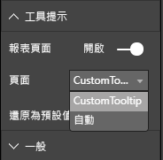

# <a name="tooltips-in-power-bi-visuals"></a>Power BI 視覺效果中的工具提示

視覺效果現在可以利用 Power BI 工具提示支援。 Power BI 工具提示會處理下列互動：'''

* 顯示工具提示。'''
* 隱藏工具提示。
* 移動工具提示。

工具提示可在指定座標集顯示含有標題的文字元素、特定色彩的值，以及不透明度。 此資料會提供給 API，而 Power BI 主機呈現它的方式，會與其呈現原生視覺效果之工具提示的方式相同。

下圖顯示位於範例橫條圖中的工具提示：


上面的工具提示影像說明單一橫條的類別和值。 您可以擴充單一工具提示以顯示多個值。

## <a name="manage-tooltips"></a>管理工具提示

您用來管理工具提示的介面是 "ITooltipService"。 它可用來通知主機必須顯示、移除或移動的工具提示。

```typescript
    interface ITooltipService {
        enabled(): boolean;
        show(options: TooltipShowOptions): void;
        move(options: TooltipMoveOptions): void;
        hide(options: TooltipHideOptions): void;
    }
```

您的視覺效果必須接聽視覺效果內的滑鼠事件，視需要呼叫 `show()`、`move()` 和 `hide()` 委派，並在 `Tooltip****Options` 物件中填入適當的內容。
`TooltipShowOptions` 和 `TooltipHideOptions` 會分別定義要顯示的內容，以及在這些事件中的運作方式。

因為呼叫這些方法會牽涉到使用者事件 (例如滑鼠移動或觸控事件)，所以最好為這些事件建立接聽程式，進而叫用 `TooltipService` 成員。
範例會在稱為 `TooltipServiceWrapper` 的類別中彙總。

### <a name="the-tooltipservicewrapper-class"></a>TooltipServiceWrapper 類別

這個類別背後的基本概念是保存 `TooltipService` 的執行個體，接聽相關元素上的 D3 滑鼠事件，然後在需要時呼叫 `hide()` 和 `show()` 元素。

類別會保存及管理這些事件的任何相關狀態和邏輯，它們主要是用於與基礎 D3 程式碼互動。 D3 互動和轉換已超出本文的範圍。

您可以在 [SampleBarChart 視覺效果存放庫](https://github.com/Microsoft/PowerBI-visuals-sampleBarChart/commit/981b021612d7b333adffe9f723ab27783c76fb14) \(英文\) 中找到完整的範例程式碼。

### <a name="create-tooltipservicewrapper"></a>建立 TooltipServiceWrapper

橫條圖建構函式現在有 `TooltipServiceWrapper` 成員，它會在建構函式中搭配主機 `tooltipService` 執行個體進行具現化。

```typescript
        private tooltipServiceWrapper: ITooltipServiceWrapper;

        this.tooltipServiceWrapper = createTooltipServiceWrapper(this.host.tooltipService, options.element);
```

`TooltipServiceWrapper` 類別會保存 `tooltipService` 實例，也會作為視覺效果和觸控參數的根 D3 元素。

```typescript
    class TooltipServiceWrapper implements ITooltipServiceWrapper {
        private handleTouchTimeoutId: number;
        private visualHostTooltipService: ITooltipService;
        private rootElement: Element;
        private handleTouchDelay: number;

        constructor(tooltipService: ITooltipService, rootElement: Element, handleTouchDelay: number) {
            this.visualHostTooltipService = tooltipService;
            this.handleTouchDelay = handleTouchDelay;
            this.rootElement = rootElement;
        }
        .
        .
        .
    }
```

`addTooltip` 方法是這個類別用來註冊事件接聽程式的單一進入點。

### <a name="the-addtooltip-method"></a>addTooltip 方法

```typescript
        public addTooltip<T>(
            selection: d3.Selection<Element>,
            getTooltipInfoDelegate: (args: TooltipEventArgs<T>) => VisualTooltipDataItem[],
            getDataPointIdentity: (args: TooltipEventArgs<T>) => ISelectionId,
            reloadTooltipDataOnMouseMove?: boolean): void {

            if (!selection || !this.visualHostTooltipService.enabled()) {
                return;
            }
        ...
        ...
        }
```

* **selection: d3.Selection<Element>** ：用來處理工具提示的 D3 元素。

* **getTooltipInfoDelegate: (args:TooltipEventArgs<T>) => VisualTooltipDataItem[]** ：用於按照內容填入工具提示內容 (要顯示的內容) 的委派。

* **getDataPointIdentity: (args:TooltipEventArgs<T>) => ISelectionId**：用於擷取資料點識別碼 (未在此範例中使用) 的委派。 

* **reloadTooltipDataOnMouseMove? boolean**：指出是否要在 MouseMove 事件 (未在此範例中使用) 期間重新整理工具提示資料的布林值。

如您所見，如果已停用 `tooltipService` 或沒有真正的選取項目，`addTooltip` 便會結束而不採取任何動作。

### <a name="call-the-show-method-to-display-a-tooltip"></a>呼叫 show 方法以顯示工具提示

`addTooltip` 方法接著會接聽 D3 `mouseover` 事件，如下列程式碼所示：

```typescript
        ...
        ...
        selection.on("mouseover.tooltip", () => {
            // Ignore mouseover while handling touch events
            if (!this.canDisplayTooltip(d3.event))
                return;

            let tooltipEventArgs = this.makeTooltipEventArgs<T>(rootNode, true, false);
            if (!tooltipEventArgs)
                return;

            let tooltipInfo = getTooltipInfoDelegate(tooltipEventArgs);
            if (tooltipInfo == null)
                return;

            let selectionId = getDataPointIdentity(tooltipEventArgs);

            this.visualHostTooltipService.show({
                coordinates: tooltipEventArgs.coordinates,
                isTouchEvent: false,
                dataItems: tooltipInfo,
                identities: selectionId ? [selectionId] : [],
            });
        });
```

* **makeTooltipEventArgs**：將 D3 所選取元素的內容擷取至 tooltipEventArgs。 它也會計算座標。

* **getTooltipInfoDelegate**：它接著會從 tooltipEventArgs 建置工具提示內容。 它是對 BarChart 類別的回呼，因為它是視覺效果的邏輯。 它是要在工具提示中顯示的實際文字內容。

* **getDataPointIdentity**：未在此範例中使用。

* **this.visualHostTooltipService.show**：要顯示工具提示的呼叫。  

您可以在 `mouseout` 和 `mousemove` 事件的範例中找到其他處理。

如需詳細資訊，請參閱 [SampleBarChart 視覺效果存放庫](https://github.com/Microsoft/PowerBI-visuals-sampleBarChart/commit/981b021612d7b333adffe9f723ab27783c76fb14)。

### <a name="populate-the-tooltip-content-by-the-gettooltipdata-method"></a>透過 getTooltipData 方法填入工具提示內容

BarChart 類別已搭配 `getTooltipData` 成員新增，該成員只會將資料點的 `category`、`value` 和 `color` 擷取至 VisualTooltipDataItem[] 元素。

```typescript
        private static getTooltipData(value: any): VisualTooltipDataItem[] {
            return [{
                displayName: value.category,
                value: value.value.toString(),
                color: value.color,
                header: 'ToolTip Title'
            }];
        }
```

在上述實作中，`header` 成員是常數，但您可將它用於需要動態值的更複雜實作。 您可以搭配多個元素填入 `VisualTooltipDataItem[]`，這會將多行新增至工具提示。 這在如堆疊橫條圖的視覺效果中很有用，其中工具提示可能會顯示來自多個資料點的資料。

### <a name="call-the-addtooltip-method"></a>呼叫 addTooltip 方法

最後一個步驟是在實際資料可能變更時呼叫 `addTooltip`。 這個呼叫會在 `BarChart.update()` 方法中進行。 會進行呼叫來監視所有 'bar' 元素的選取項目，只傳遞 `BarChart.getTooltipData()`(如上所述)。

```typescript
        this.tooltipServiceWrapper.addTooltip(this.barContainer.selectAll('.bar'),
            (tooltipEvent: TooltipEventArgs<number>) => BarChart.getTooltipData(tooltipEvent.data),
            (tooltipEvent: TooltipEventArgs<number>) => null);
```

## <a name="add-report-page-tooltips"></a>新增報表頁面工具提示

若要新增報表頁面工具提示支援，大部分的變更都位於 *capabilities.json* 檔案中。

範例結構描述為

```json
{
    "tooltips": {
        "supportedTypes": {
            "default": true,
            "canvas": true
        },
        "roles": [
            "tooltips"
        ]
    }
}
```

您可以在 [格式]  窗格中定義報表頁面工具提示。



* `supportedTypes`：視覺效果所支援的工具提示設定，且會反映在欄位上。 
   * `default`：指定是否支援透過資料欄位的「自動」工具提示繫結。 
   * `canvas`：指定是否支援報表頁面工具提示。

* `roles`：(選擇性) 定義之後，會指示有哪些資料角色會繫結至欄位中選取的工具提示選項。

如需詳細資訊，請參閱[報表頁面工具提示使用指導方針](https://powerbi.microsoft.com/blog/power-bi-desktop-march-2018-feature-summary/#tooltips) \(英文\)。

為了顯示報表頁面工具提示，在 Power BI 主機呼叫 `ITooltipService.Show(options: TooltipShowOptions)` 或 `ITooltipService.Move(options: TooltipMoveOptions)` 之後，它會使用 selectionId (前面 `options` 引數的 `identities` 屬性)。 若要讓工具提示擷取，SelectionId 應該代表您將游標暫留在其上之項目的選取資料 (類別、數列等)。

下列程式碼會顯示將 selectionId 傳送至工具提示顯示呼叫的範例：

```typescript
    this.tooltipServiceWrapper.addTooltip(this.barContainer.selectAll('.bar'),
        (tooltipEvent: TooltipEventArgs<number>) => BarChart.getTooltipData(tooltipEvent.data),
        (tooltipEvent: TooltipEventArgs<number>) => tooltipEvent.data.selectionID);
```
