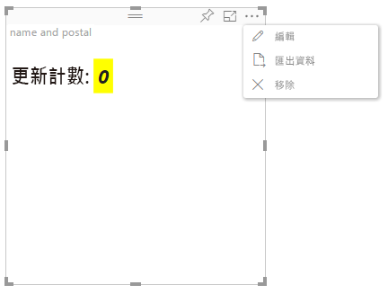

# 進階編輯模式

需要進階 UI 控制項的視覺效果可以宣告支援進階編輯模式。
如果支援，在報表編輯模式中，視覺效果的功能表會顯示一個 `Edit` 按鈕。
按一下 `Edit` 按鈕時，EditMode 就會設定為 `Advanced`。
視覺效果可以使用 EditMode 旗標來判斷是否應顯示這類 UI 控制項。

根據預設，視覺效果不支援進階編輯模式。
如果需要不同的行為，則應透過設定 `advancedEditModeSupport` 屬性在視覺效果的 `capabilities.json` 檔案中明確陳述。

可能的值為：

- 0 - NotSupported

- 1 - SupportedNoAction

- 2 - SupportedInFocus

## 進入進階編輯模式

在下列情況中，將會顯示 `Edit` 按鈕：

 1- `advancedEditModeSupport` 屬性在 capabilities.json 中設定為 `SupportedNoAction` 或 `SupportedInFocus`。

 2- 視覺效果是以報表編輯模式來檢視。

如果 capabilities.json 遺漏 `advancedEditModeSupport` 屬性，或該屬性設定為 `NotSupported`，則 [編輯] 按鈕將會消失。

當使用者按一下 `Edit` 時，視覺效果會收到 EditMode 設定為 `Advanced` 的 update() 呼叫。
根據 capabilities 中設定的值，將會發生下列動作：

* `SupportedNoAction` - 主機不會採取進一步的動作。
* `SupportedInFocus` - 主機會將視覺效果彈出到焦點模式中。

## 結束進階編輯模式

在下列情況中，將會顯示 `Back to report` 按鈕：

1- `advancedEditModeSupport` 屬性在 capabilities.json 中設定為 `SupportedInFocus`。
