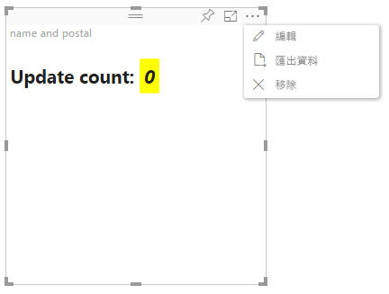

# Power BI 視覺效果中的進階編輯模式

如果您的 Power BI 視覺效果中需要有進階 UI 控制項，您可以利用進階編輯模式。 當您處於報表編輯模式時，選取 [編輯]  按鈕，將編輯模式設定為 [進階]  。 視覺效果可以使用 `EditMode` 旗標來判斷是否應顯示此 UI 控制項。

根據預設，視覺效果不支援進階編輯模式。 如果需要不同的行為，您可以透過設定 `advancedEditModeSupport` 屬性，在視覺效果的 *capabilities.json* 檔案中明確陳述。

可能的值為：

- `0` - NotSupported

- `1` - SupportedNoAction

- `2` - SupportedInFocus

## 進入進階編輯模式

下列情況會顯示 [編輯]  按鈕：

* *capabilities.json* 檔案中的 `advancedEditModeSupport` 屬性設定為 `SupportedNoAction` 或 `SupportedInFocus`。

* 視覺效果是以報表編輯模式來檢視。

如果 *capabilities.json* 檔案遺漏 `advancedEditModeSupport` 屬性，或該屬性設定為 `NotSupported`，則不會顯示 [編輯]  按鈕。

當您選取 [編輯]  時，視覺效果會進行 update() 呼叫，並將 EditMode 設為 `Advanced`。 取決於 *capabilities.json* 檔案中設定的值，會發生下列動作：

* `SupportedNoAction`：主機不需要採取進一步的動作。
* `SupportedInFocus`：主機會將視覺效果彈出到焦點模式中。

## 結束進階編輯模式

下列情況會顯示 [回到報表]  按鈕：

* *capabilities.json* 檔案中的 `advancedEditModeSupport` 屬性設定為 `SupportedInFocus`。
