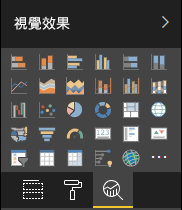

# <a name="analytics-pane-in-power-bi-visuals"></a>Power BI 視覺效果中的分析窗格

**分析窗格**是在 2018 年 11 月[引入原生視覺效果](https://docs.microsoft.com/power-bi/desktop-analytics-pane)。
使用 API v2.5.0 的自訂視覺效果可以在**分析窗格**中呈現及管理其屬性。



其處理方式類似於[在 [格式] 窗格中管理屬性](https://docs.microsoft.com/power-bi/developer/custom-visual-develop-tutorial-format-options)，做法是在視覺效果的 capabilities.json 檔案中定義一個物件。 

差異如下：

1. 在 `object` 的定義底下，新增值為 2 的 `objectCategory` 欄位。

    > [!NOTE]
    > `objectCategory` 欄位是在 API 2.5.0 中引進的選擇性欄位。 它會定義物件所控制的視覺效果層面 (1 = 格式、2 = 分析)。 「格式」用於外觀及操作、色彩、軸、標籤等。「分析」用於預測、趨勢線、參考線和圖形等。
    >
    > 如果省略，則 `objectCategory` 預設為「格式」。

2. 物件必須有下列兩個屬性：
    1. 類型為 bool 的 `show`，其預設值為 false。
    2. 類型為 text 的 `displayName`。 您選擇的預設值會變成執行個體的初始顯示名稱。

```json
{
  "objects": {
    "YourAnalyticsPropertiesCard": {
      "displayName": "Your analytics properties card's name",
      "objectCategory": 2,
      "properties": {
        "show": {
          "type": {
            "bool": true
          }
        },
        "displayName": {
          "type": {
            "text": true
          }
        },
      ... //any other properties for your Analytics card
      }
    }
  ...
  }
}
```

任何其他屬性的定義方式可能與針對格式物件所使用的定義方式相同。 物件列舉的執行方式則與 [格式] 窗格  完全相同。

***已知限制和問題***

  1. 尚未支援多個實例。 物件不能有非[靜態](https://microsoft.github.io/PowerBI-visuals/docs/concepts/objects-and-properties/#selector) (即 "selector": null) 的選取器，且自訂視覺效果不能有使用者定義的多個卡片執行個體。
  2. 類型為 `integer` 的屬性不會正確顯示。 因應措施是改為使用 `numeric` 類型。

> [!NOTE]
> [分析] 窗格僅適用於新增資訊或闡明所呈現資訊的物件。 例如，說明重要趨勢的動態參考線。
> 控制視覺效果外觀及操作 (也就是格式) 的任何選項，都應該保存在 [格式] 窗格中。
