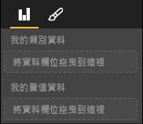

# <a name="power-bi-visual-capabilities"></a>Power BI 視覺效果功能

功能可將視覺效果的相關資訊提供給主機。 功能模型上的所有屬性都是 `optional`

視覺效果功能的根物件是 `dataRoles`、`dataViewMappings` 等。

```json
{
    "dataRoles": [ ... ],
    "dataViewMappings": [ ... ],
    "objects":  { ... },
    "supportsHighlight": true|false,
    "advancedEditModeSupport": 0|1|2,
    "sorting": { ... }
}

```

## <a name="define-the-data-fields-your-visual-expects---dataroles"></a>定義您視覺效果預期的資料欄位 - `dataRoles`

為了定義可以繫結至資料的欄位，我們會使用 `dataRoles` 來採用 `DataViewRole` 物件陣列，其中會定義所需的所有屬性。

### <a name="properties"></a>屬性

* **name** - 此資料欄位的內部名稱 (必須是唯一)
* **kind** - 欄位種類：
    * `Grouping` - 用於分組量值欄位的離散值
    * `Measure` - 數值資料值
    * `GroupingOrMeasure` - 可以當作分組或量值使用
* **displayName** - 在 [屬性] 窗格中顯示給使用者的名稱
* **description** - 欄位的簡短描述 (選擇性)
* **requiredTypes** - 此資料角色所需的資料類型。 任何不符合的值都會設定為 Null (選擇性)
* **preferredTypes** - 此資料角色慣用的資料類型 (選擇性)

### <a name="valid-data-types-in-requiredtypes-and-preferredtypes"></a>"RequiredTypes" 和 "preferredTypes" 中的有效資料類型

* **bool** - 布林值
* **integer** - 整數值
* **numeric** - 數值
* **text** - 文字值
* **geography** - 地理資料

### <a name="example"></a>範例

```json
"dataRoles": [
    {
        "displayName": "My Category Data",
        "name": "myCategory",
        "kind": "Grouping",
        "requiredTypes": [
            {
                "text": true
            },
            {
                "numeric": true
            },
            {
                "integer": true
            }
        ],
        "preferredTypes": [
            {
                "text": true
            }
        ]
    },
    {
        "displayName": "My Measure Data",
        "name": "myMeasure",
        "kind": "Measure",
        "requiredTypes": [
            {
                "integer": true
            },
            {
                "numeric": true
            }
        ],
        "preferredTypes": [
            {
                "integer": true
            }
        ]
    },
    {
        "displayNameKey": "Visual_Location",
        "name": "Locations",
        "kind": "Measure",
        "displayName": "Locations",
        "requiredTypes": [
            {
                "geography": {
                    "address": true
                }
            },
            {
                "geography": {
                    "city": true
                }
            },
            {
                "geography": {
                    "continent": true
                }
            },
            {
                "geography": {
                    "country": true
                }
            },
            {
                "geography": {
                    "county": true
                }
            },
            {
                "geography": {
                    "place": true
                }
            },
            {
                "geography": {
                    "postalCode": true
                }
            },
            {
                "geography": {
                    "region": true
                }
            },
            {
                "geography": {
                    "stateOrProvince": true
                }
            }
        ]
    }
]
```

上述資料角色會建立下列欄位



## <a name="define-how-you-want-the-data-mapped---dataviewmappings"></a>定義您要對應資料的方式 - `dataViewMappings`

DataViewMapping 會描述資料角色的相互關係，並可讓您指定其條件式需求。

大部分的視覺效果都提供單一對應，但您可以提供多個 dataViewMappings。 每個有效的對應都會產生一個 DataView。 

```json
"dataViewMappings": [
    {
        "conditions": [ ... ],
        "categorical": { ... },
        "table": { ... },
        "single": { ... },
        "matrix": { ... }
    }
]
```

[深入了解 DataViewMappings](dataview-mappings.md)

## <a name="define-property-pane-options---objects"></a>定義屬性窗格選項 - `objects`

物件會描述與視覺效果建立關聯的可自訂屬性。
每個物件都可以有多個屬性，且每個屬性都有一個與其建立關聯的類型。
類型指的是屬性內容。 如需類型的詳細資訊，請參閱下文。

```json
"objects": {
    "myCustomObject": {
        "displayName": "My Object Name",
        "properties": { ... }
    }
}
```

[深入了解物件](objects-properties.md)

## <a name="handle-partial-highlighting---supportshighlight"></a>處理部分醒目提示 - `supportsHighlight`

根據預設，此值設定為 false，這表示當選取頁面上的某些項目時，系統會自動篩選您的「值」，這會更新您的視覺效果以只顯示所選取值。 如果您想要顯示完整的資料，但只醒目提示選取的項目，則您必須在 capabilities.json 中將 `supportsHighlight` 設定為 true。

[深入了解醒目提示](highlight.md)

## <a name="handle-advanced-edit-mode---advancededitmodesupport"></a>處理進階編輯模式 - `advancedEditModeSupport`

視覺效果可以宣告其對進階編輯模式的支援。
根據預設，除非在 capabilities json 中另有說明，否則視覺效果不支援進階編輯模式。

[深入了解 advancedEditModeSupport](advanced-edit-mode.md)

## <a name="data-sorting-options-for-visual---sorting"></a>視覺效果的資料排序選項 - `sorting`

視覺效果可以透過其功能來定義其排序行為。
根據預設，除非在 capabilities.json 中另有說明，否則視覺效果不支援修改其排序次序。

[深入了解排序](sort-options.md)
