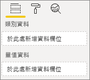
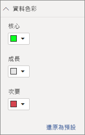

# <a name="build-a-bar-chart"></a>建置橫條圖

此文章是使用程式碼建置範例 Power BI 橫條圖的逐步指南。 您可以在 [https://github.com/Microsoft/PowerBI-visuals-sampleBarChart](https://github.com/Microsoft/PowerBI-visuals-sampleBarChart) \(英文\) 取得完整的程式碼範例。

## <a name="view-model"></a>檢視模型
請務必先定義橫條圖檢視模型，然後逐一查看您的視覺效果在建置時所公開的內容。

```typescript
/**
 * Interface for BarCharts viewmodel.
 *
 * @interface
 * @property {BarChartDataPoint[]} dataPoints - Set of data points the visual will render.
 * @property {number} dataMax                 - Maximum data value in the set of data points.
 */
interface BarChartViewModel {
    dataPoints: BarChartDataPoint[];
    dataMax: number;
};

/**
 * Interface for BarChart data points.
 *
 * @interface
 * @property {number} value    - Data value for the point.
 * @property {string} category - Corresponding category of the data value.
 */
interface BarChartDataPoint {
    value: number;
    category: string;
};
```

### <a name="use-static-data"></a>使用靜態資料

使用靜態資料是一種無需資料繫結即可測試視覺效果的好方法。 即使在稍後的步驟中加入資料繫結之後，您的檢視模型也不會變更。

```typescript
let testData: BarChartDataPoint[] = [
    {
        value: 10,
        category: 'a'
    },
    {
        value: 20,
        category: 'b'
    },
    {
        value: 1,
        category: 'c'
    },
    {
        value: 100,
        category: 'd'
    },
    {
        value: 500,
        category: 'e'
    }];

let viewModel: BarChartViewModel = {
    dataPoints: testData,
    dataMax: d3.max(testData.map((dataPoint) => dataPoint.value))
};
```

## <a name="data-binding"></a>資料繫結 
您可以透過在 *capabilities.json* 中定義視覺效果功能來新增資料繫結。 範例程式碼已經有可供您使用的結構描述。

資料繫結在 Power BI 中的**欄位**區上作用良好。



### <a name="add-data-roles"></a>新增資料角色
範例程式碼已經有資料角色，但是您可以加以自訂。

- `displayName` 是**欄位**區中顯示的名稱。
- `name` 是用來參考資料角色的內部名稱。
- `kind` 是欄位種類。 「分組」欄位 (0) 具有離散值。 「量值」欄位 (1) 具有數值資料值。

```json
"dataRoles": [
    {
        "displayName": "Category Data",
        "name": "category",
        "kind": 0
    },
    {
        "displayName": "Measure Data",
        "name": "measure",
        "kind": 1
    }
],
```

如需詳細資訊，請參閱[資料角色](./capabilities.md#define-the-data-fields-that-your-visual-expects-dataroles)。

### <a name="add-conditions-to-dataviewmapping"></a>將條件新增至 DataViewMapping
在 `dataViewMappings` 中定義條件，以設定每個欄位區可以繫結的欄位數目。 使用資料角色的內部 `name` 來參考每個欄位。

```json
    "dataViewMappings": [
        {
            "conditions": [
                {
                    "category": {
                        "max": 1
                    },
                    "measure": {
                        "max": 1
                    }
                }
            ],
        }
    ]
```

如需詳細資訊，請參閱[資料檢視對應](./dataview-mappings.md)。

### <a name="define-and-use-visualtransform"></a>定義並使用 visualTransform
`DataView` 是 Power BI 提供給您的視覺效果的結構，其中包含要視覺化的查詢資料。 不過，`DataView` 可以提供不同形式的資料，例如類別目錄與表格式。 若要建立類似橫條圖的類別視覺效果，您只需要使用 `DataView` 上的類別目錄屬性。 定義 `visualTransform` 可讓您將 `DataView` 轉換成視覺效果將使用的檢視模型。

若要在定義個別資料點時指派色彩並加以選取，您可以使用 `IVisualHost`。 

```typescript
/**
 * Function that converts queried data into a view model that will be used by the visual
 *
 * @function
 * @param {VisualUpdateOptions} options - Contains references to the size of the container
 *                                        and the dataView which contains all the data
 *                                        the visual had queried.
 * @param {IVisualHost} host            - Contains references to the host which contains services
 */
function visualTransform(options: VisualUpdateOptions, host: IVisualHost): BarChartViewModel {
    /*Convert dataView to your viewModel*/
}

```

## <a name="color"></a>色彩 
色彩會公開為 `IVisualHost` 上可用的其中一個服務。

### <a name="add-color-to-data-points"></a>將色彩新增至資料點
每一個資料點都由不同的色彩表示。 您會將色彩新增至 `BarChartDataPoint` 介面。

```typescript
/**
 * Interface for BarChart data points.
 *
 * @interface
 * @property {number} value    - Data value for the point.
 * @property {string} category - Corresponding category of the data value.
 * @property {string} color    - Color corresponding to the data point.
 */
interface BarChartDataPoint {
    value: number;
    category: string;
    color: string;
};
```

### <a name="the-colorpalette-service"></a>colorPalette 服務
`colorPalette` 服務會管理視覺效果中所使用的色彩。 其執行個體在 `IVisualHost` 上可以使用。

### <a name="assign-color-to-data-points"></a>將色彩指派給資料點
您將 `visualTransform` 定義為建構，以將 `dataView` 轉換成橫條圖可以使用的檢視模型。 由於您會逐一查看 `visualTransform` 中的資料點，因此這也是指派色彩的理想位置。

```typescript
let colorPalette: IColorPalette = host.colorPalette; // host: IVisualHost
for (let i = 0, len = Math.max(category.values.length, dataValue.values.length); i < len; i++) {
    barChartDataPoints.push({
        category: category.values[i],
        value: dataValue.values[i],
        color: colorPalette.getColor(category.values[i]).value,
    });
}
```

## <a name="selection-and-interactions"></a>選取項目與互動
選取項目可讓使用者與您的視覺效果和其他視覺效果互動。 

### <a name="add-selection-to-each-data-point"></a>將選取項目新增至每個資料點
由於每個資料點都是唯一的，因此請將選取項目新增至每個資料點。 您會在 `BarChartDataPoint` 介面上加入選取項目屬性。

```typescript
/**
 * Interface for BarChart data points.
 *
 * @interface
 * @property {number} value             - Data value for the point.
 * @property {string} category          - Corresponding category of data value.
 * @property {string} color             - Color corresponding to data point.
 * @property {ISelectionId} selectionId - Id assigned to data point for cross filtering
 *                                        and visual interaction.
 */
interface BarChartDataPoint {
    value: number;
    category: string;
    color: string;
    selectionId: ISelectionId;
};
```

### <a name="assign-selection-ids-to-each-data-point"></a>將選取項目識別碼指派給每個資料點
由於您會逐一查看 `visualTransform` 中的資料點，因此這也是建立選取項目識別碼的理想位置。 主機變數是 `IVisualHost`，其中包含視覺效果可能使用的服務，例如色彩與選取項目產生器。 

請使用 `IVisualHost` 上的 `createSelectionIdBuilder` Factory 方法來建立新的選取項目識別碼。 針對每個資料點建立新的選取項目產生器。

由於您只是根據類別來進行選取，因此您只需要定義選取項目 `withCategory`。

```typescript
for (let i = 0, len = Math.max(category.values.length, dataValue.values.length); i < len; i++) {
    barChartDataPoints.push({
        category: category.values[i],
        value: dataValue.values[i],
        color: colorPalette.getColor(category.values[i]).value,
        selectionId: host.createSelectionIdBuilder()
            .withCategory(category, i)
            .createSelectionId()
    });
}
```

如需詳細資訊，請參閱[建立選取項目產生器的執行個體](./selection-api.md#create-an-instance-of-the-selection-builder)。

### <a name="interact-with-data-points"></a>與資料點互動
一旦將選取項目識別碼指派給資料點，您就可以與橫條圖的每個橫條互動。 橫條圖會接聽 `click` 事件。

請使用 `IVisualHost` 上的 `selectionManager` Factory 方法，為交叉篩選和清除選取項目建立選取項目管理員。

```typescript
let selectionManager = this.selectionManager;

//This must be an anonymous function instead of a lambda because
//d3 uses 'this' as the reference to the element that was clicked.
bars.on('click', function(d) {
    selectionManager.select(d.selectionId).then((ids: ISelectionId[]) => {
        bars.attr({
            'fill-opacity': ids.length > 0 ? BarChart.Config.transparentOpacity : BarChart.Config.solidOpacity
        });

        d3.select(this).attr({
            'fill-opacity': BarChart.Config.solidOpacity
        });
    });

    (<Event>d3.event).stopPropagation();
});
```

如需詳細資訊，請參閱[如何使用 SelectionManager](./selection-api.md#how-to-use-selectionmanager-to-select-data-points)。

## <a name="static-objects"></a>靜態物件

您可以將物件加入至 [屬性] 窗格，以進一步自訂視覺效果。 這些自訂可以是使用者介面變更，或與所查詢資料相關的變更。 此範例會使用靜態物件來呈現橫條圖的 X 軸。

您可以在 [屬性] 窗格中開啟或關閉物件。

![[屬性] 窗格中的物件](./media/create-bar-chart/property-pane.png)

### <a name="define-objects-in-capabilities"></a>定義功能中的物件
在您的 *capabilities.json* 檔案中定義 `objects` 屬性，以使物件顯示在 [屬性] 窗格中。
- `enableAxis` 是 `dataView` 所參考的內部名稱。 
- `displayName` 是顯示在 [屬性] 窗格上的名稱。
- `bool` 是基本的值，通常搭配靜態物件使用，例如文字方塊或開關。
- `show` 是 `properties` 上的特殊屬性，可在物件上啟用 `show` 開關。 因為 `show` 是一個開關，所以其會輸入為 `bool`。


```typescript
"objects": {
    "enableAxis": {
        "displayName": "Enable Axis",
        "properties": {
            "show": {
                "displayName": "Enable Axis",
                "type": { "bool": true }
            }
        }
    }
}
```

如需詳細資訊，請參閱[物件](./objects-properties.md)。

### <a name="define-property-settings"></a>定義屬性設定

下列各節說明定義屬性設定的基本原則。 您也可以使用 `powerbi-visuals-utils-dataviewutils` 套件中定義的公用程式類別來定義屬性設定。 如需詳細資訊，請參閱 [DataViewObjectsParser](https://github.com/Microsoft/powerbi-visuals-utils-dataviewutils/blob/master/docs/api/data-view-objects-parser.md) \(英文\) 類別的文件與範例。


雖然是選擇性的，但最好將大部分的設定當地語系化為單一物件，以方便參考。

```typescript
/**
 * Interface for BarCharts viewmodel.
 *
 * @interface
 * @property {BarChartDataPoint[]} dataPoints - Set of data points the visual will render.
 * @property {number} dataMax                 - Maximum data value in the set of data points.
 * @property {BarChartSettings} settings      - Object property settings
 */
interface BarChartViewModel {
    dataPoints: BarChartDataPoint[];
    dataMax: number;
    settings: BarChartSettings;
};

/**
 * Interface for BarChart settings.
 *
 * @interface
 * @property "show" enableAxis - Object property that allows axis to be enabled.
 */
interface BarChartSettings {
    enableAxis: {
        show: boolean;
    };
}
```

### <a name="define-and-use-objectenumerationutility"></a>定義並使用 ObjectEnumerationUtility
物件屬性值以 `dataView` 上的中繼資料方式提供，但沒有任何服務可協助您擷取這些屬性。 `ObjectEnumerationUtility` 是一組靜態函式，可用於從 `dataView` 以及其他視覺效果專案中擷取物件值。 `ObjectEnumerationUtility` 是選擇性的，但非常適合用來逐一查看 `dataView` 以擷取物件屬性。

```typescript
/**
 * Gets property value for a particular object.
 *
 * @function
 * @param {DataViewObjects} objects - Map of defined objects.
 * @param {string} objectName       - Name of desired object.
 * @param {string} propertyName     - Name of desired property.
 * @param {T} defaultValue          - Default value of desired property.
 */
export function getValue<T>(objects: DataViewObjects, objectName: string, propertyName: string, defaultValue: T ): T {
    if(objects) {
        let object = objects[objectName];
        if(object) {
            let property: T = object[propertyName];
            if(property !== undefined) {
                return property;
            }
        }
    }
    return defaultValue;
}
```

有關原始程式碼，請參閱 [objectEnumerationUtility.ts](https://github.com/Microsoft/PowerBI-visuals-sampleBarChart/blob/master/src/objectEnumerationUtility.ts) \(英文\)。

### <a name="retrieve-property-values-from-dataview"></a>從 dataView 擷取屬性值
`visualTransform` 是操作視覺效果檢視模型的理想位置。 若要繼續此模式，請從 `dataView` 擷取物件屬性。

定義屬性的預設狀態，並使用 `getValue` 從 `dataView` 擷取屬性。

```typescript
let defaultSettings: BarChartSettings = {
    enableAxis: {
        show: false,
    }
};

let barChartSettings: BarChartSettings = {
    enableAxis: {
        show: getValue<boolean>(objects, 'enableAxis', 'show', defaultSettings.enableAxis.show),
    }
}
```

### <a name="populate-property-pane-with-enumerateobjectinstances"></a>使用 enumerateObjectInstances 填入 [屬性] 窗格
`IVisual` 上的 `enumerateObjectInstances` 選擇性方法會列舉所有物件，並將其放在 [屬性] 窗格中。 每個物件都是以 `enumerateObjectInstances` 呼叫。 物件的名稱可在 `EnumerateVisualObjectInstancesOptions` 上取得。

針對每個物件，使用其目前狀態定義屬性。

```typescript
/**
 * Enumerates through the objects defined in the capabilities and adds the properties to the format pane
 *
 * @function
 * @param {EnumerateVisualObjectInstancesOptions} options - Map of defined objects
 */
public enumerateObjectInstances(options: EnumerateVisualObjectInstancesOptions): VisualObjectInstanceEnumeration {
    let objectName = options.objectName;
    let objectEnumeration: VisualObjectInstance[] = [];

    switch(objectName) {
        case 'enableAxis':
            objectEnumeration.push({
                objectName: objectName,
                properties: {
                    show: this.barChartSettings.enableAxis.show,
                },
                selector: null
            });
    };

    return objectEnumeration;
}
```

### <a name="control-property-update-logic"></a>控制項屬性更新邏輯
將物件加入至 [屬性] 窗格後，每個切換都會觸發更新。 在 `if` 區塊中新增特定物件邏輯：

```typescript
if(settings.enableAxis.show) {
    let margins = BarChart.Config.margins;
    height -= margins.bottom;
}
```

## <a name="databound-objects"></a>資料繫結物件
資料繫結物件與靜態物件類似，但通常會處理資料選取。 例如，您可以變更與資料點相關聯的色彩。



### <a name="define-object-in-capabilities"></a>定義功能中的物件
與靜態物件類似，在 *capabilities.json* 中定義另一個物件。 
- `colorSelector` 是 `dataView` 所參考的內部名稱。
- `displayName` 是顯示在 [屬性] 窗格上的名稱。
- `fill` 是未與基本類型建立關聯的結構化物件值。

```typescript
"colorSelector": {
    "displayName": "Data Colors",
    "properties": {
        "fill": {
            "displayName": "Color",
            "type": {
                "fill": {
                    "solid": {
                        "color": true
                    }
                }
            }
        }
    }
}
```

如需詳細資訊，請參閱[物件](./objects-properties.md)。

### <a name="use-objectenumerationutility"></a>使用 ObjectEnumerationUtility
如同靜態物件，您需要從 `dataView` 擷取物件詳細資料。 但是，物件值會與每個類別相關聯，而不是在中繼資料內的物件值。

```typescript
/**
 * Gets property value for a particular object in a category.
 *
 * @function
 * @param {DataViewCategoryColumn} category - List of category objects.
 * @param {number} index                    - Index of category object.
 * @param {string} objectName               - Name of desired object.
 * @param {string} propertyName             - Name of desired property.
 * @param {T} defaultValue                  - Default value of desired property.
 */
export function getCategoricalObjectValue<T>(category: DataViewCategoryColumn, index: number, objectName: string, propertyName: string, defaultValue: T): T {
    let categoryObjects = category.objects;

    if(categoryObjects) {
        let categoryObject: DataViewObject = categoryObjects[index];
        if(categoryObject) {
            let object = categoryObject[objectName];
            if(object) {
                let property: T = object[propertyName];
                if(property !== undefined) {
                    return property;
                }
            }
        }
    }
    return defaultValue;
}
```

有關原始程式碼，請參閱 [objectEnumerationUtility.ts](https://github.com/Microsoft/PowerBI-visuals-sampleBarChart/blob/master/src/objectEnumerationUtility.ts) \(英文\)。

### <a name="define-default-color-and-retrieve-categorical-object-from-dataview"></a>定義預設色彩並從 dataView 擷取類別目錄物件
現在，每種色彩都與 `dataView` 內的每個類別相關聯。 您可以將每個資料點設定為其對應的色彩。

```typescript
for (let i = 0, len = Math.max(category.values.length, dataValue.values.length); i < len; i++) {
    let defaultColor: Fill = {
        solid: {
            color: colorPalette.getColor(category.values[i]).value
        }
    }

    barChartDataPoints.push({
        category: category.values[i],
        value: dataValue.values[i],
        color: getCategoricalObjectValue<Fill>(category, i, 'colorSelector', 'fill', defaultColor).solid.color,
        selectionId: host.createSelectionIdBuilder()
            .withCategory(category, i)
            .createSelectionId()
    });
}
```

### <a name="populate-property-pane-with-enumerateobjectinstances"></a>使用 enumerateObjectInstances 填入 [屬性] 窗格
使用 `enumerateObjectInstances` 將物件填入 [屬性] 窗格。 

針對此執行個體，請新增色彩選擇器，以在 [屬性] 窗格上轉譯每個類別。 若要這樣做，請針對 `colorSelector` 的 `switch` 陳述式新增額外的案例，並逐一查看具有相關聯色彩的每個資料點。 

需要進行選擇，才能將色彩與資料點產生關聯。

```typescript
/**
 * Enumerates through the objects defined in the capabilities and adds the properties to the format pane
 *
 * @function
 * @param {EnumerateVisualObjectInstancesOptions} options - Map of defined objects
 */
public enumerateObjectInstances(options: EnumerateVisualObjectInstancesOptions): VisualObjectInstanceEnumeration {
    let objectName = options.objectName;
    let objectEnumeration: VisualObjectInstance[] = [];

    switch(objectName) {
        case 'enableAxis':
            objectEnumeration.push({
                objectName: objectName,
                properties: {
                    show: this.barChartSettings.enableAxis.show,
                },
                selector: null
            });
            break;
        case 'colorSelector':
            for(let barDataPoint of this.barDataPoints) {
                objectEnumeration.push({
                    objectName: objectName,
                    displayName: barDataPoint.category,
                    properties: {
                        fill: {
                            solid: {
                                color: barDataPoint.color
                            }
                        }
                    },
                    selector: barDataPoint.selectionId.getSelector()
                });
            }
            break;
    };

    return objectEnumeration;
}
```

提供每個屬性的選取器之後，您會取得下列 `dataView` 物件陣列：


陣列 `dataViews[0].categorical.categories[0].objects` 中的每個項目都會對應至資料集的實體類別。

函式 `getCategoricalObjectValue` 只是提供一個方便的方式，依其類別索引來存取屬性。 您必須在 *capabilities.json* 中提供與物件和屬性符合的 `objectName` 和 `propertyName`。

## <a name="other-features"></a>其他功能 
您可以將滑桿控制項或工具提示加入至橫條圖。 有關要新增的程式碼，請參閱以下位置的提交：[新增屬性窗格滑桿以控制不透明度](https://github.com/Microsoft/PowerBI-visuals-sampleBarChart/commit/e2e0bc5888d9a3ca305a7a7af5046068645c8b30) \(英文\) 與[加入工具提示的支援](https://github.com/Microsoft/PowerBI-visuals-sampleBarChart/commit/981b021612d7b333adffe9f723ab27783c76fb14) \(英文\)。 如需有關工具提示的詳細資訊，請參閱 [Power BI 視覺效果中的工具提示](./add-tooltips.md)。

## <a name="packaging"></a>包裝材料

若要將視覺效果載入 [Power BI Desktop](https://powerbi.microsoft.com/desktop/)，或在 [Power BI 視覺效果資源庫](https://visuals.powerbi.com/) \(英文\) 中與社群分享，您必須加以封裝。 瀏覽至視覺效果專案的根資料夾，其中包含 *pbiviz.json* 檔案，並使用下列命令來產生 *pbiviz* 檔案：

```bash
pbiviz package
```
此命令會在視覺效果專案的 *dist/* 目錄中建立 *pbiviz* 檔案，並覆寫任何來自先前封裝作業的 *pbiviz* 檔案。

## <a name="next-steps"></a>後續步驟
您可以將下列功能新增至您的視覺效果：
* [將內容功能表加入至視覺效果](./context-menu.md)
* [登陸頁面](./landing-page.md)
* [啟動 URL](./launch-url.md)
* [地區設定支援](./localization.md)