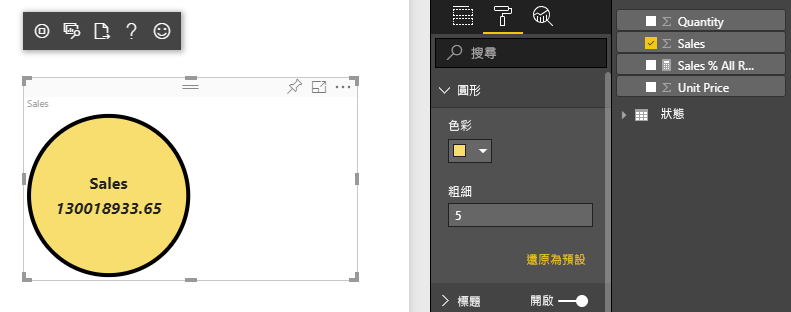
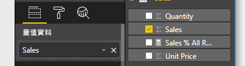

# <a name="tutorial-create-a-react-based-visual"></a>教學課程：建立以 React 為基礎的視覺效果

此教學課程說明如何使用 [React](https://reactjs.org/) 建立 Power BI 視覺效果。 該視覺效果以圓形顯示值。 該視覺效果有可自訂的自適性大小與設定。 使用此文章中的資訊，您可以使用 React 建立自己的 Power BI 視覺效果。



在本教學課程中，您會了解如何：

> [!div class="checklist"]
>
> * 設定開發環境
> * 建立 React 視覺效果
> * 設定視覺效果的功能
> * 從 Power BI 轉譯資料
> * 調整視覺效果的大小
> * 讓視覺效果可自訂

## <a name="prerequisites"></a>必要條件

* **Power BI Pro** 帳戶。 開始之前，請先[註冊免費試用](https://powerbi.microsoft.com/pricing/)。
* [Visual Studio Code](https://www.visualstudio.com/) \(英文\)。
* 適用於 Windows 使用者的 [Windows PowerShell](https://docs.microsoft.com/powershell/scripting/install/installing-windows-powershell?view=powershell-6) 4 或更新版本，或適用於 OSX 使用者的[終端機](https://macpaw.com/how-to/use-terminal-on-mac) \(英文\)。
* 如[設定開發人員環境](custom-visual-develop-tutorial.md#setting-up-the-developer-environment)所述的環境。

## <a name="getting-started"></a>開始使用

若要開始，請使用 `pbiviz` 建立簡易 Power BI 視覺效果。 如需專案與專案結構的詳細資訊，請參閱 [Power BI 視覺效果專案結構](visual-project-structure.md)。 如需此視覺效果的完整原始程式碼，請參閱[圓形卡片 React 視覺效果](https://github.com/Microsoft/powerbi-visuals-circlecard-react) \(英文\)。

您可以從 [GitHub](https://github.com/Microsoft/powerbi-visuals-circlecard-react) \(英文\) 複製或下載視覺效果的完整原始程式碼。

1. 開啟 PowerShell 並執行下列命令：

   ```powershell
   pbiviz new ReactCircleCard
   ```

   該命令會建立名為 *ReactCircleCard* 的資料夾。

1. 將目錄變更為該資料夾，並開啟 Visual Studio Code。

   ```powershell
   cd ./ReactCircleCard
   code .
   ```

1. 啟動視覺效果的開發人員伺服器。

   ```powershell
   pbiviz start
   ```

   

此基本視覺效果代表更新計數。 讓我們在下一個步驟將其轉換成圓形卡片。

## <a name="change-the-visual-to-a-circle-card"></a>將視覺效果變更為圓形卡片

此基本視覺效果代表更新計數。 接下來，將其轉換成圓形卡片，代表量值與其標題。

1. 執行下列命令以安裝必要相依性：

   ```powershell
   npm i react react-dom
   ```

1. 執行下列命令以安裝 React 16 與對應版本的 `react-dom` 與類型：

   ```powershell
   npm i @types/react @types/react-dom
   ```

1. 建立回應元件類別。 在 Visual Studio Code 中，選取 [檔案] > [新增檔案]。 將下列程式碼複製至該檔案。

    ```typescript
    import * as React from "react";

    export class ReactCircleCard extends React.Component<{}>{
        render(){
            return (
                <div className="circleCard">
                    Hello, React!
                </div>
            )
        }
    }

    export default ReactCircleCard;
    ```

1. 選取 [另存新檔]。 移至 [src] 目錄。 輸入名稱「元件」。 針對 [儲存為類型]，請選取 [TypeScript React]。

1. 開啟 *src/visual.ts*。 將目前的程式碼取代為下列程式碼：

    ```typescript
    "use strict";
    import powerbi from "powerbi-visuals-api";

    import DataView = powerbi.DataView;
    import VisualConstructorOptions = powerbi.extensibility.visual.VisualConstructorOptions;
    import VisualUpdateOptions = powerbi.extensibility.visual.VisualUpdateOptions;
    import IVisual = powerbi.extensibility.visual.IVisual;

    import "./../style/visual.less";

    export class Visual implements IVisual {

        constructor(options: VisualConstructorOptions) {

        }

        public update(options: VisualUpdateOptions) {

        }
    }
    ```

1. 匯入 React 相依性與您剛新增的元件。

    ```typescript
    import * as React from "react";
    import * as ReactDOM from "react-dom";
    ...
    import ReactCircleCard from "./component";
    ```

   預設 Power BI TypeScript 設定不接受 React *tsx* 檔案。 Visual Studio Code 將 `component` 醒目提示為錯誤。

1. 開啟 *tsconfig.json* 檔案，並將兩行加入 `compilerOptions` 項目的開頭。

    ```json
    {
      "compilerOptions": {
        "jsx": "react",
        "types": ["react", "react-dom"],
        //...
      }
    }
    ```

   `component` 上的錯誤應該會消失。

   若要轉譯元件，請新增目標 HTML 元素。 此元素是 `VisualConstructorOptions` 中傳遞至建構函式的 `HTMLElement`。

1. 修改 `Visual` 類別，如下列程式碼所示：

    ```typescript
      private target: HTMLElement;
      private reactRoot: React.ComponentElement<any, any>;

      constructor(options: VisualConstructorOptions) {
          this.reactRoot = React.createElement(ReactCircleCard, {});
          this.target = options.element;

          ReactDOM.render(this.reactRoot, this.target);
      }
    ```

1. 儲存變更並使用此命令執行現有程式碼：

    ```bash
    pbiviz start
    ```

   > [!NOTE]
   > 如果您先前已執行 `pbiviz`，則必須將其重新啟動，以在 *tsconfig.json* 中套用變更。

  ![視覺效果中的 [Hello React] 訊息](./media/create-react-visual/hello-react-message-visual.png)

## <a name="configure-capabilities"></a>設定功能

您可以設定視覺效果的功能。

1. 開啟 `capabilities.json`。 將 `Category Data` 物件從 `dataRoles` 移除。 `ReactCircleCard` 會顯示單一值，因此我們只需要 `Measure Data`。 `dataRoles` 機碼現在看起來像這樣：

    ```json
    "dataRoles": [
        {
            "displayName": "Measure Data",
            "name": "measure",
            "kind": "Measure"
        }
    ],
    ```

1. 移除 `objects` 機碼的所有內容。 您會在稍後填寫。

    ```json
        "objects": {},
    ```

1. 複製下列 `dataViewMappings` 屬性的程式碼。 `max: 1` 值表示只能提交一個量值資料行。

    ```json
        "dataViewMappings": [
            {
                "conditions": [
                    {
                        "measure": {
                            "max": 1
                        }
                    }
                ],
                "single": {
                    "role": "measure"
                }
            }
        ]
    ```

現在您可以將資料從 `Fields` 窗格帶入至視覺效果設定。



## <a name="receive-properties-from-power-bi"></a>從 Power BI 接收屬性

您可以使用 React 來轉譯資料。 元件可以顯示來自其本身狀態的資料。

1. 修改 *src/component.tsx*。

    ```javascript
    export interface State {
        textLabel: string,
        textValue: string
    }

    export const initialState: State = {
        textLabel: "",
        textValue: ""
    }

    export class ReactCircleCard extends React.Component<{}, State>{
        constructor(props: any){
            super(props);
            this.state = initialState;
        }

        render(){
            const { textLabel, textValue } = this.state;

            return (
                <div className="circleCard">
                    <p>
                        {textLabel}
                        <br/>
                        <em>{textValue}</em>
                    </p>
                </div>
            )
        }
    }
    ```

1. 透過編輯 *styles/visual.less* 來加入新標記的樣式。

    ```css
    .circleCard {
        position: relative;
        box-sizing: border-box;
        border: 1px solid #000;
        border-radius: 50%;
        width: 200px;
        height: 200px;
    }

    p {
        text-align: center;
        line-height: 30px;
        font-size: 20px;
        font-weight: bold;

        position: relative;
        top: -30px;
        margin: 50% 0 0 0;
    }
    ```

1. 視覺效果接收的目前資料是作為 `update` 方法的引數。 開啟 *src/visual.ts*，並將程式碼新增至 `ReactCircleCard.update`。

    ```typescript
    //...
    import { ReactCircleCard, initialState } from "./component";
    //...

    export class Visual implements IVisual {
        //...
        public update(options: VisualUpdateOptions) {

            if(options.dataViews && options.dataViews[0]){
                const dataView: DataView = options.dataViews[0];

                ReactCircleCard.update({
                    textLabel: dataView.metadata.columns[0].displayName,
                    textValue: dataView.single.value.toString()
                });
            }
            } else {
                this.clear();
            }
        }

        private clear() {
            ReactCircleCard.update(initialState);
        }
    }
    ```

    該程式碼從 `DataView` 選取 `textLabel` 與 `textValue`，如果資料存在，則會更新元件狀態。

1. 若要將更新傳送至元件執行個體，請在 `ReactCircleCard` 類別中插入下列程式碼：

    ```typescript
        private static updateCallback: (data: object) => void = null;

        public static update(newState: State) {
            if(typeof ReactCircleCard.updateCallback === 'function'){
                ReactCircleCard.updateCallback(newState);
            }
        }

        public state: State = initialState;

        public componentWillMount() {
            ReactCircleCard.updateCallback = (newState: State): void => { this.setState(newState); };
        }

        public componentWillUnmount() {
            ReactCircleCard.updateCallback = null;
        }
    ```

1. 測試視覺效果。 請確定已執行 `pbiviz start`，並儲存所有檔案。 重新整理視覺效果。

   

## <a name="make-component-resizable"></a>使元件能夠調整大小

在此節中，您將使元件可調整大小。 目前，元件有固定的寬度與高度。

從 `options` 物件取得視覺效果檢視區的目前大小。

1. 開啟 *src/visual.ts*。 匯入 `IViewport` 介面，並將 `viewport` 屬性新增至 `visual` 類別。

    ```typescript
    import IViewport = powerbi.IViewport;

    //...

    export class Visual implements IVisual {
        private viewport: IViewport;
        //...
    }
    ```

1. 將下列程式碼新增至 `visual` 的 `update` 方法。

    ```typescript
      if (options.dataViews && options.dataViews[0]) {
          const dataView: DataView = options.dataViews[0];

          this.viewport = options.viewport;
          const { width, height } = this.viewport;
          const size = Math.min(width, height);

          ReactCircleCard.update({
              size,
              //...
          });
      }
    ```

1. 在 *src/component.tsx* 中將屬性新增至 `State` 介面。

    ```typescript
    export interface State {
        //...
        size: number
    }

    const initialState: State = {
        //...
        size: 200
    }
    ```

1. 在 *src/component.tsx* 中的 `render` 方法中進行下列變更：

    ```typescript
        render() {
            const { textLabel, textValue, size } = this.state;

            const style: React.CSSProperties = { width: size, height: size };

            return (
                <div className="circleCard" style={style}>
                    {/* ... */}
                </div>
            )
        }
    ```

1. 將 *style/visual.less* 中的 `width` 與 `height` 規則取代為 `min-width` 與 `min-height`。

    ```css
        min-width: 200px;
        min-height: 200px;
    ```

現在您可以調整檢視區。 圓形直徑會對應至最小的寬度或高度。

## <a name="make-your-power-bi-visual-customizable"></a>讓您的 Power BI 視覺效果可自訂

在此節中，您將讓視覺效果可自訂。

1. 開啟 *capabilities.json*。 將下列設定新增至 `objects` 屬性。

    ```json
    //...
        "objects": {
            "circle": {
                "displayName": "Circle",
                "properties": {
                    "circleColor": {
                        "displayName": "Color",
                        "description": "The fill color of the circle.",
                        "type": {
                            "fill": {
                                "solid": {
                                    "color": true
                                }
                            }
                        }
                    },
                    "circleThickness": {
                        "displayName": "Thickness",
                        "description": "The circle thickness.",
                        "type": {
                            "numeric": true
                        }
                    }
                }
            }
        },
    //...
    ```

1. 將 *src/settings.ts* 中的現有程式碼取代為此程式碼：

    ```typescript
    "use strict";

    import { dataViewObjectsParser } from "powerbi-visuals-utils-dataviewutils";
    import DataViewObjectsParser = dataViewObjectsParser.DataViewObjectsParser;

    export class CircleSettings {
        public circleColor: string = "white";
        public circleThickness: number = 2;
    }

    export class VisualSettings extends DataViewObjectsParser {
        public circle: CircleSettings = new CircleSettings();
    }
    ```

1. 在 *src/visual.ts* 頂端新增這些 `import` 陳述式：

    ```typescript
    import VisualObjectInstance = powerbi.VisualObjectInstance;
    import EnumerateVisualObjectInstancesOptions = powerbi.EnumerateVisualObjectInstancesOptions;
    import VisualObjectInstanceEnumerationObject = powerbi.VisualObjectInstanceEnumerationObject;

    import { VisualSettings } from "./settings";

    ```

1. 將 `enumerateObjectInstances` 方法新增至 *src/visual.ts*。 此方法是用來套用視覺效果設定。

    ```typescript
    export class Visual implements IVisual {
        private settings: VisualSettings;

        //...

        public enumerateObjectInstances(
            options: EnumerateVisualObjectInstancesOptions
        ): VisualObjectInstance[] | VisualObjectInstanceEnumerationObject {

            return VisualSettings.enumerateObjectInstances(this.settings || VisualSettings.getDefault(), options);
        }
    }
    ```

1. 加入程式碼，讓 `dataView` 物件現在可以接收設定。

    ```typescript
        public update(options: VisualUpdateOptions) {

            if(options.dataViews && options.dataViews[0]){
                //...
                this.settings = VisualSettings.parse(dataView) as VisualSettings;
                const object = this.settings.circle;

                ReactCircleCard.update({
                    borderWidth: object && object.circleThickness ? object.circleThickness : undefined,
                    background: object && object.circleColor ? object.circleColor : undefined,
                    //...
                });
            }
        }
    }
    ```

1. 將對應的變更套用至 *src/component.tsx*，先將這些值新增至 `State`：

    ```typescript
    export interface State {
        //...
        background?: string,
        borderWidth?: number
    }
    ```

1. 然後，將下列程式碼新增至 `render` 方法：

    ```typescript
        const { /*...*/ background, borderWidth } = this.state;

        const style: React.CSSProperties = { /*...*/ background, borderWidth };
    ```

    

## <a name="next-steps"></a>後續步驟

如需 Power BI 開發的詳細資訊，請參閱 [Power BI 視覺效果指導方針](guidelines-powerbi-visuals.md)與 [Power BI 中的視覺效果](power-bi-visuals-concept.md)。