# <a name="tutorial-developing-a-power-bi-visual"></a>教學課程：開發 Power BI 視覺效果

開發人員可以輕鬆地將 Power BI 視覺效果加入 Power BI，以用於儀表板和報表。 為了協助您開始使用，我們已將所有視覺效果的程式碼發行到 GitHub。

除了視覺效果架構之外，我們還提供測試套件與工具，以協助社群建置適用於 Power BI 的高品質 Power BI 視覺效果。

此教學課程說明如何開發名為 Circle Card 的 Power BI 自訂視覺效果，以在圓形中顯示已設定格式的量值。 Circle Card 視覺效果支援自訂填滿色彩與外框粗細。

在 Power BI Desktop 報表中，卡片被修改成 Circle Cards。

  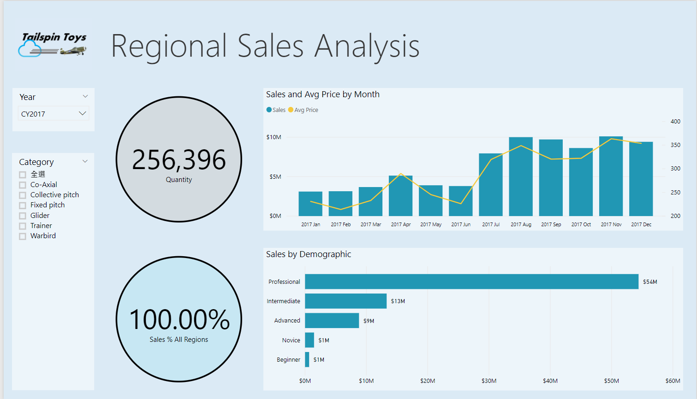

在本教學課程中，您會了解如何：
> [!div class="checklist"]
> * 建立 Power BI 自訂視覺效果。
> * 使用 D3 視覺效果元素開發自訂視覺效果。
> * 設定與視覺效果元素的資料繫結。
> * 設定資料值的格式。

## <a name="prerequisites"></a>先決條件

* 如果您尚未註冊 **Power BI Pro**，請先[註冊免費試用](https://powerbi.microsoft.com/pricing/)，再開始進行。
* 您需要安裝 [Visual Studio Code](https://www.visualstudio.com/)。
* 您需要適用於 Windows 使用者的 [Windows PowerShell](https://docs.microsoft.com/powershell/scripting/setup/installing-windows-powershell?view=powershell-6) 4 或更新版本，亦或是適用於 OSX 使用者的 [Terminal](https://macpaw.com/how-to/use-terminal-on-mac)。

## <a name="setting-up-the-developer-environment"></a>設定開發人員環境

除了先決條件之外，您還需要安裝幾個工具。

### <a name="installing-nodejs"></a>安裝 Node.js

1. 若要安裝 Node.js，請在網頁瀏覽器中瀏覽至 [Node.js](https://nodejs.org) \(英文\)。

2. 下載最新的功能 MSI 安裝程式。

3. 執行安裝程式，然後按照安裝步驟執行。 接受授權合約的條款與所有預設值。

   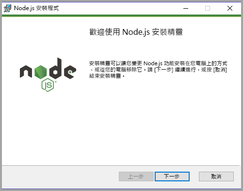

4. 將電腦重新開機。

### <a name="installing-packages"></a>安裝套件

現在，您必須安裝 **pbiviz** 套件。

1. 在電腦重新開機之後，開啟 Windows PowerShell。

2. 若要安裝 pbiviz，請輸入下列命令。

    ```powershell
    npm i -g powerbi-visuals-tools
    ```

### <a name="creating-and-installing-a-certificate"></a>建立及安裝憑證

#### <a name="windows"></a>Windows

1. 若要建立和安裝憑證，請輸入下列命令。

    ```powershell
    pbiviz --install-cert
    ```

    它會傳回產生「複雜密碼」  的結果。 在此案例中，「複雜密碼」  是 **_15105661266553327_** 。 它也會啟動 [憑證匯入精靈]。

    

2. 在 [憑證匯入精靈] 中，確認存放區位置已 設定為 [目前使用者]。 接著，選取 [下一步]  。

      

3. 在 [要匯入的檔案]  步驟中，選取 [下一步]  。

4. 在 [私密金鑰保護]  步驟中，在 [密碼] 方塊中，貼上您從建立憑證步驟收到的複雜密碼。同樣地，在此案例中，它是 **_15105661266553327_** 。

      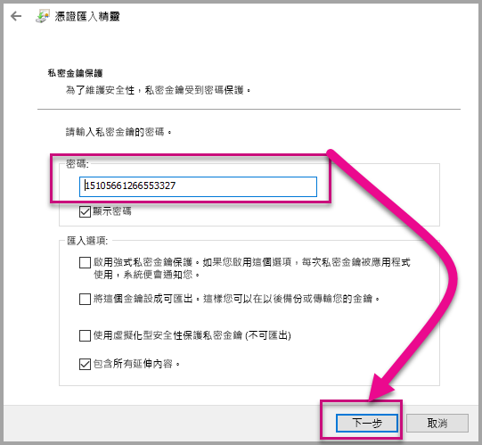

5. 在 [憑證存放區]  步驟中，選取 [將所有憑證放入以下的存放區]  選項。 接著，選取 [瀏覽]  。

      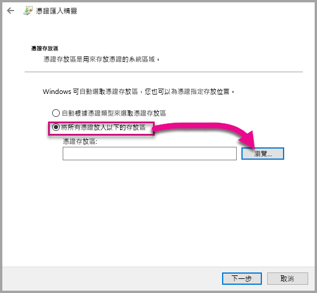

6. 在 [選取憑證存放區]  視窗中，選取 [受信任的根憑證授權單位]  ，然後選取 [確定]  。 接著，在 [憑證存放區]  畫面上，選取 [下一步]  。

      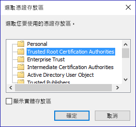

7. 若要完成匯入，請選取 [完成]  。

8. 如果您收到安全性警告，請選取 [是]  。

    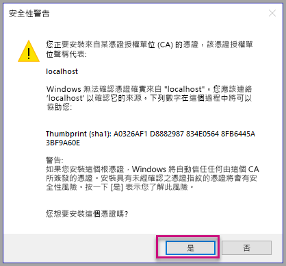

9. 當系統通知匯入成功時，請選取 [確定]  。

    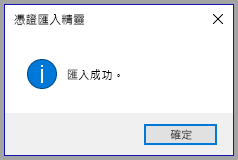

> [!Important]
> 請勿關閉 Windows PowerShell 工作階段。

#### <a name="osx"></a>OSX

1. 如果左上方的鎖為鎖定狀態，請選取該鎖以解除鎖定。 搜尋 *localhost* 並按兩下憑證。

    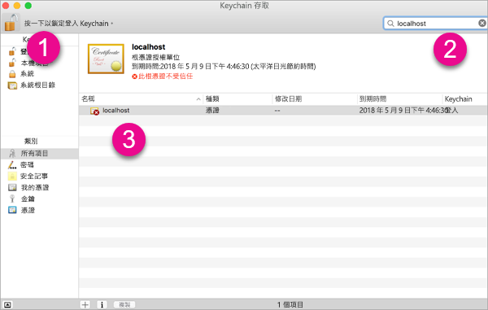

2. 選取 [永遠信任]  ，然後關閉視窗。

    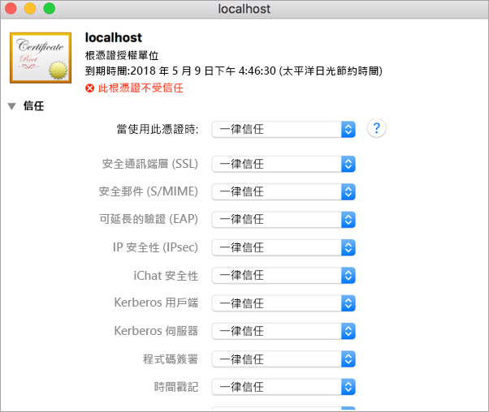

3. 輸入您的使用者名稱和密碼。 選取 [更新設定]  。

    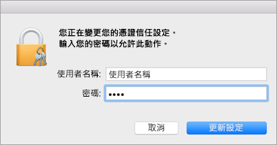

4. 關閉任何已開啟的瀏覽器。

> [!NOTE]
> 如果系統無法辨識憑證，您可能需要重新啟動電腦。

## <a name="creating-a-custom-visual"></a>建立自訂視覺效果

您現在已經設定好環境，可以開始建立視覺效果了。

您可以[下載](https://github.com/Microsoft/PowerBI-visuals-circlecard)此教學課程的完整原始程式碼。

1. 請確認已安裝 Power BI 視覺效果工具套件。

    ```powershell
    pbiviz
    ```
    您應該會看到下列說明的輸出。

    <pre><code>
        +syyso+/
    oms/+osyhdhyso/
    ym/       /+oshddhys+/
    ym/              /+oyhddhyo+/
    ym/                     /osyhdho
    ym/                           sm+
    ym/               yddy        om+
    ym/         shho /mmmm/       om+
        /    oys/ +mmmm /mmmm/       om+
    oso  ommmh +mmmm /mmmm/       om+
    ymmmy smmmh +mmmm /mmmm/       om+
    ymmmy smmmh +mmmm /mmmm/       om+
    ymmmy smmmh +mmmm /mmmm/       om+
    +dmd+ smmmh +mmmm /mmmm/       om+
            /hmdo +mmmm /mmmm/ /so+//ym/
                /dmmh /mmmm/ /osyhhy/
                    //   dmmd
                        ++

        PowerBI Custom Visual Tool

    Usage: pbiviz [options] [command]

    Commands:

    new [name]        Create a new visual
    info              Display info about the current visual
    start             Start the current visual
    package           Package the current visual into a pbiviz file
    update [version]  Updates the api definitions and schemas in the current visual. Changes the version if specified
    help [cmd]        display help for [cmd]

    Options:

    -h, --help      output usage information
    -V, --version   output the version number
    --install-cert  Install localhost certificate
    </code></pre>

    <a name="ssl-setup"></a>

2. 檢閱輸出，包括支援的命令清單。

    

3. 若要建立自訂視覺效果專案，請輸入下列命令。 **CircleCard** 是專案名稱。

    ```PowerShell
    pbiviz new CircleCard
    ```
    

    > [!Note]
    > 您可在目前提示的位置建立新專案。

4. 瀏覽至專案資料夾。

    ```powershell
    cd CircleCard
    ```
5. 啟動自訂視覺效果。 您的 CircleCard 視覺效果正在執行，且同時裝載在您的電腦上。

    ```powershell
    pbiviz start
    ```

    

> [!Important]
> 請勿關閉 Windows PowerShell 工作階段。

### <a name="testing-the-custom-visual"></a>測試自訂視覺效果

在此節中，我們將會上傳 Power BI Desktop 報表，然後編輯要顯示自訂視覺效果的報表，以測試 CircleCard 自訂視覺效果。

1. 登入 [PowerBI.com](https://powerbi.microsoft.com/) > 移至**齒輪圖示** > 然後選取 [設定]  。

      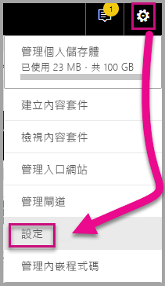

2. 選取 [開發人員]  ，然後選取 [啟用開發人員視覺效果以供測試]  核取方塊。

    ![[開發人員] 頁面設定](media/custom-visual-develop-tutorial/developer-page-settings.png)

3. 上傳 Power BI Desktop 報表。  

    [取得資料] > [檔案] > [本機檔案]。

    如果沒有已建立的報表，您可以[下載](https://microsoft.github.io/PowerBI-visuals/docs/step-by-step-lab/images/US_Sales_Analysis.pbix)範例 Power BI Desktop 報表。

    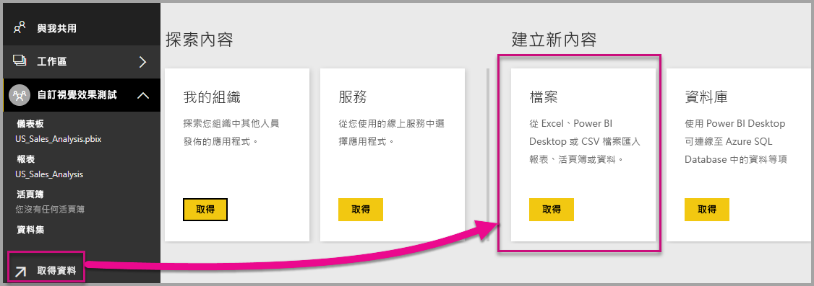 

    現在要檢視報表，從左側導覽窗格中的 [報表]  區段中選取 [US_Sales_Analysis]  。

    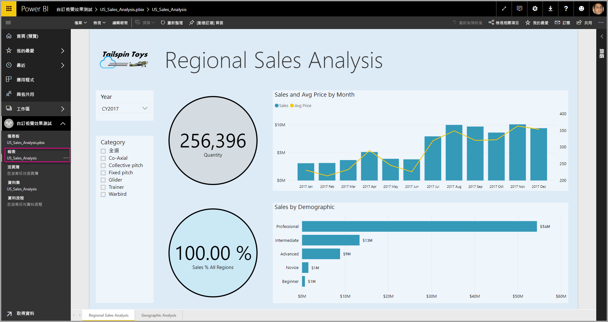

4. 現在，您需要在 Power BI 服務中編輯報表。

    移至 [編輯報表]  。

    

5. 從 [視覺效果]  窗格選取 [開發人員視覺效果]  。

    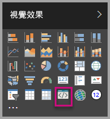

    > [!Note]
    > 此視覺效果會呈現您在電腦上啟動的自訂視覺效果。 只有在啟用開發人員設定時才能取得它。

6. 請注意視覺效果已新增至報表畫布。

    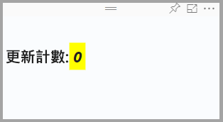

    > [!Note]
    > 這是非常簡單的視覺效果，它會顯示呼叫 Update 方法的次數。 在這個階段中，視覺效果尚未擷取任何資料。

7. 選取報表中新視覺效果的同時，移至 [欄位] 窗格 > 展開 [Sales] \(銷售\) > 選取 [Quantity] \(數量\)。

    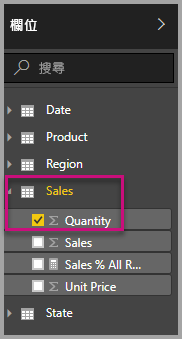

8. 然後測試新的視覺效果，調整視覺效果的大小，並注意 Update 值會遞增。

    

若要停止在 PowerShell 中執行的自訂視覺效果，請輸入 Ctrl + C。 當系統提示您終止批次作業時，請輸入 Y，然後按 Enter。

## <a name="adding-visual-elements"></a>新增視覺效果元素

現在，您必須安裝 **D3 JavaScript 程式庫**。 D3 是用來在網頁瀏覽器中產生動態、互動式資料視覺效果的 JavaScript 程式庫。 它使用廣為實作的 SVG HTML5 與 CSS 標準。

現在，您可以開發自訂視覺效果，以顯示包含文字的圓形。

> [!Note]
> 此教學課程中的許多文字項目都可以從[這裡](https://github.com/Microsoft/powerbi-visuals-circlecard)複製。

1. 若要在 PowerShell 中安裝 **D3 程式庫**，請輸入以下命令。

    ```powershell
    npm i d3@^5.0.0 --save
    ```

    ```powershell
    PS C:\circlecard>npm i d3@^5.0.0 --save
    + d3@5.11.0
    added 179 packages from 169 contributors and audited 306 packages in 33.25s
    found 0 vulnerabilities

    PS C:\circlecard>
    ```

2. 若要安裝 **D3 程式庫**的型別定義，請輸入以下命令。

    ```powershell
    npm i @types/d3@^5.0.0 --save
    ```

    ```powershell
    PS C:\circlecard>npm i @types/d3@^5.0.0 --save
    + @types/d3@5.7.2
    updated 1 package and audited 306 packages in 2.217s
    found 0 vulnerabilities

    PS C:\circlecard>
    ```

    此命令會安裝以 JavaScript 檔案為基礎的 TypeScript 定義，讓您可以在 TypeScript (JavaScript 的超集合) 中開發自訂視覺效果。 Visual Studio Code 是開發 TypeScript 應用程式的理想 IDE。

3. 若要在 PowerShell 中安裝 **core-js**，請輸入下列命令。

    ```powershell
    npm i core-js@3.2.1 --save
    ```

    ```powershell
    PS C:\circlecard> npm i core-js@3.2.1 --save

    > core-js@3.2.1 postinstall F:\circlecard\node_modules\core-js
    > node scripts/postinstall || echo "ignore"

    Thank you for using core-js ( https://github.com/zloirock/core-js ) for polyfilling JavaScript standard library!

    The project needs your help! Please consider supporting of core-js on Open Collective or Patreon:
    > https://opencollective.com/core-js
    > https://www.patreon.com/zloirock

    + core-js@3.2.1
    updated 1 package and audited 306 packages in 6.051s
    found 0 vulnerabilities

    PS C:\circlecard>
    ```

    此命令會安裝適用於 JavaScript 的模組化標準程式庫。 它包括適用於 ECMAScript (最新到 2019) 的外掛程式。 深入了解 [`core-js`](https://www.npmjs.com/package/core-js)

4. 若要在 PowerShell 中安裝 **powerbi-visual-api**，請輸入下列命令。

    ```powershell
    npm i powerbi-visuals-api --save-dev
    ```

    ```powershell
    PS C:\circlecard>npm i powerbi-visuals-api --save-dev

    + powerbi-visuals-api@2.6.1
    updated 1 package and audited 306 packages in 2.139s
    found 0 vulnerabilities

    PS C:\circlecard>
    ```

    此命令會安裝 Power BI 視覺效果 API 定義。

5. 啟動 [Visual Studio Code](https://code.visualstudio.com/)。

    您可以使用下列命令從 PowerShell 啟動 **Visual Studio Code**。

    ```powershell
    code .
    ```

6. 在 [檔案總管]  窗格中，展開 [node_modules]  資料夾，以確認已經安裝 **D3 程式庫**。

    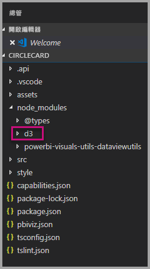

7. 確定已新增 **index.d.ts** 檔案，方式是展開[檔案總管窗格]  中的 node_modules > @types > d3。

    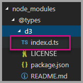

### <a name="developing-the-visual-elements"></a>開發視覺效果元素

現在我們可以探索如何開發自訂視覺效果，以顯示圓形與範例文字。

1. 在 [檔案總管]  窗格中，展開 [src]  資料夾，然後選取 [visual.ts]  。

    > [!Note]
    > 請注意在 **visual.ts** 檔案頂端的註解。 使用 Power BI 自訂視覺效果的權限是根據 MIT 授權的規定免費授與的。 根據該合約所規定，您必須將註解保留在檔案頂端。

2. 將下列預設的自訂視覺效果邏輯從 Visual 類別中移除。
    * 四個類別層級的私用變數宣告。
    * 來自建構函式的所有程式碼行。
    * 來自 update 方法的所有程式碼行。
    * 模組中其餘各行，包括 parseSettings 與 enumerateObjectInstances 方法。

    確認模組程式碼看起來像下面這樣。

    ```typescript
    "use strict";
    import "core-js/stable";
    import "../style/visual.less";
    import powerbi from "powerbi-visuals-api";
    import IVisual = powerbi.extensibility.IVisual;
    import VisualConstructorOptions = powerbi.extensibility.visual.VisualConstructorOptions;
    import VisualUpdateOptions = powerbi.extensibility.visual.VisualUpdateOptions;

    import * as d3 from "d3";
    type Selection<T extends d3.BaseType> = d3.Selection<T, any,any, any>;

    export class Visual implements IVisual {

        constructor(options: VisualConstructorOptions) {

        }

        public update(options: VisualUpdateOptions) {

        }
    }
    ```

3. 在 *Visual* 類別宣告下方，插入下列類別層級屬性。

    ```typescript
    export class Visual implements IVisual {
        // ...
        private host: IVisualHost;
        private svg: Selection<SVGElement>;
        private container: Selection<SVGElement>;
        private circle: Selection<SVGElement>;
        private textValue: Selection<SVGElement>;
        private textLabel: Selection<SVGElement>;
        // ...
    }
    ```

    

4. 將下列程式碼新增到 *constructor*。

    ```typescript
    this.svg = d3.select(options.element)
        .append('svg')
        .classed('circleCard', true);
    this.container = this.svg.append("g")
        .classed('container', true);
    this.circle = this.container.append("circle")
        .classed('circle', true);
    this.textValue = this.container.append("text")
        .classed("textValue", true);
    this.textLabel = this.container.append("text")
        .classed("textLabel", true);
    ```

    此程式碼會在視覺效果中新增 SVG 群組，然後新增三個圖形：一個圓形與兩個文字元素。

    若要設定文件中程式碼的格式，請在 **Visual Studio Code 文件**中以滑鼠右鍵選取任一處，然後選取 [格式化文件]  。

      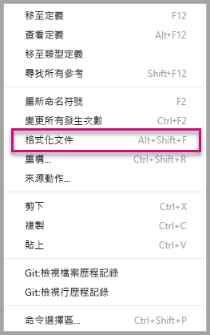

    若要改善可讀性，建議您每次貼上程式碼片段之後，都對文件進行格式設定。

5. 將下列程式碼新增到 *update* 方法。

    ```typescript
    let width: number = options.viewport.width;
    let height: number = options.viewport.height;
    this.svg.attr("width", width);
    this.svg.attr("height", height);
    let radius: number = Math.min(width, height) / 2.2;
    this.circle
        .style("fill", "white")
        .style("fill-opacity", 0.5)
        .style("stroke", "black")
        .style("stroke-width", 2)
        .attr("r", radius)
        .attr("cx", width / 2)
        .attr("cy", height / 2);
    let fontSizeValue: number = Math.min(width, height) / 5;
    this.textValue
        .text("Value")
        .attr("x", "50%")
        .attr("y", "50%")
        .attr("dy", "0.35em")
        .attr("text-anchor", "middle")
        .style("font-size", fontSizeValue + "px");
    let fontSizeLabel: number = fontSizeValue / 4;
    this.textLabel
        .text("Label")
        .attr("x", "50%")
        .attr("y", height / 2)
        .attr("dy", fontSizeValue / 1.2)
        .attr("text-anchor", "middle")
        .style("font-size", fontSizeLabel + "px");
    ```

    此程式碼會設定視覺效果的寬與高，然後將視覺效果元素的的屬性與樣式初始化。 

6. 儲存 **visual.ts** 檔案。

7. 選取 [capabilities.json]  檔案。

    在第 14 行，移除整個物件元素 (第 14-60 行)。

8. 儲存 **capabilities.json** 檔案。

9. 在 PowerShell 中，啟動自訂視覺效果。

    ```powershell
    pbiviz start
    ```

### <a name="toggle-auto-reload"></a>切換自動重新載入

1. 瀏覽回到 Power BI 報表。
2. 在開發人員視覺效果上方浮動的工具列中，選取 [切換自動重新載入]  。

    

    此選項可確保您每次儲存專案變更時，視覺效果都會自動重新載入。

3. 從 [欄位]  窗格中，將 [Quantity]  \(數量\) 欄位拖曳到開發人員視覺效果中。

4. 確認視覺效果看起來像下面這樣。

    

5. 調整視覺效果的大小。

    請注意圓形與文字會縮放，以符合視覺效果的可用範圍。

    隨著調整視覺效果的大小，update 方法會持續被呼叫，因此產生視覺效果元素的流暢縮放。

    您現在已經開發視覺效果元素。

6. 繼續執行視覺效果。

## <a name="process-data-in-the-visual-code"></a>處理視覺效果程式碼中的資料

定義資料角色與資料檢視對應，然後修改自訂視覺效果邏輯以顯示量值的值與顯示名稱。

### <a name="configuring-the-capabilities"></a>設定功能

修改 **capabilities.json** 檔案，以定義資料角色與資料檢視對應。

1. 在 Visual Studio Code 中，於 **capabilities.json** 檔案內，將 **dataRoles** 陣列中的所有內容 (第 3-12 行) 都移除。

2. 在 **dataRoles** 陣列中，插入下列程式碼。

    ```json
    {
        "displayName": "Measure",
        "name": "measure",
        "kind": "Measure"
    }
    ```

    **dataRoles** 陣列現在定義類型為 **measure** 的單一資料角色，其名稱為 **measure**，且顯示為 **Measure**。 此資料角色可讓您傳遞量值欄位或加總之後的欄位。

3. 在 **dataViewMappings** 陣列中，將所有內容 (第 10-31 行) 都移除。

4. 在 **dataViewMappings** 陣列中，插入下列內容。

    ```json
    {
        "conditions": [
            { "measure": { "max": 1 } }
        ],
        "single": {
            "role": "measure"
        }
    }
    ```

    **dataViewMappings** 陣列現在定義一個可以傳遞到名為 **measure** 之資料角色的欄位。

5. 儲存 **capabilities.json** 檔案。

6. 在 Power BI 中，請注意視覺效果現在可以使用 [Measure]  \(量值\) 來設定。

    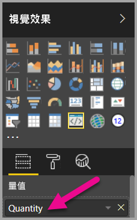

    > [!Note]
    > 視覺效果尚未包含資料繫結邏輯。

### <a name="exploring-the-dataview"></a>探索資料檢視

1. 在視覺效果上方浮動的工具列中，選取 [顯示資料檢視]  。

    

2. 向下展開到 [single]  ，然後注意該值。

    

3. 向下展開到 [metadata]  中，然後到 [columns]  陣列中，並請特別注意 [format]  與 [displayName]  值。

    

4. 若要切換回到視覺效果，在視覺效果上方浮動的工具列中，選取 [顯示資料檢視]  。

    

### <a name="consume-data-in-the-visual-code"></a>取用視覺效果程式碼中的資料

1. 在 **Visual Studio Code** 的 **visual.ts** 檔案中，

    從 `powerbi` 模組匯入 `DataView` 介面

    ```typescript
    import DataView = powerbi.DataView;
    ```

    並將下列陳述式新增為更新方法的第一個陳述式。

    ```typescript
    let dataView: DataView = options.dataViews[0];
    ```

    

    為了方便存取，陳述式將 *dataView* 指派給變數，然後宣告該變數參考 *dataView* 物件。

2. 在 **update** 方法中，將 **.text("Value")** 取代成下列項目。

    ```typescript
    .text(<string>dataView.single.value)
    ```

    

3. 在 **update** 方法中，將 **.text("Label")** 取代成下列項目。

    ```typescript
    .text(dataView.metadata.columns[0].displayName)
    ```

    

4. 儲存 **visual.ts** 檔案。

5. 在 [Power BI]  中，檢閱視覺效果，它現在會顯示值與顯示名稱。

您現在已經設定資料角色，並將視覺效果繫結到資料檢視。

在下一個教學課程中，您將了解如何將格式設定選項新增到自訂視覺效果。

## <a name="debugging"></a>偵錯

如需偵錯自訂視覺效果的祕訣，請參閱[偵錯指南](https://microsoft.github.io/PowerBI-visuals/docs/how-to-guide/how-to-debug/)。

## <a name="next-steps"></a>後續步驟

> [!div class="nextstepaction"]
> [新增格式設定選項](custom-visual-develop-tutorial-format-options.md)
