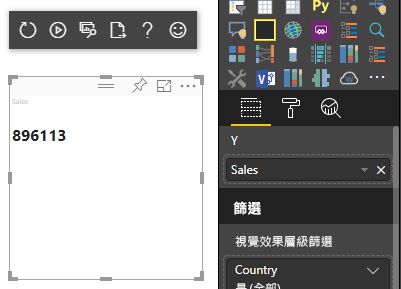
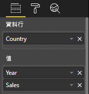

# <a name="understand-data-view-mapping-in-power-bi-visuals"></a>了解 Power BI 視覺效果中的資料檢視對應

此文章說明資料檢視對應，也描述資料角色的相互關係，並可讓您指定其條件式需求。 此文章也說明每個 `dataMappings` 類型。

每個有效對應都會產生資料檢視，但我們目前僅支援針對每個視覺效果執行一個查詢。 您通常只會取得一個資料檢視。 不過，您可以提供具有特定條件的多個資料對應，允許的設定如下：

```json
"dataViewMappings": [
    {
        "conditions": [ ... ],
        "categorical": { ... },
        "single": { ... },
        "table": { ... },
        "matrix": { ... }
    }
]
```

只有在 `dataViewMappings` 中填入有效的對應時，Power BI 才會建立資料檢視的對應。

換句話說，`dataViewMappings` 中可能已定義 `categorical`，但未定義其他對應 (例如，`table` 或 `single`)。 例如：

```json
"dataViewMappings": [
    {
        "categorical": { ... }
    }
]
```

Power BI 產生具有單一 `categorical` 對應的資料檢視，且未定義 `table` 和其他對應：

```javascript
{
    "categorical": {
        "categories": [ ... ],
        "values": [ ... ]
    },
    "metadata": { ... }
}
```

## <a name="conditions"></a>條件

本節描述特定資料對應的條件。 您可以提供多組條件，如果資料符合其中一組描述的條件，視覺效果會將資料接受為有效。

目前，您可以為每個欄位指定最小值和最大值。 該值代表可以繫結至該資料角色的欄位數目。 

> [!NOTE]
> 如果條件中省略了資料角色，則可以有任意數目的欄位。

### <a name="example-1"></a>範例 1

您可以將多個欄位拖曳到每個資料角色。 在此範例中，您會將類別限制為一個資料欄位，並將量值限制為兩個資料欄位。

```json
"conditions": [
    { "category": { "max": 1 }, "y": { "max": 2 } },
]
```

### <a name="example-2"></a>範例 2

在此範例中，需要兩個條件其中之一：
* 類別目錄資料欄位只有一個，且量值只有兩個
* 類別目錄只有兩個，且量值只有一個。

```json
"conditions": [
    { "category": { "min": 1, "max": 1 }, "measure": { "min": 2, "max": 2 } },
    { "category": { "min": 2, "max": 2 }, "measure": { "min": 1, "max": 1 } }
]
```

## <a name="single-data-mapping"></a>單一資料對應

單一資料對應是資料對應的最簡單形式。 它會接受單一量值欄位，並為您提供總計。 如果欄位是數值，則會為您提供總和。 否則，它會為您提供唯一值的計數。

若要使用單一資料對應，您必須定義想要對應的資料角色名稱。 這個對應只使用單一量值欄位。 如果指派第二個欄位，就不會產生資料檢視，因此，也建議您包含將資料限制為單一欄位的條件。

> [!NOTE]
> 此資料對應不能與任何其他資料對應一起使用。 其目的是要將資料縮減為單一數值。

### <a name="example-3"></a>範例 3

```json
{
    "dataRoles": [
        {
            "displayName": "Y",
            "name": "Y",
            "kind": "Measure"
        }
    ],
    "dataViewMappings": [
        {
            "conditions": [
                {
                    "Y": {
                        "max": 1
                    }
                }
            ],
            "single": {
                "role": "Y"
            }
        }
    ]
}
```

產生的資料檢視仍包含其他類型 (資料表、類別目錄等)，但每個對應只包含單一值。 最佳做法是只存取單一值。

```JSON
{
    "dataView": [
        {
            "metadata": null,
            "categorical": null,
            "matrix": null,
            "table": null,
            "tree": null,
            "single": {
                "value": 94163140.3560001
            }
        }
    ]
}
```

處理簡單資料檢視對應的程式碼範例

```typescript
"use strict";
import powerbi from "powerbi-visuals-api";
import DataView = powerbi.DataView;
import DataViewSingle = powerbi.DataViewSingle;
// standart imports
// ...

export class Visual implements IVisual {
    private target: HTMLElement;
    private host: IVisualHost;
    private valueText: HTMLParagraphElement;

    constructor(options: VisualConstructorOptions) {
        // constructor body
        this.target = options.element;
        this.host = options.host;
        this.valueText = document.createElement("p");
        this.target.appendChild(this.valueText);
        // ...
    }

    public update(options: VisualUpdateOptions) {
        const dataView: DataView = options.dataViews[0];
        const singleDataView: DataViewSingle = dataView.single;

        if (!singleDataView ||
            !singleDataView.value ) {
            return
        }

        this.valueText.innerText = singleDataView.value.toString();
    }
}
```

因此，視覺效果會顯示來自 Power BI 的單一值：



## <a name="categorical-data-mapping"></a>類別目錄資料對應

類別目錄資料對應是用來取得一或兩個獨立的資料群組。

### <a name="example-4"></a>範例 4

以下是上述範例中關於資料角色的定義：

```json
"dataRole":[
    {
        "displayName": "Category",
        "name": "category",
        "kind": "Grouping"
    },
    {
        "displayName": "Y Axis",
        "name": "measure",
        "kind": "Measure"
    }
]
```

對應如下：

```json
"dataViewMappings": {
    "categorical": {
        "categories": {
            "for": { "in": "category" }
        },
        "values": {
            "select": [
                { "bind": { "to": "measure" } }
            ]
        }
    }
}
```

這是簡單的範例。 意思是「對應我的 `category` 資料角色，使我拖曳至 `category` 的每個欄位，其資料都對應到 `categorical.categories`。 也將我的 `measure` 資料角色對應到 `categorical.values`」。

* **for...in**：對於此資料角色中的所有項目，將它們包含在資料查詢中。
* **bind...to**：產生與 *for...in* 相同的結果，但預期資料角色會有將其限制為單一欄位的條件。

### <a name="example-5"></a>範例 5

在此範例中，我們將使用上述範例的前兩個資料角色，另外定義 `grouping` 和 `measure2`。

```json
"dataRole":[
    {
        "displayName": "Category",
        "name": "category",
        "kind": "Grouping"
    },
    {
        "displayName": "Y Axis",
        "name": "measure",
        "kind": "Measure"
    },
    {
        "displayName": "Grouping with",
        "name": "grouping",
        "kind": "Grouping"
    },
    {
        "displayName": "X Axis",
        "name": "measure2",
        "kind": "Grouping"
    }
]
```

對應如下：

```json
"dataViewMappings":{
    "categorical": {
        "categories": {
            "for": { "in": "category" }
        },
        "values": {
            "group": {
                "by": "grouping",
                "select":[
                    { "bind": { "to": "measure" } },
                    { "bind": { "to": "measure2" } }
                ]
            }
        }
    }
}
```

此處的差異在於我們如何對應 categorical.values。 我們表示「對應要依資料角色 `grouping` 分組的 `measure` 和 `measure2` 資料角色」。

### <a name="example-6"></a>範例 6

以下是資料角色：

```json
"dataRoles": [
    {
        "displayName": "Categories",
        "name": "category",
        "kind": "Grouping"
    },
    {
        "displayName": "Measures",
        "name": "measure",
        "kind": "Measure"
    },
    {
        "displayName": "Series",
        "name": "series",
        "kind": "Measure"
    }
]
```

以下是資料檢視對應：

```json
"dataViewMappings": [
    {
        "categorical": {
            "categories": {
                "for": {
                    "in": "category"
                }
            },
            "values": {
                "group": {
                    "by": "series",
                    "select": [{
                            "for": {
                                "in": "measure"
                            }
                        }
                    ]
                }
            }
        }
    }
]
```

類別目錄資料檢視的視覺化方式如下：

| 類別目錄 |  |  | | | |
|-----|-----|------|------|------|------|
| | 年 | 2013 | 2014 | 2015 | 2016 |
| 國家/地區 | | |
| 美國 | | x | x | 650 | 350 |
| 加拿大 | | x | 630 | 490 | x |
| 墨西哥 | | 645 | x | x | x |
| 英國 | | x | x | 831 | x |

Power BI 將它產生為類別目錄資料檢視。 這是一組類別。

```JSON
{
    "categorical": {
        "categories": [
            {
                "source": {...},
                "values": [
                    "Canada",
                    "USA",
                    "UK",
                    "Mexico"
                ],
                "identity": [...],
                "identityFields": [...],
            }
        ]
    }
}
```

每個類別也會對應到一組值。 每一個值都會依數列 (以年份表示) 分組。

例如，每個 `values` 陣列都代表每年的資料。
此外，每個 `values` 陣列各有 4 個值，分別適用於加拿大、美國、英國和墨西哥：

```JSON
{
    "values": [
        // Values for 2013 year
        {
            "source": {...},
            "values": [
                null, // Value for `Canada` category
                null, // Value for `USA` category
                null, // Value for `UK` category
                645 // Value for `Mexico` category
            ],
            "identity": [...],
        },
        // Values for 2014 year
        {
            "source": {...},
            "values": [
                630, // Value for `Canada` category
                null, // Value for `USA` category
                null, // Value for `UK` category
                null // Value for `Mexico` category
            ],
            "identity": [...],
        },
        // Values for 2015 year
        {
            "source": {...},
            "values": [
                490, // Value for `Canada` category
                650, // Value for `USA` category
                831, // Value for `UK` category
                null // Value for `Mexico` category
            ],
            "identity": [...],
        },
        // Values for 2016 year
        {
            "source": {...},
            "values": [
                null, // Value for `Canada` category
                350, // Value for `USA` category
                null, // Value for `UK` category
                null // Value for `Mexico` category
            ],
            "identity": [...],
        }
    ]
}
```

處理類別資料檢視對應的程式碼範例如下所述。 此範例會建立階層式結構 `Country => Year => Value`

```typescript
"use strict";
import powerbi from "powerbi-visuals-api";
import DataView = powerbi.DataView;
import DataViewDataViewCategoricalSingle = powerbi.DataViewCategorical;
import DataViewValueColumnGroup = powerbi.DataViewValueColumnGroup;
import PrimitiveValue = powerbi.PrimitiveValue;
// standart imports
// ...

export class Visual implements IVisual {
    private target: HTMLElement;
    private host: IVisualHost;
    private categories: HTMLElement;

    constructor(options: VisualConstructorOptions) {
        // constructor body
        this.target = options.element;
        this.host = options.host;
        this.categories = document.createElement("pre");
        this.target.appendChild(this.categories);
        // ...
    }

    public update(options: VisualUpdateOptions) {
        const dataView: DataView = options.dataViews[0];
        const categoricalDataView: DataViewCategorical = dataView.categorical;

        if (!categoricalDataView ||
            !categoricalDataView.categories ||
            !categoricalDataView.categories[0] ||
            !categoricalDataView.values) {
            return;
        }

        // Categories have only one column in data buckets
        // If you want to support several columns of categories data bucket, you should iterate categoricalDataView.categories array.
        const categoryFieldIndex = 0;
        // Measure has only one column in data buckets.
        // If you want to support several columns on data bucket, you should iterate years.values array in map function
        const measureFieldIndex = 0;
        let categories: PrimitiveValue[] = categoricalDataView.categories[categoryFieldIndex].values;
        let values: DataViewValueColumnGroup[] = categoricalDataView.values.grouped();

        let data = {};
        // iterate categories/countries
        categories.map((category: PrimitiveValue, categoryIndex: number) => {
            data[category.toString()] = {};
            // iterate series/years
            values.map((years: DataViewValueColumnGroup) => {
                if (!data[category.toString()][years.name] && years.values[measureFieldIndex].values[categoryIndex]) {
                    data[category.toString()][years.name] = []
                }
                if (years.values[0].values[categoryIndex]) {
                    data[category.toString()][years.name].push(years.values[measureFieldIndex].values[categoryIndex]);
                }
            });
        });

        this.categories.innerText = JSON.stringify(data, null, 6);
        console.log(data);
    }
}
```

視覺效果的結果：


## <a name="table-data-mapping"></a>資料表資料對應

資料表資料檢視是簡單的資料對應。 基本上，它是可彙總數值資料點的資料點清單。

### <a name="example-7"></a>範例 7

具有指定功能：

```json
"dataRoles": [
    {
        "displayName": "Column",
        "name": "column",
        "kind": "Grouping"
    },
    {
        "displayName": "Value",
        "name": "value",
        "kind": "Measure"
    }
]
```

```json
"dataViewMappings": [
    {
        "table": {
            "rows": {
                "select": [
                    {
                        "for": {
                            "in": "column"
                        }
                    },
                    {
                        "for": {
                            "in": "value"
                        }
                    }
                ]
            }
        }
    }
]
```

您可以下列方式將資料表資料檢視視覺化：  

資料範例：

| 國家/地區| 年 | 銷售 |
|-----|-----|------|
| 美國 | 2016 | 100 |
| 美國 | 2015 | 50 |
| 加拿大 | 2015 | 200 |
| 加拿大 | 2015 | 50 |
| 墨西哥 | 2013 | 300 |
| 英國 | 2014 | 150 |
| 美國 | 2015 | 75 |

資料繫結：



Power BI 會將您的資料顯示為資料表資料檢視。 您不應該假設資料已排序。

```JSON
{
    "table" : {
        "columns": [...],
        "rows": [
            [
                "Canada",
                2014,
                630
            ],
            [
                "Canada",
                2015,
                490
            ],
            [
                "Mexico",
                2013,
                645
            ],
            [
                "UK",
                2014,
                831
            ],
            [
                "USA",
                2015,
                650
            ],
            [
                "USA",
                2016,
                350
            ]
        ]
    }
}
```

您可以選取所需的欄位，然後選取 [加總]，來彙總資料。  


處理資料表資料檢視對應的程式碼範例。

```typescript
"use strict";
import "./../style/visual.less";
import powerbi from "powerbi-visuals-api";
// ...
import DataViewMetadataColumn = powerbi.DataViewMetadataColumn;
import DataViewTable = powerbi.DataViewTable;
import DataViewTableRow = powerbi.DataViewTableRow;
import PrimitiveValue = powerbi.PrimitiveValue;
// other imports
// ...

export class Visual implements IVisual {
    private target: HTMLElement;
    private host: IVisualHost;
    private table: HTMLParagraphElement;

    constructor(options: VisualConstructorOptions) {
        // constructor body
        this.target = options.element;
        this.host = options.host;
        this.table = document.createElement("table");
        this.target.appendChild(this.table);
        // ...
    }

    public update(options: VisualUpdateOptions) {
        const dataView: DataView = options.dataViews[0];
        const tableDataView: DataViewTable = dataView.table;

        if (!tableDataView) {
            return
        }
        while(this.table.firstChild) {
            this.table.removeChild(this.table.firstChild);
        }

        //draw header
        const tableHeader = document.createElement("th");
        tableDataView.columns.forEach((column: DataViewMetadataColumn) => {
            const tableHeaderColumn = document.createElement("td");
            tableHeaderColumn.innerText = column.displayName
            tableHeader.appendChild(tableHeaderColumn);
        });
        this.table.appendChild(tableHeader);

        //draw rows
        tableDataView.rows.forEach((row: DataViewTableRow) => {
            const tableRow = document.createElement("tr");
            row.forEach((columnValue: PrimitiveValue) => {
                const cell = document.createElement("td");
                cell.innerText = columnValue.toString();
                tableRow.appendChild(cell);
            })
            this.table.appendChild(tableRow);
        });
    }
}
```

視覺效果樣式檔案 `style/visual.less` 包含資料表的配置：

```less
table {
    display: flex;
    flex-direction: column;
}

tr, th {
    display: flex;
    flex: 1;
}

td {
    flex: 1;
    border: 1px solid black;
}
```


## <a name="matrix-data-mapping"></a>矩陣資料對應

矩陣資料對應類似於資料表資料對應，但資料列會以階層方式呈現。 任一個資料角色值都可以用來作為資料行標題值。

```json
{
    "dataRoles": [
        {
            "name": "Category",
            "displayName": "Category",
            "displayNameKey": "Visual_Category",
            "kind": "Grouping"
        },
        {
            "name": "Column",
            "displayName": "Column",
            "displayNameKey": "Visual_Column",
            "kind": "Grouping"
        },
        {
            "name": "Measure",
            "displayName": "Measure",
            "displayNameKey": "Visual_Values",
            "kind": "Measure"
        }
    ],
    "dataViewMappings": [
        {
            "matrix": {
                "rows": {
                    "for": {
                        "in": "Category"
                    }
                },
                "columns": {
                    "for": {
                        "in": "Column"
                    }
                },
                "values": {
                    "select": [
                        {
                            "for": {
                                "in": "Measure"
                            }
                        }
                    ]
                }
            }
        }
    ]
}
```

Power BI 會建立階層式資料結構。 樹狀結構階層的根包含 `Category` 資料角色 **Parents** 資料行中的資料，其中包含來自資料角色資料表 **Children** 資料行的下層。

資料集：

| 上層 | 下層 | 下下層 | 行 | 值 |
|-----|-----|------|-------|-------|
| Parent1 | Child1 | Grand child1 | Col1 | 5 |
| Parent1 | Child1 | Grand child1 | Col2 | 6 |
| Parent1 | Child1 | Grand child2 | Col1 | 7 |
| Parent1 | Child1 | Grand child2 | Col2 | 8 |
| Parent1 | Child2 | Grand child3 | Col1 | 5 |
| Parent1 | Child2 | Grand child3 | Col2 | 3 |
| Parent1 | Child2 | Grand child4 | Col1 | 4 |
| Parent1 | Child2 | Grand child4 | Col2 | 9 |
| Parent1 | Child2 | Grand child5 | Col1 | 3 |
| Parent1 | Child2 | Grand child5 | Col2 | 5 |
| Parent2 | Child3 | Grand child6 | Col1 | 1 |
| Parent2 | Child3 | Grand child6 | Col2 | 2 |
| Parent2 | Child3 | Grand child7 | Col1 | 7 |
| Parent2 | Child3 | Grand child7 | Col2 | 1 |
| Parent2 | Child3 | Grand child8 | Col1 | 10 |
| Parent2 | Child3 | Grand child8 | Col2 | 13 |

Power BI 的核心矩陣視覺效果會將資料以表格呈現。


下列程式碼描述視覺效果的資料結構 (這裡只顯示前兩個表格列)：

```json
{
    "metadata": {...},
    "matrix": {
        "rows": {
            "levels": [...],
            "root": {
                "childIdentityFields": [...],
                "children": [
                    {
                        "level": 0,
                        "levelValues": [...],
                        "value": "Parent1",
                        "identity": {...},
                        "childIdentityFields": [...],
                        "children": [
                            {
                                "level": 1,
                                "levelValues": [...],
                                "value": "Child1",
                                "identity": {...},
                                "childIdentityFields": [...],
                                "children": [
                                    {
                                        "level": 2,
                                        "levelValues": [...],
                                        "value": "Grand child1",
                                        "identity": {...},
                                        "values": {
                                            "0": {
                                                "value": 5 // value for Col1
                                            },
                                            "1": {
                                                "value": 6 // value for Col2
                                            }
                                        }
                                    },
                                    ...
                                ]
                            },
                            ...
                        ]
                    },
                    ...
                ]
            }
        },
        "columns": {
            "levels": [...],
            "root": {
                "childIdentityFields": [...],
                "children": [
                    {
                        "level": 0,
                        "levelValues": [...],
                        "value": "Col1",
                        "identity": {...}
                    },
                    {
                        "level": 0,
                        "levelValues": [...],
                        "value": "Col2",
                        "identity": {...}
                    },
                    ...
                ]
            }
        },
        "valueSources": [...]
    }
}
```

## <a name="data-reduction-algorithm"></a>資料縮減演算法

若要控制在資料檢視中接收到的資料量，您可以套用資料縮減演算法。

根據預設，所有 Power BI 視覺效果都會套用常見資料縮減演算法，並將 *count* 設定為 1000 個資料點。 這相當於在 *capabilities.json* 檔案中設定下列屬性：

```json
"dataReductionAlgorithm": {
    "top": {
        "count": 1000
    }
}
```

您可以將 *count* 值修改為最多到 30000 的任何整數值。 以 R 為基礎的 Power BI 視覺效果最多可支援 150000 個資料列。

## <a name="data-reduction-algorithm-types"></a>資料縮減演算法類型

資料縮減演算法有四個類型：

* `top`：如果您想要將資料限制為取自資料集頂端的值。 前一個 *count* 值將取自資料集。
* `bottom`：如果您想要將資料限制為取自資料集底端的值。 最後的 "count" 值將取自資料集。
* `sample`：透過限制為 *count* 個項目的簡單取樣演算法來縮減資料集。 這表示會包含第一個和最後一個項目，以及在它們之間具有相等間隔的 *count* 個項目。
例如，如果您有資料集 [0, 1, 2, ...100] 且 *count* 為 9，則您接收到的值為 [0, 10, 20 ...100]。
* `window`：一次載入一個 *window* 的資料點，其中包含 *count* 個元素。 目前，`top` 和 `window` 是相等的。 我們正在努力完整地支援視窗設定。

## <a name="data-reduction-algorithm-usage"></a>資料縮減演算法使用方式

資料縮減演算法可以用於類別目錄、資料表或矩陣矩陣資料檢視對應。

它可以將演算法設定到類別目錄資料對應的 `categories` 中，和/或其 `values` 的 group 區段中。

### <a name="example-8"></a>範例 8

```json
"dataViewMappings": {
    "categorical": {
        "categories": {
            "for": { "in": "category" },
            "dataReductionAlgorithm": {
                "window": {
                    "count": 300
                }
            }  
        },
        "values": {
            "group": {
                "by": "series",
                "select": [{
                        "for": {
                            "in": "measure"
                        }
                    }
                ],
                "dataReductionAlgorithm": {
                    "top": {
                        "count": 100
                    }
                }  
            }
        }
    }
}
```

您可以將資料縮減演算法套用至資料檢視對應資料表的 `rows` 區段。

### <a name="example-9"></a>範例 9

```json
"dataViewMappings": [
    {
        "table": {
            "rows": {
                "for": {
                    "in": "values"
                },
                "dataReductionAlgorithm": {
                    "top": {
                        "count": 2000
                    }
                }
            }
        }
    }
]
```

您可以將資料縮減演算法套用至資料檢視對應矩陣的 `rows` 和 `columns` 區段。

## <a name="next-steps"></a>後續步驟

了解如何[在 Power BI 視覺效果中新增資料檢視對應的向下鑽研支援](drill-down-support.md)。
