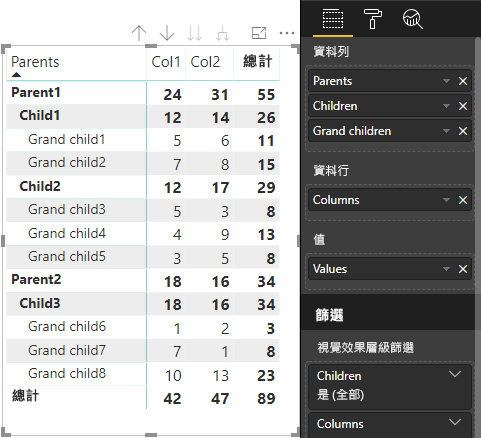

# <a name="data-view-mappings-in-power-bi-visuals"></a>Power BI 視覺效果中的資料檢視對應

`dataViewMappings` 會描述資料角色的相互關係，並可讓您指定其條件式需求。
每個 `dataMappings` 都有一個區段。

每個有效的對應都會產生 `DataView`，但目前我們只支援對每個視覺效果執行一個查詢，因此在大部分情況下，您只會取得一個 `DataView`。 不過，您可以提供多個具有不同條件的資料對應，其允許

```json
"dataViewMappings": [
    {
        "conditions": [ ... ],
        "categorical": { ... },
        "single": { ... },
        "table": { ... },
        "matrix": { ... }
    }
]
```

> [!NOTE]
> 值得注意的是，只有在 `dataViewMappings` 中填入有效的對應時，Power BI 才會建立 DataView 的對應。

換句話說，如果 `categorical` 定義在 `dataViewMappings` 中，但 `table`、`single` 等其他對應不是 (如下列範例所示)：
```json
"dataViewMappings": [
    {
        "categorical": { ... }
    }
]
```

Power BI 會產生具有單一 `categorical` 對應的 `DataView` (`table` 和其他對應將是 `undefined`)：
```javascript
{
    "categorical": {
        "categories": [ ... ],
        "values": [ ... ]
    },
    "metadata": { ... }
}
```

## <a name="conditions"></a>條件

描述特定資料對應的條件。 您可以提供多組條件，如果資料符合其中一組描述的條件，視覺效果會將資料接受為有效。

目前，您可以為每個欄位指定最小值和最大值。 這代表可以繫結至該資料角色的欄位數目。 

> [!NOTE]
> 如果條件中省略了資料角色，則可以有任意數目的欄位。

### <a name="example-1"></a>範例 1

您可以將多個欄位拖曳到每個資料角色。 在此範例中，我們會將類別限制為一個資料欄位，並將量值限制為兩個資料欄位。

```json
"conditions": [
    { "category": { "max": 1 }, "y": { "max": 2 } },
]
```

### <a name="example-2"></a>範例 2

在此範例中，需要兩個條件其中之一。 正好一個類別資料欄位和正好兩個量值，或正好兩個類別和正好一個量值。

```json
"conditions": [
    { "category": { "min": 1, "max": 1 }, "measure": { "min": 2, "max": 2 } },
    { "category": { "min": 2, "max": 2 }, "measure": { "min": 1, "max": 1 } }
]
```

## <a name="single-data-mapping"></a>單一資料對應

單一資料對應是資料對應的最簡單形式。 它會接受單一量值欄位，並為您提供總計。 如果欄位是數值，則會為您提供總和。 否則，它會為您提供唯一值的計數。

若要使用單一資料對應，您必須定義想要對應的資料角色名稱。 這個對應只會使用單一量值欄位。 如果指派第二個欄位，則不會產生任何資料檢視。 因此，也建議您包含將資料限制為單一欄位的條件。

> [!NOTE]
> 此資料對應不能與任何其他資料對應一起使用。 其目的是要將資料縮減為單一數值。

### <a name="example-3"></a>範例 3

```json
"dataViewMappings": {
    "conditions": [
        { "Y": { "max": 1 } }
    ],
    "single": {
        "role": "Y"
    }
}  
```

產生的資料檢視仍會包含其他類型 (資料表、類別目錄等)，但每個對應只會包含單一值。 最佳做法是只存取單一值。

```JSON
{
    "dataView": [
        {
            "metadata": null,
            "categorical": null,
            "matrix": null,
            "table": null,
            "tree": null,
            "single": {
                "value": 94163140.3560001
            }
        }
    ]
}
```

## <a name="categorical-data-mapping"></a>類別目錄資料對應

類別目錄資料對應是用來取得一或兩個獨立的資料群組。

### <a name="example-4"></a>範例 4

以下是上述範例中關於 DataRole 的定義。

```json
"dataRole":[
    {
        "displayName": "Category",
        "name": "category",
        "kind": "Grouping"
    },
    {
        "displayName": "Y Axis",
        "name": "measure",
        "kind": "Measure"
    }
]
```

現在，針對此對應：

```json
"dataViewMappings": {
    "categorical": {
        "categories": {
            "for": { "in": "category" }
        },
        "values": {
            "select": [
                { "bind": { "to": "measure" } }
            ]
        }
    }
}
```

這是一個簡單範例，用簡單易懂的英語就是「對應我的 `category` DataRole，讓我拖曳至 `category` 的每個欄位，其資料會對應到 `categorical.categories`。 也請將我的 `measure` DataRole 對應到 `categorical.values`」。

* **for...in** - 對於此資料角色中的所有項目，請將其包含在資料查詢中。
* **bind...to** - 產生與 for...in 相同的結果，但預期 DataRole 會有將其限制為單一欄位的條件。

### <a name="example-5"></a>範例 5

在此範例中，我們將使用上述範例的前兩個 DataRole，另外定義 `grouping` 和 `measure2`。

```json
"dataRole":[
    {
        "displayName": "Category",
        "name": "category",
        "kind": "Grouping"
    },
    {
        "displayName": "Y Axis",
        "name": "measure",
        "kind": "Measure"
    },
    {
        "displayName": "Grouping with",
        "name": "grouping",
        "kind": "Grouping"
    },
    {
        "displayName": "X Axis",
        "name": "measure2",
        "kind": "Grouping"
    }
]
```

現在，針對此對應：

```json
"dataViewMappings":{
    "categorical": {
        "categories": {
            "for": { "in": "category" }
        },
        "values": {
            "group": {
                "by": "grouping",
                "select":[
                    { "bind": { "to": "measure" } },
                    { "bind": { "to": "measure2" } }
                ]
            }
        }
    }
}
```

此處的差異在於我們如何對應 categorical.values。 我們表示「對應要依資料角色 `grouping` 分組的 `measure` 和 `measure2` 資料角色」。

### <a name="example-6"></a>範例 6

以下是 dataRole。

```json
"dataRoles": [
    {
        "displayName": "Categories",
        "name": "category",
        "kind": "Grouping"
    },
    {
        "displayName": "Measures",
        "name": "measure",
        "kind": "Measure"
    },
    {
        "displayName": "Series",
        "name": "series",
        "kind": "Measure"
    }
]
```

以下是 dataViewMapping。

```json
"dataViewMappings": [
    {
        "categorical": {
            "categories": {
                "for": {
                    "in": "category"
                }
            },
            "values": {
                "group": {
                    "by": "series",
                    "select": [{
                            "for": {
                                "in": "measure"
                            }
                        }
                    ]
                }
            }
        }
    }
]
```

類別目錄 `dataview` 可以像這樣視覺化。

| 類別目錄 |  |  | | | |
|-----|-----|------|------|------|------|
| | 年度 | 2013 | 2014 | 2015 | 2016 |
| 國家/地區 | | |
| 美國 | | x | x | 125 | 100 |
| 加拿大 | | x | 50 | 200 | x |
| 墨西哥 | | 300 | x | x | x |
| 英國 | | x | x | 75 | x |

Power BI 會為您產生類別目錄 dataview。 這是一組類別。

```JSON
{
    "categorical": {
        "categories": [
            {
                "source": {...},
                "values": [
                    "Canada",
                    "Mexico",
                    "UK",
                    "USA"
                ],
                "identity": [...],
                "identityFields": [...],
            }
        ]
    }
}
```

每個類別也會對應到一組值。 每一個值都會依數列 (即年份) 分組。

例如，2013 年的加拿大銷售額是 Null，而 2014 年的加拿大銷售額是 50。

```JSON
{
    "values": [
        {
            "source": {...},
            "values": [
                null,
                300,
                null,
                null
            ],
            "identity": [...],
        },
        {
            "source": {...},
            "values": [
                50,
                null,
                150,
                null
            ],
            "identity": [...],
        },
        {
            "source": {...},
            "values": [
                200,
                null,
                null,
                125
            ],
            "identity": [...],
        },
        {
            "source": {...},
            "values": [
                null,
                null,
                null,
                100
            ],
            "identity": [...],
        }
    ]
}
```

## <a name="table-data-mapping"></a>資料表資料對應

資料表資料檢視是簡單的資料對應。 基本上，它是可彙總數值資料點的資料點清單。

### <a name="example-7"></a>範例 7

具有指定功能：

```json
"dataRoles": [
    {
        "displayName": "Values",
        "name": "values",
        "kind": "Measure"
    }
]
```

```json
"dataViewMappings": [
    {
        "table": {
            "rows": {
                "for": {
                    "in": "values"
                }
            }
        }
    }
]
```

資料表 `dataview` 可以像這樣視覺化。  

| 國家/地區| 年度 | 銷售額 |
|-----|-----|------|
| 美國 | 2016 | 100 |
| 美國 | 2015 | 50 |
| 加拿大 | 2015 | 200 |
| 加拿大 | 2015 | 50 |
| 墨西哥 | 2013 | 300 |
| 英國 | 2014 | 150 |
| 美國 | 2015 | 75 |

Power BI 將會產生您的資料表 dataview。 請不要假設有排序。

```JSON
{
    "table" : {
        "columns": [...],
        "rows": [
            [
                "Canada",
                2014,
                50
            ],
            [
                "Canada",
                2015,
                200
            ],
            [
                "Mexico",
                2013,
                300
            ],
            [
                "UK",
                2014,
                150
            ],
            [
                "USA",
                2015,
                100
            ],
            [
                "USA",
                2015,
                75
            ],
            [
                "USA",
                2016,
                100
            ]
        ]
    }
}
```

選取所需的欄位並按一下 [總和]，即可彙總資料。  


## <a name="matrix-data-mapping"></a>矩陣資料對應

矩陣資料對應類似於資料表資料對應，但資料列會以階層方式呈現。 而其中一個 `dataRole` 值可用來作為資料行標題值。

```json
{
    "dataRoles": [
        {
            "name": "Category",
            "displayName": "Category",
            "displayNameKey": "Visual_Category",
            "kind": "Grouping"
        },
        {
            "name": "Column",
            "displayName": "Column",
            "displayNameKey": "Visual_Column",
            "kind": "Grouping"
        },
        {
            "name": "Measure",
            "displayName": "Measure",
            "displayNameKey": "Visual_Values",
            "kind": "Measure"
        }
    ],
    "dataViewMappings": [
        {
            "matrix": {
                "rows": {
                    "for": {
                        "in": "Category"
                    }
                },
                "columns": {
                    "for": {
                        "in": "Column"
                    }
                },
                "values": {
                    "select": [
                        {
                            "for": {
                                "in": "Measure"
                            }
                        }
                    ]
                }
            }
        }
    ]
}
```

Power BI 會建立階層式資料結構。 樹狀結構的根包含 `Category` 資料角色第一個資料行中的資料，其中包含來自資料角色第二個資料行的下層。

資料集：

| 上層 | 下層 | 下下層 | 資料行 | 值 |
|-----|-----|------|-------|-------|
| Parent1 | Child1 | Grand child1 | Col1 | 5 |
| Parent1 | Child1 | Grand child1 | Col2 | 6 |
| Parent1 | Child1 | Grand child2 | Col1 | 7 |
| Parent1 | Child1 | Grand child2 | Col2 | 8 |
| Parent1 | Child2 | Grand child3 | Col1 | 5 |
| Parent1 | Child2 | Grand child3 | Col2 | 3 |
| Parent1 | Child2 | Grand child4 | Col1 | 4 |
| Parent1 | Child2 | Grand child4 | Col2 | 9 |
| Parent1 | Child2 | Grand child5 | Col1 | 3 |
| Parent1 | Child2 | Grand child5 | Col2 | 5 |
| Parent2 | Child3 | Grand child6 | Col1 | 1 |
| Parent2 | Child3 | Grand child6 | Col2 | 2 |
| Parent2 | Child3 | Grand child7 | Col1 | 7 |
| Parent2 | Child3 | Grand child7 | Col2 | 1 |
| Parent2 | Child3 | Grand child8 | Col1 | 10 |
| Parent2 | Child3 | Grand child8 | Col2 | 13 |

Power BI 的核心矩陣視覺效果會像資料表一樣加以呈現。



視覺效果會取得如下所述的資料結構 (只呈現前兩個資料列)：

```json
{
    "metadata": {...},
    "matrix": {
        "rows": {
            "levels": [...],
            "root": {
                "childIdentityFields": [...],
                "children": [
                    {
                        "level": 0,
                        "levelValues": [...],
                        "value": "Parent1",
                        "identity": {...},
                        "childIdentityFields": [...],
                        "children": [
                            {
                                "level": 1,
                                "levelValues": [...],
                                "value": "Child1",
                                "identity": {...},
                                "childIdentityFields": [...],
                                "children": [
                                    {
                                        "level": 2,
                                        "levelValues": [...],
                                        "value": "Grand child1",
                                        "identity": {...},
                                        "values": {
                                            "0": {
                                                "value": 5 // value for Col1
                                            },
                                            "1": {
                                                "value": 6 // value for Col2
                                            }
                                        }
                                    },
                                    ...
                                ]
                            },
                            ...
                        ]
                    },
                    ...
                ]
            }
        },
        "columns": {
            "levels": [...],
            "root": {
                "childIdentityFields": [...],
                "children": [
                    {
                        "level": 0,
                        "levelValues": [...],
                        "value": "Col1",
                        "identity": {...}
                    },
                    {
                        "level": 0,
                        "levelValues": [...],
                        "value": "Col2",
                        "identity": {...}
                    },
                    ...
                ]
            }
        },
        "valueSources": [...]
    }
}
```

## <a name="data-reduction-algorithm"></a>資料縮減演算法

如果您想要控制在 DataView 中收到的資料量，則可以套用 `DataReductionAlgorithm`。

根據預設，所有自訂視覺效果都會套用頂端的 DataReductionAlgorithm，並將 "count" 設定為 1000 個資料點。 這相當於在 capabilities.json 中設定下列屬性：

```json
"dataReductionAlgorithm": {
    "top": {
        "count": 1000
    }
}
```

您可以將 'count' 值修改為最多到 30000 的任何整數值。 以 R 為基礎的自訂視覺效果最多可支援 150000 個資料列。

## <a name="data-reduction-algorithm-types"></a>資料縮減演算法類型

有四種類型的 `DataReductionAlgorithm` 設定：

* `top` - 如果您想要將資料限制為取自資料集頂端的值。 前一個 "count" 值將取自資料集。
* `bottom` - 如果您想要將資料限制為取自資料集底端的值。 最後的 "count" 值將取自資料集。
* `sample` - 透過限制為 "count" 個項目的簡單取樣演算法來減少資料集。 這表示會包含第一個和最後一個項目，以及在它們之間具有相等間隔的 "count" 個項目。
例如，如果您有資料集 [0, 1, 2, ...100] 且 `count: 9`，則會收到下列值 [0, 10, 20 ...100]
* `window` - 在包含 "count" 元素時載入一個資料點 'window'。 目前 `top` 和 `window` 是相等的。 正在進行完整支援視窗化設定的工作。

## <a name="data-reduction-algorithm-usage"></a>資料縮減演算法使用方式

`DataReductionAlgorithm` 可用於類別目錄、資料表或矩陣 `dataview` 對應。

它可以設定到類別目錄資料對應中 `values` 的 `categories` 和/或 group 區段。

### <a name="example-8"></a>範例 8

```json
"dataViewMappings": {
    "categorical": {
        "categories": {
            "for": { "in": "category" },
            "dataReductionAlgorithm": {
                "window": {
                    "count": 300
                }
            }  
        },
        "values": {
            "group": {
                "by": "series",
                "select": [{
                        "for": {
                            "in": "measure"
                        }
                    }
                ],
                "dataReductionAlgorithm": {
                    "top": {
                        "count": 100
                    }
                }  
            }
        }
    }
}
```

資料縮減演算法可以套用至資料表 `dataview` 對應的 `rows` 區段。

### <a name="example-9"></a>範例 9

```json
"dataViewMappings": [
    {
        "table": {
            "rows": {
                "for": {
                    "in": "values"
                },
                "dataReductionAlgorithm": {
                    "top": {
                        "count": 2000
                    }
                } 
            }
        }
    }
]
```

資料縮減演算法可以套用至 `matrix` `dataview` 對應的 `rows` 和/或 `columns` 區段。
