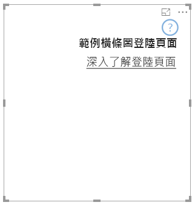

# <a name="landing-page"></a>登陸頁面

透過 API 2.3.0，您可以將登陸頁面新增至您的視覺效果。若要這麼做，請將 `supportsLandingPage` 新增至功能並將它設定為 true，如此一來，即使在將資料新增至其中之前，它也會讓您的視覺效果初始化及更新 (也就是說，它不會再顯示浮水印)；因此，只要它沒有資料，您就可以設計自己的登陸頁面以便在視覺效果中顯示。

```typescript
export class BarChart implements IVisual {
    //...
    private element: HTMLElement;
    private isLandingPageOn: boolean;
    private LandingPageRemoved: boolean;
    private LandingPage: d3.Selection<any>;

    constructor(options: VisualConstructorOptions) {
            //...
            this.element = options.element;
            //...
    }

    public update(options: VisualUpdateOptions) {
    //...
        this.HandleLandingPage(options);
    }

    private HandleLandingPage(options: VisualUpdateOptions) {
        if(!options.dataViews || !options.dataViews.length) {
            if(!this.isLandingPageOn) {
                this.isLandingPageOn = true;
                const SampleLandingPage: Element = this.createSampleLandingPage(); //create a landing page
                this.element.appendChild(SampleLandingPage);
                this.LandingPage = d3.select(SampleLandingPage);
            }

        } else {
                if(this.isLandingPageOn && !this.LandingPageRemoved){
                    this.LandingPageRemoved = true;
                    this.LandingPage.remove();
                }
        }
    }
```

範例


