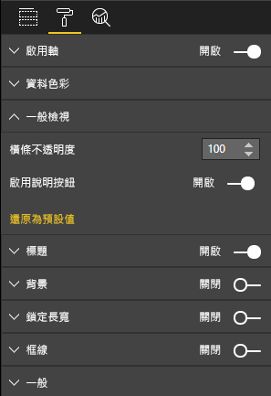

# <a name="create-a-launch-url"></a>建立啟動 URL

透過建立啟動 URL，您可藉由將實際工作委派給 Power BI 來開啟新的瀏覽器索引標籤 (或視窗)。

## <a name="sample"></a>範例

```typescript
   this.host.launchUrl('https://powerbi.microsoft.com');
```

## <a name="usage"></a>使用量

您可以使用 `host.launchUrl()` API 呼叫，並傳遞您的目的地 URL 作為字串引數：

```typescript
this.host.launchUrl('https://some.link.net');
```

## <a name="restrictions"></a>限制

* 只能使用絕對路徑，不能使用相對路徑。 例如，請使用 `https://some.link.net/subfolder/page.html`之類的絕對路徑。 系統不會開啟像 `/page.html` 這樣的相對路徑。

* 目前僅支援 *HTTP* 和 *HTTPS* 通訊協定。 請避免使用 *FTP* 和 *MAILTO* 之類的通訊協定。

## <a name="best-practices"></a>最佳作法

* 通常最好只在回應使用者的明確動作時才開啟連結。 讓使用者輕鬆了解按一下連結或按鈕會導致開啟新的索引標籤。觸發 `launchUrl()` 呼叫而不需要使用者採取動作，或作為其他動作的副作用，可能會讓使用者感到困惑或挫折。

* 如果連結對於視覺效果的正常運作並不重要，則建議為報表作者提供停用和隱藏連結的方式。 此建議與特殊 Power BI 使用案例特別相關，例如將報表內嵌於協力廠商應用程式或發佈至 Web。

* 避免從迴圈內部、視覺效果的 `update` 函式或任何其他經常重複出現的程式碼內觸發 `launchUrl()` 呼叫。

## <a name="a-step-by-step-example"></a>逐步說明範例

### <a name="add-a-link-launching-element"></a>新增連結啟動元素

下列程式碼行已新增至視覺效果的 `constructor` 函式：

```typescript
    this.helpLinkElement = this.createHelpLinkElement();
    options.element.appendChild(this.helpLinkElement);
```

此外，已新增能建立和附加錨點元素的私用函式：

```typescript
private createHelpLinkElement(): Element {
    let linkElement = document.createElement("a");
    linkElement.textContent = "?";
    linkElement.setAttribute("title", "Open documentation");
    linkElement.setAttribute("class", "helpLink");
    linkElement.addEventListener("click", () => {
        this.host.launchUrl("https://docs.microsoft.com/power-bi/developer/visuals/custom-visual-develop-tutorial");
    });
    return linkElement;
};
```

最後，*visual.less* 檔案中的項目會定義連結元素的樣式：

```less
.helpLink {
    position: absolute;
    top: 0px;
    right: 12px;
    display: block;
    width: 20px;
    height: 20px;
    border: 2px solid #80B0E0;
    border-radius: 20px;
    color: #80B0E0;
    text-align: center;
    font-size: 16px;
    line-height: 20px;
    background-color: #FFFFFF;
    transition: all 900ms ease;

    &:hover {
        background-color: #DDEEFF;
        color: #5080B0;
        border-color: #5080B0;
        transition: all 250ms ease;
    }

    &.hidden {
        display: none;
    }
}
```

### <a name="add-a-toggling-mechanism"></a>新增切換機制

若要新增切換機制，您需要新增靜態物件，使報表作者能切換連結元素的可見性。 (預設值是設定為 *hidden*。)如需詳細資訊，請參閱[靜態物件教學課程](https://microsoft.github.io/PowerBI-visuals/docs/concepts/objects-and-properties) \(英文\)。

已將 `showHelpLink` 布林值靜態物件新增至 *capabilities.json* 檔案的物件項目，如下列程式碼所示：

```typescript
"objects": {
    "generalView": {
            "displayName": "General View",
            "properties":
                "showHelpLink": {
                    "displayName": "Show Help Button",
                    "type": {
                        "bool": true
                    }
                }
            }
        }
    }
```



此外，在視覺效果的 `update` 函式中，已新增下列程式碼行：

```typescript
if (settings.generalView.showHelpLink) {
    this.helpLinkElement.classList.remove("hidden");
} else {
    this.helpLinkElement.classList.add("hidden");
}
```

*hidden* 類別已定義於 *visual.less* 檔案中，以控制元素的顯示。
