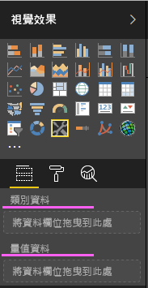
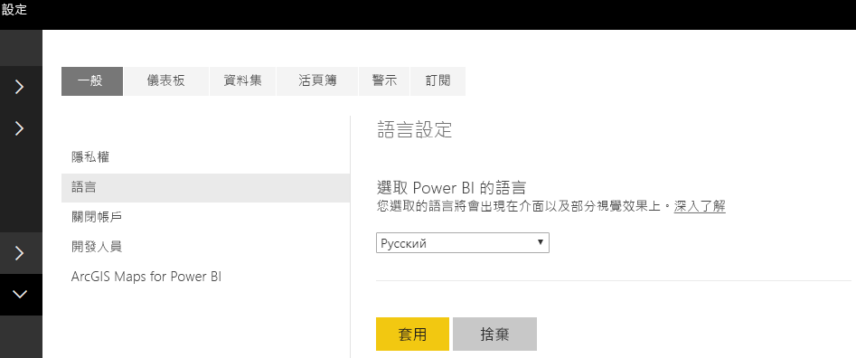

# <a name="add-the-locale-in-power-bi-for-power-bi-visuals"></a>在 Power BI 中為 Power BI 視覺效果新增地區設定

視覺效果可以擷取 Power BI 地區設定，用來將其內容當地語系化為相關語言。

深入了解 [Power BI 支援的語言和國家/地區](./../../fundamentals/supported-languages-countries-regions.md)

例如，在範例橫條圖視覺效果中取得地區設定。


這些橫條圖每一個都是以不同的地區設定 (英文、巴斯克文和印度文) 建立，並顯示在工具提示中。

> [!NOTE]
> API 1.10.0 和更高版本支援視覺效果程式碼中的當地語系化管理員。

## <a name="get-the-locale"></a>取得地區設定

在初始化視覺效果期間，會以字串的形式傳遞 `locale`。 如果在 Power BI 中變更了地區設定，則會使用新的地區設定來重新產生視覺效果。 您可以在 SampleBarChart 上找到含有地區設定的完整範例程式碼

BarChart 建構函式現在有一個 locale 成員，該成員會在建構函式中使用主機 locale 執行個體進行具現化。

```typescript
private locale: string;
...
this.locale = options.host.locale;
```

支援的地區設定：

地區設定字串 | 語言
--------------|----------------------
ar-SA | العربية (阿拉伯文)
bg-BG | български (保加利亞文)
ca-ES | català (加泰蘭文)
cs-CZ | čeština (捷克文)
da-DK | dansk (丹麥文)
de-DE | Deutsche (德文)
el-GR | ελληνικά (希臘文)
en-US | English (英文)
es-ES | español service (西班牙文)
et-EE | eesti (愛沙尼亞文)
eU-ES | Euskal (巴斯克文)
fi-FI | suomi (芬蘭文)
fr-FR | français (法文)
gl-ES | galego (加利西亞文)
he-IL | עברית (希伯來文)
hi-IN | हिन्दी (印度文)
hr-HR | hrvatski (克羅埃西亞文)
hu-HU | magyar (匈牙利文)
id-ID | Bahasa Indonesia (印尼文)
it-IT | italiano (義大利文)
ja-JP | 日本の (日文)
kk-KZ | Қазақ (哈薩克文)
ko-KR | 한국의 (韓文)
lt-LT | Lietuvos (立陶宛文)
lv-LV | Latvijas (拉脫維亞文)
ms-MY | Bahasa Melayu (馬來文)
nb-NO | norsk (挪威文)
nl-NL | Nederlands (荷蘭文)
pl-PL | polski (波蘭文)
pt-BR | português (葡萄牙文)
pt-PT | português (葡萄牙文)
ro-RO | românesc (羅馬尼亞文)
ru-RU | русский (俄文)
sk-SK | slovenský (斯洛伐克文)
sl-SI | slovenski (斯洛維尼亞文)
sr-Cyrl-RS | српски (塞爾維亞文)
sr-Latn-RS | srpski (塞爾維亞文)
sv-SE | svenska (瑞典文)
th-TH | ไทย (泰文)
tr-TR | Türk (土耳其文)
uk-UA | український (烏克蘭文)
vi-VN | tiếng Việt (越南文)
zh-CN | 中国 (簡體中文)
zh-TW | 中國 (繁體中文)

> [!NOTE]
> 在 PowerBI Desktop 中，地區設定屬性會包含已安裝的 PowerBI Desktop 語言。

## <a name="localizing-the-property-pane-for-power-bi-visuals"></a>將 Power BI 視覺效果的屬性窗格當地語系化

屬性窗格中的欄位可以進行當地語系化，以提供更多整合且一致的體驗。 這可讓自訂視覺效果的運作方式與其他 Power BI 核心視覺效果一樣。

例如，使用 `pbiviz new` 命令建立的非當地語系化自訂視覺效果，將會在屬性窗格中顯示下列欄位：



類別資料和量值資料都會在 capabilities.json 檔案中定義為 `displayName`。

## <a name="how-to-localize-capabilities"></a>如何將功能當地語系化

首先，將顯示名稱索引鍵新增至要在功能中進行當地語系化的每個顯示名稱。 在此範例中：

```json
{
    "dataRoles": [
        {
            "displayName": "Category Data",
            "displayNameKey": "VisualCategoryDataNameKey1",
            "name": "category",
            "kind": "Grouping"
        },
        {
            "displayName": "Measure Data",
            "displayNameKey": "VisualMeasureDataNameKey2",
            "name": "measure",
            "kind": "Measure"
        }
    ]
}
```

然後，新增稱為 stringResources 的目錄。 此目錄會根據您想要讓視覺效果支援的地區設定來包含所有不同的字串資源檔。 在此目錄下，您必須為想要支援的每個地區設定新增一個 JSON 檔案。 這些檔案包含您想要取代之每個 displayNameKey 的地區設定資訊和當地語系化字串值。

在我們的範例中，假設要支援阿拉伯文和希伯來文。 我們需要以下列方式新增兩個 JSON 檔案：


每個 JSON 檔案都會定義單一地區設定 (此檔案必須是上述支援清單的其中一個地區設定)，並包含所需顯示名稱索引鍵的字串值。 在我們的範例中，希伯來文字串資源檔會如下所示：

```json
{
    "locale": "he-IL",
    "values": {
        "VisualCategoryDataNameKey1": "קטגוריה",
        "VisualMeasureDataNameKey2": "יחידות מידה"
    }
}
```

使用當地語系化管理員的所有必要步驟如下所述。

> [!NOTE]
> 目前，針對開發視覺效果進行偵錯不支援當地語系化

## <a name="setup-environment"></a>設定環境

### <a name="desktop"></a>桌上型

針對桌面使用方式，請從 https://powerbi.microsoft.com 下載 Power BI Desktop 的當地語系化版本。

### <a name="web-service"></a>Web 服務

如果您在服務中使用網頁用戶端 (瀏覽器)，則請在 [設定] 中變更語言：



## <a name="resource-file"></a>資源檔

將 resources.resjson 檔案新增至以要在 stringResources 資料夾內使用的地區設定所命名資料夾中。 在我們的範例中是 en-US 和 ru-RU。


之後，將要使用的所有當地語系化字串，新增至在上一個步驟中新增的 resources.resjson 檔案。

```json
{
    ...
    "Role_Legend": "Обозначения",
    "Role_task": "Задача",
    "Role_StartDate": "Дата начала",
    "Role_Duration": "Длительность"
    ...
}
```

這個範例是 resources.resjson 檔案的 en-US 版本：

```json
{
    ...
    "Role_Legend": "Legend",
    "Role_task": "Task",
    "Role_StartDate": "Start date",
    "Role_Duration": "Duration"
    ...
}
```

新 localizationManager 執行個體會在視覺效果程式碼中建立 localizationManager 的執行個體，如下所示

```typescript
private localizationManager: ILocalizationManager;

constructor(options: VisualConstructorOptions) {
    this.localizationManager = options.host.createLocalizationManager();
}
```

## <a name="localizationmanager-usage-sample"></a>localizationManager 使用範例

現在，您可以使用在 resources.resjson 中定義的字串索引鍵引數來呼叫當地語系化管理員的 getDisplayName 函式，以在程式碼內的任何位置取得必要字串：

```typescript
let legend: string = this.localization.getDisplayName("Role_Legend");
```

針對 en-US 會傳回 "Legend"；針對 ru-RU 則會傳回 "Обозначения"

## <a name="next-steps"></a>後續步驟

* [了解如何使用格式化公用程式來提供當地語系化格式](utils-formatting.md)
