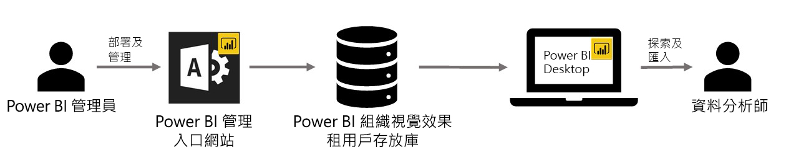

# Power BI 中的組織視覺效果

您可以在 Power BI 中使用 Power BI 視覺效果，以建立量身打造的唯一視覺效果類型。 Power BI 視覺效果是由開發人員建立；通常是因為 Power BI 中包含的多種視覺效果不符合開發人員需求，他們才會自行建立自訂視覺效果。

在某些組織中，Power BI 視覺效果則更為重要，必須有它們才能傳達組織唯一的特定資料或見解，它們也可能有特殊的資料需求，或醒目提示私用商務方法。 此類組織需要開發 Power BI 視覺效果、在整個組織中共用這些視覺效果，並確保其受到妥善維護。 Power BI 視覺效果可讓組織達到此目的。

下圖顯示的程序說明 Power BI 流程中組織 Power BI 視覺效果如何從系統管理員開始，經過開發及維護，最後到資料分析師手上。

組織視覺效果是由 Power BI 系統管理員從系統管理入口網站中部署及管理。 一旦部署到組織存放庫，組織中的使用者就可以輕鬆地探索組織 Power BI 視覺效果，並直接從 Power BI Desktop 將它們匯入至其報告中。

若要深入了解如何在您建立的報告中使用組織 Power BI 視覺效果，請參閱下列文章：[深入了解如何將組織視覺效果匯入自己的報告](power-bi-custom-visuals.md)。

## 管理組織 Power BI 視覺效果

若要深入了解如何管理及部署組織內的組織 Power BI 視覺效果，請參閱下列文章：[深入了解組織 Power BI 視覺效果的部署和管理](../../admin/organizational-visuals.md)。

> [!WARNING]
> 從檔案安裝的 Power BI 視覺效果，其程式碼可能會有安全性或隱私權風險。 將任何 Power BI 視覺效果檔案部署到組織存放庫之前，請確定您信任其作者和來源。

## 考量與限制

有數個考量和限制是您必須留意的。

系統管理員：

* 如果從存放庫刪除來自 ApSource 或檔案的 Power BI 視覺效果，使用已刪除視覺效果的任何現有報表將會停止轉譯。 從存放庫刪除是無法復原的。 若要暫時停用來自 ApSource 或檔案的 Power BI 視覺效果，請使用「停用」功能。

* Power BI 報表伺服器不支援組織 Power BI 視覺效果。

使用者：

* 組織 Power BI 視覺效果是從組織存放庫匯入的私用視覺效果。 與任何私用視覺效果一樣，當使用者[訂閱報表頁面](https://docs.microsoft.com/power-bi/consumer/end-user-subscribe)時，它們不能[匯出至 PowerPoint](https://docs.microsoft.com/power-bi/consumer/end-user-powerpoint) 或在收到的電子郵件中顯示。 僅有直接從 Marketplace 匯入的[經認證 Power BI 視覺效果](power-bi-custom-visuals-certified.md)支援這些功能。

* 來自 AppSource Marketplace 的 Visio 視覺效果、PowerApps 視覺效果、Map box 視覺效果和 GlobeMap 視覺效果，若透過組織存放庫部署，將不會轉譯。

## 疑難排解

如需疑難排解的相關資訊，請前往[針對您的 Power BI 視覺效果進行疑難排解](power-bi-custom-visuals-troubleshoot.md)。

## 常見問題集

如需詳細資訊和問題的解答，請前往 [Power BI 視覺效果常見問題集](power-bi-custom-visuals-faq.md#organizational-power-bi-visuals)。

有其他問題嗎？ [試試 Power BI 社群](https://community.powerbi.com/)。
