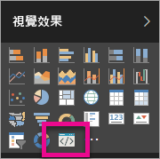

# 疑難排解 Power BI 視覺效果

## 偵錯

**找不到 pbiviz 命令 (或類似的錯誤)**

當您在終端機的命令列中執行 `pbiviz` 時，應該會看到說明畫面。 如果未顯示，表示安裝有誤。 請確定您至少已安裝 NodeJS 4.0 版。

**在 [視覺效果] 索引標籤中找不到偵錯視覺效果**

[視覺效果]  索引標籤中的偵錯視覺效果功能，看起來像個提示圖示。

如果未顯示，請確定您已在 Power BI 設定中加以啟用。

> [!NOTE]
> 偵錯視覺效果功能目前僅可在 Power BI 服務中使用；Power BI Desktop 或行動裝置應用程式皆尚未提供。 封裝的視覺效果仍可在每個地方運作。

**聯繫不到視覺效果伺服器**

在終端機命令列中輸入 `pbiviz start` 命令，從視覺效果專案的根目錄執行視覺效果伺服器。 如果伺服器未在執行中，很可能是您未正確安裝 SSL 憑證。

如果您有任何問題或意見，歡迎連絡 Power BI 視覺效果支援小組：pbicvsupport@microsoft.com。

## 後續步驟

如需詳細資訊，請前往 [Power BI 視覺效果常見問題集](power-bi-custom-visuals-faq.md#organizational-power-bi-visuals)。