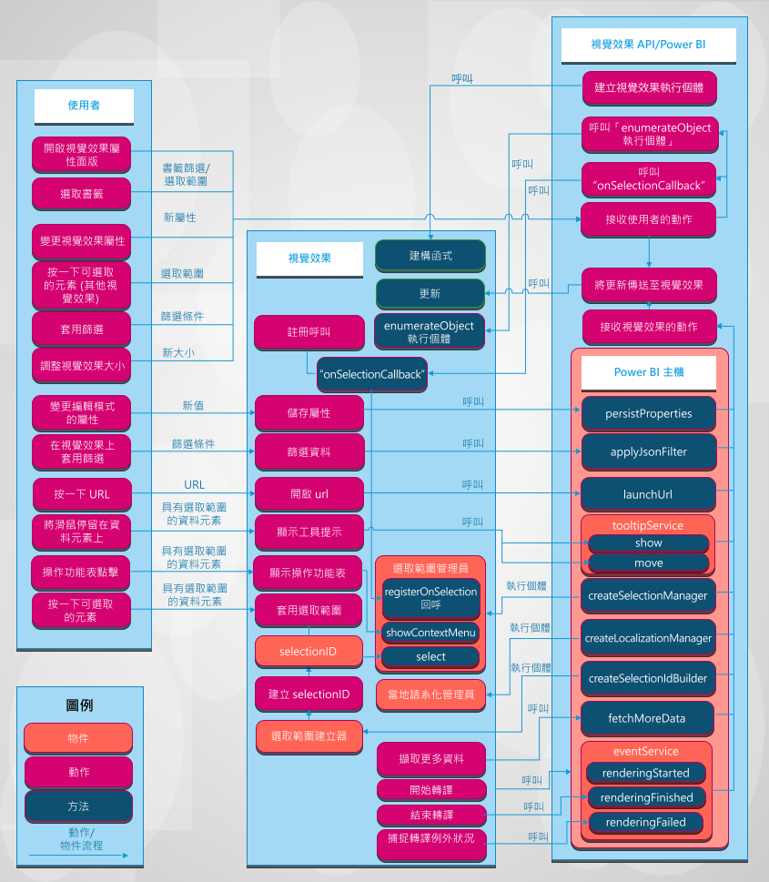

# Power BI 的視覺效果

本文將說明視覺效果與 Power BI 的整合方式，以及使用者可以如何與 Power BI 中的視覺效果互動。 

下圖說明使用者常採取的視覺效果動作 (例如選取書籤) 如何在 Power BI 中處理。

## 視覺效果會從 Power BI 取得更新

視覺效果會呼叫 `update` 方法，以從 Power BI 取得更新。 `update` 通常會包含視覺效果的主要邏輯，並負責轉譯圖表或將資料視覺化。

當視覺效果呼叫 `update` 方法時，就會觸發更新。

## 動作和更新模式

Power BI 視覺效果中的動作和後續更新會以下列三種模式之一進行：

* 使用者透過 Power BI 與視覺效果互動。
* 使用者直接與視覺效果互動。
* 視覺效果與 Power BI 互動。

### 使用者透過 Power BI 與視覺效果互動

* 使用者開啟視覺屬性面板。

    當使用者開啟視覺效果的屬性面板時，Power BI 會從視覺效果的 capabilities.json  檔案提取支援的物件和屬性。 若要接收屬性的實際值，Power BI 會呼叫視覺效果的 `enumerateObjectInstances` 方法。 視覺效果會傳回屬性的實際值。

    如需詳細資訊，請參閱 [Power BI 視覺效果的功能和屬性](capabilities.md)。

* 使用者在格式面板中[變更視覺效果的屬性](../../visuals/power-bi-visualization-customize-title-background-and-legend.md)。

    當使用者在格式面板中變更屬性的值時，Power BI 會呼叫視覺效果的 `update` 方法。 Power BI 會將新的 `options` 物件傳入 `update` 方法。 物件會包含新的值。

    如需詳細資訊，請參閱 [Power BI 視覺效果的物件和屬性](objects-properties.md)。

* 使用者調整視覺效果的大小。

    當使用者變更視覺效果的大小時，Power BI 會使用新的 `options` 物件來呼叫 `update` 方法。 `options` 物件具有巢狀 `viewport` 物件，其中包含視覺效果的新寬度和高度。

* 使用者會在報表、頁面或視覺效果層級上套用篩選。

    Power BI 會根據篩選準則來篩選資料。 Power BI 會呼叫視覺效果的 `update` 方法，以新的資料更新視覺效果。

    當其中一個巢狀物件中有新資料時，視覺效果會取得 `options` 物件的新更新。 更新發生的方式取決於視覺效果的資料檢視對應設定。

    如需詳細資訊，請參閱[了解 Power BI 視覺效果中的資料檢視對應](dataview-mappings.md)。

* 使用者在報表的另一個視覺效果中選取資料點。

    當使用者在報表的另一個視覺效果中選取資料點時，Power BI 會篩選或醒目提示選取的資料點，並呼叫視覺效果的 `update` 方法。 視覺效果會取得新的篩選資料，或取得具有醒目提示陣列的相同資料。

    如需詳細資訊，請參閱[在 Power BI 視覺效果中醒目提示資料點](highlight.md)。

* 使用者在報表的書籤面板上選取書籤。

    當使用者在報表的書籤面板中選取書籤時，可能會發生以下兩者其中之一的動作：

    * Power BI 會呼叫由 `registerOnSelectionCallback` 方法傳遞和註冊的函式。 回呼函式會取得對應書籤的選取陣列。

    * Power BI 會使用 `options` 物件內的對應 `filter` 物件來呼叫 `update` 方法。

    不論是哪一種情況，視覺效果都必須根據收到的選取項目或 `filter` 物件來變更其狀態。

    如需有關書籤和篩選器的詳細資訊，請參閱 [Power BI 視覺效果中的視覺篩選 API](filter-api.md)。

### 使用者直接與視覺效果互動

* 使用者將滑鼠停留在資料元素上。

    視覺效果可以透過 Power BI 工具提示 API 顯示資料點的詳細資訊。 當使用者將滑鼠停留在視覺元素上方時，視覺效果可以處理事件，並顯示相關聯的工具提示元素資料。 視覺效果可以顯示標準工具提示或報表頁面工具提示。

    如需詳細資訊，請參閱 [Power BI 視覺效果中的工具提示](add-tooltips.md)。

* 使用者變更視覺效果屬性。 (例如，使用者展開樹狀結構，而視覺效果會在視覺效果屬性中儲存狀態。)

    視覺效果可以透過 Power BI API 儲存屬性值。 例如，當使用者與視覺效果互動，而視覺效果需要儲存或更新屬性值時，視覺效果就可以呼叫 `presistProperties` 方法。

* 使用者選取 URL。

    根據預設，視覺效果無法直接開啟 URL。 相反地，若要在新的索引標籤中開啟 URL，視覺效果可以呼叫 `launchUrl` 方法，並將 URL 傳遞為參數。

    如需詳細資訊，請參閱[建立啟動 URL](launch-url.md)。

* 使用者透過視覺效果套用篩選。

    視覺效果可以呼叫 `applyJsonFilter` 方法並傳遞條件，以篩選其他視覺效果中的資料。 有數種篩選類型可供使用，包括基本、進階和 Tuple 篩選。

    如需詳細資訊，請參閱 [Power BI 視覺效果中的視覺效果篩選 API](filter-api.md)。

* 使用者選取視覺效果中的元素。

    如需有關 Power BI 視覺效果中選取項目的詳細資訊，請參閱[使用 Power BI 視覺效果選取項目來新增互動](selection-api.md)。

### 視覺效果與 Power BI 互動

* 視覺效果向 Power BI 要求更多資料。

    視覺效果逐項處理資料。 `fetchMoreData` API 方法會要求資料集中的下一個資料片段。

    如需詳細資訊，請參閱[從 Power BI 擷取更多資料](fetch-more-data.md)。

* 事件服務觸發程序。

    Power BI 可以將報表匯出為 PDF，或透過電子郵件傳送報表 (僅適用於經認證的視覺效果)。 若要通知 Power BI 轉譯已完成，而且視覺效果已準備好擷取為 PDF 或電子郵件，則視覺效果應呼叫轉譯事件 API。

    如需詳細資訊，請參閱[報表從 Power BI 匯出至 PDF](../../consumer/end-user-pdf.md)。

    若要了解事件服務，請參閱[在 Power BI 視覺效果中轉譯事件](event-service.md)。

## 後續步驟

您想建立視覺效果並將其新增到 Microsoft AppSource 嗎？ 請參閱以下文章：

* [開發 Power BI 視覺效果](./custom-visual-develop-tutorial.md)
* [將 Power BI 視覺效果發佈至合作夥伴中心](office-store.md)
