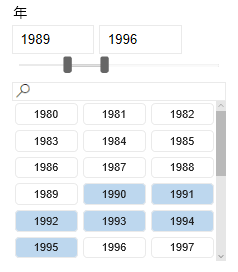
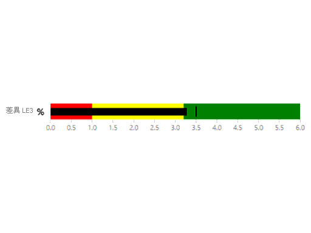
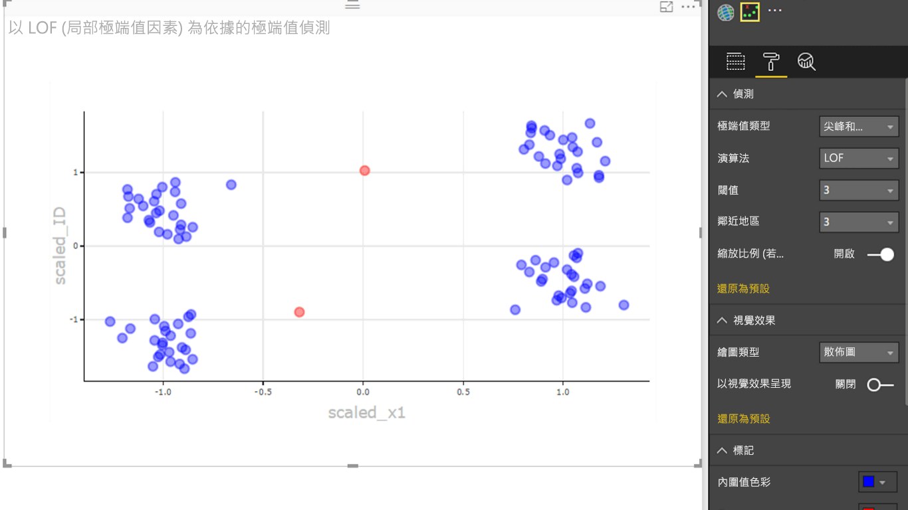

# Power BI 視覺效果範例

您可以從 GitHub 下載、使用及修改這些 Power BI 視覺效果。 這些範例說明如何處理使用 Power BI 進行開發時的常見情況。

## 交叉分析篩選器

交叉分析篩選器可將報表中其他視覺效果中所顯示資料的一部分縮小。 交叉分析篩選器是在 Power BI 中篩選資料的幾種方式之一。

|   |  | |
| ------------- | ------------- | -------------|
| [Chiclet Slicer](https://github.com/Microsoft/powerbi-visuals-chicletslicer/) (Chiclet 交叉分析篩選器)   顯示在其他視覺效果中作為畫布內篩選的影像或文字按鈕 | [時間軸交叉分析篩選器](https://github.com/Microsoft/powerbi-visuals-timeline/)  依日期篩選的圖形日期範圍選取器 | [交叉分析篩選器範例](https://github.com/Microsoft/powerbi-visuals-sampleslicer/) \(英文\)  示範如何使用進階篩選 API

## 圖表

透過我們的資源庫 (包括橫條圖、圓形圖、文字雲與其他內容) 來獲得靈感。

|   |  | |
| ------------- | ------------- | -------------|
| [Aster Plot](https://github.com/Microsoft/powerbi-visuals-asterplot/) (Aster 繪圖)   這是標準環圈圖的變形，其使用第二個值來推動掃掠角度 | [子彈圖](https://github.com/Microsoft/powerbi-visuals-bulletchart/) \(英文\)  包含額外視覺效果元素的橫條圖，以提供適合用於追蹤目標的內容 | [Chord](https://github.com/Microsoft/powerbi-visuals-chord/) (和弦圖)  顯示矩陣中資料之間關聯性的圖形化方法
|  | |  
| [點圖](https://github.com/Microsoft/powerbi-visuals-dotplot/) \(英文\)  以易讀的方式呈現頻率分佈 | [雙重 KPI](https://github.com/Microsoft/powerbi-visuals-dualkpi/)  有效圖解一段時間內的兩個量值，顯示兩者在聯結時間軸上的趨勢 | [Enhanced Scatter](https://github.com/Microsoft/powerbi-visuals-enhancedscatter/) (增強的散佈圖)  現有散佈圖的改善
| | | 
| [力圖](https://github.com/Microsoft/powerbi-visuals-forcegraph/) \(英文\)  使用曲徑的力配置圖，適合用於顯示實體之間的連接 | [甘特圖](https://github.com/Microsoft/powerbi-visuals-gantt/)  搭配資源說明專案時間軸或排程的橫條圖 | [Table Heatmap](https://github.com/Microsoft/powerbi-visuals-heatmap/) (資料表熱度圖)  在表格中使用色彩，以簡單又直覺的方式比較資料
|  |  |  
| [長條圖](https://github.com/Microsoft/powerbi-visuals-histogram/) \(英文\)  將一段連續間隔或某個期間的資料分佈視覺化 | [LineDot chart](https://github.com/Microsoft/powerbi-visuals-linedotchart/) (顯示資料點的折線圖)  使用動畫點透過資料與觀眾互動的動畫折線圖 | [Mekko chart](https://github.com/Microsoft/powerbi-visuals-mekkochart/) (巧拼圖)  100% 堆疊直條圖與 100% 堆疊橫條圖合併成一個檢視
|  |  |  
| [Multi KPI](https://github.com/microsoft/PowerBI-visuals-MultiKPI/) (多個 KPI)   功能強大的多重 KPI 視覺效果，其中包含關鍵 KPI 以及多個支援資料走勢圖 | [Power KPI](https://github.com/microsoft/PowerBI-visuals-PowerKPI/)  強大的 KPI 指標，具有多重折線圖與目前日期、值與差異的標籤 | [Power KPI Matrix](https://github.com/microsoft/PowerBI-visuals-PowerKPIMatrix/) (Power KPI 矩陣)  在精簡、容易閱讀的清單中，監視平衡計分卡與無限數量的計量與 KPI
| |  |  
| [Pulse chart](https://github.com/Microsoft/powerbi-visuals-pulsechart/) (Pulse 圖表)  此折線圖已加註重要事件，是用資料說故事的理想選擇| [Radar Chart](https://github.com/Microsoft/powerbi-visuals-radarchart/) (雷達圖)  繪製於類別軸上的多個量值，適用於比較屬性 | [Sankey 圖表](https://github.com/Microsoft/powerbi-visuals-sankey/)  數列寬度與流量成正比的流量圖
|  | | 
| [流線圖](https://github.com/Microsoft/powerbi-visuals-streamgraph/) \(英文\)  帶有平滑內插補點的堆疊區域圖，通常用於顯示一段時間內的值 | [放射環狀圖](https://github.com/Microsoft/powerbi-visuals-sunburst/)  用於以視覺呈現階層式資料的多層環圈圖| [龍捲風圖](https://github.com/Microsoft/powerbi-visuals-tornado/)  比較兩個群組之間變項的相對重要性
 | 
 | [Word 雲端](https://github.com/Microsoft/powerbi-visuals-wordcloud/)  從資料中的常用文字建立有趣的視覺效果

## WebGL

WebGL 可讓 Web 內容使用以 OpenGL ES 2.0 為基礎的 API，在 HTML 畫布中執行 2D 與 3D 轉譯。

| |
| ------------- |
| [地球地圖](https://github.com/Microsoft/powerbi-visuals-globemap/) \(英文\)  在互動式 3D 地圖上繪製地點

## R 視覺效果

這些範例示範如何運用 R 視覺效果與 R 指令碼的分析與視覺化功能。

| | | |
|------------- |------------- |------------- |------------- |
| [Association Rules](https://github.com/Microsoft/powerbi-visuals-assorules/) (關聯規則)  使用 if-then 陳述式，找出看似不相關資料之間的關聯性 | [Clustering](https://github.com/Microsoft/powerbi-visuals-clustering-kmeans/) (叢集)  在您的資料中使用 K-Means 演算法尋找相似性群組 | [具有極端值的群集](https://github.com/microsoft/PowerBI-visuals-dbscan/) \(英文\)  在您的資料中尋找相似性群組與極端值
|  |  |  
| [Correlation plot](https://github.com/Microsoft/powerbi-visuals-corrplot/) (相互關聯繪圖)  反白顯示資料表中最相互關聯的變數 | [決策樹圖表](https://github.com/Microsoft/powerbi-visuals-decision-tree/) \(英文\)  使用遞迴資料分割來判斷統計機率的示意式樹狀結構形圖表 | [Forecasting TBATS](https://github.com/Microsoft/powerbi-visuals-forcasting-tbats/) (預測 TBATS)  時間序列預測，具有使用 TBATS 模型的多個季節性數列
|  |  |  
| [Forecasting with ARIMA](https://github.com/Microsoft/powerbi-visuals-forcastingarima/) (使用 ARIMA 進行預測)  使用自動迴歸整合式移動平均 (ARIMA)，根據歷程記錄資料預測未來值 | [漏斗圖](https://github.com/Microsoft/powerbi-visuals-funnel/) \(英文\)  使用漏斗圖找出資料中的極端值 | [極端值偵測](https://github.com/Microsoft/powerbi-visuals-outliers-det/) \(英文\)  使用最適當的方法與繪圖來尋找資料中的極端值
|  |  | 
| [Spline chart](https://github.com/Microsoft/powerbi-visuals-spline/) (曲線圖)  將雜訊資料視覺化並加以了解 | [Time series decomposition chart](https://github.com/Microsoft/powerbi-visuals-timeseriesdecomposition/) (時間序列分解圖表)  使用「使用 Loess 的季節性和趨勢分解」來了解時間序列元件 | [時間序列預測圖表](https://github.com/Microsoft/powerbi-visuals-forcasting-exp/) \(英文\)  使用指數平滑模型，可根據先前觀察到的值來預測未來值

## 後續步驟

若要嘗試建立 Power BI 視覺效果，請參閱[教學課程：開發 Power BI 視覺效果](custom-visual-develop-tutorial.md)。
