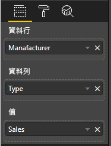

# <a name="add-interactivity-into-visual-by-power-bi-visuals-selections"></a>透過 Power BI 視覺效果選取項目，將互動功能新增至視覺效果中

Power BI 提供了兩種視覺效果之間的互動方式 - 選取和篩選。 下列範例示範如何選取一個視覺效果中的任何項目，並將新選取項目的狀態通知報表中的其他視覺效果。

`Selection` 物件對應至介面：

```typescript
export interface ISelectionId {
    equals(other: ISelectionId): boolean;
    includes(other: ISelectionId, ignoreHighlight?: boolean): boolean;
    getKey(): string;
    getSelector(): Selector;
    getSelectorsByColumn(): SelectorsByColumn;
    hasIdentity(): boolean;
}
```

## <a name="how-to-use-selectionmanager-to-select-data-points"></a>如何使用 SelectionManager 選取資料點

視覺效果主機物件提供建立選取項目管理員執行個體的方法。 選取項目管理員負責選取、清除選取項目、顯示操作功能表，儲存目前的選取項目和檢查選取項目狀態。 選取項目管理員為那些動作提供了對應的方法。

### <a name="create-an-instance-of-the-selection-manager"></a>建立選取項目管理員的執行個體

若要使用選取項目管理員，您必須建立選取項目管理員的執行個體。 視覺效果通常會在視覺效果物件的 `constructor` 中建立選取項目管理員執行個體。

```typescript
export class Visual implements IVisual {
    private target: HTMLElement;
    private host: IVisualHost;
    private selectionManager: ISelectionManager;
    // ...
    constructor(options: VisualConstructorOptions) {
        this.host = options.host;
        // ...
        this.selectionManager = this.host.createSelectionManager();
    }
    // ...
}
```

### <a name="create-an-instance-of-the-selection-builder"></a>建立選取項目產生器的執行個體

建立選取項目管理員執行個體時，您必須為視覺效果的每個資料點都建立 `selections`。 視覺效果主機物件提供 `createSelectionIdBuilder` 方法，以產生每個資料點的選取項目。 這個方法會傳回具有介面 `powerbi.visuals.ISelectionIdBuilder` 之物件的執行個體：

```typescript
export interface ISelectionIdBuilder {
    withCategory(categoryColumn: DataViewCategoryColumn, index: number): this;
    withSeries(seriesColumn: DataViewValueColumns, valueColumn: DataViewValueColumn | DataViewValueColumnGroup): this;
    withMeasure(measureId: string): this;
    withMatrixNode(matrixNode: DataViewMatrixNode, levels: DataViewHierarchyLevel[]): this;
    withTable(table: DataViewTable, rowIndex: number): this;
    createSelectionId(): ISelectionId;
}
```

這個物件有對應的方法，可建立用於不同類型資料檢視對應的 `selections`。

> [!NOTE]
> 方法 `withTable` 和 `withMatrixNode` 是在 Power BI 視覺效果的 API 2.5.0 中引進。
> 如果您需要針對資料表或矩陣資料檢視對應使用選取項目，則必須將 API 版本更新為 2.5.0 或更高版本。

### <a name="create-selections-for-categorical-data-view-mapping"></a>建立類別資料檢視對應的選取項目

讓我們檢閱在範例資料集的類別資料檢視對應上，選取項目的呈現方式：

| 製造商 | 類型 | 值 |
| - | - | - |
| 克萊斯勒 | 國內車輛 | 28883 |
| 克萊斯勒 | 國內卡車 | 117131 |
| 克萊斯勒 | 進口車輛 | 0 |
| 克萊斯勒 | 進口卡車 | 6362 |
| 福特 | 國內車輛 | 50032 |
| 福特 | 國內卡車 | 122446 |
| 福特 | 進口車輛 | 0 |
| 福特 | 進口卡車 | 0 |
| GM | 國內車輛 | 65426 |
| GM | 國內卡車 | 138122 |
| GM | 進口車輛 | 197 |
| GM | 進口卡車 | 0 |
| Honda | 國內車輛 | 51450 |
| Honda | 國內卡車 | 46115 |
| Honda | 進口車輛 | 2932 |
| Honda | 進口卡車 | 0 |
| Nissan | 國內車輛 | 51476 |
| Nissan | 國內卡車 | 47343 |
| Nissan | 進口車輛 | 5485 |
| Nissan | 進口卡車 | 1430 |
| Toyota | 國內車輛 | 55643 |
| Toyota | 國內卡車 | 61227 |
| Toyota | 進口車輛 | 20799 |
| Toyota | 進口卡車 | 23614 |

而且，視覺效果會使用下列資料檢視對應：

```json
{
    "dataRoles": [
        {
            "displayName": "Columns",
            "name": "columns",
            "kind": "Grouping"
        },
        {
            "displayName": "Rows",
            "name": "rows",
            "kind": "Grouping"
        },
        {
            "displayName": "Values",
            "name": "values",
            "kind": "Measure"
        }
    ],
    "dataViewMappings": [
        {
            "categorical": {
                "categories": {
                    "for": {
                        "in": "columns"
                    }
                },
                "values": {
                    "group": {
                        "by": "rows",
                        "select": [
                            {
                                "for": {
                                    "in": "values"
                                }
                            }
                        ]
                    }
                }
            }
        }
    ]
}
```

在範例中，`Manufacturer` 為 `columns` 而 `Type` 為 `rows`。 有一個依群組值建立的數列 (依 `rows` (`Type`))。

而且視覺效果應該也可以藉由 `Manufacturer` 和 `Type` 來配量資料。

例如，當使用者依 `Manufacturer` 選取 `Chrysler` 時，其他視覺效果應顯示下列資料：

| 製造商 | 類型 | 值 |
| - | - | - |
| **克萊斯勒** | 國內車輛 | 28883 |
| **克萊斯勒** | 國內卡車 | 117131 |
| **克萊斯勒** | 進口車輛 | 0 |
| **克萊斯勒** | 進口卡車 | 6362 |

當使用者依 `Type` 選取 `Import Car` (依數列選取資料) 時，其他視覺效果應顯示下列資料：

| 製造商 | 類型 | 值 |
| - | - | - |
| 克萊斯勒 | **進口車輛** | 0 |
| 福特 | **進口車輛** | 0 |
| GM | **進口車輛** | 197 |
| Honda | **進口車輛** | 2932 |
| Nissan | **進口車輛** | 5485 |
| Toyota | **進口車輛** | 20799 |


必須填滿視覺效果資料籃。



`Manufacturer` 作為類別 (資料行)、`Type` 作為數列 (資料列)，而 `Value` 作為數列的 `Values`。

> [!NOTE]
> `Values` 是數列的必要項，因為根據資料檢視對應，視覺效果預期 `Values` 會依據 `Rows` 資料來分組。

#### <a name="create-selections-for-categories"></a>建立類別的選取項目

```typescript
// categories
const categories = dataView.categorical.categories;

// create label for 'Manufacturer' column
const p = document.createElement("p") as HTMLParagraphElement;
p.innerText = categories[0].source.displayName.toString();
this.target.appendChild(p);

// get count of category elements
const categoriesCount = categories[0].values.length;

// iterate all categories to generate selection and create button elements to use selections
for (let categoryIndex = 0; categoryIndex < categoriesCount; categoryIndex++) {
    const categoryValue: powerbi.PrimitiveValue = categories[0].values[categoryIndex];

    const categorySelectionId = this.host.createSelectionIdBuilder()
        .withCategory(categories[0], categoryIndex) // we have only one category (only one `Manufacturer` column)
        .createSelectionId();
    this.dataPoints.push({
        value: categoryValue,
        selection: categorySelectionId
    });
    console.log(categorySelectionId);

    // create button element to apply selection on click
    const button = document.createElement("button") as HTMLButtonElement;
    button.value = categoryValue.toString();
    button.innerText = categoryValue.toString();
    button.addEventListener("click", () => {
        // handle click event to apply correspond selection
        this.selectionManager.select(categorySelectionId);
    });
    this.target.appendChild(button);
}
```

在範例程式碼中，您可以看到我們逐一查看所有類別。 而在每次反覆運算中，我們透過呼叫選取項目產生器的 `withCategory` 方法，呼叫 `createSelectionIdBuilder` 來建立每個類別的下一個選取項目。 方法 `createSelectionId` 是用來作為傳回所產生 `selection` 物件的最後方法。

在 `withCategory` 方法中，我們會傳遞 `category` 的資料行，範例中其為 `Manufacturer` 和類別元素的索引。

#### <a name="create-selections-for-series"></a>建立數列的選取項目

```typescript
// get groupped values for series
const series: powerbi.DataViewValueColumnGroup[] = dataView.categorical.values.grouped();

// create label for 'Type' column
const p2 = document.createElement("p") as HTMLParagraphElement;
p2.innerText = dataView.categorical.values.source.displayName;
this.target.appendChild(p2);

// iterate all series to generate selection and create button elements to use selections
series.forEach( (ser: powerbi.DataViewValueColumnGroup) => {
    // create selection id for series
    const seriesSelectionId = this.host.createSelectionIdBuilder()
        .withSeries(dataView.categorical.values, ser)
        .createSelectionId();

    this.dataPoints.push({
        value: ser.name,
        selection: seriesSelectionId
    });

    // create button element to apply selection on click
    const button = document.createElement("button") as HTMLButtonElement;
    button.value =ser.name.toString();
    button.innerText = ser.name.toString();
    button.addEventListener("click", () => {
        // handle click event to apply correspond selection
        this.selectionManager.select(seriesSelectionId);
    });
    this.target.appendChild(button);
});
```

### <a name="create-selections-for-table-data-view-mapping"></a>建立資料表資料檢視對應的選取項目

資料表資料檢視對應的範例

```json
{
    "dataRoles": [
        {
            "displayName": "Values",
            "name": "values",
            "kind": "GroupingOrMeasure"
        }
    ],
    "dataViewMappings": [
        {
            "table": {
                "rows": {
                    "for": {
                        "in": "values"
                    }
                }
            }
        }
    ]
}
```

若要為資料表資料檢視對應的每個資料列建立選取項目，您必須呼叫選取項目產生器的 `withTable` 方法。

```typescript
public update(options: VisualUpdateOptions) {
    const dataView = options.dataViews[0];
    dataView.table.rows.forEach((row: DataViewTableRow, rowIndex: number) => {
        this.target.appendChild(rowDiv);
        const selection: ISelectionId = this.host.createSelectionIdBuilder()
            .withTable(dataView.table, rowIndex)
            .createSelectionId();
    }
}
```

視覺效果程式碼會逐一查看資料表的資料列，而每個資料列都會呼叫 `withTable` 資料表方法。 `withTable` 方法的參數是 `table` 物件和資料表資料列的索引。

### <a name="create-selections-for-matrix-data-view-mapping"></a>建立矩陣資料檢視對應的選取項目

```typescript
public update(options: VisualUpdateOptions) {
    const host = this.host;
    const rowLevels: powerbi.DataViewHierarchyLevel[] = dataView.matrix.rows.levels;
    const columnLevels: powerbi.DataViewHierarchyLevel[] = dataView.matrix.rows.levels;

    // iterate rows hierarchy
    nodeWalker(dataView.matrix.rows.root, rowLevels);
    // iterate columns hierarchy
    nodeWalker(dataView.matrix.columns.root, columnLevels);

    function nodeWalker(node: powerbi.DataViewMatrixNode, levels: powerbi.DataViewHierarchyLevel[]) {
        const nodeSelection = host.createSelectionIdBuilder().withMatrixNode(node, levels);

        if (node.children && node.children.length) {
            node.children.forEach(child => {
                nodeWalker(child, levels);
            });
        }
    }
}
```

在範例中，`nodeWalker` 會針對每個節點和子節點以遞迴方式呼叫。

`nodeWalker` 會在每個呼叫上建立 `nodeSelection` 物件。 而每個 `nodeSelection` 代表對應節點的 `selection`。

## <a name="select-datapoints-to-slice-other-visuals"></a>選取資料點以配量其他視覺效果

在類別資料檢視對應的選取項目範例程式碼中，您會看到我們為按鈕元素建立了 Click 處理常式。 此處理常式會呼叫選取項目管理員的 `select` 方法，並傳遞選取項目物件。

```typescript
button.addEventListener("click", () => {
    // handle click event to apply correspond selection
    this.selectionManager.select(categorySelectionId);
});
```

`select` 方法的介面為

```typescript
interface ISelectionManager {
    // ...
    select(selectionId: ISelectionId | ISelectionId[], multiSelect?: boolean): IPromise<ISelectionId[]>;
    // ...
}
```

您可以看到 `select` 能夠接受選取項目陣列。 這表示您的視覺效果可以選取數個資料點。 第二個參數 `multiSelect` 負責處理複選。 如果值為 true，則 Power BI 不會清除先前的選取項目狀態並套用目前的選取項目；否則會重設先前的選取項目。

在 Click 事件上使用 `multiSelect` 處理 CTRL 按鈕狀態的一般情節。

```typescript
button.addEventListener("click", (mouseEvent) => {
    const multiSelect = (mouseEvent as MouseEvent).ctrlKey;
    this.selectionManager.select(seriesSelectionId, multiSelect);
});
```

## <a name="next-steps"></a>後續步驟

* [了解如何使用選取項目將視覺效果屬性繫結到資料點](objects-properties.md#objects-selector)

* [了解如何處理書籤切換上的選擇](bookmarks-support.md#visuals-with-selection)

* [了解如何為視覺效果資料點新增操作功能表](context-menu.md)

* [了解如何使用 InteractivityUtils 將選取項目新增至 Power BI 視覺效果](utils-interactivity-selections.md)
