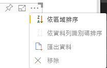

# <a name="sorting-options"></a>排序選項

`Sorting` 會指定視覺效果的預設排序行為。
此功能需要下面所述的其中一個參數：

## <a name="default-sorting"></a>預設排序

`default` 選項是最簡單的形式。 它允許排序 'DataMappings' 區段中顯示的資料。
此選項可依使用者排序 'DataMappings'，並可指定排序方向。

```json
    "sorting": {
        "default": {   }
    }
```



## <a name="implicit-sorting"></a>隱含排序

`implicit` 是指使用陣列參數 `clauses` 進行排序，該參數會描述每個資料角色的排序方式。
`implicit` 表示視覺效果的使用者無法變更排序次序。
Power BI 不會在視覺效果的功能表中顯示排序選項。 不過，Power BI 會根據指定的設定來排序資料。

`clauses` 參數可以包含數個具有下列兩個參數的物件：

- `role` - 決定用於排序的 `DataMapping`。

- `direction` - 決定排序方向 (1 = 遞增，2 = 遞減)。

```json
    "sorting": {
        "implicit": {
            "clauses": [
                {
                    "role": "category",
                    "direction": 1
                },
                {
                    "role": "measure",
                    "direction": 2
                }
            ]
        }
    }
```

## <a name="custom-sorting"></a>自訂排序

`custom` 表示排序是由開發人員在視覺效果的程式碼中管理。
